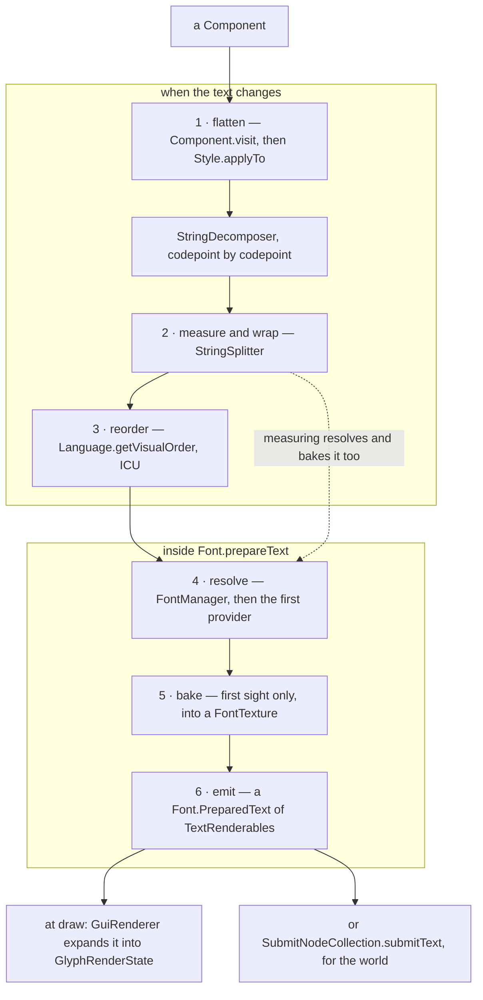
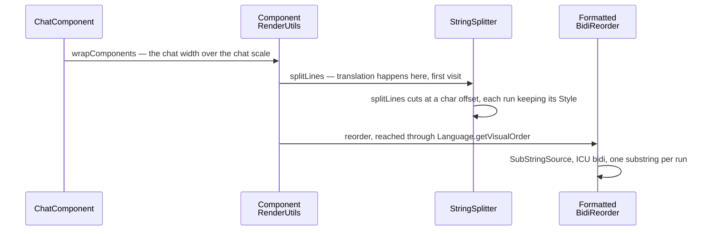
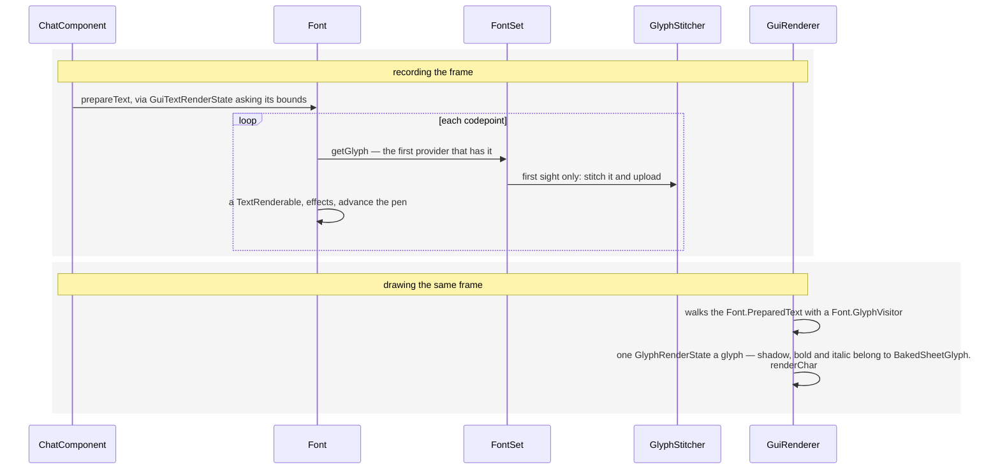

# Text and fonts

> Verified against **Minecraft 26.2** · Part X · a chat line in a language whose characters are not in the default font: six stages from a `Component` to a quad, one of which uploads a texture while pretending to measure.

Ask the client how wide a piece of text is and it will stitch a glyph into a
texture sheet and upload it to the GPU. `Font.width` resolves each codepoint
to a **baked** glyph and reads its advance — so measuring a codepoint nobody
has drawn yet is neither free nor read-only, and a layout pass over a
never-before-seen script is a series of texture uploads wearing arithmetic's
clothes.

This page is the pipeline that ends in that glyph: flattening a component
tree into styled runs, measuring and wrapping it, reordering it for
bidirectional scripts, choosing a glyph for every codepoint from a chain of
providers, baking it the first time anyone asks, and emitting the vertices.
What a `Component` *is* — its contents kinds, its `Style`, how it is
serialised — is Part II's [text
components](../foundations/text-components.md), and how a chat message is
signed is [chat and signing](../networking/chat-and-signing.md). This page
starts from "you have one".

## The cast

| class | what it decides | thread |
|---|---|---|
| `StringDecomposer` | where one styled run ends and the next begins, and what a section sign means | Render thread |
| `StringSplitter` | width, line breaks and word boundaries, given a width provider | Render thread |
| `FormattedBidiReorder` | visual order, by handing the flattened text to ICU | Render thread |
| `FontManager` | which `GlyphSource` a `FontDescription` resolves to — three different ways | reload workers, then Render thread |
| `FontSet` | the provider chain for one font id, its codepoint cache, and the fishy split | Render thread |
| `GlyphStitcher` | where a bitmap lands in a `FontTexture`, and the upload | Render thread |
| `Font` | the per-codepoint loop, and the `Font.PreparedText` everything else walks | Render thread |
| `GuiRenderer` | expanding prepared text into one `GlyphRenderState` per glyph | Render thread |

## The six stages

*The numbers are the order the stages matter in, not one walk: the top box
runs when the text changes, the bottom box on every record pass, and the
dotted edge is why measuring a string you never draw still uploads its glyphs.
Only what happens after stage six waits for the draw pass.*

The numbering is the order the stages *matter* in, not a pipeline anything
walks straight through. Stages one to three run whenever the text changes, and
four to six run inside `Font.prepareText`, which the GUI calls **during the
record pass** — [the render
tree](the-gui-render-tree.md#the-tree-and-where-a-new-element-lands) explains
why, and why nothing is left for the draw pass but the expansion of the
finished `Font.PreparedText` into one `GlyphRenderState` a glyph. But four and five are
also reached from *two*: the width function `Font` hands its `StringSplitter`
asks the glyph source for each codepoint, and that call resolves the provider
and forces the bake. Measuring a string you never draw still uploads its
glyphs.

All of it is on the Render thread, glyph baking and GPU uploads included. The
only work that leaves the thread is *loading*, and it is an ordinary [resource
reload](../foundations/resource-system.md#prepare-every-listener-at-once) with
one unusual step: `FontManager`'s prepare phase parses the font definitions,
loads each provider, resolves references between them, and then **pre-warms
every provider by asking it for every codepoint it claims**, on the reload
workers, so that the first frame after a reload does not pay for the whole
alphabet. The apply phase — closing the old font sets
and building new ones — is back on the Render thread.

### 1 · Flatten

`Component` and `FormattedText` provide the walk: `Component.visit` yields
(style, string) runs in logical order, applying `Style.applyTo` down the
sibling tree. `StringDecomposer` iterates those runs codepoint by codepoint
and is where a legacy section-sign colour code is interpreted.
`FormattedCharSequence` is the end product — a one-method interface that
pushes (index, style, codepoint) triples at a `FormattedCharSink` — and
`ComponentCollector` reassembles pieces back into a component.

### 2 · Measure and wrap

`StringSplitter` owns width and line breaking: `StringSplitter.stringWidth`,
`StringSplitter.splitLines`, `StringSplitter.headByWidth`,
`StringSplitter.findLineBreak` and `StringSplitter.getWordPosition`. It works
against a `StringSplitter.WidthProvider`, and on the real `Font` that
provider is what bakes. `Font.width`, `Font.split`,
`Font.splitIgnoringLanguage`, `Font.wordWrapHeight` and `Font.getSplitter`
are the public face of it.

**Wrapping preserves styles rather than ignoring them.** It cuts at a
character offset, captures the style in force at the cut, and re-applies it to
the continuation — which is why a colour code before a wrap point still
colours the line after it. And
`Font.split` reorders while `Font.splitIgnoringLanguage` does not — anything
that will re-measure or re-wrap must use the second.

### 3 · Reorder

`Language.getVisualOrder` is the entry point; on the client `ClientLanguage`
implements it with `FormattedBidiReorder`, which builds a `SubStringSource` —
the flattened plain text plus one `Style` per character — runs ICU's bidi
algorithm over it, and re-emits each run through
`SubStringSource.substring`. `MutableComponent.getVisualOrderText` caches
the result against the identity of the current `Language`.
`Font.bidirectionalShaping` is a separate, much smaller thing: it shapes a
bare string, and beside `Font.prepareText`'s own use of it the sign editor is
the only caller. Those two are half of the game's ICU surface; the other two
are not text layout at all — `CreateBuffetWorldScreen` and the item
property `LocalTime` each use it for collation and calendars.

### 4 · Resolve

`FontManager` is the reload listener and the resolver: `Font.Provider` asks
it for a `GlyphSource` given a `FontDescription`, and it branches once per
kind of description — three of them.

A `FontDescription.Resource` resolves to a `FontSet` — the per-font-id object
holding the provider list, the codepoint cache (`CodepointMap`), a
`GlyphStitcher` and the by-width table used for obfuscation. A
`FontDescription.AtlasSprite` or `FontDescription.PlayerSprite` resolves
instead to a `SingleSpriteSource` from `AtlasGlyphProvider` or
`PlayerGlyphProvider` — a one-glyph font that returns the same sprite for
every codepoint, with no texture sheet of its own; `FontManager` still keeps a
`FontSet` behind it as the fallback.

Below that: `GlyphProvider` implementations chosen by `GlyphProviderType`,
declared in *font/* JSON as `GlyphProviderDefinition`s. Five kinds, and their
definitions are worth naming because the differences between them are visible
on screen: `BitmapProvider` slices a PNG on a grid, `TrueTypeGlyphProviderDefinition`
runs FreeType over a real font file (`FreeTypeUtil` is the wrapper),
`UnihexProvider` reads the compact hex format the fallback font ships in,
`SpaceProvider` produces advance and no pixels, and
`ProviderReferenceDefinition` splices another font's providers into this one's
chain. Beside them `SpecialGlyphs` is not from a file at all: it is the
hard-coded missing-glyph box and the white square everything else draws
effects with.

### 5 · Bake

A provider returns an `UnbakedGlyph`, whose `GlyphBitmap` is handed to
`GlyphStitcher.stitch`, placed into a `FontTexture` sheet and uploaded,
producing a `BakedGlyph`. `BakedGlyph` is an interface; the sheet
implementation is `BakedSheetGlyph`, and `EffectGlyph` covers the solid quads
used for underlines and backgrounds.

There is **one glyph atlas family per font id**, each with its own stitcher,
and colour and greyscale glyphs never share a sheet. The atlas is discarded,
never compacted: a resource reload throws it away — and so does toggling the
force-unicode or Japanese-variants option, which rebuilds every font set with
no reload at all.

### 6 · Emit

What comes out is a `TextRenderable` per glyph inside a `Font.PreparedText`.
In the GUI, `GuiGraphicsExtractor.text` and its siblings build a
`GuiTextRenderState` that `GuiRenderer` later expands into
`GlyphRenderState`s. In the world, `SubmitNodeCollection.submitText` and
`SubmitNodeCollection.submitNameTag` feed `TextFeatureRenderer` and
`NameTagFeatureRenderer`, and `GlyphRenderTypes.select` picks between the
normal, see-through and polygon-offset render types by `Font.DisplayMode`.

## A chat line, through all six

*Stages one to three, when the message arrives: four objects and no glyph yet.
`ComponentRenderUtils` reaches `FormattedBidiReorder` through
`Language.getVisualOrder`, which `ClientLanguage` implements.*

A frame later the same line is recorded, and it is a different four objects.

*Stages four to six, then what happens to their result: the two bands are the
record pass and the draw pass of one frame, and `GlyphStitcher` appears in the
first only because a glyph is baked once, ever.*

Two moments beyond the baking are worth pausing on. **Translation is lazy and
cached on the `TranslatableContents` itself**, so the first thing to visit a
message is what translates it — usually a measure, sometimes a log line one
statement earlier. And the continuation indent on a wrapped chat line is a
**literal space codepoint** prepended by `ComponentRenderUtils` — the one
place in the pipeline where a character is invented rather than derived.

## Style is not a font, and the box is four failures

Two things the pipeline does *not* do are worth stating before the page ends,
because both are assumed the other way round by nearly everyone.

**Bold is not a font.** Bold draws the glyph twice with a small offset and
thickens it; italic shears the top and bottom edges. Nothing anywhere in the
six stages knows what a bold face is. Shadow is a colour rather than a boolean,
and zero means none. Underlines, strikethroughs and text backgrounds always
come from the **default** font whatever the style names, because the effect
glyph is looked up separately from the text's. Obfuscation is in the same
family: the glyph is swapped for a random one *of the same width*, from a
by-width table built once per font set, which is why obfuscated text never
shifts a layout — and because the swap happens inside `Font.prepareText`, which
already runs once per frame, the animation costs nothing extra.

**A sprite is a font.** A block icon or a player head in a chat line is,
mechanically, one character in a font with one character in it: an object
component emits a single object replacement character with a synthetic font
description, which resolves through stage four to a one-glyph sprite source.
The plain-text walk of the same component yields a bracketed fallback string
instead, which is what the narrator and `Component.getString` see. A data pack
cannot reach this: the codec behind `FontDescription` encodes only the resource
kind, so **a style can never name a sprite font**, and the sprite descriptions
arise only from object contents.

And when the pipeline fails it fails one way, which makes the hollow box
ambiguous. Four different causes produce it: no provider has the codepoint; the
font id is unknown, so the whole font set is the missing-font set; the glyph's
advance is *fishy* — outside a sane range — and the caller asked for the
filtered font; or the bitmap fit no sheet. The fishy case is the one with
machinery behind it. Every font set stores two suppliers per codepoint because
of it, and the game builds a second `Font` that filters the fishy ones out,
with exactly one use in the entire client: the chat input box, which cannot be
made to draw a character three screens wide.

## What else walks a `Font.PreparedText`, and what the caches promise

The prepared text is walked twice by different things and that is deliberate.
`GuiRenderer` walks it to emit glyphs, and `ActiveTextCollector` walks the very
same object looking for the style under the cursor — which is how hovering a
link works, and why preparation can be asked to record *empty* areas, so that
hovering the space inside a hover-event run still finds the style. Glyph areas
deliberately extend to the full advance, so there are no dead gaps between
characters.

The caches down the pipeline are safe mostly by being single-threaded rather
than by being locked: they are meant to be touched only on the Render thread.
It is not a clean rule — some are keyed on identity and some on equality, and
the glyph layer does use *volatile* fields and a Guava cache. A component's
cached visual order is invalidated by the `Language` object changing, and a
translatable component's decomposition likewise. The one place that leaks is
worth knowing: the sign block entity caches its rendered lines on a class the
*server* also ships, and that cache does not notice a font reload.

> **For a 1.21-era reader.** `Font` cannot draw. Every *drawInBatch* and
> *drawString* is gone; `Font.prepareText` returns a `Font.PreparedText` that
> somebody else walks later. `Style.getFont` no longer returns an identifier
> — it returns a `FontDescription`, which may not name a font file at all.
> Also gone: *Font.StringRenderOutput*; *RawGlyph* and *SheetGlyphInfo* (now
> `UnbakedGlyph` and `GlyphBitmap`); *BakedGlyph* as a class;
> *GlyphProviderBuilder* (now `GlyphProviderDefinition`); and
> `FontSet.getGlyph` as public API. `StringSplitter`, `StringDecomposer`,
> `FormattedCharSequence`, `SubStringSource`, `GlyphStitcher` and
> `FontTexture` all survive under their old names.

## Where to look

`Font.prepareText` — the per-codepoint loop is the centre of the page.
`FontSet` for the provider chain and the fishy-advance split, `FontManager`
for how a `FontDescription` becomes a `GlyphSource`, and
`GlyphStitcher.stitch` for the moment a glyph acquires a texture.
`StringSplitter.splitLines` for how a line break preserves styles, and
`FormattedBidiReorder.reorder` for the heaviest of the four places ICU is
used.

---

*Rules: names, never code · how the system works, not how the code reads ·
newest version only · every backticked name passes `tools/verify_names.py`.*
