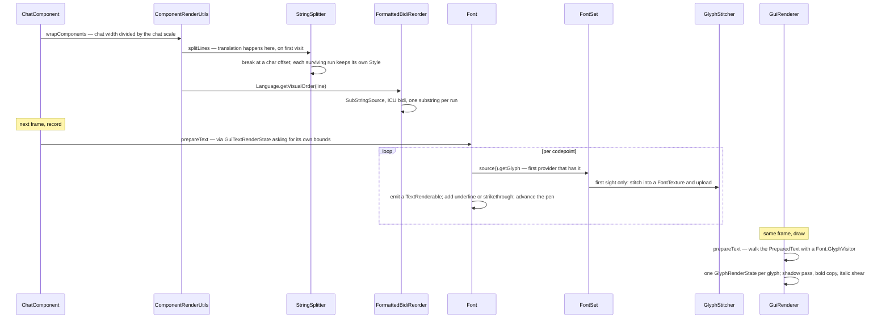

# Text and fonts

> Verified against **Minecraft 26.2** · Part X · a chat line: a translated message with a sprite in it, wrapped, reordered, and turned into glyphs that may not exist yet.

## Responsibility

Everything between a `Component` and a quad with a glyph on it: flattening a
component tree into styled runs, measuring and wrapping it, reordering it for
bidirectional scripts, choosing a glyph for every codepoint from a chain of
providers, baking that glyph into a texture the first time anyone asks, and
finally emitting the vertices. What a `Component` *is* — its contents kinds,
its `Style`, how it is serialised and signed — belongs to
[chat and signing](../networking/chat-and-signing.md); this page starts from
"you have one".

The one sentence a player would recognise: *a chat message in a language
whose characters are not in the default font.*

The headline for a 1.21-era reader: **`Font` cannot draw.** Every *drawInBatch*
and *drawString* is gone; `Font.prepareText` returns a `Font.PreparedText`
that is walked later by somebody else. And `Style.getFont` no longer returns
an identifier — it returns a `FontDescription`, which may not name a font
file at all.

## The data it owns

### From component to characters

`Component` and `FormattedText` provide the walk: `Component.visit` yields
(style, string) runs in logical order, applying `Style.applyTo` down the
sibling tree. `StringDecomposer` iterates those runs codepoint by codepoint
and is where a legacy section-sign colour code is interpreted.
`FormattedCharSequence` is the end product — a one-method interface that
pushes (index, style, codepoint) triples at a `FormattedCharSink`.
`ComponentCollector` reassembles pieces back into a component.

### Measuring and breaking

`StringSplitter` owns width and line breaking:
`StringSplitter.stringWidth`, `StringSplitter.splitLines`,
`StringSplitter.headByWidth`, `StringSplitter.findLineBreak`,
`StringSplitter.getWordPosition`. It is given a
`StringSplitter.WidthProvider` — which, on the real `Font`, resolves each
codepoint to a *baked* glyph and asks its advance. `Font.width`,
`Font.split`, `Font.splitIgnoringLanguage`, `Font.wordWrapHeight` and
`Font.getSplitter` are the public face of it.

### Reordering

`Language.getVisualOrder` is the entry point; on the client
`ClientLanguage` implements it with `FormattedBidiReorder`, which builds a
`SubStringSource` — the flattened plain text plus one `Style` per character
— runs ICU's bidi algorithm over it, and re-emits each run through
`SubStringSource.substring`. `MutableComponent.getVisualOrderText` caches the
result against the identity of the current `Language`.
`Font.bidirectionalShaping` is a separate, much smaller thing: it shapes a
bare string, and the sign editor is its only caller.

### The glyph supply chain

`FontManager` is the reload listener and the resolver: `Font.Provider` asks
it for a `GlyphSource` given a `FontDescription`, and it answers three
different ways. A `FontDescription.Resource` resolves to a `FontSet` — the
per-font-id object holding the provider list, the codepoint cache
(`CodepointMap`), a `GlyphStitcher` and the by-width table used for
obfuscation. A `FontDescription.AtlasSprite` or
`FontDescription.PlayerSprite` resolves instead to a `SingleSpriteSource`
from `AtlasGlyphProvider` or `PlayerGlyphProvider` — a one-glyph font that
returns the same sprite for every codepoint, and never touches a `FontSet`
or a texture sheet at all.

Below that: `GlyphProvider` implementations, chosen by `GlyphProviderType` —
bitmap, TrueType, space, unihex, reference — declared in *font/* JSON as
`GlyphProviderDefinition`s. A provider returns an `UnbakedGlyph`, whose
`GlyphBitmap` is handed to `GlyphStitcher.stitch`, placed into a `FontTexture`
sheet and uploaded, producing a `BakedGlyph`. `BakedGlyph` is an interface
now; the sheet implementation is `BakedSheetGlyph`, and `EffectGlyph` covers
the solid quads used for underlines and backgrounds. What comes out is a
`TextRenderable`.

### The two consumers

In the GUI, `GuiGraphicsExtractor.text` and its siblings build a
`GuiTextRenderState`, and `GuiRenderer` later expands it into
`GlyphRenderState`s — see [the GUI render tree](the-gui-render-tree.md). In
the world, `SubmitNodeCollection.submitText` and
`SubmitNodeCollection.submitNameTag` feed `TextFeatureRenderer` and
`NameTagFeatureRenderer`, and `GlyphRenderTypes.select` picks between the
normal, see-through and polygon-offset render types by `Font.DisplayMode`.

## When it runs

All of it is on the render thread, including glyph baking and the GPU
uploads that come with it. The only work that leaves the thread is
*loading*: `FontManager`'s prepare phase parses the font definitions, loads
each provider, resolves references between them, and pre-warms every
provider by asking it for every codepoint it claims — on the reload workers.
The apply phase, which closes the old font sets and builds new ones, is back
on the render thread.

Within a frame, text is prepared during the GUI's record pass (because the
tree needs its bounding box to place it) and expanded into glyph states
during the draw pass.

## The trace: a chat line

Three moments are worth pausing on. **Translation is lazy and cached on the
language object**, so the first time a message is measured it is also
translated. **Wrapping never touches styles** — it cuts at a character
offset and rebuilds each line from runs that still carry their own style,
which is why a colour code before a wrap point still colours the
continuation line. And **the first sight of a codepoint creates GPU texture
data**, inside what looks like a pure measurement.

## Invariants and surprises

- **Measuring bakes.** The width provider resolves to a baked glyph, so
  `Font.width` on a codepoint nobody has drawn yet stitches it into a sheet
  and uploads it. Measuring is neither free nor read-only.
- **A missing glyph has four causes and one appearance.** No provider has
  the codepoint; the font id is unknown, so the whole font set is the
  missing-font set; the glyph's advance is "fishy" and the caller asked for
  the filtered font; or the bitmap fit no sheet. All four produce the same
  hollow box.
- **"Fishy" is a real concept with exactly one user.** An advance outside a
  sane range makes a glyph fishy, so every font set stores two suppliers per
  codepoint and the game builds a second `Font` that filters them out. Its
  only use in the entire client is the chat input box — a font that cannot
  be made to draw a character three screens wide.
- **Objects are glyphs.** An object component emits a single object
  replacement character with a synthetic font description, which resolves to
  a one-glyph sprite font. A block icon or a player head in a chat line is,
  mechanically, one character in a font with one character in it — and the
  plain-text walk of the same component yields a bracketed fallback string
  instead, which is what the narrator and `Component.getString` see.
- **A style can never name a sprite font.** The codec behind
  `FontDescription` only encodes the resource kind, so a data pack cannot
  write one; the sprite descriptions arise only from object contents.
- **There is one glyph atlas family per font id**, each with its own
  stitcher, and colour and greyscale glyphs never share a sheet.
- **The atlas is discarded, never compacted.** A resource reload throws it
  away — and so does toggling the force-unicode or Japanese-variants option,
  which rebuilds every font set with no reload at all.
- **Underlines, strikethroughs and text backgrounds always come from the
  default font**, whatever font the style names: the effect glyph is looked
  up separately.
- **Bold and italic are vertex tricks.** Bold draws the glyph twice with a
  small offset and thickens it; italic shears the top and bottom edges.
  Nothing in the font pipeline knows what a bold face is.
- **Obfuscated text re-rolls every frame and costs nothing extra.** The
  glyph is swapped for a random one *of the same width* from a table built
  once per font set — so the layout never moves, and because the swap
  happens inside `Font.prepareText`, which already runs once per frame, the
  animation is free.
- **Shadow is a colour, and zero means none.** There is no boolean.
- **Hit-testing re-uses the very text that will be drawn.**
  `ActiveTextCollector` walks the same `Font.PreparedText` to find the style
  under the cursor, and that is why preparation can be asked to record
  *empty* areas: hovering the space inside a hover-event run still finds the
  style. Glyph areas deliberately extend to the full advance, so there are no
  dead gaps between characters.
- **Wrapped chat lines get a hard-coded space.** The continuation indent is
  a literal space codepoint prepended by `ComponentRenderUtils` — the one
  place in the pipeline where a character is invented rather than derived.
- **`Font.split` reorders and `Font.splitIgnoringLanguage` does not.**
  Anything that will re-measure or re-wrap must use the second.
- **The caches are keyed on identity, not content.** A component's cached
  visual order is invalidated by the `Language` object changing, and a
  translatable component's decomposition likewise; neither is synchronised,
  because neither is meant to be touched off the render thread. The sign
  block entity caches its rendered lines on a class the *server* also ships,
  and that cache does not notice a font reload.
- **Names a 1.21-era reader will hunt for and not find:** *Font.drawInBatch*
  and every *drawString* variant; *Font.StringRenderOutput*; *RawGlyph* and
  *SheetGlyphInfo* (now `UnbakedGlyph` and `GlyphBitmap`); *BakedGlyph* as a
  class (it is an interface; the sheet implementation is `BakedSheetGlyph`);
  *GlyphProviderBuilder* (now `GlyphProviderDefinition`); and
  `FontSet.getGlyph` as public API. `StringSplitter`, `StringDecomposer`,
  `FormattedCharSequence`, `SubStringSource`, `GlyphStitcher` and
  `FontTexture` all survive under their old names.

## Where to look

`Font.prepareText` — the per-codepoint loop is the centre of the page.
`FontSet` for the provider chain and the fishy-advance split, `FontManager`
for how a `FontDescription` becomes a `GlyphSource`, and
`GlyphStitcher.stitch` for the moment a glyph acquires a texture.
`StringSplitter.splitLines` for how a line break preserves styles, and
`FormattedBidiReorder.reorder` for the one place ICU is used.

---

*Rules: names, never code · how the system works, not how the code reads ·
newest version only · every backticked name passes `tools/verify_names.py`.*
