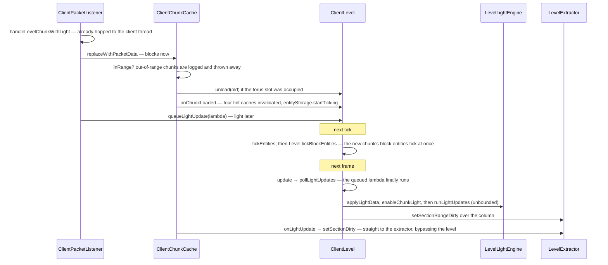

# The client level

> Verified against **Minecraft 26.2** · Part X · a chunk arrives: how a packet becomes a column of world, what the client then simulates in it, and what it only pretends to.

## Responsibility

`ClientLevel` is the same `Level` class the server runs, with most of its
authority removed and a handful of jobs added. It ticks entities and block
entities, runs a real light engine, keeps a free-running clock, and answers
every question the renderer asks about the world. What it does *not* do is
decide anything: scheduled ticks vanish, explosions do nothing, game events
are dropped, and biomes are whatever it was told.

The one sentence a player would recognise: *the terrain filling in ahead of
you as you fly.*

The headline for a 1.21-era reader: **the client is not a passive receiver
and not an authority either.** It simulates hard — every block entity ticks
regardless of distance, every local block change is relit locally — while
inheriting a set of shared `Level` methods that have been quietly reduced to
constants. Reading `ClientLevel` is largely a matter of noticing which
overrides are empty.

## The data it owns

### The level itself

`ClientLevel.tickingEntities` (an `EntityTickList`) over
`ClientLevel.entityStorage`, which is a `TransientEntitySectionManager` — no
persistence, no chunk save, no UUID index to disk.
`ClientLevel.clientLevelData` is a `ClientLevel.ClientLevelData` holding the
client's own `ClientLevel.ClientLevelData.gameTime`, difficulty, hardcore and
flat flags, the respawn data, and the two the renderer wants:
`ClientLevel.ClientLevelData.getHorizonHeight` and
`ClientLevel.ClientLevelData.voidDarknessOnsetRange`.

`ClientLevel.lightUpdateQueue` holds light work the server sent and the
client has not applied yet. `ClientLevel.tintCaches` holds four
`BlockTintCache`s — grass, foliage, dry foliage, water.
`ClientLevel.destroyingBlocks` and `ClientLevel.destructionProgress` hold the
breaking overlays other players cause.
`ClientLevel.globallyRenderedBlockEntities` is the set of block entities that
draw from anywhere, populated by `ClientLevel.onBlockEntityAdded`.
`ClientLevel.explosionTracker` is a `ClientExplosionTracker` — a queue of
delayed block particles. `ClientLevel.blockStatePredictionHandler` is the
ledger described in
[prediction and acknowledgement](prediction-and-acks.md);
`ClientLevel.levelExtractor` is the push half of the route to the renderer.
`ClientLevel.NORMAL_LIGHT_UPDATES_PER_FRAME` and
`ClientLevel.LIGHT_UPDATE_QUEUE_SIZE_THRESHOLD` set the light budget.

### The chunk cache

`ClientChunkCache` is not a map. `ClientChunkCache.Storage` is a flat array
whose side is the view diameter, indexed by the chunk coordinates *modulo*
that diameter — a torus. `ClientChunkCache.calculateStorageRange` makes the
array a few rings wider than the view distance, `ClientChunkCache.inRange`
and `ClientChunkCache.getIndex` decide where a chunk lands, and
`ClientChunkCache.updateViewCenter` moves the origin by assigning two
integers. Its verbs are `ClientChunkCache.replaceWithPacketData`,
`ClientChunkCache.drop`, `ClientChunkCache.replaceBiomes`,
`ClientChunkCache.updateViewRadius`, `ClientChunkCache.onLightUpdate` and the
delta sets `ClientChunkCache.addedEmptySections` /
`ClientChunkCache.removedEmptySections` /
`ClientChunkCache.addedLoadedChunks` /
`ClientChunkCache.removedLoadedChunks`, double-buffered by
`ClientChunkCache.flipUpdateTrackingSets` so the renderer can ask what
changed since last frame.

### The clocks

There are two, and neither is on `ClientLevel` alone.
`ClientLevel.tickTime` advances `ClientLevel.ClientLevelData.gameTime` by one
every tick and hands the result to a `ClientClockManager`, which is owned by
`ClientPacketListener` and reached through `ClientLevel.clockManager`.
`ClientLevel.setTimeFromServer` is the only correction, and its only caller
is `ClientPacketListener.handleSetTime`.

## When it runs

**Per client tick**, from `Minecraft.tick`: `ClientLevel.tickEntities`, then
`Level.tickBlockEntities`, then `ClientLevel.tick` — which does
`Level.updateSkyBrightness` unconditionally and then, **only if the tick rate
manager is running normally**, the world border, the clock, the weather
*effects*, and the breaking-progress sweep. After that, unconditionally
again: the sky flash countdown, the End flash state, and the explosion
tracker. `ClientLevel.animateTick` and `ParticleEngine.tick` follow, both
gated on the game not being frozen.

**Per frame**, and only per frame: `ClientLevel.update`, which calls
`ClientLevel.pollLightUpdates` and then runs the light engine. It is gated on
the game being loaded, the level existing, and the frame being one that
advances game time at all — so the blocking loops that draw a frame without
ticking do no lighting either.

**Per packet**, on the client thread after the frame's drain: chunk payloads,
light updates, block changes and entity spawns.

## The trace: a chunk arrives

Three things about the shape. **Blocks and light are separated in the
handler**, so a chunk exists, ticks and can be walked on before it is lit.
**The light queue is budgeted and the light engine is not**: below a
thousand queued updates the frame runs a tenth of the backlog, floored at
ten; at a thousand or more it runs all of them — and then
`LevelLightEngine.runLightUpdates` drains the engine's own propagation queue
completely, every frame, with no budget at all. And **the renderer is
reached two ways**: the level pushes (`ClientLevel.sendBlockUpdated`,
`ClientLevel.setBlocksDirty`, `ClientLevel.setSectionRangeDirty`), but the
chunk cache and one packet handler call `LevelExtractor` directly, and the
extractor also *pulls* — `ClientLevel.entitiesForRendering`,
`ClientLevel.destructionProgress` and
`ClientLevel.getGloballyRenderedBlockEntities` are read each frame and are
mutated with no notification at all.

Unloading is the same trace backwards: `ClientChunkCache.drop` evicts the
slot, `ClientLevel.unload` clears the chunk's block entities and stops
ticking its entities, and a light removal is queued for a later frame.

## What the client simulates, and what it fakes

| shared `Level` method | on the server | on `ClientLevel` |
|---|---|---|
| `Level.shouldTickBlocksAt` | ticket range | inherited — unconditionally true |
| `ScheduledTickAccess.scheduleTick` | real `LevelTicks` | both lists are `BlackholeTickAccess` |
| `Level.explode` | the real thing | empty override; particles arrive by packet |
| `Level.gameEvent` | vibrations, sculk | empty override |
| `LevelReader.getUncachedNoiseBiome` | generates | returns plains |
| `Level.hasChunk` | asks the source | unconditionally true |
| `Level.setBlocksDirty` | empty | the renderer notification |
| `Level.shouldTickDeath` | true | **stricter**: within the server's simulation distance |
| entity storage | persistent | transient |

The one that surprises people is the black hole. Both tick lists return
`BlackholeTickAccess`, whose `LevelTickAccess` accepts a schedule and drops
it, reports *no* for "is a tick pending" and counts zero — so shared block
code that *asks* the client whether something is scheduled gets a confident
no. A predicted placement of anything that reschedules itself looks inert
until the server speaks.

## Interfaces

- **Called by:** `Minecraft.tick` and `Minecraft.renderFrame` — see
  [the client loop](the-client-loop.md); every packet handler on
  `ClientPacketListener`.
- **Calls into:** `LevelExtractor` for renderer notifications (Part XI); the
  shared light engine described in [lighting](../world/lighting.md);
  `ParticleEngine`, `SoundManager` and `LevelEventHandler`.
- **Crosses the network as:** inbound `ClientboundLevelChunkWithLightPacket`,
  `ClientboundForgetLevelChunkPacket`, `ClientboundLightUpdatePacket`,
  `ClientboundChunksBiomesPacket`, `ClientboundSetChunkCacheCenterPacket`,
  `ClientboundSetChunkCacheRadiusPacket`,
  `ClientboundSetSimulationDistancePacket`, `ClientboundSetTimePacket` and
  the block-change family. Outbound, nothing: the level itself never sends.
- **Data-driven by:** the dimension's `DimensionType` and the environment
  attribute layers installed by `ClientLevel.addEnvironmentAttributeLayers` —
  see [environment attributes and
  timelines](../world/environment-attributes-and-timelines.md).

## Invariants and surprises

- **The light budget is a cliff, not a slope.**
  `ClientLevel.pollLightUpdates` runs a tenth of the queue (never fewer than
  ten) below the threshold and the *entire* queue at or above it. A
  chunk-load burst therefore produces one long frame rather than a hundred
  slightly late ones.
- **Only the queue is budgeted.** The light engine's own propagation runs to
  completion every frame. The budget controls how fast the client *accepts*
  the server's light, not how fast it computes its own.
- **The client runs a real light engine, with block light always on and sky
  light only where the dimension has it.** Every client-side `Level.setBlock`
  relights — but only when the new state actually differs in emission or
  opacity; a cosmetic state change queues nothing.
- **Every block entity ticks, at any distance — unless the world is
  frozen.** `Level.shouldTickBlocksAt` is unconditionally true here, but
  `Level.tickBlockEntities` still checks the tick rate manager, and the loop
  skips the whole tick while paused.
- **Simulation distance has exactly two consumers, and one is a debug
  string.** `ClientLevel.shouldTickDeath` uses it to decide whether a dying
  mob plays its death animation; `LevelExtractor` prints it in the render
  stats. Nothing else on the client cares, and the value only ever arrives
  from the server.
- **The client keeps its own clock and free-runs between corrections.**
  `ClientLevel.tickTime` increments unconditionally; `ClientboundSetTimePacket`
  is the only thing that resets it. The breaking-progress sweep is likewise
  approximate by construction — it only runs on every twentieth tick.
- **Weather is presentation only.** `ClientLevel.tickWeatherEffects` spawns
  rain particles and picks rain sounds; the rain and thunder *levels* are set
  wholesale by game-event packets, with no interpolation on either side.
- **Sounds the server excluded you from are the ones the client plays.**
  `ClientLevel.playSeededSound` plays a sound only when the excluded player
  is the local one — the server tells everyone *else*, and the client
  produces its own copy locally. Distant sounds are delayed on the client
  by a distance-derived number of ticks, which is why thunder arrives late
  without anyone sending a timestamp.
- **`ClientLevel.animateTick` samples 667 positions at radius sixteen and
  another 667 at radius thirty-two, every tick**, and `ClientLevel.doAddParticle` culls
  by distance and can stochastically downgrade the particle setting further.
- **The collision world is one entity wide.**
  `ClientLevel.getPushableEntities` returns at most the local player.
- **`ClientLevel` never notifies `LevelRenderer`.** It has no reference to
  it; `LevelRenderer` has no invalidation API left at all. Everything goes
  through `LevelExtractor`, and some of it goes around the level entirely.
- **Names a 1.21-era reader will hunt for and not find:**
  *ClientLevel.levelRenderer*, every dirty method on *LevelRenderer* (now on
  `LevelExtractor`), *ClientLevel.getStarBrightness* and *ClientLevel.effects*
  (now `EnvironmentAttribute` lookups), and *ClientChunkCache.ChunkArray*.

## Where to look

`ClientLevel.tick` and `ClientLevel.update` for the two cadences.
`ClientChunkCache.Storage` for the torus, and
`ClientChunkCache.replaceWithPacketData` for what a chunk packet actually
does. `ClientLevel.pollLightUpdates` for the budget arithmetic.
`ClientLevel.tickEntities` for the entity walk, and `ClientLevel.EntityCallbacks`
for what joins the ticking set. Then read the empty overrides —
`ClientLevel.explode`, `ClientLevel.gameEvent`, `ClientLevel.getBlockTicks` —
because they are the page in miniature.

---

*Rules: names, never code · how the system works, not how the code reads ·
newest version only · every backticked name passes `tools/verify_names.py`.*
