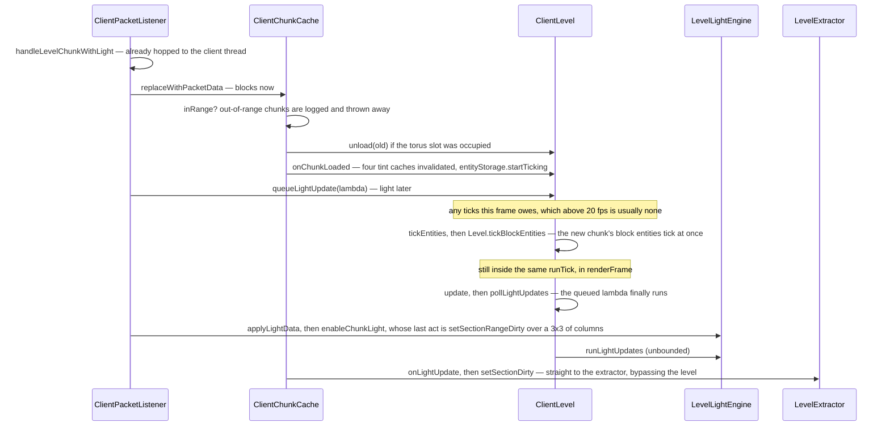

# The client level

> Verified against **Minecraft 26.2** · Part X · the same `Level` class the server runs, with its authority removed: what the client really simulates, and what it only pretends to.

Place a repeater on the client and it is *there* — drawn, collidable, part of
the world. Ask the client whether that repeater has a tick scheduled and it
will tell you, confidently, that it does not. `ClientLevel`'s two scheduled-tick
lists are a `BlackholeTickAccess`: it accepts a schedule, drops it, reports
*no* when asked whether a tick is pending, and counts zero. Shared block code
that consults the level therefore gets a wrong answer rather than an error,
and anything that reschedules itself looks inert until the server speaks.

That is the shape of the whole class. `ClientLevel` is not a passive receiver
and not an authority either: it simulates hard — every block entity ticks
regardless of distance, every local block change is relit locally, it keeps
its own clock and free-runs between corrections — while inheriting a set of
shared `Level` methods that have been quietly reduced to constants. Reading
`ClientLevel` is largely a matter of noticing which overrides are empty.
(*Authority* is a word with five predicates behind it, and
[authority](../entities/authority.md#five-predicates-and-the-final-one-the-other-four-hang-off)
is where they are set out; this page needs only the one that says who may
decide a block's state.)

## The cast

| class | what it decides | thread |
|---|---|---|
| `ClientLevel` | what the client simulates, and what it answers when asked | Render thread |
| `ClientChunkCache` | which chunks exist, in a fixed-size array indexed modulo the view diameter | Render thread |
| `ClientLevel.ClientLevelData` | the client's own game time, difficulty, horizon height and void darkness | Render thread |
| `LevelLightEngine` | the light the client computes for itself, unbudgeted | Render thread |
| `LevelExtractor` | the main route from the level to the renderer — pushed *and* pulled | Render thread |
| `ClientPacketListener` | the view radius and simulation distance the server announced | Render thread |
| `TransientEntitySectionManager` | entity storage with no persistence, no chunk save, no index to disk | Render thread |
| `Entity` | whether a position update is a snap or an interpolation | Render thread |

## Where the two levels differ

The comparison is the page. Every row but the last is a method both sides
inherit from the shared hierarchy — `Level` itself, or one of the interfaces
above it — and that the two sides answer differently; the last row is not a
method but the storage behind one. Seven of the nine rows are the client
hollowing something out. The eighth, `Level.shouldTickDeath`, is the one that
runs the other way.

| shared method | on the server | on `ClientLevel` |
|---|---|---|
| `Level.shouldTickBlocksAt` | ticket range | inherited — unconditionally true |
| `ScheduledTickAccess.scheduleTick` | real `LevelTicks` | both lists are `BlackholeTickAccess` |
| `Level.explode` | the real thing | empty override — particles arrive by packet |
| `LevelAccessor.gameEvent` | vibrations, sculk | empty override |
| `LevelReader.getUncachedNoiseBiome` | generates | returns plains |
| `LevelReader.hasChunk` | asks the source | unconditionally true |
| `Level.setBlocksDirty` | empty | real — and it notifies `LevelExtractor`, never `LevelRenderer` |
| `Level.shouldTickDeath` | true | **stricter** — within the server's simulation distance |
| entity storage | persistent: a disk store, known UUIDs, per-chunk load states | transient: the same lookup, none of the bookkeeping |

Three of those deserve their own sentence. `LevelReader.hasChunk` returning
true unconditionally means that particular question is useless on the client —
though `Level.isLoaded` still works, because it goes through the chunk source
instead. `Level.explode` doing nothing is why an explosion you can see is not
a simulation: one `ClientboundExplodePacket` carries the sound, the particle
and the knockback, and the handler plays all of it. And `Level.shouldTickDeath` is the only row where the *client*
is the stricter of the two: it uses the server's announced simulation
distance to decide whether a dying mob plays its death animation.

That last row is also one of only **two** things in the client that read the
server's announced simulation distance: the death-animation test, and
`LevelExtractor`'s render-stats string. (The client's own
`Options.simulationDistance` is a different number with its own readers.) The
level keeps its own copy in `ClientLevel.serverSimulationDistance`, but never
decides it: the value arrives from the server on
`ClientPacketListener.serverSimulationDistance`, beside
`ClientPacketListener.serverChunkRadius` — both seeded at login and updated by
their own packets — and is handed to each new `ClientLevel` at construction
and thereafter through `ClientLevel.setServerSimulationDistance`.

## What it does simulate: the two cadences

**Per client tick**, from [`Minecraft.tick`](the-client-loop.md#what-a-tick-is-in-order):
`ClientLevel.tickEntities`, then
`Level.tickBlockEntities`, then `ClientLevel.tick` — which does
`Level.updateSkyBrightness` unconditionally and then, **only if the tick rate
manager is running normally**, the world border, the clock, the weather
*effects* and the breaking-progress sweep. After that, unconditionally again:
the sky flash countdown, the End flash state, and the explosion tracker.
`ClientLevel.animateTick` and `ParticleEngine.tick` follow, both gated on the
game not being frozen.

So "every block entity ticks, at any distance" is true of *distance* and
false of `/tick freeze`: `Level.shouldTickBlocksAt` is unconditionally true
here, but `Level.tickBlockEntities` still checks the tick rate manager, and
the loop skips the whole tick while paused.

**Per frame**, and only per frame: `ClientLevel.update`, which calls
`ClientLevel.pollLightUpdates` and then runs the light engine. It is gated on
the game being loaded, the level existing, and the frame being one that
advances game time — so the blocking loops that draw a frame without ticking
do no lighting either.

The light budget is a cliff rather than a slope, and it budgets the wrong
half of the work on purpose. Below `ClientLevel.LIGHT_UPDATE_QUEUE_SIZE_THRESHOLD`
the frame runs a tenth of `ClientLevel.lightUpdateQueue`, floored at
`ClientLevel.NORMAL_LIGHT_UPDATES_PER_FRAME`; at the threshold or above it
runs the entire queue. Then `LevelLightEngine.runLightUpdates` drains the
engine's own propagation queue **completely, every frame, with no budget at
all**. The budget controls how fast the client accepts the *server's* light,
not how fast it computes its own — and a chunk-load burst therefore produces
one long frame rather than a hundred slightly late ones.

## A chunk arrives

The grounding trace, and the one place the whole class is visible at once.

Three things about the shape. **Blocks and light are separated in the
handler**, so a chunk exists, ticks and can be walked on before it is lit.
**The separation is not a wait**: both notes fall inside the one
`Minecraft.runTick` that handled the packet, and above twenty frames a second
the frame usually owes no tick at all, so the light is applied with nothing
having ticked in between. And **the renderer is reached two ways** —
the level pushes (`ClientLevel.sendBlockUpdated`, `ClientLevel.setBlocksDirty`,
`ClientLevel.setSectionRangeDirty`), but the chunk cache and three of
`ClientPacketListener`'s own handlers reach `LevelExtractor` directly (the
biome resend marks whole sections dirty; login and the game-test highlight
reach through it for the debug renderers), and the extractor also *pulls*:
`ClientLevel.entitiesForRendering`, `ClientLevel.destructionProgress` and
`ClientLevel.getGloballyRenderedBlockEntities` are read each frame and are
mutated with no notification at all.

Unloading is the same trace backwards: `ClientChunkCache.drop` clears the
slot, `ClientLevel.unload` clears the chunk's block entities and stops
ticking its entities, and a light removal is queued for a later frame.

## The chunk cache is a torus

`ClientChunkCache` is not a map. `ClientChunkCache.Storage` is a flat
`AtomicReferenceArray` whose side is the view diameter, indexed by the chunk
coordinates *modulo* that diameter — so moving the origin evicts the ring
behind you by overwriting it. The array is atomic, the two centre coordinates
are declared *volatile*, and so is the reference to the
`ClientChunkCache.Storage` itself,
because the packet handlers are not the only readers. The section-compile
workers are: a `RenderSectionRegion` resolves biome tint *live* rather than
from its snapshot, so `RenderSectionRegion.getBlockTint` goes through
`ClientLevel.getBlockTint` into the chunk cache from a background thread while
the main thread is moving the origin. The `ThreadLocal` and the read-write
lock inside `BlockTintCache` are the same contract said out loud.

`ClientChunkCache.calculateStorageRange` makes the array a few rings wider
than the view distance, `ClientChunkCache.Storage.inRange` and
`ClientChunkCache.Storage.getIndex` decide where a chunk lands, and
`ClientChunkCache.updateViewCenter` moves the origin by assigning two
integers. Its verbs are `ClientChunkCache.replaceWithPacketData`,
`ClientChunkCache.drop`, `ClientChunkCache.replaceBiomes`,
`ClientChunkCache.updateViewRadius` and `ClientChunkCache.onLightUpdate`,
and it keeps four delta sets — `ClientChunkCache.addedEmptySections`,
`ClientChunkCache.removedEmptySections`, `ClientChunkCache.addedLoadedChunks`
and `ClientChunkCache.removedLoadedChunks` — double-buffered by
`ClientChunkCache.flipUpdateTrackingSets` so the renderer can ask what
changed since last frame.

## Who interpolates, and who snaps

An entity position arriving from the server does not simply become the
entity's position. `Entity.moveOrInterpolateTo` asks
`Entity.getInterpolation` for an `InterpolationHandler`; if there is one the
new position is handed to it as a target, and if there is not the position,
yaw and pitch are assigned directly. The base implementation returns
**null**, so the default across the entity tree is to snap, and interpolation
is opted into by exactly seven overrides.

| supplies an `InterpolationHandler` | snaps |
|---|---|
| `LivingEntity` — so every mob and every remote player | `AbstractArrow` and the other projectiles |
| `Display` | `PrimedTnt` |
| `ExperienceOrb` | `ItemEntity` — a dropped item |
| `Shulker` | `FallingBlockEntity` |
| `FishingHook` | everything else that does not override |
| `AbstractBoat` and `AbstractMinecart` | |

That table is the reason a dropped item's movement looks different from a
mob's over the same connection: nothing is smoothing it. The handler itself
— its three-tick window, and the 64-block distance past which
`ClientPacketListener` does not hand it the move at all and snaps instead — belongs to [movement and
collision](../entities/movement-and-collision.md#and-the-tick-after-what-this-one-costs-on-the-wire); what this page
owns is *who has one*. `Entity.isInterpolating` is the question
`ServerboundMoveVehiclePacket` and `PositionMoveRotation` both ask before
deciding whether to publish the interpolation's target or the entity's
current position.

## The clock and the weather run themselves, and neither interpolates

Two of the things in that tick are the client keeping numbers the server also
keeps, and both are worth a sentence because both are the class's character in
miniature: it free-runs, and it is corrected rather than told.

**The clock.** `ClientLevel.tickTime` increments
`ClientLevel.ClientLevelData.gameTime` unconditionally every tick and hands the
result to a `ClientClockManager` — owned by `ClientPacketListener`, reached
through `ClientLevel.clockManager`, and the thing anything asking the client
what time it is actually asks. `ClientLevel.setTimeFromServer` is the only
correction, and its only caller is `ClientPacketListener.handleSetTime`. So the
time in a screenshot is the client's own count since the last correction, not
the server's.

**The weather.** Weather on the client is presentation only:
`ClientLevel.tickWeatherEffects` spawns rain particles and picks rain sounds,
while the rain and thunder *levels* are ramped on the server by ±0.01 a tick
and broadcast on every tick they change — about a hundred packets across a
five-second transition. What the client does not do is interpolate *within* a
tick: `Level.setRainLevel` writes the old and new values to the same number, so
the partial tick buys nothing and the level steps twenty times a second rather
than smoothly.

Two more numbers in that tick are deliberately coarse in the same way. The
breaking-progress sweep over `ClientLevel.destroyingBlocks` and
`ClientLevel.destructionProgress` runs only on every twentieth tick, which is
why a crack overlay on someone else's block lags behind their mining. And
`ClientLevel.animateTick` samples 667 positions at radius sixteen and another
667 at radius thirty-two every tick regardless of the machine, with
`ClientLevel.doAddParticle` culling by distance afterwards and able to
downgrade the particle setting stochastically on top.

The one thing in the class that is *not* coarse is the sound of your own
footsteps: `ClientLevel.playSeededSound` plays only when the excluded entity is
the local player, so what you do is never on the wire and what lags is what you
hear of other people ([who hears
it](what-makes-a-sound.md#who-hears-it) owns that rule and the sounds this
level defers for distance).

## What else it holds

`ClientLevel.tickingEntities` is an `EntityTickList`, fed by
`ClientLevel.EntityCallbacks` — the four hooks `ClientLevel.entityStorage`
invokes as a chunk starts and stops ticking. Three more fields are each the
whole of a mechanism another page owns:
`ClientLevel.globallyRenderedBlockEntities` is the set that draws from
anywhere, `ClientLevel.blockStatePredictionHandler` is the ledger [prediction
and acknowledgement](prediction-and-acks.md) owns, and
`ClientLevel.explosionTracker` is a per-tick budget of at most 512 block
particles that empties itself every tick rather than deferring anything.

### The four tint caches, and the soft biome edge

`ClientLevel.tintCaches` holds four `BlockTintCache`s — grass, foliage, dry
foliage, water — and each is what makes a biome colour boundary look softer
than the biome boundary is. `ClientLevel.calculateBlockTint` box-blurs the
per-block answer over the columns the *biome blend radius* option names and
caches that, over a lookup that is itself on the ragged side of the two biome
borders ([biomes](../worldgen/biomes.md#the-two-borders)). The blur is the
client's, entirely: nothing on the server knows the edge is soft. That is also
why a chunk arriving invalidates all four of them at once, two sections above.

The client runs a real light engine — block light always, sky light only
where the dimension has it — and every client-side `Level.setBlock` relights,
under exactly the shared `LightEngine.hasDifferentLightProperties` test the
server uses ([lighting](../world/lighting.md) owns what that test asks; the
consequence here is that a purely cosmetic change to a stair or a slab
relights anyway). Its
collision world, on the other hand,
is one entity wide: `ClientLevel.getPushableEntities` returns at most the
local player.

And `ClientLevel` never notifies `LevelRenderer`. It has no reference to it,
and not one per-block or per-section dirty method is left on `LevelRenderer` —
they are all on `LevelExtractor` now. What `LevelRenderer` keeps is
whole-world invalidation, `LevelRenderer.invalidateCompiledGeometry` and its
neighbours, which the extractor calls.

> **For a 1.21-era reader.** Gone: *ClientLevel.levelRenderer*, every dirty
> method on *LevelRenderer* (now on `LevelExtractor`),
> *ClientLevel.getStarBrightness* and *ClientLevel.effects* (both now
> `EnvironmentAttribute` lookups — see [environment attributes and
> timelines](../world/environment-attributes-and-timelines.md)), and
> *ClientChunkCache.ChunkArray*.

## Where to look

`ClientLevel.tick` and `ClientLevel.update` for the two cadences.
`ClientChunkCache.Storage` for the torus, and
`ClientChunkCache.replaceWithPacketData` for what a chunk packet actually
does. `ClientLevel.pollLightUpdates` for the budget arithmetic.
`ClientLevel.tickEntities` for the entity walk and `ClientLevel.EntityCallbacks`
for what joins the ticking set. `Entity.moveOrInterpolateTo` for the
snap-or-smooth fork. Then read the empty overrides — `ClientLevel.explode`,
`ClientLevel.gameEvent`, `ClientLevel.getBlockTicks` — because they are the
page in miniature.

---

*Rules: names, never code · how the system works, not how the code reads ·
newest version only · every backticked name passes `tools/verify_names.py`.*
