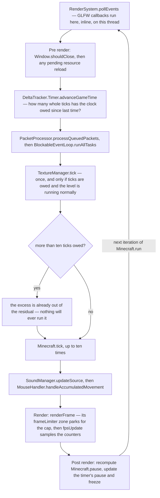

# The client loop

> Verified against **Minecraft 26.2** · Part X · one turn of `Minecraft.run`: how much simulated time a frame owes, what it spends it on, and what happens to the time it cannot afford.

The client has one loop and no schedule. A tick is not a timer callback and
not a thread — it is something the loop does on its way to a frame, as many
times as the clock says it owes. The clock is asked once per iteration, it
answers in whole ticks, and the loop then runs at most **ten** of them. A
frame that earned fifteen runs ten and loses five — and the five are not
deferred. The clock keeps its leftover as a fraction of a tick and hands out
whole ticks as they come due; a tick that has been counted has left that
leftover for good, so nothing will ever run the five, and the world you are
standing in has skipped forward without simulating the gap. That the two programs keep
different clocks at all is [the two loops](../anatomy/anatomy.md#two-loops-and-a-wire-between-them),
and the contrast is sharpest here: the server drops ticks too, but only once
it is more than the overload threshold plus twenty ticks behind, and it logs
*Can't keep up!* when it does ([the server
tick](../server/server-tick.md#the-event-loop-and-what-a-ticks-spare-time-buys)).
The client does it on any frame that needs to, at a ceiling of ten, and says
nothing.

Everything on this page happens on one thread, and it is the client's in [the
four threads](../anatomy/anatomy.md#four-threads-worth-memorising). What that
page does not say is who does the naming: `Main.main` renames the JVM's main
thread to `"Render thread"` and `RenderSystem.initRenderThread` claims it, so
`Minecraft.gameThread`, `BlockableEventLoop.isSameThread` and
`RenderSystem.assertOnRenderThread` all agree about that one thread. **The name
is the trap.** There is no *separate* render thread — no second thread drawing
while the first one ticks — and there never was one in this version. What the
stack traces call *Render thread* is the thread that does everything, and it is
what every *Render thread* in this part's cast tables means.

## The cast

| class | what it decides | thread |
|---|---|---|
| `Minecraft` | the loop itself, and — being a `ReentrantBlockableEventLoop` — the main thread's task queue | Render thread |
| `DeltaTracker.Timer` | how many whole ticks this frame owes, and what the leftover fraction is | Render thread |
| `PacketProcessor` | where packets decoded on Netty threads wait to be applied | filled on Netty, drained here |
| `TickRateManager` | the millisecond target the Timer divides by — a shared class the client holds one of, carrying numbers only the server sets | read here, decided there |
| `FramerateLimitTracker` | what the frame cap actually is, which is not always the option | Render thread |
| `FramerateLimiter` | the park that enforces it | Render thread |
| `Main` | the process: the config, the shutdown hook, the thread's name | JVM main = Render thread |

## One turn of the loop

`Minecraft.run` spins until `Minecraft.running` goes false, and each
iteration is `RenderSystem.pollEvents` followed by `Minecraft.runTick`. The
figure is that iteration. It is drawn as a flowchart rather than a
conversation because the fact worth having is a *decision* — the clamp, and
what falls off the end of it.

Read it as **owe, spend, draw, settle**. The clock says how much simulated
time has passed; the loop spends it on packets, tasks and up to ten ticks;
the frame draws whatever the world looks like afterwards; and only then does
the loop notice whether the game is now paused — which is why the first
frame of a pause is drawn unpaused.

*Pre render*, *Render* and *Post render*, which head three of the figure's
nodes, are `Window.setErrorSection` calls — the crash report's breadcrumb, so a
client that dies takes whichever of the three it was in to the report with it. What happens inside the frame is [the
frame](../rendering/the-frame.md#the-zones-a-frame-is-made-of);
this page stops where the profiler's *frame* zone opens, and every zone inside
it is that page's. Note where the frame limiter sits: inside `Minecraft.renderFrame`,
after the present, with only the *fpsUpdate* zone after it, and *before* the
pause is recomputed.

## The ten, and the arithmetic behind it

`DeltaTracker.Timer.advanceGameTime` takes the elapsed milliseconds, divides
by whatever `DeltaTracker.Timer.targetMsptProvider` returns for
`DeltaTracker.Timer.msPerTick`, adds the result to
`DeltaTracker.Timer.deltaTickResidual`, takes the whole part out and returns
it. The fraction that stays behind is the partial tick everything
interpolates against. The clamp then happens in the loop, not in the Timer —
so the ticks above ten are not deferred to the next frame, because they left
the residual when they were counted.

**Ten** — the ceiling, named by `Minecraft.MAX_TICKS_PER_UPDATE`, though the
clamp in `Minecraft.runTick` is written as a literal and no reader of the
constant survives the decompile. *javac* inlines a `static final int` at
every use site, so a decompile can never tell a documented constant from a
dead one; what it does show is that the number the loop obeys is the literal.

The divisor is not the client's to choose. `DeltaTracker.Timer` gets its
target from `DeltaTracker.Timer.targetMsptProvider`, which is
`Minecraft.getTickTargetMillis`, which asks the level's `TickRateManager`
for `TickRateManager.millisecondsPerTick` whenever it
`TickRateManager.runsNormally`. **`/tick rate` is a server command that
changes the arithmetic inside the client's frame loop.** `/tick freeze` is
the same lever pulled the other way, and the loop reads it directly rather
than through the Timer: `Minecraft.isLevelRunningNormally` asks the level's
`TickRateManager` again, and that is what stops `TextureManager.tick` — which
is why freezing the world freezes the water texture — and what gates
`ClientLevel.animateTick` and `ParticleEngine.tick` inside the tick. The
Timer is *told* the same answer at the end of the iteration, through
`DeltaTracker.Timer.updateFrozenState`, so that the partial tick it hands out
stops moving too.

Alongside the game clock the Timer runs a second, unpausable one.
`DeltaTracker.Timer.advanceRealTime` produces
`DeltaTracker.getRealtimeDeltaTicks`, which is what a menu animates against
while the world is stopped. The two constants `DeltaTracker.ZERO` and
`DeltaTracker.ONE` — two instances of the one nested `DeltaTracker.DefaultValue`
— exist so that code which needs a partial tick can be handed *no*
interpolation or *complete* interpolation without a branch.

## What a tick is, in order

`Minecraft.tick` is one long method, its order is a dependency order, and the
column that matters is the second: almost everything in it is inside a gate,
and the two things that are not are the reason the main menu has music.

| in order | what runs | what gates it |
|---|---|---|
| 1 | `Minecraft.clientTickCount` advances | nothing |
| 2 | `TickRateManager.tick` | a level, and not paused |
| 3 | the game mode | a level, and not paused |
| 4 | `Minecraft.pick`, at a partial tick of one | nothing |
| 5 | `Tutorial.onLookAt`, with what the pick found | nothing |
| 6 | `TextInputManager`, then `Gui.tick` — `Minecraft.missTime` pinned high while a screen is open | nothing |
| 7 | the keybind drain, `Minecraft.handleKeybinds` | neither a screen nor an overlay — **and nothing about a level** |
| 8 | `GameRenderer.tick`, `ClientLevel.tickEntities`, `Level.tickBlockEntities` | a level, and not paused |
| 9 | the music and sound managers | nothing |
| 10 | the first-server toast, `Tutorial.tick`, then `ClientLevel.tick` alone inside a crash-report handler | a level, and not paused |
| 11 | `ClientLevel.animateTick`, `ParticleEngine.tick` | a level, not paused, and the tick rate manager running normally |
| 12 | `ServerboundClientTickEndPacket` | a level, a connection, and not paused |
| 13 | `KeyboardHandler.tick`, where the F3+C crash countdown lives | nothing |

Five of the thirteen rows are gated on nothing at all, and they are the five
that explain what a client with no world is still doing: it counts ticks, it
picks at whatever is in front of the camera, it runs the interface, it plays
music, and it reads the keyboard. Everything that is the *world* is inside
`level != null && !pause`. With no level that middle collapses — but not into
one branch. Two separate *else* arms at two points in the method clear any
post-effect and tick the pending connection, with row nine running between
them.

Two of those rows are load-bearing elsewhere in the book. Row twelve is why
a client still in configuration sends no tick-end packet at all: it sits
inside the level block, and the server reads the packets it does get to decide
that a player who sent no movement this tick is standing still. And row four
is only half of `Minecraft.pick`, which runs **once per tick and once per
frame** — the tick's call at a partial tick of one, the
frame's at the real one, and it is the frame's result the crosshair and the
block outline use. A frame that runs three ticks calls it four times; a frame
that runs none calls it once.

## Where work leaves this thread, and where it comes back

Five ways off this thread, and one re-entry that is not a way off it.

- **Packets** decoded on Netty threads are parked by
  `PacketProcessor.scheduleIfPossible` and drained in the
  *scheduledPacketProcessing* zone — once per frame, not once per tick. That
  single fact is behind most of what looks like network jitter; [the
  connection](../networking/the-connection.md) is the other side of it.
- **Tasks** from other threads land in *scheduledExecutables* through
  `BlockableEventLoop.execute`. From *this* thread the same call usually runs
  inline instead of queueing — but not while a queued task is already running,
  because `ReentrantBlockableEventLoop.scheduleExecutables` returns true for
  the whole of `ReentrantBlockableEventLoop.doRunTask`, which is what stops a
  task from re-entering itself. GLFW callbacks, dispatched inside
  `RenderSystem.pollEvents`, are not inside one, so they execute *before* the
  tick that will observe them — see [input and keybinds](input-and-keybinds.md).
- **Section meshing** goes to `Util.backgroundExecutor` and is collected by
  `SectionRenderDispatcher` (Part XI).
- **Timers**, of which the client has exactly two, and neither of them
  touches the game. `PeriodicNotificationManager` and
  `RemoteFriendListUpdateHandler` each own a scheduler, and each hops back
  here with `BlockableEventLoop.execute` before touching anything — which is
  why nothing in the client's simulation is ever driven by a timer callback.
- **GPU work** registered with `RenderSystem.queueFencedTask` is picked up by
  `RenderSystem.executePendingTasks`, which stops at the first unsignalled
  fence rather than waiting. It looks general and is not: the one thing in
  the tree that queues a fenced task is the OpenGL backend's asynchronous
  texture readback.
The re-entry is `BlockableEventLoop.managedBlock`, which pumps that second
queue while the loop is *blocked* waiting for the integrated server — so work
runs on this thread at a moment when the thread is not running its loop at all.
The mechanism is [the server
tick](../server/server-tick.md#the-event-loop-and-what-a-ticks-spare-time-buys)'.

The profiler wraps all of it. `Minecraft.constructProfiler` picks per
iteration between `InactiveProfiler`, the frame-profile `ContinuousProfiler`
behind the F3 pie chart, the `MetricsRecorder` and a `SingleTickProfiler`,
and `Minecraft.finishProfilers` closes it. `RenderSystem.pollEvents` is
inside the profiler scope but outside `Minecraft.runTick`, so **input polling
lands in no named zone** and shows up on the pie chart as unspecified time.
That is not why
`RenderSystem.isFrozenAtPollEvents` exists, though: its one caller is
`ClientCommonPacketListenerImpl.handleKeepAlive`, which defers the keep-alive
reply while the poll is blocked, so that dragging the window does not look to
the server like a network stall.

## Pausing, which is two things and neither is the menu

`Minecraft.pauseIfInactive`, called during the frame, pauses the game when
the window has been unfocused for more than half a second and
`Options.pauseOnLostFocus` is on. `Minecraft.pause` — the field — is
recomputed at the very end of `Minecraft.runTick` as a conjunction of three:
*singleplayer*, and the GUI says we are pausing, and the world is not open to
LAN. Only the middle one is a question about the interface — `Gui.isPausing`
asks the current screen and overlay, and `Screen.isPauseScreen` defaults to
**true**, which is why the options screen stops a singleplayer world and a
chest does not ([GUI and
screens](gui-and-screens.md#gui-which-is-not-the-hud) owns the vote and the
overrides that cast it). On the
rising edge the loop calls `SoundManager.pauseAllExcept`, sparing music and
UI sounds, and hands the new state to `DeltaTracker.Timer.updatePauseState`.

## The frame cap is usually the option, and sometimes is not

`FramerateLimitTracker.getFramerateLimit` returns the option unchanged
normally; caps it at thirty after a minute idle; replaces it with ten when
the window is iconified or after ten minutes idle — **iconified, not
unfocused**, which is a different state with a different consequence, one
section above — and replaces it with
**sixty** in a menu with no level — which can be *more* than the player
asked for. The two idle cases apply only when `Options.inactivityFpsLimit`
is set to the AFK behaviour, and the iconified test wins over both.
`FramerateLimiter.limitDisplayFPS` is skipped entirely at or above 260 — the
option's own maximum, i.e. "unlimited"; below it, it parks for most of the
remainder, correcting for how much the JDK's park habitually overshoots, and
busy-spins the last fraction. The profiler notices too, though it does not
stop: `FramerateLimitTracker.isHeavilyThrottled` is the `ContinuousProfiler`'s
*suppress warnings* predicate, so a throttled client still measures itself but
stops complaining that its frames are slow.

The numbers on the F3 screen are three different measurements and it is worth
knowing which is which. `Minecraft.fps` is a static field sampled once a
second, and is the one printed as *fps*. `Minecraft.frameTimeNs` is a CPU span
that stops at the blit, before the present and before the limiter, and is read
by nothing but telemetry — so it appears on no line of the overlay. The third
has no name of its own: the frame-time *graph* is fed wall-clock between
frames, measured *after* the limiter, so it includes the sleep and the other
two do not.

## Starting, and the three ways of stopping

`Main.main` builds a `GameConfig` from the command line, installs a shutdown
hook, renames the thread, calls `RenderSystem.initRenderThread` and
constructs `Minecraft`; a `SilentInitException` out of that constructor exits
quietly rather than crashing. `Minecraft.running` is set true inside that
constructor, but five statements *after* the `Options` are read from disk. A
setting's listener only fires while that flag is true, so every
`OptionInstance.set` performed while loading *options.txt* silently skips its
own — [the loading
guard](options.md#the-guard-that-silences-every-setting-at-startup) is that
rule and what it costs. `Main.main` then
calls `Minecraft.exitWorldAndClose`, and its last statement arms
`ClientShutdownWatchdog.startShutdownWatchdog` over what follows. That is the
second of two armings, not the only one: the window-close callback arms the
same watchdog against the game thread while the game is still running, which
is the one that catches a client that hangs on the close button rather than
one that hangs on the way out. The two do not have the same powers, either.
Both start a daemon thread that sleeps fifteen seconds and, if the shutdown
has not claimed the counter by then, builds a crash report from the main
thread's stack — but the close-callback arming stops there, at *report only*,
while the one after `Minecraft.run` has returned goes on to take the process
down.

Stopping has three doors and one corridor. `Minecraft.stop` sets
`Minecraft.running` false, and is what `Window.shouldClose` triggers at the
top of `Minecraft.runTick`. `Minecraft.emergencySaveAndCrash` is where a
`ReportedException` or any other throwable from the loop body ends up, by way
of `Minecraft.emergencySave`, which releases the reserved memory block, halts
the integrated server and shows the saving screen. And an out-of-memory error
does not necessarily end anything: the first one makes `Minecraft.run` stop
advancing game time altogether — GUI only, no ticks, no packets, no world —
after an emergency save; a second one rethrows.

The corridor is `Minecraft.exitWorldAndClose` and then `Minecraft.close`,
which tears down in a fixed order — the time source first, outside the try,
then the friends list, the timer query, telemetry, compliancies, the atlas and
font managers, the game renderer, the shader manager, the level renderer, the
sound manager, the two texture managers, resources, the Tracy capture, the
narrator, FreeType, the executors, the surface and the renderer — and then, in
a finally block, only the window, the monitor manager and GLFW's own termination.
There is no *Minecraft.destroy*.

> **For a 1.21-era reader.** Names to stop hunting for:
> *Minecraft.getPartialTick*, *Minecraft.noRender*, *Minecraft.tell*,
> *Minecraft.destroy*, *Minecraft.screen* and *Minecraft.setScreen* (both now
> on `Gui`), *Timer* (now `DeltaTracker.Timer`), and *initGameThread* /
> *isOnGameThread*, which do not exist because the second thread they
> distinguished does not either.

## Where to look

`Minecraft.run` and `Minecraft.runTick` — the loop is those two methods.
`DeltaTracker.Timer.advanceGameTime` for the tick arithmetic and
`Minecraft.getTickTargetMillis` for who sets its rate. `Minecraft.tick` for
the ordered contents of a tick. `FramerateLimitTracker.getFramerateLimit` for
the frame cap that is not the option. `Main.main` for how the process starts,
and `Minecraft.close` for the order in which it comes apart.

---

*Rules: names, never code · how the system works, not how the code reads ·
newest version only · every backticked name passes `tools/verify_names.py`.*
