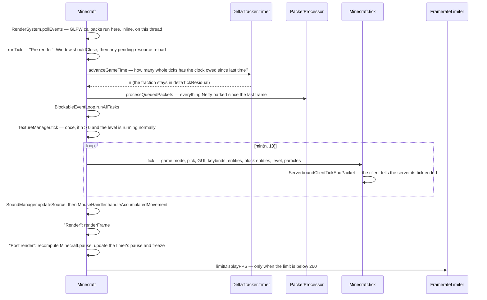

# The client loop

> Verified against **Minecraft 26.2** · Part X · one turn of `Minecraft.run`: how much simulated time a frame owes, what it spends it on, and what the loop does when it is not allowed to draw.

## Responsibility

The client has one loop and no schedule. A tick is not a timer callback and
not a thread — it is something the loop does on its way to a frame, as many
times as the clock says it owes, up to a hard ceiling, after which the debt
is written off. This page is that loop: the thread it runs on, the arithmetic
that decides how many ticks a frame runs, what the tick itself does in what
order, and the two ends of the loop's life — the client starting and the
client stopping.

The one sentence a player would recognise: *the game stuttering, and the
world moving on without you.*

The headline for a 1.21-era reader: **there is no render thread.** The thread
named `"Render thread"` is the main thread — `Main.main` renames it and
`RenderSystem.initRenderThread` claims it — so `Minecraft.gameThread`,
`BlockableEventLoop.isSameThread` and `RenderSystem.assertOnRenderThread` all
agree about the same thread. Everything on this page is that one thread.

## The data it owns

- **`Minecraft`** — a `ReentrantBlockableEventLoop`, so the game object is
  also the main thread's task queue. The loop's own state is
  `Minecraft.running`, `Minecraft.pause`, `Minecraft.gameThread`,
  `Minecraft.clientTickCount`, `Minecraft.window`,
  `Minecraft.windowSurface`, `Minecraft.level` and `Minecraft.player`.
  Its timing state is `Minecraft.deltaTracker`, `Minecraft.frameTimeNs`,
  `Minecraft.frames`, `Minecraft.lastNanoTime`, `Minecraft.fps`,
  `Minecraft.gpuUtilization`, `Minecraft.savedCpuDuration` and
  `Minecraft.timerQuery`. `Minecraft.rightClickDelay` and
  `Minecraft.missTime` are the two input cooldowns the tick decrements.
- **`DeltaTracker`** — the interface everything else asks for time, with
  three questions: `DeltaTracker.getGameTimeDeltaTicks`,
  `DeltaTracker.getGameTimeDeltaPartialTick` (which takes a flag saying
  whether to ignore a frozen game) and `DeltaTracker.getRealtimeDeltaTicks`.
  Two implementations: the constant `DeltaTracker.DefaultValue` behind
  `DeltaTracker.ZERO` and `DeltaTracker.ONE`, and the real
  `DeltaTracker.Timer`. The Timer holds `DeltaTracker.Timer.deltaTicks`,
  `DeltaTracker.Timer.deltaTickResidual`,
  `DeltaTracker.Timer.pausedDeltaTickResidual`,
  `DeltaTracker.Timer.realtimeDeltaTicks`,
  `DeltaTracker.Timer.lastMs`, `DeltaTracker.Timer.lastUiMs`,
  `DeltaTracker.Timer.msPerTick`, `DeltaTracker.Timer.targetMsptProvider`,
  `DeltaTracker.Timer.paused` and `DeltaTracker.Timer.frozen`.
  `DeltaTracker.Timer.advanceGameTime` is the function that decides how many
  ticks a frame runs; `DeltaTracker.Timer.advanceRealTime` runs the second,
  unpausable clock that menus interpolate against.
- **`PacketProcessor`** — the parking place for packets decoded on Netty
  threads. `PacketProcessor.scheduleIfPossible` fills it from the network
  side; `PacketProcessor.processQueuedPackets` drains it here. It is shared
  code: the server has one too (see
  [the connection](../networking/the-connection.md)).
- **`FramerateLimitTracker`** and **`FramerateLimiter`** — what the frame
  cap actually is, and the sleep that enforces it.
  `FramerateLimitTracker.getFramerateLimit`,
  `FramerateLimitTracker.FramerateThrottleReason`,
  `FramerateLimitTracker.isHeavilyThrottled`,
  `FramerateLimiter.limitDisplayFPS`.
- **The profiler apparatus.** `Minecraft.constructProfiler` picks, per
  iteration, between `InactiveProfiler`, the frame-profile
  `ContinuousProfiler` behind the F3 pie chart, the `MetricsRecorder` and a
  `SingleTickProfiler`; `Minecraft.finishProfilers` closes the loop.
  Alongside it, `Minecraft.perTickGizmos` (a `SimpleGizmoCollector`) and
  `Minecraft.drainedLatestTickGizmos` hold the debug geometry a tick
  collected, bracketed by `Gizmos.TemporaryCollection` from
  `Minecraft.collectPerTickGizmos`.

## When it runs

`Main.main` builds a `GameConfig` from the command line, installs a shutdown
hook, renames the thread, calls `RenderSystem.initRenderThread` and
constructs `Minecraft`; a `SilentInitException` out of that constructor exits
quietly rather than crashing. Then `Minecraft.run` spins until
`Minecraft.running` goes false, and `Main.main` finishes by calling
`Minecraft.exitWorldAndClose`.

Work leaves the thread in four directions and comes back in four places.
Packets decoded on Netty threads are parked by
`PacketProcessor.scheduleIfPossible` and drained in the
*scheduledPacketProcessing* zone. Anything calling
`BlockableEventLoop.execute` from another thread lands in
*scheduledExecutables* — from *this* thread it does not queue at all but runs
inline, which is why GLFW callbacks, dispatched inside
`RenderSystem.pollEvents` on this thread, execute immediately rather than
next tick. Section meshing goes to `Util.backgroundExecutor` and is collected
by `SectionRenderDispatcher`. GPU work registered with
`RenderSystem.queueFencedTask` is picked up by
`RenderSystem.executePendingTasks`, which stops at the first unsignalled
fence rather than waiting. A fifth re-entry exists and is not a queue:
`BlockableEventLoop.managedBlock` pumps tasks while the loop is blocked
waiting for the integrated server.

## The trace: one turn of the loop

Read it as **owe, spend, draw, settle**. The clock says how much simulated
time has passed; the loop spends it on packets, tasks and up to ten ticks;
the frame draws whatever the world looks like afterwards; and only then does
the loop notice whether the game is now paused.

The quoted strings are `Window.setErrorSection` calls — the crash report's
breadcrumb, so a client that dies takes *Pre render*, *Render* or *Post
render* to the report with it. What happens inside the frame itself is
[the frame](../rendering/the-frame.md).

## The tick, in order

`Minecraft.tick` is one long method, and its order is a dependency order.
It advances `Minecraft.clientTickCount`, then — when there is a level and the
game is not paused — ticks the `TickRateManager`. Then, in sequence: the game
mode; `Minecraft.pick` at a partial tick of one; `Tutorial.onLookAt` with the
result; the GUI block (`TextInputManager`, then `Gui.tick`, with
`Minecraft.missTime` pinned high while a screen is open); the keybind drain,
**only** when there is neither an overlay nor a screen; then
`GameRenderer.tick`, `ClientLevel.tickEntities` and `Level.tickBlockEntities`;
then the music and sound managers, which sit *outside* the level check and
run with no world at all; then the level block (`Tutorial.tick` and
`ClientLevel.tick`, wrapped in a crash-report handler); then
`ClientLevel.animateTick` and `ParticleEngine.tick`, both additionally gated
on the level running normally; then `ServerboundClientTickEndPacket`; and
last of all `KeyboardHandler.tick`, which is where the F3+C crash countdown
lives.

With no level, that whole middle collapses to one branch: the pending
connection is ticked instead, and any post-effect is cleared.

## Starting and stopping

**Starting** is `Main.main` and the `Minecraft` constructor, and the loop's
only involvement is that `Minecraft.running` is set true *after* the
constructor returns — which is why every `OptionInstance.set` performed while
loading *options.txt* silently skips its listener (see
[options](options.md)).

**Stopping** has three doors and one corridor. `Minecraft.stop` sets
`Minecraft.running` false — it is what `Window.shouldClose` triggers at the
top of `Minecraft.runTick`. `Minecraft.emergencySaveAndCrash` is where a
`ReportedException` or any other throwable from the loop body ends up, by way
of `Minecraft.emergencySave`, which releases the reserved memory block, halts
the integrated server and shows the saving screen. And an out-of-memory error
does not necessarily end anything: the first one makes `Minecraft.run` stop
advancing game time altogether — GUI only, no ticks, no world — after an
emergency save; a second one rethrows.

The corridor is `Minecraft.exitWorldAndClose` and then `Minecraft.close`,
which tears down in a fixed order — the time source, the timer query,
telemetry, the atlas and font managers, the game and level renderers, the
shader manager, the sound manager, textures, resources, the Tracy capture,
the narrator, FreeType — and then, in a finally block, the executors, the
surface, the renderer, the window and the monitor manager. There is no
*Minecraft.destroy*.

## Pausing

Two different pauses, and neither of them is the pause menu.

`Minecraft.pauseIfInactive`, called during the frame, pauses the game when
the window has been unfocused for more than half a second and
`Options.pauseOnLostFocus` is on. `Minecraft.pause` — the field — is
recomputed at the very end of `Minecraft.runTick` as *singleplayer, and the
GUI says we are pausing, and the world is not open to LAN*. `Gui.isPausing`
asks the current screen and overlay, and `Screen.isPauseScreen` defaults to
**true**: this is why the options screen stops a singleplayer world and a
chest does not — `AbstractContainerScreen` overrides it to false. On the
rising edge the loop calls `SoundManager.pauseAllExcept`, sparing music and
UI sounds, and hands the new state to
`DeltaTracker.Timer.updatePauseState`.

## Interfaces

- **Called by:** `Main.main`, and nothing else. `Minecraft.run` is the
  process.
- **Calls into:** `Minecraft.renderFrame` — see
  [the frame](../rendering/the-frame.md) — plus everything the tick touches:
  [the client level](the-client-level.md), [input](input-and-keybinds.md),
  [GUI and screens](gui-and-screens.md), [sound](sound.md).
- **Crosses the network as:** `ServerboundClientTickEndPacket`, once per
  unpaused client tick that has a connection. The server reads it to decide
  that a player who sent no movement this tick is standing still. Inbound,
  this loop is where every packet is *applied* — see
  [what the client is told](../networking/what-the-client-is-told.md).
- **Data-driven by:** `Options` — `Options.framerateLimit`,
  `Options.inactivityFpsLimit`, `Options.pauseOnLostFocus`.

## Invariants and surprises

- **Excess ticks are dropped, not deferred.**
  `DeltaTracker.Timer.advanceGameTime` takes the whole integer part out of
  its residual and returns it; the loop then runs at most ten of them. A
  frame that earned fifteen ticks runs ten and loses five — they are already
  gone from the residual, and nothing will ever run them.
- **The ten is written twice and read once.**
  `Minecraft.MAX_TICKS_PER_UPDATE` is ten and has no callers anywhere in the
  tree; the clamp in `Minecraft.runTick` is a literal. The constant is
  documentation, not code.
- **The server owns the client's clock rate.** The Timer's
  `DeltaTracker.Timer.targetMsptProvider` is `Minecraft.getTickTargetMillis`,
  which asks the level's `TickRateManager` for
  `TickRateManager.millisecondsPerTick` whenever it
  `TickRateManager.runsNormally`. `/tick rate` is a server command that
  changes the arithmetic inside the client's frame loop.
- **`Minecraft.pick` runs once per tick and once per frame.** The tick's call
  uses a partial tick of one; the frame's uses the real one, and that second
  result is what the crosshair and the block outline use. A frame that runs
  three ticks calls it four times; a frame that runs none calls it once.
- **Animated textures advance once per frame at most, and stop when the
  world does.** `TextureManager.tick` sits outside the tick loop, gated on
  the frame having earned at least one tick **and** on the level running
  normally — so `/tick freeze` freezes the water.
- **`Minecraft.pause` lags by one frame.** It is recomputed after the frame
  is drawn, so the first frame of a pause is drawn unpaused.
- **The framerate limit is usually the option, and sometimes is not.**
  `FramerateLimitTracker.getFramerateLimit` returns the option unchanged
  normally; caps it at thirty after a minute idle; replaces it with ten when
  the window is iconified or after ten minutes idle; and replaces it with
  **sixty** in a menu with no level — which can be *more* than the player
  asked for. The two idle cases apply only when `Options.inactivityFpsLimit`
  is set to the AFK behaviour, and the iconified test wins over both.
  `FramerateLimiter.limitDisplayFPS` is skipped entirely at or above 260 —
  the option's own maximum, i.e. "unlimited"; below it, it parks for most of
  the remainder, correcting for how much the JDK's park habitually
  overshoots, and busy-spins the last fraction.
- **The fps number, the frame time and the F3 graph are three different
  measurements.** `Minecraft.fps` is a static field sampled once a second.
  `Minecraft.frameTimeNs` is the real per-frame CPU span and is read by
  nothing but telemetry. The graph uses wall-clock between frames, measured
  after the limiter, so it includes the sleep.
- **Input polling is inside the profiler and inside no zone.**
  `RenderSystem.pollEvents` is called from `Minecraft.run`, within the
  profiler scope and the Tracy frame but outside `Minecraft.runTick`, so it
  appears in no pie slice. That is not why
  `RenderSystem.isFrozenAtPollEvents` exists, though: its one caller is
  `ClientCommonPacketListenerImpl.handleKeepAlive`, which defers the
  keep-alive reply while the poll is blocked, so that dragging the window
  does not look to the server like a network stall.
- **The profiler turns itself off when nobody is watching.** The
  frame-profile profiler is skipped while
  `FramerateLimitTracker.isHeavilyThrottled` — an idle client does not pay to
  measure itself.
- **A GLFW callback is not a queued task.** `BlockableEventLoop.execute` only
  queues when called from another thread; on the game thread it runs the task
  immediately. Input handlers reached from `RenderSystem.pollEvents`
  therefore run *before* the tick that observes them, not inside it.
- **Names a 1.21-era reader will hunt for and not find:**
  *Minecraft.getPartialTick*, *Minecraft.noRender*, *Minecraft.tell*,
  *Minecraft.destroy*, *Minecraft.screen* and *Minecraft.setScreen* (now on
  `Gui`), *Timer* (now `DeltaTracker.Timer`), and *initGameThread* /
  *isOnGameThread*, which do not exist because the second thread they
  distinguished does not either.

## Where to look

`Minecraft.run` and `Minecraft.runTick` — the loop is those two methods.
`DeltaTracker.Timer.advanceGameTime` for the tick arithmetic and
`Minecraft.getTickTargetMillis` for who sets its rate. `Minecraft.tick` for
the ordered contents of a tick. `FramerateLimitTracker.getFramerateLimit` for
the frame cap that is not the option. `Main.main` for how the process starts,
and `Minecraft.close` for the order in which it comes apart.

---

*Rules: names, never code · how the system works, not how the code reads ·
newest version only · every backticked name passes `tools/verify_names.py`.*
