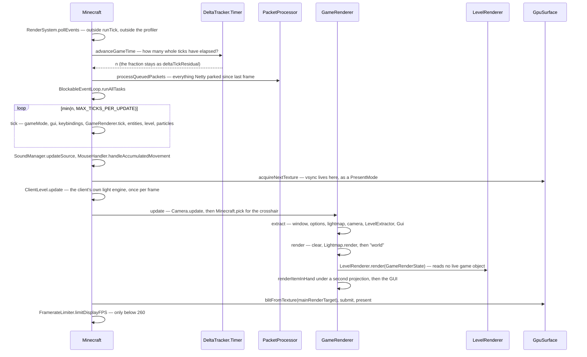

# The frame

> Verified against **Minecraft 26.2** · Part X · one frame: from a GLFW event poll to a texture handed to the compositor, and where the time went.

## Responsibility

The client has one loop, and it is the frame. Ticks do not get a thread of
their own — they are something the frame does on its way past. This page
is the shape of that loop: what runs before the world is drawn, how many
ticks a slow frame runs, which of the several different "partial ticks" a
given system gets, and where the frame actually ends.

The one sentence a player would recognise: *the number in the top-left
that says 143 fps.*

The headline for a 1.21-era reader: **there is no render thread.** The
thread named `"Render thread"` is the main thread — `Main.main` renames
it and `RenderSystem.initRenderThread` claims it. And the rendering model
is now **extract then render**: `GameRenderer.extract` copies the live
game into a `GameRenderState`, and `GameRenderer.render` is forbidden
from looking at anything else. *MultiBufferSource* does not exist.

## The data it owns

- **`Minecraft`** — a `ReentrantBlockableEventLoop`, so it is both the
  game and the main-thread task queue. It owns `Minecraft.running`,
  `Minecraft.pause`, `Minecraft.gameThread`, `Minecraft.window`,
  `Minecraft.windowSurface`, `Minecraft.level`, `Minecraft.player`,
  `Minecraft.gui`, `Minecraft.gameRenderer`, `Minecraft.levelRenderer`,
  `Minecraft.levelExtractor`, `Minecraft.hitResult` and
  `Minecraft.crosshairPickEntity`. Its timing state is
  `Minecraft.deltaTracker`, `Minecraft.frameTimeNs`, `Minecraft.frames`,
  `Minecraft.lastNanoTime`, `Minecraft.fps`, `Minecraft.gpuUtilization`
  and `Minecraft.savedCpuDuration`. `Minecraft.MAX_TICKS_PER_UPDATE` is
  the per-frame tick clamp.
- **`DeltaTracker`** — the interface the rest of the game asks for time.
  Three questions: `DeltaTracker.getGameTimeDeltaTicks`,
  `DeltaTracker.getGameTimeDeltaPartialTick` and
  `DeltaTracker.getRealtimeDeltaTicks`. Two implementations:
  `DeltaTracker.DefaultValue` (behind `DeltaTracker.ZERO` and
  `DeltaTracker.ONE`) and the real `DeltaTracker.Timer`, which holds
  `DeltaTracker.Timer.deltaTicks`,
  `DeltaTracker.Timer.deltaTickResidual`,
  `DeltaTracker.Timer.realtimeDeltaTicks`,
  `DeltaTracker.Timer.msPerTick`,
  `DeltaTracker.Timer.targetMsptProvider`,
  `DeltaTracker.Timer.paused` and `DeltaTracker.Timer.frozen`.
  `DeltaTracker.Timer.advanceGameTime` is the function that decides how
  many ticks this frame runs.
- **`GameRenderer`** — the frame's owner of everything drawn.
  `GameRenderer.gameRenderState` (the extract target),
  `GameRenderer.mainCamera`, `GameRenderer.mainRenderTarget`,
  `GameRenderer.renderBuffers`, `GameRenderer.featureRenderDispatcher`,
  `GameRenderer.guiRenderer`, `GameRenderer.itemInHandRenderer`,
  `GameRenderer.screenEffectRenderer`, `GameRenderer.lightmap` and
  `GameRenderer.uiLightmap`, `GameRenderer.fogRenderer`,
  `GameRenderer.resourcePool` (a `CrossFrameResourcePool`),
  `GameRenderer.globalSettingsUniform`,
  `GameRenderer.levelProjectionMatrixBuffer`,
  `GameRenderer.hudProjection`, and the post-effect state
  `GameRenderer.postEffectId` / `GameRenderer.effectActive`.
- **`GameRenderState`** — the frame's snapshot:
  `GameRenderState.levelRenderState`,
  `GameRenderState.lightmapRenderState`,
  `GameRenderState.guiRenderState`,
  `GameRenderState.optionsRenderState`,
  `GameRenderState.windowRenderState` and
  `GameRenderState.framerateLimit`. `CameraRenderState` is the camera's
  half of it — `CameraRenderState.pos`, `CameraRenderState.projectionMatrix`,
  `CameraRenderState.cullFrustum`, `CameraRenderState.fogData`,
  `CameraRenderState.fogType`, `CameraRenderState.hudFov`.
- **`Camera`** — split in two, like everything else.
  `Camera.tick` smooths the eye height and the FOV modifier;
  `Camera.update` does `Camera.alignWithEntity`, `Camera.calculateFov`,
  `Camera.prepareCullFrustum` and `Camera.setupPerspective`;
  `Camera.extractRenderState` copies the result. Its accessors lost their
  *get* prefix: `Camera.position`, `Camera.blockPosition`,
  `Camera.entity`, `Camera.xRot`, `Camera.yRot`, `Camera.rotation`,
  `Camera.forwardVector`, `Camera.upVector`, `Camera.leftVector`,
  `Camera.isDetached`, `Camera.getCullFrustum`, `Camera.attributeProbe`.
- **`RenderBuffers`** — much smaller than it was. Now only
  `RenderBuffers.fixedBufferPack` and `RenderBuffers.sectionBufferPool`
  (the section-meshing scratch, sized to the processor count) plus one
  shared `RenderBuffers.stagedVertexBuffer`, released by
  `RenderBuffers.endFrame`. Geometry submission moved to
  `SubmitNodeCollector` / `SubmitNodeStorage` and is drawn by
  `FeatureRenderDispatcher.renderAllFeatures`.
- **`Window`** and **`GpuSurface`** — the window handle and the
  presentable surface. `GpuSurface.acquireNextTexture`,
  `GpuSurface.blitFromTexture`, `GpuSurface.present`,
  `GpuSurface.configure` and `GpuSurface.PresentMode`.
- **`FramerateLimitTracker`** and **`FramerateLimiter`** — what the fps
  cap actually is, and the sleep that enforces it.

## When it runs

Everything on this page is on one thread. `Main.main` renames the JVM's
main thread to *Render thread* and calls `RenderSystem.initRenderThread`;
`Minecraft.gameThread` is that thread, and
`BlockableEventLoop.isSameThread` and `RenderSystem.assertOnRenderThread`
therefore agree. Ticks, extract, draws and GLFW polling all happen there.

Work leaves it in four directions and comes back in four places:
packets decoded on Netty threads are queued by
`PacketProcessor.scheduleIfPossible` and drained in the frame's
*scheduledPacketProcessing* zone; anything calling
`BlockableEventLoop.execute` lands in *scheduledExecutables*; section
meshing goes to `Util.backgroundExecutor` and is collected by
`SectionRenderDispatcher` without ever blocking the loop; and GPU work
registered with `RenderSystem.queueFencedTask` is picked up by
`RenderSystem.executePendingTasks` in the *gpuAsync* zone, which stops at
the first unsignalled fence rather than waiting.

## The trace: one frame

Read it as three phases with a hard wall between them. **Advance** decides
how much simulated time has passed and spends it — packets, tasks, up to
ten ticks. **Extract** walks the live game once and writes a
`GameRenderState`. **Render** draws that state and nothing else. The wall
is why `LevelRenderer.render` takes a `CameraRenderState` and not a
`Camera`: by the time it runs, the camera is allowed to have moved on.

`Minecraft.renderFrame` is public and is called from three blocking
loops as well — waiting for the integrated server to come up, waiting for
it to shut down, and `Minecraft.setScreenAndShow` — always with the
"advance game time" flag off, which skips both the ticks and the whole
world render.

## Interfaces

- **Called by:** `Minecraft.run`, which does nothing but wrap
  `Minecraft.runTick` in a profiler scope, a Tracy frame and an
  out-of-memory handler.
- **Calls into:** `GameRenderer.extract` and `GameRenderer.render`; the
  frame graph in [level rendering](level-rendering.md); the GPU
  abstraction in [blaze3d](blaze3d.md); `Gui.extractRenderState` and
  `GuiRenderer.render` in [GUI and screens](gui-and-screens.md).
- **Crosses the network as:** nothing itself, but the frame is where
  received packets are applied — `PacketProcessor` is the client's half
  of the arrangement described in
  [the connection](../networking/the-connection.md).
- **Data-driven by:** `Options` — render distance, FOV, vsync,
  `Options.framerateLimit`, `Options.inactivityFpsLimit`,
  `Options.pauseOnLostFocus`.

## Invariants and surprises

- **The tick loop is driven from the frame, and excess ticks are
  dropped, not deferred.** `DeltaTracker.Timer.advanceGameTime` removes
  the whole integer part from its residual and returns it; the frame then
  runs at most `Minecraft.MAX_TICKS_PER_UPDATE` of them. A frame that
  earned fifteen ticks runs ten and silently loses five — they are
  already gone from the residual.
- **One frame uses several different partial ticks.** The world gets
  `DeltaTracker.getGameTimeDeltaPartialTick` with frozen time honoured;
  the camera and the held item get
  `Camera.getCameraEntityPartialTicks`, which ignores freezing — and
  returns a hard `1.0` when the camera entity itself is frozen. The
  lightmap ignores partial ticks entirely. Under `/tick freeze` the world
  is pinned and the camera still interpolates.
- **The client light engine runs per frame, not per tick.**
  `ClientLevel.update` is called from the frame's *update* zone,
  regardless of how many ticks that frame ran.
- **So do animated textures.** `TextureManager.tick` sits *outside* the
  tick loop, gated only on the tick count being non-zero. A frame that
  runs three ticks advances animations once.
- **`Minecraft.pick` runs twice per ticking frame** — once inside
  `Minecraft.tick` with a partial tick of one, once in the frame's update
  zone with the real one. The second is what the crosshair and the block
  outline use.
- **`Minecraft.pause` lags by one frame.** It is recomputed at the very
  end of `Minecraft.runTick`, after the frame is drawn, and the timer's
  pause and freeze states are updated there too.
- **Nothing swaps buffers in the zone called *swapBuffers*.**
  Presentation is `GpuSurface.acquireNextTexture` early in the frame,
  `GpuSurface.blitFromTexture` from the main target, then
  `CommandEncoder.submit` and `GpuSurface.present`. Vsync is not a swap
  interval any more — it is a `GpuSurface.PresentMode` baked into a
  `GpuSurface.Configuration`, so toggling it forces a surface
  reconfigure.
- **The framerate limit is not the option.**
  `FramerateLimitTracker.getFramerateLimit` overrides it: ten when the
  window is iconified, ten after ten minutes idle, thirty after one
  minute idle, sixty in a menu with no level. The reason is exposed as
  `FramerateLimitTracker.FramerateThrottleReason`. And
  `FramerateLimiter.limitDisplayFPS` is skipped entirely above a high
  threshold; below it, it parks for most of the remainder — correcting
  for how much `LockSupport` habitually overshoots — and busy-spins the
  last fraction.
- **The fps number and the frame time are different measurements.**
  `Minecraft.fps` is a static field sampled once a second.
  `Minecraft.getFrameTimeNs` is the real per-frame CPU span and is read
  by nothing but telemetry. The F3 frame graph uses a third number,
  wall-clock between frames, which includes the limiter's sleep.
- **Input polling is invisible to the profiler.**
  `RenderSystem.pollEvents` is called from `Minecraft.run`, outside
  `Minecraft.runTick` and outside the profiler scope, which is why
  `RenderSystem.isFrozenAtPollEvents` has to exist as a separate
  watchdog.
- **The cull frustum is deliberately wider than the camera.**
  `Camera.createProjectionMatrixForCulling` uses the larger of the
  current FOV and the configured one, so sprint FOV can never cull a
  section the un-modified FOV would have shown.
- **Out of memory degrades the loop instead of crashing it.** The first
  out-of-memory error makes `Minecraft.run` stop advancing game time
  altogether — GUI only, no ticks, no world — after an emergency save. A
  second one rethrows.
- **Names a 1.21-era reader will hunt for and not find:**
  *Minecraft.getPartialTick*, *Minecraft.noRender*, *Minecraft.tell*,
  *Minecraft.screen* and *Minecraft.setScreen* (now on `Gui`),
  *Minecraft.getMainRenderTarget* (now `GameRenderer.mainRenderTarget`),
  *Timer* (now `DeltaTracker.Timer`), *Camera.setup* (now
  `Camera.update` plus `Camera.extractRenderState`),
  *GameRenderer.getProjectionMatrix* and *resetProjectionMatrix*,
  *Window.updateDisplay*, *MultiBufferSource* and every buffer source on
  `RenderBuffers`, and *LightTexture* (now `Lightmap`).

## Where to look

`Minecraft.run`, then `Minecraft.runTick` — the whole loop is those two
methods. `DeltaTracker.Timer.advanceGameTime` for the tick arithmetic.
`Minecraft.renderFrame` for the frame proper, then `GameRenderer.extract`
and `GameRenderer.render` for the wall between live objects and drawing.
`Camera.update` for how the view is decided, and `GpuSurface.present`
for where a frame ends.

---

*Rules: names, never code · how the system works, not how the code reads ·
newest version only · every backticked name passes `tools/verify_names.py`.*
