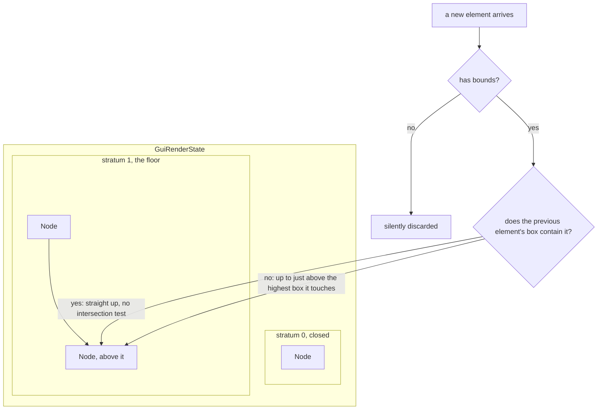
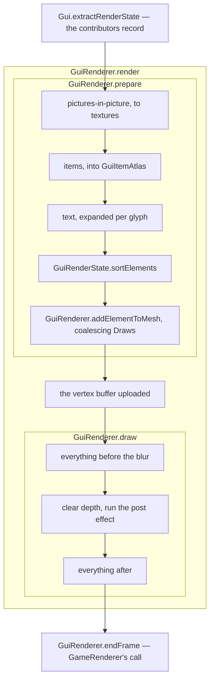

# The GUI render tree

> Verified against **Minecraft 26.2** · Part X · a chest full of the same item: how the 2D UI decides what is in front of what, without anybody ever saying so.

Nothing in the client's 2D UI draws anything. Every call a screen, a widget
or the HUD makes appends a *render state* to a tree; later in the same frame
a second pass resolves that tree, sorts it, batches it and issues the draws.
And the tree is not told what order to put things in. **Layering is inferred
from bounding boxes**: a new element goes above the highest existing element
whose box it *intersects*, and two elements that do not overlap can share a
node and be reordered freely by the batching sort. There is no Z value, no
layer index, and no declared order beyond the call order and two explicit
barriers.

That inference is what buys the cheapness of a chest full of identical stacks,
and it buys it twice over. Because two elements that do not overlap may share a
node, the fifty-odd slots of a chest land in the *same* layer, and a layer's
element list is free to be reordered — so they can be sorted together and
issued as one draw call instead of fifty. And because each distinct item model
is rendered into a dynamic atlas **once and reused for as long as it stays
resident**, those fifty slots between them cost one 3D render ever, not one per
frame and not one per stack; what they then draw is a flat rectangle of that
atlas, which is exactly the kind of thing the sort can batch. The model being
rendered is [models and atlases](../rendering/models-and-atlases.md)', and what
records into this tree in the first place — screens and widgets — is [GUI and
screens](gui-and-screens.md#the-objects-and-what-contains-what), the lecture
before this one.

## The cast

| class | what it decides | thread |
|---|---|---|
| `GuiGraphicsExtractor` | what a screen is handed — every drawing verb, and the scissor stack | Render thread |
| `GuiRenderState` | the tree: strata, nodes, and where a new element belongs | Render thread |
| `GuiRenderState.Node` | one layer: five lists, of which only the element list is ever sorted | Render thread |
| `GuiElementRenderState` | one recorded thing, and the bounds the layering algorithm reads | Render thread |
| `GuiRenderer` | resolving, sorting, coalescing and issuing the draws | Render thread |
| `GuiItemAtlas` | which item models are already rendered, and which age out | Render thread |
| `GameRenderState` | who actually owns the tree — not `Gui`; the frame's own snapshot ([the frame](../rendering/the-frame.md#the-zones-a-frame-is-made-of)) | Render thread |

## The tree, and where a new element lands

*`GuiRenderState` is a list of strata and each stratum a chain of nodes. Both
answers land in the tree, and neither can land below the barrier: a
`GuiRenderState.nextStratum` call closes stratum 0 for good, so the worst the
search can do is reach the bottom node of the current one. The five element
lists each node holds are the table below.*

Three consequences fall straight out of that picture.

**An element with no bounds is silently discarded.** Every *recording* add
verb is conditional on the tree finding a node, and finding a node requires
bounds. Glyph states deliberately have none — which is exactly why they are
added through the layer-bypassing verb,
`GuiRenderState.addGlyphToCurrentLayer`, which the draw pass calls rather than
the record pass, and emitted after their node's geometry. **Glyphs are never sorted**, and
that is the whole mechanism behind "text draws on top of its own background".

**The search never descends below the current stratum.** A *stratum* is a
floor the layering search may not go under: opening one declares that
everything recorded from now on sits above everything recorded so far,
whatever the bounding boxes say. That is what makes
`GuiRenderState.nextStratum` — reached by a recorder as
`GuiGraphicsExtractor.nextStratum`, which is the same barrier under the name
the caller sees — a hard rule rather than a hint. It is how the HUD keeps the
hotbar block out of the crosshair's layering, and how chat stays clear of the
scoreboard.

**The fast path is the common case.** If the previous element's box
*contains* the new one — a label inside a button, a sprite inside a slot — it
goes straight up with no test.

The tree's verbs sort into three kinds, and the third kind is the one that
catches people out: two of them are not recording verbs at all, and are called
by the resolve pass rather than by a screen.

| verb | who calls it | what lands in the node |
|---|---|---|
| `GuiRenderState.addGuiElement` | a recorder | `BlitRenderState`, `TiledBlitRenderState`, `ColoredRectangleRenderState` |
| `GuiRenderState.addText` | a recorder | `GuiTextRenderState` |
| `GuiRenderState.addItem` | a recorder | `GuiItemRenderState` |
| `GuiRenderState.addPicturesInPictureState` | a recorder | the `PictureInPictureRenderState` family, below |
| `GuiRenderState.nextStratum` | a recorder | nothing — a barrier |
| `GuiRenderState.blurBeforeThisStratum` | a recorder | nothing — a barrier |
| `GuiRenderState.addBlitToCurrentLayer` | `GuiRenderer` and `PictureInPictureRenderer`, in the resolve pass | the flat rectangle an item or a picture-in-picture resolved to |
| `GuiRenderState.addGlyphToCurrentLayer` | `GuiRenderer`, in the resolve pass | `GlyphRenderState` |

The last two bypass the layering search entirely and append to the node their
source element already chose, which is the whole reason a resolved thing never
jumps in front of what recorded it. `PanoramaRenderState` is the one state with
no verb at all: the title screen's spinning backdrop is a nullable *field* on
`GuiRenderState`, assigned by `Panorama` and drawn by `GuiRenderer.render`
before the tree is resolved — so it is under everything by construction rather
than by layering.

The `PictureInPictureRenderState` family is six — `GuiEntityRenderState`,
`GuiSkinRenderState`, `GuiBookModelRenderState`, `GuiBannerResultRenderState`,
`GuiProfilerChartRenderState` and `OversizedItemRenderState` — and each has a
matching `PictureInPictureRenderer` subclass in `client/gui/render/pip` that
resolves it into a texture during `GuiRenderer.prepare`. Those six and the item
atlas are where 3D drawing happens inside a 2D pass: the spinning entity in an
inventory, the skin in a social list, the enchanting-table book, and every item
model in every slot.

## The draw pass

Two phases, one thread, one frame. It is a *data* split rather than a thread
split: the record phase touches game state, the draw phase touches the
recorded objects and the GPU.

*The nesting is the point: the five steps in the inner box all happen inside
`GuiRenderer.prepare`, not after it, and `GuiRenderer.draw` is its sibling
rather than its successor. Only `Gui.extractRenderState` at the top and
`GuiRenderer.endFrame` at the foot are outside `GuiRenderer.render`.*

One thing happens eagerly during recording that looks like it should not:
adding text forces the text to be **prepared**, because the tree needs its
bounds to place it. Only the expansion into per-glyph states waits for the
draw pass — see [text and fonts](text-and-fonts.md).

There is one sort comparator, not three.
`GuiRenderer.ELEMENT_SORT_COMPARATOR` is the whole key, and it is built from
the three the figure names in order: `GuiRenderer.SCISSOR_COMPARATOR` first,
then the pipeline's own sort key, then `GuiRenderer.TEXTURE_COMPARATOR`. That
is what turns a node's element list into as few `GuiRenderer.Draw`s as
possible, because the mesh builder starts a new one only when the next element
disagrees about one of those three. Both the sort and the coalescing happen
inside `GuiRenderer.prepare`; `GuiRenderer.draw` only replays the list they
produced, and `GuiRenderer.render` is the outer method that calls the two in
turn.

## Blur is a barrier, and it is fussy

`GuiRenderState.blurBeforeThisStratum` splits the draw list in two, and
`GuiRenderer.draw` then draws everything before the boundary, clears the depth
buffer, runs the blur chain over the result — world and GUI alike, which is
[post-processing](../rendering/post-processing.md#the-six-chains)'
— and draws the rest crisp on top. What the *tree* decides is where the
boundary goes and whether there is one at all.

`Screen.extractBlurredBackground` is the one thing that asks, and inside it
there is exactly one condition: the menu-background blurriness option must be
at least one, which is why a slider at zero costs nothing at all rather than
blurring by a little. Two further facts are about *reaching* it. Screens that
declare themselves in-game UI — container screens, sign editors, book screens
— take the transparent-background path and never call it, which is why the
pause menu blurs the world and a chest does not. And a second call in one frame
is a bug rather than a second blur: `GuiRenderState.blurBeforeThisStratum`
**throws** when the boundary has already been set. The darkening tint over a
blurred menu is itself sharp, because it is recorded after the boundary.

## When the atlas costs something, and what the extractor keeps

The residency the opening leans on is not free, and its failures are worth
knowing because they are what a slow inventory screen looks like. A slot that
is stale or was never filled is redrawn with no invalidation involved, and
animated models are exempt from residency altogether — they are redrawn every
frame. Wholesale invalidation is the loud case: changing the GUI scale throws
the atlas away, and an atlas that cannot grow, because
`DynamicAtlasAllocator` has run out of room, logs that some items will be
skipped rather than failing. The aging that evicts a slot happens in
`GuiRenderer.endFrame`, which `GameRenderer` calls after the frame.

The extractor, for its part, is not quite the pure function its name promises.
Its side effects are two and neither is a draw: the scissor stack is real
state, and the cursor shape requested during the record pass is applied to the
window at the end of it. It also carries the deferred tooltip and the
`IMEPreeditOverlay` across the pass, which is why an input method's
in-progress text survives something otherwise stateless.

And the tree outlives all of it, because it is not `Gui`'s. `Gui` holds a
reference to one that belongs to `GameRenderState`, so the tree is reachable
from the frame rather than from the interface — which is also how two fields
recorded here come to change the *world*: [the
HUD](hud.md#the-hidden-flag-travels-two-ways) owns that traffic and both of its
directions. If you ever need to prove the batching sort is safe, two debug
switches exist for it: one promotes every element into its own layer and
outlines it, and the other shuffles each node's element list and re-seeds the
sort keys, to shake out accidental order dependence.

> **For a 1.21-era reader.** There is no *GuiGraphics*. The class is
> `GuiGraphicsExtractor`, and the name is the whole design — it extracts, it
> does not paint. *LayeredDraw* is gone too: ordering is the literal call
> order plus explicit barriers. *GuiGraphics.renderTooltip* is gone, and so
> is `PoseStack` in 2D GUI code — the GUI transform is a 2D affine stack now,
> though a real `PoseStack` still lives inside the item atlas, where actual
> 3D models are drawn.

## Where to look

`GuiRenderState.nextStratum` and the node-placement logic beside it — the
layering rule is thirty lines and explains most of the UI's behaviour.
`GuiGraphicsExtractor` for what a screen is actually handed.
`GuiRenderer.prepare` for where items, text and picture-in-picture content
are resolved, and `GuiRenderer.draw` for the batching rule and the blur split.

---

*Rules: names, never code · how the system works, not how the code reads ·
newest version only · every backticked name passes `tools/verify_names.py`.*
