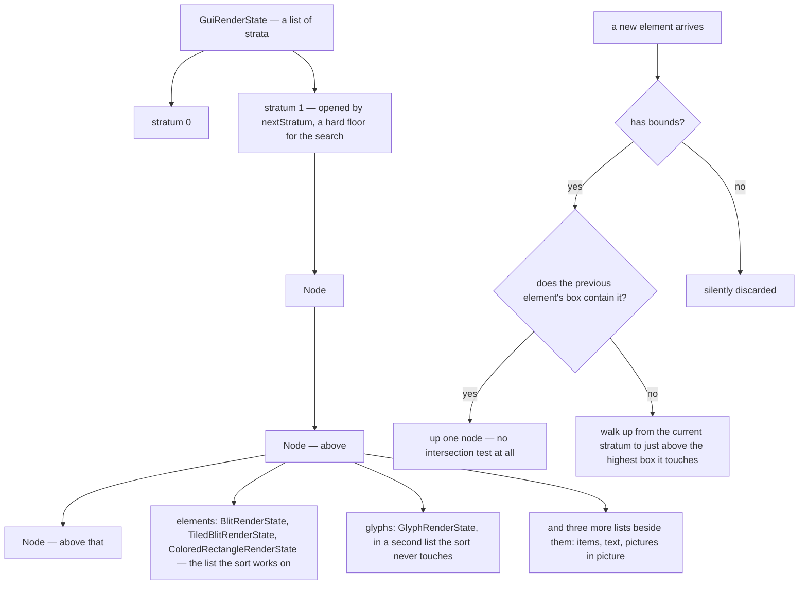
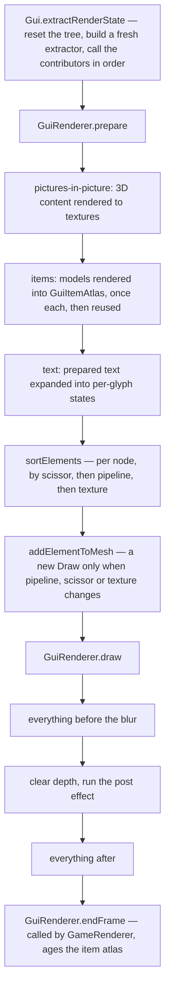

# The GUI render tree

> Verified against **Minecraft 26.2** · Part X · a chest full of the same item: how the 2D UI decides what is in front of what, without anybody ever saying so.

Nothing in the client's 2D UI draws anything. Every call a screen, a widget
or the HUD makes appends a *render state* to a tree; later in the same frame
a second pass resolves that tree, sorts it, batches it and issues the draws.
And the tree is not told what order to put things in. **Layering is inferred
from bounding boxes**: a new element goes above the highest existing element
whose box it *intersects*, and two elements that do not overlap can share a
node and be reordered freely by the batching sort. There is no Z value, no
layer index, and no declared order beyond the call order and two explicit
barriers.

That inference is what makes the batching possible, and the batching is why a
chest full of identical stacks is cheap: each distinct item model is rendered
into a dynamic atlas **once and reused for as long as it stays resident** —
one 3D render ever, not one per frame, and not one per stack.

## The cast

| class | what it decides | thread |
|---|---|---|
| `GuiGraphicsExtractor` | what a screen is handed — every drawing verb, and the scissor stack | Render thread |
| `GuiRenderState` | the tree: strata, nodes, and where a new element belongs | Render thread |
| `GuiRenderState.Node` | one layer: a list of elements and a separate list of glyphs | Render thread |
| `GuiElementRenderState` | one recorded thing, and the bounds the layering algorithm reads | Render thread |
| `GuiRenderer` | resolving, sorting, coalescing and issuing the draws | Render thread |
| `GuiItemAtlas` | which item models are already rendered, and which age out | Render thread |
| `GameRenderState` | who actually owns the tree — not `Gui` | Render thread |

## The tree, and where a new element lands

Three consequences fall straight out of that picture.

**An element with no bounds is silently discarded.** Every *recording* add
verb is conditional on the tree finding a node, and finding a node requires
bounds. Glyph states deliberately have none — which is exactly why they are
added through the layer-bypassing verb,
`GuiRenderState.addGlyphToCurrentLayer`, which the draw pass calls rather than
the record pass, and emitted after their node's geometry. **Glyphs are never sorted**, and
that is the whole mechanism behind "text draws on top of its own background".

**The search never descends below the current stratum**, which is what makes
`GuiRenderState.nextStratum` a hard barrier rather than a hint. It is how the
HUD keeps the hotbar block out of the crosshair's layering, and how chat
stays clear of the scoreboard.

**The fast path is the common case.** If the previous element's box
*contains* the new one — a label inside a button, a sprite inside a slot — it
goes straight up with no test.

The recording verbs are `GuiRenderState.addGuiElement`,
`GuiRenderState.addText`, `GuiRenderState.addItem`,
`GuiRenderState.addPicturesInPictureState`,
`GuiRenderState.addBlitToCurrentLayer` and
`GuiRenderState.addGlyphToCurrentLayer`; the structural ones are
`GuiRenderState.nextStratum` and `GuiRenderState.blurBeforeThisStratum`. The
states themselves are `BlitRenderState`, `TiledBlitRenderState`,
`ColoredRectangleRenderState`, `GuiTextRenderState`, `GlyphRenderState`,
`GuiItemRenderState`, `PanoramaRenderState`, and the
`PictureInPictureRenderState` family — `GuiEntityRenderState`,
`GuiSkinRenderState`, `GuiBookModelRenderState`,
`GuiBannerResultRenderState`, `GuiProfilerChartRenderState` and
`OversizedItemRenderState`.

## The draw pass

Two phases, one thread, one frame. It is a *data* split rather than a thread
split: the record phase touches game state, the draw phase touches the
recorded objects and the GPU.

One thing happens eagerly during recording that looks like it should not:
adding text forces the text to be **prepared**, because the tree needs its
bounds to place it. Only the expansion into per-glyph states waits for the
draw pass — see [text and fonts](text-and-fonts.md).

The three sort comparators, `GuiRenderer.ELEMENT_SORT_COMPARATOR`,
`GuiRenderer.SCISSOR_COMPARATOR` and `GuiRenderer.TEXTURE_COMPARATOR`, are
what turns a node's element list into as few `GuiRenderer.Draw`s as possible.
Both the sort and the coalescing happen inside `GuiRenderer.prepare`;
`GuiRenderer.draw` only replays the list they produced.

## Blur is a barrier, and it is fussy

`GuiRenderState.blurBeforeThisStratum` splits the draw list in two. Asking
for it twice in one frame **throws**. It is conditional on the
menu-background blurriness option being at least one, and screens that
declare themselves in-game UI — container screens, sign editors, book screens
— take the transparent-background path and never request it. That is why the
pause menu blurs the world and a chest does not.

## Questions a reader asks

**Does the item atlas ever get expensive?** Whenever a slot is not already
resident and current — a slot that has gone stale, or was never filled, is
redrawn with no invalidation involved. Wholesale invalidation is the loud
case: changing the GUI scale throws the atlas away, and an atlas that cannot
grow logs that some items will be skipped. Animated models are the exception
to residency: they are redrawn every frame. The aging that evicts a slot happens
in `GuiRenderer.endFrame`, which `GameRenderer` calls — not
`GuiRenderer.render`.

**Does the extractor really have no side effects?** It has two, just not
drawing ones. The scissor stack is real state, and the cursor shape requested
during the record pass is applied to the window at the end of it. It also
holds the deferred tooltip and the pre-edit overlay.

**Can a 2D flag change how the world is drawn?** Yes. The HUD's hidden flag
and a clear-colour override live on `GuiRenderState` and are read by
`GameRenderer` — every site is `GameRenderer`'s, not `LevelRenderer`'s. The
tree also belongs to `GameRenderState` rather than to `Gui`: the GUI holds a
reference to it. Nor is this the only reach backwards: the HUD's boss bar
reads world fog, the lightmap and the level render state as well.

**What if the batching sort were wrong?** There are debug switches for
exactly that. One promotes every element into its own layer and outlines it;
another shuffles each node's element list and re-seeds the sort keys, to shake
out accidental order dependence. The second one is how you would find out.

> **For a 1.21-era reader.** There is no *GuiGraphics*. The class is
> `GuiGraphicsExtractor`, and the name is the whole design — it extracts, it
> does not paint. *LayeredDraw* is gone too: ordering is the literal call
> order plus explicit barriers. *GuiGraphics.renderTooltip* is gone, and so
> is `PoseStack` in 2D GUI code — the GUI transform is a 2D affine stack now,
> though a real `PoseStack` still lives inside the item atlas, where actual
> 3D models are drawn.

## Where to look

`GuiRenderState.nextStratum` and the node-placement logic beside it — the
layering rule is thirty lines and explains most of the UI's behaviour.
`GuiGraphicsExtractor` for what a screen is actually handed.
`GuiRenderer.prepare` for where items, text and picture-in-picture content
are resolved, and `GuiRenderer.draw` for the batching rule and the blur split.

---

*Rules: names, never code · how the system works, not how the code reads ·
newest version only · every backticked name passes `tools/verify_names.py`.*
