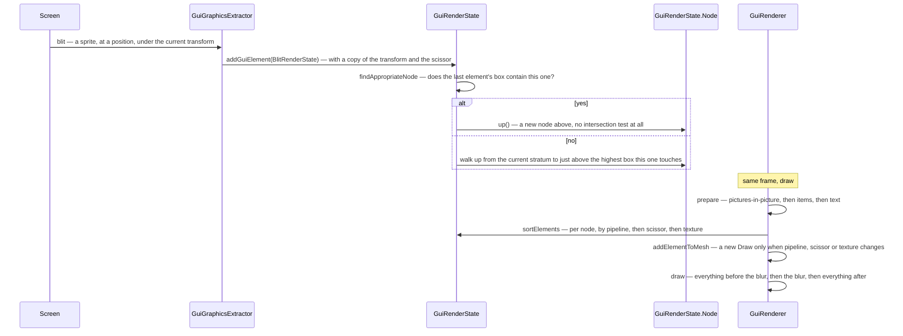

# The GUI render tree

> Verified against **Minecraft 26.2** · Part X · one blit, from a screen that cannot draw to a batched draw call — through a tree that infers its own layering from bounding boxes.

## Responsibility

Nothing in the client's 2D UI draws anything. Every call a screen, a widget
or the HUD makes appends a *render state* to a tree; later in the same frame
a second pass resolves that tree — rendering 3D content to textures,
expanding text to glyphs — sorts it, batches it and issues the draws. This
page is that tree: how an element finds its place in it, why the placement is
decided by bounding boxes rather than a Z value, and what the draw pass is
allowed to merge.

The one sentence a player would recognise: *a chest full of the same item
costing nothing extra to draw.*

The headline for a 1.21-era reader: **there is no *GuiGraphics*.** The class
is `GuiGraphicsExtractor`, and its name is the whole design — it extracts,
it does not paint. *LayeredDraw* is gone too: ordering is now the literal
call order plus explicit barriers.

## The data it owns

- **`GuiGraphicsExtractor`** — what screens are handed. Every drawing verb
  appends a state that captures a *copy* of the current 2D transform, plus
  the current scissor. It also owns the scissor stack, the deferred tooltip
  and pre-edit overlay, and the pending cursor shape.
- **`GuiRenderState`** — the tree. A list of *strata*, each a chain of
  `GuiRenderState.Node`; each node holds a list of element states and a
  separate list of glyph states. The recording verbs are
  `GuiRenderState.addGuiElement`, `GuiRenderState.addText`,
  `GuiRenderState.addItem`, `GuiRenderState.addPicturesInPictureState`,
  `GuiRenderState.addBlitToCurrentLayer` and
  `GuiRenderState.addGlyphToCurrentLayer`; the structural ones are
  `GuiRenderState.nextStratum` and
  `GuiRenderState.blurBeforeThisStratum`. The state is owned by
  `GameRenderState`, not by `Gui` — the GUI holds a reference to it, and the
  *level* renderer reads two fields back out of it.
- **The states themselves** — `BlitRenderState`, `TiledBlitRenderState`,
  `ColoredRectangleRenderState`, `GuiTextRenderState`, `GlyphRenderState`,
  `GuiItemRenderState`, `PanoramaRenderState`, and the
  `PictureInPictureRenderState` family: `GuiEntityRenderState`,
  `GuiSkinRenderState`, `GuiBookModelRenderState`,
  `GuiBannerResultRenderState`, `GuiProfilerChartRenderState` and
  `OversizedItemRenderState`. All of them are `GuiElementRenderState`s, and
  the layering algorithm is written against one method: their bounds.
- **`GuiRenderer`** — the draw side. `GuiRenderer.prepare` and its
  sub-passes, `GuiRenderer.draw`, `GuiRenderer.endFrame`, the
  `GuiRenderer.Draw` list, a `GuiItemAtlas`, the registered
  picture-in-picture renderers, and the sort comparators
  `GuiRenderer.ELEMENT_SORT_COMPARATOR`,
  `GuiRenderer.SCISSOR_COMPARATOR` and
  `GuiRenderer.TEXTURE_COMPARATOR`.

## When it runs

Two phases, one thread, one frame. It is a *data* split rather than a thread
split: the record phase touches game state, the draw phase touches the
recorded objects and the GPU.

**Record** — `Gui.extractRenderState` resets the tree, builds a fresh
extractor for the frame and calls the contributors in order (see
[GUI and screens](gui-and-screens.md)). One thing happens eagerly here that
looks like it should not: adding text forces the text to be *prepared*,
because the tree needs its bounds to place it.

**Resolve and draw** — `GameRenderer.render` calls `GuiRenderer.render`,
which runs the picture-in-picture pass (3D content rendered to textures),
the item pass (item models rendered into a dynamic atlas), the text pass
(prepared text expanded into per-glyph states), then sorts each node's
elements and coalesces them into as few draws as possible.

## The trace: one blit

The interesting half is the placement. **Layering is inferred, not
declared.** A new element goes above the highest existing element whose box
it intersects; elements that do not overlap can share a node and be
reordered freely by the batching sort, which is what makes the batching
possible at all. There is a fast path first — if the previous element's box
*contains* the new one, it goes straight up with no test — and the search
never descends below the current stratum, which is what makes
`GuiRenderState.nextStratum` a hard barrier.

## Interfaces

- **Called by:** `Gui.extractRenderState` for the record half;
  `GameRenderer.render` for the draw half.
- **Calls into:** [blaze3d](../rendering/blaze3d.md) for the pipelines and
  the draws; `ItemModelResolver` and the entity renderers for the content
  that has to be rendered *into* the tree before it can be drawn from it.
- **Crosses the network as:** nothing.
- **Data-driven by:** the GUI atlas; `Options.guiScale` and the
  menu-background blurriness.

## Invariants and surprises

- **An element with no bounds is silently discarded.** Every add verb is
  conditional on the tree finding a node for it, and finding a node requires
  bounds. Glyph states deliberately have none — which is exactly why they
  are added through the layer-bypassing verb and emitted after their node's
  geometry.
- **Glyphs are never sorted.** A node keeps its glyphs in a second list that
  the sort does not touch, and emits them after the elements. That is the
  mechanism behind "text draws on top of its own background".
- **The item atlas is not per frame.** Each distinct item model is rendered
  into `GuiItemAtlas` once and reused for as long as it stays resident; only
  animated models are redrawn every frame. A chest full of identical stacks
  costs one 3D render *ever*, not one per frame — and the aging that evicts
  a slot happens in `GuiRenderer.endFrame`, which `GameRenderer` calls, not
  `GuiRenderer.render`.
- **Changing the GUI scale throws the item atlas away**, and an atlas that
  cannot grow logs that some items will be skipped.
- **Blur is a once-per-frame barrier that splits the draw list.** Asking for
  it twice in one frame throws. The draw pass issues everything before it,
  clears depth, runs the post effect, and issues the rest. It is also
  conditional on the blurriness option being at least one, and screens that
  declare themselves in-game UI — container screens, sign editors, book
  screens — take the transparent-background path and never request it.
- **The extractor does have side effects, just not drawing ones.** The
  scissor stack is real state, and the cursor requested during the record
  pass is applied to the window at the end of it.
- **Text is prepared during recording and expanded during drawing.** The
  bounds needed for placement force preparation at submission time; only the
  expansion into per-glyph states waits for the draw pass. See
  [text and fonts](text-and-fonts.md).
- **The GUI state reaches back into the world render.** The HUD's hidden
  flag and a clear-colour override live on `GuiRenderState` and are read by
  `GameRenderer` — a 2D flag changing how the level is drawn.
- **There are debug switches for exactly these failure modes.** One promotes
  every element into its own layer and outlines it; another shuffles each
  node's element list and re-seeds the sort keys, to shake out accidental
  order dependence. If the batching sort were ever wrong, that second flag
  is how you would find out.
- **Names a 1.21-era reader will hunt for and not find:** *GuiGraphics*,
  *LayeredDraw*, *GuiGraphics.renderTooltip*, and `PoseStack` in 2D GUI code
  — the GUI transform is a 2D affine stack now, though a real `PoseStack`
  still lives inside the item atlas, where actual 3D models are drawn.

## Where to look

`GuiRenderState.nextStratum` and the node-placement logic beside it — the
layering rule is thirty lines and explains most of the UI's behaviour.
`GuiGraphicsExtractor` for what a screen is actually handed.
`GuiRenderer.prepare` for where items, text and picture-in-picture content
are resolved, and `GuiRenderer.draw` for the batching rule and the blur
split.

---

*Rules: names, never code · how the system works, not how the code reads ·
newest version only · every backticked name passes `tools/verify_names.py`.*
