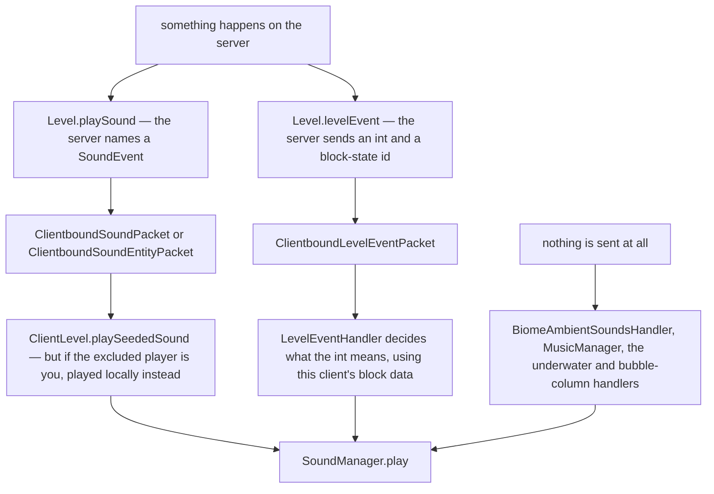

# What makes a sound happen

> Verified against **Minecraft 26.2** · Part X · you break a block and you hear it: three doors a sound can come through, and only one of them says what the sound is.

Place a block and the server sends `ClientboundSoundPacket`, naming the
sound. Break the same block and it sends nothing of the kind:
`Level.destroyBlock` fires a **level event**, and
`ClientboundLevelEventPacket` carries an int and a block-state id. The client
decides for itself what that int means — for a break, `SoundType.getBreakSound`
from the block's own `SoundType` — and plays the result locally. So the two
halves of one interaction reach you by different mechanisms, and the second
one is not a sound at all until your client makes it one.

Then there is the third door, the one people are most surprised by: your own
sounds are never sent to you. `Player.playSound` calls `Level.playSound` with
itself as the *excluded* entity; the server broadcasts to everyone but you,
and on your client `ClientLevel.playSeededSound` notices that the excluded
player is the local one and plays it at once, locally. **A laggy connection
delays what you hear of other people and never what you hear of yourself.**

This page is the content model and those three doors. The machine that turns
any of them into an OpenAL source is [the sound engine](sound-engine.md).

## The cast

| class | what it decides | thread |
|---|---|---|
| `SoundEvent` | a name and an optional fixed range — never a file | both sides |
| `SoundEvents` | the static registry of every event the game defines | both sides |
| `SoundSource` | which volume slider applies | both sides |
| `SoundEventRegistration` | what one `sounds.json` entry says, and whether it replaces or appends | Render thread |
| `WeighedSoundEvents` | the weighted list a name resolves to, and the redirects in it | Render thread |
| `LevelEventHandler` | what an int from `ClientboundLevelEventPacket` means | Render thread |
| `BiomeAmbientSoundsHandler` | the loop, the random additions and the cave mood | Render thread |
| `MusicManager` | which track, how often, and the fade that is not the slider | Render thread |

## The three doors

The distinction matters for anyone reasoning about the wire.

| | a named sound | a level event | client-side ambience |
|---|---|---|---|
| what crosses | a `SoundEvent` holder, a position in eighths of a block, a seed | an int and a block-state id | nothing |
| who chooses the sound | the server | **this client**, from its own resource pack and block data | this client |
| can it name a sound in no registry | **yes** — `SoundEvent.STREAM_CODEC` sends either a registry id or an id plus a range | no | no |
| examples | a block placed, `/playsound`, a mob's voice | a block broken, a dispenser, fire extinguished, a ghast warning, the wither spawn, the dragon's death | biome loops, cave mood, music, underwater, bubble columns |

That third row is a genuine hole in the usual summary. Data packs cannot
*register* sound events — `Registries.SOUND_EVENT` is a static registry —
but a packet may carry an **inline** `SoundEvent`, so a server can name a
sound that is in no registry at all. The two statements are both true and are
usually run together into a false one.

The other clientbound member of the family is
`ClientboundStopSoundPacket`, which `/stopsound` sends. There is **no
serverbound sound packet** anywhere: the server infers what you did from
other packets and tells everyone else about the sound.

## What a sound *is*, as data

`SoundEvent` — in `net/minecraft/sounds`, and therefore shared — is a record
of an `Identifier` and an optional fixed range. `SoundEvents` is the
2,000-line static registry of every one the game defines. **It is a name, not
a file.**

The file comes from `sounds.json`, one per namespace in every resource pack,
which maps an event name to a `SoundEventRegistration`: a weighted list of
`Sound` entries — a file, or a redirect to another event, per the
`Sound.Type` enum — each with volume, pitch, weight, attenuation distance,
and whether to *stream* rather than load whole. `SoundManager` owns the
loaded form, a map of `Identifier` to `WeighedSoundEvents`, rebuilt on every
resource reload.

Packs merge rather than replace, unless told otherwise.
`SoundEventRegistration` carries a replace flag; without it a higher pack's
entries are **appended** to the lower pack's list, so a pack that adds one
variant gets a mix rather than an override. A redirect entry multiplies
volume and pitch through and ORs the streaming flag.

And there are two kinds of silence. A `sounds.json` entry may point at
`SoundManager.INTENTIONALLY_EMPTY_SOUND`, which silences an event with no
log warning — the resource-pack way to remove a sound — as distinct from an
unresolvable event, which logs. `SharedConstants.DEBUG_SUBTITLES` and
`SoundEngine.MISSING_SOUND` are the development counterpart, which make a
missing sound *audible* instead.

`SoundSource` is the volume category and each one is an options slider:
`SoundSource.MASTER`, `SoundSource.MUSIC`, `SoundSource.RECORDS`,
`SoundSource.WEATHER`, `SoundSource.BLOCKS`, `SoundSource.HOSTILE`,
`SoundSource.NEUTRAL`, `SoundSource.PLAYERS`, `SoundSource.AMBIENT`,
`SoundSource.VOICE`, `SoundSource.UI`. Two of those are read wrongly from the
options screen alone: `SoundSource.RECORDS` is the jukebox slider and
`SoundSource.WEATHER` the rain one. Neither is `SoundSource.AMBIENT`.

## Who hears it

`ServerLevel.playSeededSound` asks `SoundEvent.getRange` for the audible
radius — a fixed range if the event declares one, otherwise sixteen blocks
scaled up by volumes above one — and `PlayerList.broadcast` sends the packet
to every player in that dimension within range, **skipping the excluded
player**. The seed travels in the packet so that every client picks the same
random variant and the same pitch, which is why a sound that is one of eight
variants sounds the same to two players standing together.

The position is quantised on the way:
`ClientboundSoundPacket.LOCATION_ACCURACY` is eight, so the wire carries
three ints in eighths of a block.

And **sound has a speed**. `ClientLevel.playSound` defers a local sound more
than ten blocks away by its distance over a fixed rate, through
`SoundManager.playDelayed` into `SoundEngine.queuedSounds`. It is the only
place in the game where propagation delay is modelled — and it is why thunder
arrives late with nobody sending a timestamp. `LocalPlayer.playSound` goes
the other way and calls `ClientLevel.playLocalSound` directly, skipping even
the exclusion check.

## Music and ambience are environment attributes

This is the biggest 26.2 change in the system and the one a 1.21-era reader
will get wrong. *BiomeSpecialEffects* no longer carries music, ambient loops,
additions or mood — it is block tint only. Every one of those is now an
`EnvironmentAttribute` (see [environment attributes and
timelines](../world/environment-attributes-and-timelines.md)):
`EnvironmentAttributes.BACKGROUND_MUSIC`,
`EnvironmentAttributes.MUSIC_VOLUME`,
`EnvironmentAttributes.AMBIENT_SOUNDS` and
`EnvironmentAttributes.FIREFLY_BUSH_SOUNDS`, all syncable, all resolved
through the same dimension-then-biome-then-timeline-then-weather layer stack
as fog and sky colour.

`Minecraft.getSituationalMusic` reads `EnvironmentAttributes.BACKGROUND_MUSIC`
off the camera's attribute probe and asks `BackgroundMusic.select` for the
creative or underwater variant; the End boss fight overrides it directly.
`Minecraft.getMusicVolume` reads `EnvironmentAttributes.MUSIC_VOLUME` the
same way, which is how a biome dims its own music without touching the
slider.

`BiomeAmbientSoundsHandler` reads `EnvironmentAttributes.AMBIENT_SOUNDS` from
`Level.environmentAttributes` and drives three things from it: a cross-faded
loop, random additions on a per-tick chance (`AmbientAdditionsSettings`), and
the cave "mood" that accumulates in darkness (`AmbientMoodSettings`).
`UnderwaterAmbientSoundHandler` and `BubbleColumnAmbientSoundHandler` are the
two that remain plain client-side handlers with no attribute behind them.

`MusicManager` owns the rest: a `MusicManager.MusicFrequency` setting that
scales the gap between tracks, a fade implemented by driving
`SoundManager.updateCategoryVolume` — which is why the music slider and the
music fade are two different numbers — and the now-playing toast, shown or
not depending on the `SoundEngine.PlayResult` the engine returned.

The remaining callers are worth naming because they are the ones that are
neither the world nor the wire: `PlaySoundCommand`, the ambient handlers in
`client/resources/sounds` for loops that exist only on the client, and
`SoundPreviewHandler`, which previews a representative sound per category
while a volume slider is dragged outside a world.

## Where to look

`LevelEventHandler` — the whole second door is one switch, and reading it is
the fastest way to see how much of the game's audio is not named on the wire.
`ServerLevel.playSeededSound` and `PlayerList.broadcast` for who is told;
`ClientLevel.playSeededSound` for the local-player branch that closes the
loop. `SoundEventRegistration` and `WeighedSoundEvents` for the pack model,
and `BiomeAmbientSoundsHandler` for the three ambience mechanisms in one
class.

---

*Rules: names, never code · how the system works, not how the code reads ·
newest version only · every backticked name passes `tools/verify_names.py`.*
