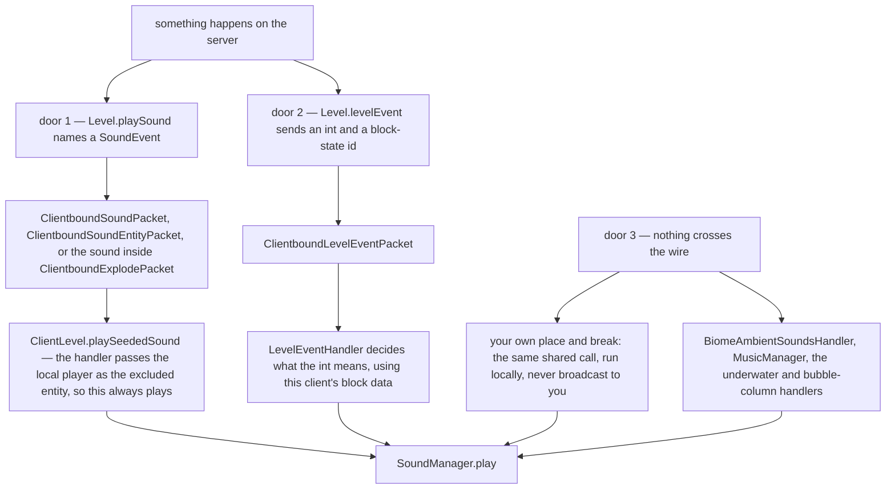

# What makes a sound happen

> Verified against **Minecraft 26.2** · Part X · you break a block and you hear it: three doors a sound can come through, and only one of them says what the sound is.

Watch someone place a block and the server sends `ClientboundSoundPacket`,
naming the sound. Watch them break the same block and it sends nothing of the
kind: `Block.spawnDestroyParticles` fires a **level event**, and
`ClientboundLevelEventPacket` carries an int and a block-state id. The client
decides for itself what that int means — for a break,
`SoundType.getBreakSound` off the block's own `SoundType`, the five-sound
group (break, step, place, hit, fall) every `BlockBehaviour.Properties`
carries — and plays the result locally. So the two
halves of one interaction reach you by different mechanisms, and the second
one is not a sound at all until your client makes it one.

Then there is the third door, and it is the absence of a packet rather than a
packet: **some sounds never cross the wire at all.** Two quite different things
come through it. Biome loops, the cave mood, music, the underwater hum are
decided by your client and nobody else's. And so, more surprisingly, are your
*own* place and break — neither of the calls above is sent to the player who
caused the sound, because that player's client has already played it locally.
*[Who hears it](#who-hears-it)* below is the one rule that arranges both.

This page is the content model and those three doors, and it takes them first:
the table below is what the page is for, and the cast comes after it, because
half of the eight classes only make sense once you know which door they stand
in. The machine that turns any of them into an OpenAL source is [the sound
engine](sound-engine.md).

## The three doors

The three columns are how to reason about the wire, and the third is the one
the usual summary leaves out entirely.

| | a named sound | a level event | nothing on the wire |
|---|---|---|---|
| what crosses | a `SoundEvent` holder, a position in eighths of a block, a seed | an int and a block-state id | nothing |
| who chooses the sound | the server | **this client**, from its own resource pack and block data | this client |
| can it name a sound in no registry | **yes** — `SoundEvent.STREAM_CODEC` sends either a registry id or an id plus a range | no | no |
| examples | a block placed, `/playsound`, a mob's voice | a block broken, a dispenser, fire extinguished, a ghast warning, the wither spawn, the dragon's death | your own place and break; biome loops, cave mood, music, underwater, bubble columns |

That third row is a genuine hole in the usual summary. Data packs cannot
*register* sound events — `Registries.SOUND_EVENT` is a static registry —
but a packet may carry an **inline** `SoundEvent`, so a server can name a
sound that is in no registry at all. The two statements are both true and are
usually run together into a false one.

The other clientbound members of the family are
`ClientboundSoundEntityPacket`, which follows a moving entity,
`ClientboundStopSoundPacket`, which `/stopsound` sends, and
`ClientboundExplodePacket`, which carries its own sound alongside everything
else an explosion needs. There is **no serverbound sound packet** anywhere: the server infers what you did from
other packets and tells everyone else about the sound.

## The cast

| class | what it decides | thread |
|---|---|---|
| `SoundEvent` | a name and an optional fixed range — never a file | both sides |
| `SoundEvents` | the static registry of every event the game defines | both sides |
| `SoundSource` | which volume slider applies | both sides |
| `SoundEventRegistration` | what one `sounds.json` entry says, and whether it replaces or appends | Render thread |
| `WeighedSoundEvents` | the weighted list a name resolves to, and the redirects in it | Render thread |
| `LevelEventHandler` | what an int from `ClientboundLevelEventPacket` means | Render thread |
| `BiomeAmbientSoundsHandler` | the loop, the random additions and the cave mood | Render thread |
| `MusicManager` | which track, how often, and the fade that is not the slider | Render thread |

## What a sound *is*, as data

`SoundEvent` — in `net/minecraft/sounds`, and therefore shared — is a record
of an `Identifier` and an optional fixed range. `SoundEvents` is the
2,000-line static registry of every one the game defines. **It is a name, not
a file.**

The file comes from `sounds.json`, one per namespace in every resource pack,
which `SoundEventRegistrationSerializer` parses into a
`SoundEventRegistration` per event name: a weighted list of
`Sound` entries — a file, or a redirect to another event, per the
`Sound.Type` enum — each with volume, pitch, weight, attenuation distance,
and whether to *stream* rather than load whole. `SoundManager` owns the
loaded form, a map of `Identifier` to `WeighedSoundEvents`, rebuilt on every
resource reload.

Packs merge rather than replace, unless told otherwise — the one place the
[resource system](../foundations/resource-system.md#discover-the-repository-and-its-packs)'s
ordinary top-pack-wins rule is overridden by the data itself.
`SoundEventRegistration` carries a replace flag; without it a higher pack's
entries are **appended** to the lower pack's list, so a pack that adds one
variant gets a mix rather than an override. A redirect entry multiplies
volume and pitch through and ORs the streaming flag.

And there are two kinds of silence, which is worth knowing because only one of
them is a mistake. The identifier
`SoundManager.INTENTIONALLY_EMPTY_SOUND_LOCATION` is short-circuited by name in
`AbstractSoundInstance.resolve` before the registry is consulted at all, so
anything asking for it is silenced with **no** log warning. An event that
simply does not resolve is the other kind, and it logs — including a pack that
empties an event's list, which gets the warning rather than the quiet.

Two development constants exist to make each of those visible.
`SoundEngine.MISSING_SOUND` makes a failed resolve *audible*, and
`SharedConstants.DEBUG_SUBTITLES` makes every sound that plays *visible* as a
subtitle whether or not its event declares one.

`SoundSource` is the volume category and each one is an options slider:
`SoundSource.MASTER`, `SoundSource.MUSIC`, `SoundSource.RECORDS`,
`SoundSource.WEATHER`, `SoundSource.BLOCKS`, `SoundSource.HOSTILE`,
`SoundSource.NEUTRAL`, `SoundSource.PLAYERS`, `SoundSource.AMBIENT`,
`SoundSource.VOICE`, `SoundSource.UI`. Two of those are read wrongly from the
options screen alone: `SoundSource.RECORDS` is the jukebox slider and
`SoundSource.WEATHER` the rain one. Neither is `SoundSource.AMBIENT`.

## Who hears it

`ServerLevel.playSeededSound` asks `SoundEvent.getRange` for the audible
radius — a fixed range if the event declares one, otherwise sixteen blocks
scaled up by volumes above one — and `PlayerList.broadcast` sends the packet
to every player in that dimension within range, **skipping the excluded
player**. The seed travels in the packet so that every client picks the same
variant and samples the same pitch multiplier off the chosen `Sound`, which is
why a sound that is one of eight variants sounds the same to two players
standing together.

**And the excluded player is not left out; they are served first.** The two
sides read that one word oppositely. `ServerLevel.playSeededSound` broadcasts
to everyone in range *but* the excluded entity; `ClientLevel.playSeededSound` —
the same method name, the client's override, in both its positional and its
entity-bound form — plays a sound **only** when the excluded entity *is* the
local player.

That inversion is what makes the client override usable for two jobs at once,
and it is worth being explicit about which is which. When a packet arrives,
`ClientPacketListener.handleSoundEvent` hands the override *the local player*
as the excluded entity, so the test passes and a bystander hears the packet
normally. When shared block or item code calls `Level.playSound` while running
on your own client, the excluded entity is you for the same reason it was you
on the server — and the test passes again, locally. So the one method plays the
sounds sent to you and the sounds never sent to anyone, and each machine hears
exactly one copy: yours locally, theirs by packet. That is the whole of the
third door, and it is why your own place and break are silent on the wire.

Two qualifications keep it from being a law. The rule needs an exclusion to
read: `Player.playServerSideSound`, which plays the six attack sounds,
excludes nobody, so your own critical hit does travel the whole way out and
back. And your local copy is genuinely a *different* sound from the one your
neighbour hears — your client drew its own seed from `Level.soundSeedGenerator`
rather than reading one off a packet, so the variant and the pitch are rolled
twice ([block interaction](../blocks/block-interaction.md#the-sound-only-you-hear)
follows a door through both rolls).

The position is quantised on the way:
`ClientboundSoundPacket.LOCATION_ACCURACY` is eight, so the wire carries
three ints in eighths of a block.

And **sound has a speed**, for the few callers that ask for it.
`ClientLevel.playLocalSound` takes a distance-delay flag, and when it is set
and the source is more than ten blocks off the sound is deferred by its
distance over a fixed rate, through `SoundManager.playDelayed` into
`SoundEngine.queuedSounds`. Firework explosions and a handful of level events
set it. Thunder, the sound everyone assumes is the reason it exists, does not:
`LightningBolt` passes the flag as false and the crack is instant.
`LocalPlayer.playSound` goes
the other way and calls `ClientLevel.playLocalSound` directly, skipping even
the exclusion check.

## Music and ambience are environment attributes

This is the biggest 26.2 change in the system and the one a 1.21-era reader
will get wrong. *BiomeSpecialEffects* no longer carries music, ambient loops,
additions or mood — it is block tint only. Every one of those is now an
`EnvironmentAttribute` (see [environment attributes and
timelines](../world/environment-attributes-and-timelines.md)):
`EnvironmentAttributes.BACKGROUND_MUSIC`,
`EnvironmentAttributes.MUSIC_VOLUME`,
`EnvironmentAttributes.AMBIENT_SOUNDS` and
`EnvironmentAttributes.FIREFLY_BUSH_SOUNDS`, all syncable, all resolved
through the same dimension-then-biome-then-timeline-then-weather layer stack
as fog and sky colour.

`Minecraft.getSituationalMusic` reads `EnvironmentAttributes.BACKGROUND_MUSIC`
off the camera's attribute probe and asks `BackgroundMusic.select` for the
creative or underwater variant; the End boss fight overrides it directly.
`Minecraft.getMusicVolume` reads `EnvironmentAttributes.MUSIC_VOLUME` the
same way, which is how a biome dims its own music without touching the
slider.

`BiomeAmbientSoundsHandler` reads `EnvironmentAttributes.AMBIENT_SOUNDS` from
`Level.environmentAttributes` and drives three things from it: a cross-faded
loop, random additions on a per-tick chance (`AmbientAdditionsSettings`), and
the cave "mood" that accumulates in darkness (`AmbientMoodSettings`).
`UnderwaterAmbientSoundHandler` and `BubbleColumnAmbientSoundHandler` are the
two that remain plain client-side handlers with no attribute behind them.

`MusicManager` owns the rest: a `MusicManager.MusicFrequency` setting that
scales the gap between tracks, a fade that drives
`SoundManager.updateCategoryVolume` rather than the player's slider (the third
of the engine's [three volume
factors](sound-engine.md#volume-looping-and-the-attenuation-everyone-explains-wrongly)),
and the now-playing toast — a `NowPlayingToast` shown or withheld on the
`SoundEngine.PlayResult` the engine returned, and suppressed again by the
pause screen and by `MusicToastDisplayState`.

The remaining callers are worth naming because they are the ones that are
neither the world nor the wire: `PlaySoundCommand`, the ambient handlers in
`client/resources/sounds` for loops that exist only on the client, and
`SoundPreviewHandler`, which previews a representative sound per category
while a volume slider is dragged outside a world.

## Where to look

`LevelEventHandler` — the whole second door is one switch, and reading it is
the fastest way to see how much of the game's audio is not named on the wire.
`ServerLevel.playSeededSound` and `PlayerList.broadcast` for who is told;
`ClientLevel.playSeededSound` for the local-player branch that closes the
loop. `SoundEventRegistration` and `WeighedSoundEvents` for the pack model,
and `BiomeAmbientSoundsHandler` for the three ambience mechanisms in one
class.

---

*Rules: names, never code · how the system works, not how the code reads ·
newest version only · every backticked name passes `tools/verify_names.py`.*
