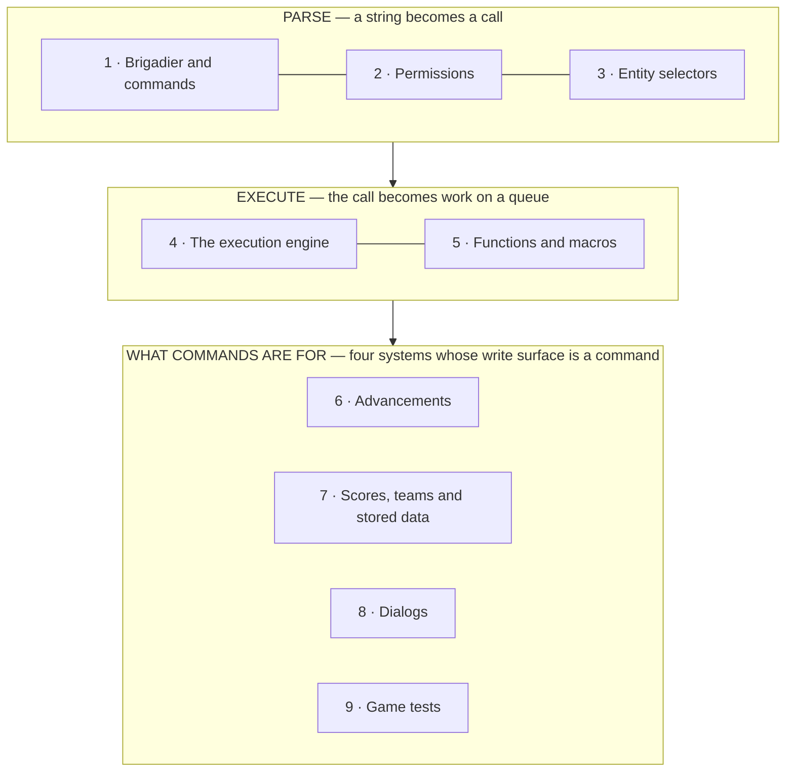

# XIII · Commands and data packs

> Verified against **Minecraft 26.2** · Part XIII · a string typed into a chat box becomes a call with typed arguments, on a queue, with a permission attached — and four whole systems are built on top of that and nothing else.

Type a slash. The text turns grey and green and red as you type, a hint
appears behind the cursor, and pressing Enter sends the *string* — the
parse the client just did is thrown away. On the server the same string is
parsed again, against a tree whose nodes carry permission requirements, and
becomes a piece of work on a queue rather than a Java call. Everything else
in this part rides that machinery: an advancement is a subscription
delivered by a trigger and edited by `/advancement`, a scoreboard is a
number written by `/scoreboard` or by `execute store`, a dialog is a
data-pack form opened by `/dialog`, and a game test is a data-pack test run
by `/test`.

Counting the seven server packages and the two client ones — one class per
file, one line per line of decompiled source, the way
[the atlas](../../maps/README.md) counts everything else — that is **442
classes and 43,800 lines**, of which more than half is the command
catalogue itself: a hundred command classes that are each a thin lambda over
machinery some other part of this book owns.

## The shape of the part

Part XIII is **a stack of three floors**, and unlike most parts the
dependency runs strictly one way. The parser knows nothing about
advancements; the engine knows nothing about scoreboards; all four systems
on the top floor need both of the floors below and none of them needs
another.

The four pages on the top floor are peers, not a sequence: watch them in any
order, or only the ones you care about. The two floors below them are not
optional for any of the four.

## Before you start

[The server tick](../server/server-tick.md) from Part III, because *when*
turns out to matter twice: command functions are the very first thing the
server does to its children each tick, and players tick **after** the
levels, which is what puts an advancement trigger and a scoreboard criterion
one tick apart from where you would expect them.

[Codecs, NBT and JSON](../foundations/codecs-nbt-json.md) and
[the data-driven type pattern](../foundations/data-driven-types.md) from
Part II. Dialogs and game tests are the pattern's clearest two instances —
a form and a test suite, both reduced to JSON dispatching on a registry of
types — and the pattern page is where that argument is made.

[The connection](../networking/the-connection.md) from Part IX, for the
Netty-thread / server-thread boundary that the command packets cross in two
different ways on purpose.

[Contexts and predicates](../items/contexts-and-predicates.md) from Part
VII, if you are here for advancements: a trigger's conditions are loot
conditions, evaluated against a loot context, and that page owns the
machine.

## Watch in this order

1. [Brigadier and commands](brigadier-and-commands.md) — three parsers for
   one string, and a tab-completion whose fast path never leaves the
   machine. Also: which sixty-two of the sixty-seven do leave it.
2. [Permissions](permissions.md) — the biggest API break in the game since
   the flattening. A permission is no longer an integer, an operator does
   not have everything, and a permission failure is reported as a typo.
3. [Entity selectors](entity-selectors.md) — a selector is a compiled
   query, and four of its twenty-one options are not filters but the query
   plan. Why *@p* crosses dimensions, why *sort=nearest* is what takes your
   *limit* away, and why one permission is checked twice.
4. [The execution engine](the-execution-engine.md) — a command engine with
   no Java recursion. A fan-out that materialises one player at a time, and
   a `/return` that deletes work out of a queue rather than unwinding a
   stack.
5. [Functions and macros](functions-and-macros.md) — what a `.mcfunction`
   file becomes, in two steps, the second of which usually does nothing.
   The one that fails silently every tick, forever.
6. [Advancements](advancements.md) — the game's general-purpose "tell me
   when the player does X", built as a per-player subscription table that
   only ever shrinks. The tree is laid out on the server and shipped.
7. [Scores, teams and stored data](scoreboard-and-data.md) — one number per
   thing, one query language for any tag, and the `execute store` seam that
   joins them. Why fake players exist.
8. [Dialogs](dialogs.md) — a data pack puts a form on your screen, possibly
   before you are in a world at all. The values are read at the moment of
   the click and not before.
9. [Game tests](game-tests.md) — the game's own test suite, as a data pack.
   The annotations are gone, a batch *is* an environment, and the shipped
   jar contains exactly one test.

## Reference this part uses

[Packets](../../reference/packets.md) for this part's own traffic, which is
almost all server → client: the scoreboard has five packets and no
serverbound counterpart at all.
[Registries](../../reference/registries.md) and
[the data-driven type pattern](../foundations/data-driven-types.md) for the
six type registries dialogs and tests dispatch on.
[Loot context parameter sets](../../reference/loot-context-params.md) for the
sets an advancement trigger and an advancement reward run in.
[Diagram lanes](../../reference/lanes.md) for the abbreviations these figures
use, and [the glossary](../../reference/glossary.md) for *Brigadier*,
*selector head*, *world-limited*, *criterion*, *objective*, *macro*, *dialog*
and *game test*.

Where the part stops: what a command *does* once it has been dispatched is
almost always another part's page, and
[Brigadier and commands](brigadier-and-commands.md) ends with a list of
which. The statistics — which are criteria, and one of only two parts of a
save that go through the data fixer as JSON, the other being advancement
progress — are in
[what this book skips](../anatomy/what-this-book-skips.md).

---

*Rules: names, never code · how the system works, not how the code reads ·
newest version only · every backticked name passes `tools/verify_names.py`.*
