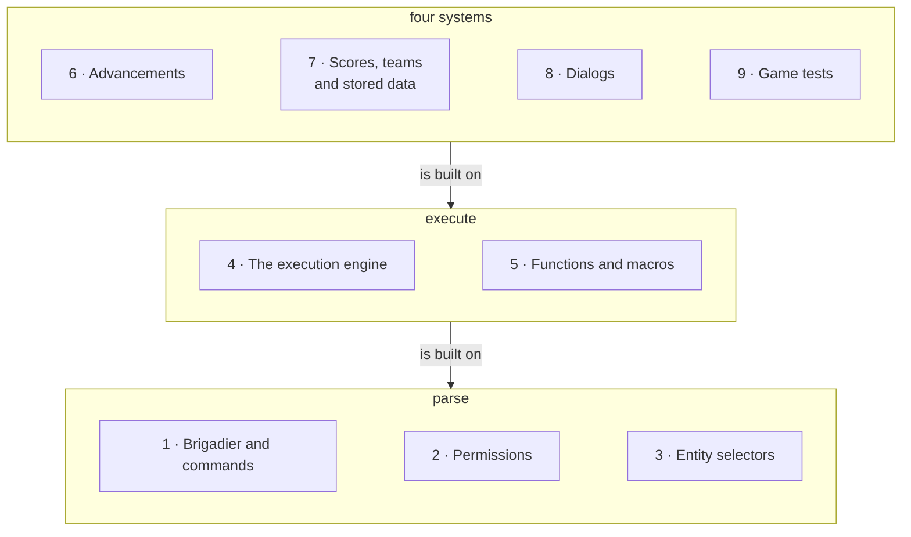

# XIII · Commands and data packs

> Verified against **Minecraft 26.3** · Part XIII · a string typed into a chat box becomes a call with typed arguments, on a queue, with a permission attached — and four whole systems are built on top of that.

Type a slash. The text turns grey and aqua and red as you type, a hint
appears behind the cursor, and pressing Enter sends the *string* — the
parse the client just did is thrown away. On the server the same string is
parsed again, against a tree whose nodes carry permission requirements, and
becomes a piece of work on a queue rather than a Java call — a heap-allocated
deque of entries that one flat loop drains, which is why pending commands can be deleted part-way through an execution and why a function calling itself
does not blow a Java stack. Everything else in this part rides that
machinery: an advancement is a subscription
delivered by a trigger and edited by `/advancement`, a scoreboard is a number that `/scoreboard` and `execute store` write, as the game's own criteria do, a dialog is a
data-pack form opened by `/dialog`, and a game test is a data-pack test run
by `/test`. **None of those four needs any of the others to be understood.** What they need from this part is the parse and the queue; *before you start* names the other parts they lean on most.

The nine packages [the atlas](../../maps/packages.md#where-each-part-lives)
gives this part are three groups. The **machinery**: `net/minecraft/commands`
and `server/permissions`. The **catalogue**: `net/minecraft/server/commands`, one file per command and a few helpers beside them. The **four systems**: `net/minecraft/advancements`,
`world/scores` with `server/bossevents`, `server/dialog` with its
`client/gui/screens/dialog` screens, and `net/minecraft/gametest`. Counted
the way the atlas counts everything, that is
{{#include ../../generated/part-commands.md}} — of which the catalogue alone is 111 files and 13,357 lines, most of them a thin lambda over machinery another page owns. So what a command *does* once dispatched is usually another part's page, and [Brigadier and commands](brigadier-and-commands.md#commands-that-are-a-door-to-somewhere-else) carries an index of the main doors; the statistics, which are criteria, are in [what
this book skips](../anatomy/what-this-book-skips.md).

## The shape of the part

Part XIII is **a stack of three floors**, and for a watcher the dependency
runs one way: all four systems on the top floor need both of the floors
below, and none of them needs another. The code is less tidy than the lecture order: the lower floors reach up into all four top-floor systems — a selector's *advancements=* and *scores=* options, the scoreboard's own argument types, a dialog's id, and `/test`'s registration — and one advancement predicate reads a team, sideways.

```mermaid
flowchart TD
    subgraph U["four systems"]
        direction LR
        L6["6 · Advancements"] ~~~ L7["7 · Scores, teams<br/>and stored data"] ~~~ L8["8 · Dialogs"] ~~~ L9["9 · Game tests"]
    end
    U -->|"is built on"| X
    subgraph X["execute"]
        direction LR
        L4["4 · The execution engine"] ~~~ L5["5 · Functions and macros"]
    end
    X -->|"is built on"| P
    subgraph P["parse"]
        direction LR
        L1["1 · Brigadier and commands"] ~~~ L2["2 · Permissions"] ~~~ L3["3 · Entity selectors"]
    end
```

*The part as three floors, numbered to the watch order — parsing turns a
string into a call, execution turns the call into work on a queue, and the four systems on top each have a command of their own. An arrow runs from a floor to the floor it is built on, the reverse of the prerequisite-first arrows on most other landing figures, so that the top floor is drawn on top, and nothing on the top floor points at another box there.*

The four pages on the top floor are peers, not a sequence: watch them in any
order, or only the ones you care about. The two floors below them are not
optional for any of the four.

## Before you start

[The server tick](../server/server-tick.md#what-minecraftservertickchildren-runs-and-in-what-order)
from Part III. Two pages in this part turn on where in that order a thing
sits — command functions near the top, an advancement's flush at the end of a
player's own tick — and neither is legible without the order itself.

[Codecs, NBT and JSON](../foundations/codecs-nbt-json.md) and
[the data-driven type pattern](../foundations/data-driven-types.md#the-idea-stated-once)
from Part II. Dialogs and game tests are the pattern's clearest two
instances — a form and a test suite, both reduced to JSON dispatching on a
registry of types — and the pattern page is where the pattern is set out.

[The connection](../networking/the-connection.md#one-packet-there-and-one-back)
from Part IX, for the boundary between the Netty threads and the Server thread, which the command packets and the suggestion request each cross their own way.

[Contexts and predicates](../items/contexts-and-predicates.md) from Part
VII, if you are here for advancements: a trigger's conditions are loot
conditions, evaluated against a loot context, and that page owns the
machine — as it owns `/execute if predicate`, whose test a selector's own *predicate* option runs too.

## Watch in this order

1. [Brigadier and commands](brigadier-and-commands.md) — three parsers for
   one string, and a tab-completion whose fast path never leaves the
   machine. Also: which sixty-six of the four hundred and fifty-four argument-node declarations ask the server by hand, and why they feel like all of them.
2. [Permissions](permissions.md) — a permission is not an integer, an operator does
   not have everything, and a permission failure is reported as a typo.
3. [Entity selectors](entity-selectors.md) — a selector is a compiled
   query, and thirteen of its twenty-one options do more than filter: they shape the query plan. Why *@p* crosses dimensions, why *sort=nearest* is what takes your
   *limit* away, why one permission is checked twice, and which dimension
   */kill @e[limit=1]* picks.
4. [The execution engine](the-execution-engine.md) — a command engine with
   no Java recursion, and the two game rules that bound one instead. A
   fan-out that materialises one player at a time, and a `/return` that
   deletes work out of a queue rather than unwinding a stack.
5. [Functions and macros](functions-and-macros.md) — what a `.mcfunction`
   file becomes, in two steps, the second of which usually does nothing.
   The one that fails silently every tick, forever.
6. [Advancements](advancements.md) — the game's general-purpose "tell me
   when the player does X", built as a per-player subscription table that
   shrinks as criteria are met, and refilled by exactly two things. The tree
   is laid out on the server and shipped.
7. [Scores, teams and stored data](scoreboard-and-data.md) — one number per
   thing, one query language for any tag, a boss bar, and the `execute store`
   seam that joins all three. Why fake players exist.
8. [Dialogs](dialogs.md) — a data pack puts a form on your screen, possibly
   before you are in a world at all. The values are read at the moment of
   the click and not before.
9. [Game tests](game-tests.md) — the game's own test suite, as a data pack.
   There is no *GameTest* annotation, a batch is keyed by an environment and a dimension, the
   shipped jar contains exactly one test, and a failed one is left standing
   in the world on purpose.

## Where the part stops

{{#include ../../generated/coverage-commands.md}}, over two-fifths of them in the catalogue — itself not quite a third of this part by line — and most of the rest in the advancement triggers and predicates. Nearly all of that is one more instance of something
a page above already draws. The **fifty-odd commands** nobody names —
`SpreadPlayersCommand`, `FillCommand`, `TeleportCommand`,
`WorldBorderCommand` and their neighbours — are each one more row for the
door table on [Brigadier and
commands](brigadier-and-commands.md#commands-that-are-a-door-to-somewhere-else):
a registration and a call into another part. The **forty advancement triggers** the advancements page does not explain and the **concrete predicates** beside them are instances of the shapes [advancements](advancements.md#what-the-package-holds-that-this-page-does-not-name) states and declines to enumerate. The **argument types** are the same again:
[Brigadier and commands](brigadier-and-commands.md#the-tree-on-the-wire)
names the families rather than the sixty-two registered types — a *type*
being a kind of argument and a *node* one use of one in one command's tree,
which is why the same page counts 454 declarations of those.

What is genuinely not here is a lecture on the three commands that are
*algorithms* rather than doors — `SpreadPlayersCommand`'s scatter,
`CloneCommands`' overlap handling, `FillCommand`'s replace modes. Each is a self-contained routine that no part's page is about, and three unrelated
routines do not make one lecture; they are named here so that a reader knows
the omission is deliberate.

## Reference this part uses

[Packets](../../reference/packets.md) for this part's own traffic. The two
systems that only *report* have no serverbound packet at all between them —
the scoreboard's five and the boss bar's one run one way — while everything a
player *does* comes back: the command and its suggestions, a dialog's click,
an advancement tab, a command block's settings from the block or the minecart, and the two the test blocks' edit screens send.
[Registries](../../reference/registries.md) and [the data-driven type
pattern](../foundations/data-driven-types.md) for the six type registries
dialogs and tests dispatch on, and [loot context parameter
sets](../../reference/loot-context-params.md) for the sets an advancement
trigger and its reward run in.
[Diagram lanes](../../reference/lanes.md) for the abbreviations these figures
use, and [the glossary](../../reference/glossary.md) for *Brigadier*,
*selector head*, *world-limited*, *criterion*, *objective*, *macro*, *boss
bar*, *dialog* and *game test*.

---

*Rules: names, never code · how the system works, not how the code reads ·
newest version only · every backticked name passes `tools/verify_names.py`.*
