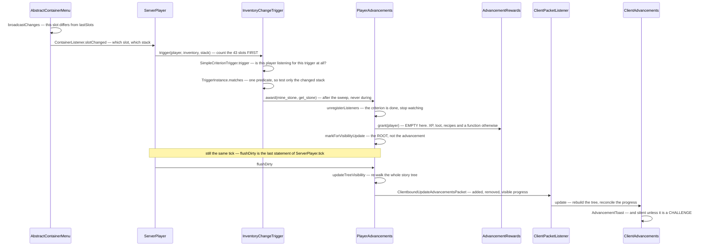

# Advancements

> Verified against **Minecraft 26.2** · Part XIII · "Stone Age": a cobblestone lands in your inventory and one tick later the toast appears — delivered by a subscription table that only ever shrinks, over a packet that never says what the criterion was.

Mine a stone block. Nothing about advancements happens when the item is
picked up; nothing happens when it enters the inventory either. What happens
is that `AbstractContainerMenu.broadcastChanges` — the same diff that keeps
your client's inventory in sync — notices that a slot's contents differ from
its remembered copy, and reports the difference. Detection is a **diff, not
an event**, and the advancement system is a subscriber to it.

That is the first of two things this system does backwards from
expectation. The second is bigger: there is **no global list of who is
listening for what**. Each player carries their own subscription table, it
contains only the criteria that player has *not yet satisfied*, and it
shrinks as they play. A veteran player is cheaper to run than a new one, and
the cost of the whole system to a save file falls monotonically over its
life.

Which is also why advancements are the game's general-purpose *"tell me when
the player does X"* facility rather than only a goal list. The recipe book
is unlocked by advancements. `PlayerPredicate` reads advancement progress
back out as a loot condition. All fifty-eight registered triggers exist
because something in the game wanted a hook and this was the hook that
already existed.

## The cast

| class | what it decides | side |
|---|---|---|
| `Advancement` | the immutable definition — parent, `DisplayInfo`, rewards, criteria, requirements, and a **pre-rendered display name** built in the compact constructor, which is the `[Title]` every announcement quotes | both |
| `AdvancementHolder` | the id plus the advancement, with **id-only equality** — so a map keyed by holder survives a pack changing an advancement's contents | both |
| `AdvancementTree` | the parent/child graph, built by a fixed-point loop that refuses any advancement whose parent is not yet a node. An orphan is **discarded**, not re-rooted | both |
| `Criterion` / `CriterionTrigger` | a trigger plus a decoded `CriterionTriggerInstance`, and nothing else — a criterion has no name of its own, the name is the map key, and the **trigger object is stateless** | both |
| `SimpleCriterionTrigger` | the base class for all but one trigger, and the owner of the per-fire sweep | both |
| `AdvancementRequirements` | a list of lists of criterion names: an **AND of ORs**. `AdvancementRequirements.size` counts *clauses*, not criteria | both |
| `PlayerAdvancements` | the per-player subscription table and the dirty sets. The only class here with interesting state | server |
| `TreeNodePosition` | a full tidy-tree layout — three walks, threads, ancestors, shifts — run on the **server**, mutating `DisplayInfo`'s coordinates in place | server |

The shared model is `net/minecraft/advancements`, the triggers are in
`advancements/triggers` and the predicates in `advancements/predicates`
(with the entity half a level down). All 112 classes ship in both jars.
`CriteriaTriggers` registers **fifty-eight** triggers into
`BuiltInRegistries.TRIGGER_TYPES` over **forty-four** classes; the gap is
re-use, with `PlayerTrigger` alone accounting for six registrations.

## The trace: "Stone Age"

`minecraft:story/mine_stone` has one criterion, *get_stone*, whose trigger
is `minecraft:inventory_changed` and whose condition is a single
`ItemPredicate` over the `#minecraft:stone_tool_materials` tag. It has no
rewards at all.

Each arrow is a decision.

**Counting comes before knowing whether anyone cares.**
`InventoryChangeTrigger.trigger` walks all forty-three slots — thirty-six
inventory plus seven equipment — to compute the occupied, full and empty
counts *before* it asks whether any criterion is listening. That is the
floor cost of every slot change of every player, forever, and it is the most
expensive trigger per fire. (The most *frequent* is `CriteriaTriggers.TICK`,
which fires unconditionally twenty times a second per player.)

**The sweep itself is the cheap part.** `SimpleCriterionTrigger.trigger`
fetches this trigger's map from `PlayerAdvancements.getTriggerMapForType` and
returns immediately if it is null — and it *is* null once every criterion
for that trigger is satisfied, because `PlayerAdvancements.removeListener`
deletes the per-trigger map when it empties. When there is work, it builds
**one** `LootContext` and reuses it for the whole sweep, evaluates the
caller's cheap matcher first and the *player* predicate only for matches,
and does not allocate the results list until the first hit. Note the scope:
one player. Nothing here is a broadcast.

**Matches are collected, then awarded**, because awarding calls
`PlayerAdvancements.unregisterListeners`, which mutates the very map being
iterated.

**Completion is checked against the requirements, not the criteria.**
`AdvancementRequirements.test` is the AND of ORs. Here it is one clause of
one name, so granting the criterion completes the advancement — which fires
the rewards, the chat announcement (built by
`AdvancementType.createAnnouncement`, broadcast to every player, gated on
`GameRules.SHOW_ADVANCEMENT_MESSAGES`) and the visibility dirty flag.

## Visibility is per root, and it gates the wire

`PlayerAdvancements.markForVisibilityUpdate` dirties the **root**, and the
flush re-runs `AdvancementVisibilityEvaluator` — the "how far past your
frontier can you see" rule, with a depth of two — over that root's entire
subtree. Finishing one advancement in a large tree re-evaluates the whole
tree, and only the nodes whose visibility actually *flipped* go on the wire.

`PlayerAdvancements.flushDirty` then sends progress **only for advancements
in `PlayerAdvancements.visible`**. Progress on something hidden, or beyond
your frontier, accumulates server-side and reaches the client the moment it
becomes visible.

Where the flush sits in the tick is worth pinning down, because it produces
a real one-tick delay that nobody expects. Inside `ServerPlayer.tick`,
`AbstractContainerMenu.broadcastChanges` is the fifth statement,
`CriteriaTriggers.TICK` fires mid-tick, and
`PlayerAdvancements.flushDirty` is the **last**. So everything awarded
between those points — a pickup, a kill, an `/advancement grant`, an item
granted by another advancement's reward — coalesces into one packet, and so
does everything that arrived in a packet, because
`MinecraftServer.processPacketsAndTick` drains the inbound queue before the
levels tick at all.

But `ServerPlayer.tick` is not the last thing that happens to a player.
`ServerGamePacketListenerImpl.tick` calls `ServerPlayer.doTick` during the
**connection** phase, which in 26.2 runs *after* the levels
([the server tick](../server/server-tick.md)) — i.e. after
`PlayerAdvancements.flushDirty` has already run. `CriteriaTriggers.LOCATION`, which fires there
every twenty ticks and is what most vanilla biome and structure
advancements hang on, therefore **always lands in the next tick's packet.**

## A criterion's conditions are loot conditions

`ContextAwarePredicate` wraps a list of `LootItemCondition` and evaluates it
against a `LootContext`, reached through `EntityPredicate.createContext`. So
a trigger's conditions are exactly the machinery of
[contexts and predicates](../items/contexts-and-predicates.md), and that is
where most descriptions of the system stop.

It is worth going one step further, because the predicate package is where
four shapes were invented that the whole data-driven half of the game now
reuses.

| shape | what it generalises | where else it turns up |
|---|---|---|
| `MinMaxBounds` | the numeric range, with both a codec **and** a `StringReader` grammar | `3..7` means the same in a predicate, an entity selector and `/random` |
| `CollectionPredicate` | one generic "N of these match", composing `CollectionContentsPredicate` and `CollectionCountsPredicate` | the item, slot and effect predicates instantiate it rather than reimplementing it |
| `EntitySubPredicate` | a per-mob test as a **registry element** instead of a code branch | the twenty-odd small entity predicates are each a record, a codec and nothing else |
| `DataComponentMatchers` | testing a stack's components without knowing what any of them are | [data components](../foundations/data-components.md) |

Two details change behaviour rather than shape.
`EntityPredicate.ADVANCEMENT_CODEC` accepts *either* a condition list or a
bare entity predicate, which is why vanilla's JSON writes the short form.
And `EntityPredicate` declares an explicit type-check-first, NBT-last
ordering for its own sub-tests — a performance invariant hiding inside a
predicate class.

## Questions players ask

**Why does the client show "3/7" if it does not know what the criteria
are?** Because `AdvancementRequirements` *is* on the wire and
`AdvancementProgress.update` reconciles against it. `Advancement.read`
reconstructs the record with an **empty criteria map** and
`AdvancementRewards.EMPTY`, so a client cannot know what any criterion
tests, or that an advancement grants anything at all. And
`AdvancementProgress.getProgressText` returns nothing at all when there is
one clause, which is why a single-criterion advancement never shows "1/1".
(An `AdvancementProgress` with no requirement clauses is permanently
incompletable — `AdvancementRequirements.test` returns false for an empty
list rather than vacuously true — and the only way to hold one is to decode
it off the wire, which is exactly what the client does before its first
update.)

**Why does the tree look the same on every client?** Because it was laid out
on the server. `TreeNodePosition` runs inside `ServerAdvancementManager` and
mutates `DisplayInfo` in place; the coordinates ride the packet. A root with
no `DisplayInfo` is never laid out and never becomes a tab, and a
display-less node in the middle of a tree is transparent — the layout skips
it and adopts its children. One wrinkle in an otherwise deterministic
algorithm: `AdvancementNode.children` is an unordered hash set, so sibling
order inside a tidy-tree layout is hash-dependent.

**Does `/reload` roll back my progress?** No, and the order is the point.
`MinecraftServer.reloadResources` calls `PlayerList.saveAll` and *then*
`PlayerList.reloadResources`, so `PlayerAdvancements.reload` re-reads a file
written moments earlier. What is genuinely lost is progress for any
advancement the new pack has removed or renamed — logged once each, and
invisible to the player except as a full reset packet — plus the selected
tab, which is silently forgotten with no packet, so the client keeps a stale
one.

**When is progress written to disk?** Only when the player is saved. There is
no write on award: `PlayerAdvancements.save` runs from `PlayerList.save`, on
disconnect, on a save-all, or from the reload above. The definitions come
from `data/<ns>/advancement/<id>.json` through `Advancement.CODEC` — a
duplicate id aborts the reload outright — and per-player state is one JSON
file at `players/advancements/<uuid>.json`
(`LevelResource.PLAYER_ADVANCEMENTS_DIR`), data-fixed on load through
`DataFixTypes.ADVANCEMENTS`.

**How does the recipe book fit in?** Every recipe advancement is generated
with a `RecipeUnlockedTrigger` criterion and an `AdvancementRewards` naming
the recipe, so earning it calls `ServerPlayer.awardRecipes`
([recipes](../items/recipes.md)). `RecipeUnlockedTrigger` then closes the
loop by letting *other* advancements observe an unlock — comparing the
recipe key by **reference identity**, which is safe only because
`ResourceKey`s are interned.

**Does the listener set ever grow?** Twice.
`PlayerAdvancements.registerListeners` subscribes only to criteria that are
not yet done in advancements that are not yet done, and every award
unsubscribes — *unless* somebody runs `/advancement revoke`, which
re-subscribes, or `/reload`, which re-subscribes everything unfinished in
the new pack.

**Why is `/advancement grant` usable as a conditional?** Because a no-op is
a hard failure: granting an advancement the player already has throws rather
than reporting zero. `AdvancementCommands.Mode` — *only*, *through*,
*from*, *until*, *everything* — is a graph traversal collecting parents or
children or both, and `/advancement grant … everything` calls
`PlayerAdvancements.flushDirty` before and after the loop with the packet's
"show advancements" flag **false**, which is the only purpose that flag has:
suppressing a toast storm.

Three smaller surprises, for completeness. `ImpossibleTrigger` has no
trigger method at all — it is the one trigger implementing `CriterionTrigger`
directly, and it exists so a node can anchor a tree while being ungrantable
except by command, which vanilla uses for exactly one file: the invisible
root of every recipe advancement. (It has nothing to do with `/trigger`,
which is a scoreboard feature.) `DisplayInfo`'s announce-to-chat flag is
**write-only on the wire**: the serialiser packs three flags into an int and
omits it, and the reader hard-codes it false while the codec defaults it
true, so the client's copy is wrong for the common case rather than merely
unused. And `PlayerAdvancements.checkForAutomaticTriggers` is dead code that
would not do what its name says: it runs a full pass over every advancement
on every player load, awarding the *empty string* as a criterion name, which
no progress object contains — so the award always fails while the rewards
are granted anyway.

## The screen at the other end

The client's half is five classes in
`net/minecraft/client/gui/screens/advancements` plus `ClientAdvancements`
over in `client/multiplayer` — about 1,240 lines — and it is the payoff for
everything the server did. It does **no tree layout**: it is drawing
positions a data-pack reload decided.

`ClientAdvancements` consumes `AdvancementTree.Listener`, and
`AdvancementTree.setListener` replays every existing root and task at a new
listener immediately, which is how the screen catches up on open.
`AdvancementsScreen` owns the tab strip; `AdvancementTab` owns one root's
pan-and-scroll bounds, auto-centres on first render and clamps the drag;
`AdvancementWidget` scales the server-decided coordinates by a fixed factor,
draws the connector lines to its parent, and wraps its own tooltip text.

`AdvancementTabType` is the one with a hard limit in it: four header
geometries with room for eight tabs above, eight below and five on each
side. **A data pack's twenty-seventh root is silently unreachable.**

Two more things ride this boundary and go nowhere.
`ServerboundSeenAdvancementsPacket` has a "closed screen" action that is
serialised, deserialised and dropped. And `Advancement.sendsTelemetryEvent`
is consumed **only** on the client, by `WorldSessionTelemetryManager`, and
only for advancements in the *minecraft* namespace — which is the whole
reason a flag rides a wire form that drops the criteria and the rewards
([what this book skips](../anatomy/what-this-book-skips.md)).

## Where to look

`Advancement` and `AdvancementRequirements` for the model;
`PlayerAdvancements` for everything that actually happens;
`SimpleCriterionTrigger` and `InventoryChangeTrigger` for the hot path;
`MinMaxBounds` and `CollectionPredicate` for the predicate shapes that recur
everywhere else; and `AdvancementVisibilityEvaluator` for the one rule
nobody guesses right.

---

*Rules: names, never code · how the system works, not how the code reads ·
newest version only · every backticked name passes `tools/verify_names.py`.*
