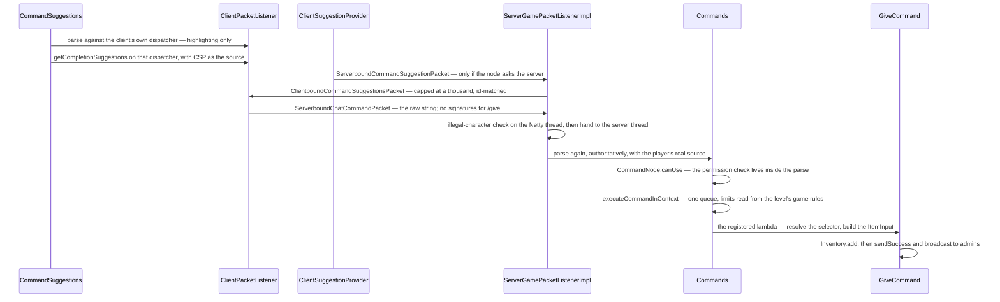

# Brigadier and commands

> Verified against **Minecraft 26.2** · Part XIII · `/give @p diamond_sword[minecraft:damage=5]`: three parsers for one string, a permission system that is no longer an integer, and a tab-completion whose fast path never leaves the machine.

## Responsibility

A command is a string typed by a human that has to become a call with typed
arguments, checked against permissions, on the server. Brigadier — Mojang's
parsing library, outside the game's own packages — supplies the shape: a **tree** of
literal and argument nodes, each with a requirement predicate, each
optionally executable. Everything on this page is what Minecraft builds on
top of that: the argument types, the source object, the permission model,
the serialisation of the tree to the client, and the three times the same
string gets parsed.

The single most important structural fact: **the client has a real
dispatcher too.** It is not a lookup table of strings. The server sends the
tree, the client rebuilds it with working parsers instantiated against its
own registries, and uses it for highlighting, usage text and the completion
of every argument type that can answer locally. That is why tab-completing
an item id is instant and tab-completing a loot table is not.

The one sentence a player would recognise: *the grey ghost text and the red
underline in the chat box.*

## The data it owns

- **`Commands`** — the one server-side `CommandDispatcher` and every
  registration. `Commands.CommandSelection` gates which commands exist at
  all (integrated versus dedicated). `Commands.literal` and
  `Commands.argument` are the builder shorthands every command file uses,
  and `Commands.hasPermission` is the new requirement idiom — **all
  ninety-four *requires* calls in the game use it**, with no exceptions.
  `Commands.CURRENT_EXECUTION_CONTEXT` is a thread-local that makes nested
  command execution reuse one queue instead of recursing
  ([execution and functions](execution-and-functions.md)).
  `Commands.validate` throws at start-up if any registered argument type is
  missing from `ArgumentTypeInfos` — the check that keeps the wire format
  honest — and `Commands.getParseException` is the three-way decision that
  turns a failed parse into a message.
- **`CommandSourceStack`** — *who is running this, from where*. Immutable;
  a wither returns a copy, or the same object when the value is unchanged. Its
  fourteen fields: a `CommandSource` (the output sink), a position, rotation
  and anchor, a `ServerLevel`, a `MinecraftServer`, an entity, a
  `PermissionSet`, a silence flag, a `CommandResultCallback`, a
  `CommandSigningContext`, a `TaskChainer` for signed-chat ordering, and the
  pair of names — `CommandSourceStack.getDisplayName` is what the admin
  broadcast quotes. It implements both `SharedSuggestionProvider` and
  `ExecutionCommandSource`, which is why one object serves parsing,
  suggesting, executing and reporting.
  `CommandSourceStack.sendSuccess` takes a *supplier*, so the message is
  never built when nobody will see it.
- **`CommandSource`** — the output end alone: `CommandSource.NULL`,
  `CommandSource.acceptsSuccess`, `CommandSource.shouldInformAdmins`. A
  command block, RCON and the console differ only here.
- **`CommandBuildContext`** — a `HolderLookup.Provider` plus
  `CommandBuildContext.enabledFeatures`. Argument types that need registries
  take one, which is how a data-pack biome becomes tab-completable without a
  code change.
- **The argument types** (`net/minecraft/commands/arguments`) — thirty-eight
  argument-type classes in the top package plus the `arguments/blocks`,
  `arguments/item`, `arguments/coordinates` and `arguments/selector`
  subpackages; **fifty-seven** of them are
  registered on the wire by `ArgumentTypeInfos`. The ones that carry the
  weight: `EntityArgument` and its `EntitySelector` /
  `EntitySelectorParser` / `EntitySelectorOptions`; `ResourceArgument`
  (yields a `Holder.Reference`), `ResourceKeyArgument` (yields a key,
  resolved later), `ResourceOrIdArgument` (an id **or** an inline literal),
  `ResourceOrTagArgument` (an id or a `#tag`) and `ResourceSelectorArgument`
  (the only one that takes a glob — `minecraft:*`); `ItemArgument` with
  `ItemParser` and `ItemInput`; `BlockStateArgument` with `BlockStateParser`
  and `BlockInput`; their predicate counterparts `ItemPredicateArgument` and
  `BlockPredicateArgument`; `NbtPathArgument`, at 874 lines the largest of
  them; `ComponentArgument`; `MessageArgument`; and the coordinate family
  built on `WorldCoordinate` and `Coordinates`. `IdentifierArgument` is the
  class a 1.21 reader knows under another name — its registry id is
  unchanged.
- **`ArgumentTypeInfo`** and **`ArgumentTypeInfos`**
  (`net/minecraft/commands/synchronization`) — the wire description of an
  argument type. `ArgumentTypeInfo.Template` is a *recipe*: it can be
  written to a buffer and `ArgumentTypeInfo.Template.instantiate`d against a
  `CommandBuildContext` on the other side. `SingletonArgumentInfo` is the
  common case and writes nothing at all;
  `ArgumentUtils.createNumberFlags` supplies the flags byte for the numeric
  types, and `ArgumentUtils.serializeNodeToJson` dumps the whole tree for
  `CommandsReport`.
- **`SuggestionProviders`** — the named providers a node can ask for. There
  are exactly three: `SuggestionProviders.ASK_SERVER`,
  `SuggestionProviders.AVAILABLE_SOUNDS` and
  `SuggestionProviders.SUMMONABLE_ENTITIES`. Everything else serialises as
  the first of those; see below.
- **The permission package** (`net/minecraft/server/permissions`, twelve
  files) — see below. `PermissionSet`, `Permission`, `Permissions`,
  `PermissionLevel`, `PermissionCheck`, `PermissionProviderCheck`,
  `LevelBasedPermissionSet`, `PermissionSetUnion`, `PermissionSetSupplier`,
  and the two bootstrap classes `PermissionTypes` and `PermissionCheckTypes`
  that make its registries code-only.
- **`ClientSuggestionProvider`** — the client's `SharedSuggestionProvider`:
  the tab list, the looked-at block and entity, the server-pushed
  completions, and the one method that sends a packet.
  **`CommandSuggestions`** is the 688-line widget on top of it — the
  highlighter, the usage hint, the popup and the parse cache.
- **`SignableCommand`** (in `net/minecraft/network/chat`),
  **`SignedArgument`**, **`ArgumentSignatures`** and
  **`CommandSigningContext`** — the signed-argument plumbing. Chat signing
  itself belongs to [chat and signing](../networking/chat-and-signing.md);
  what lives here is `ArgumentVisitor.visitArguments`, the walk over a parse
  that finds which arguments need a signature, and the map that carries them
  afterwards.
- **`BrigadierExceptions`**, installed once into Brigadier's global
  `CommandSyntaxException` provider by `SharedConstants`. It is the reason
  every parse error is a translatable `Component` rather than a plain
  string — the mechanism behind the red underline.

## When it runs

Everything server-side is the server thread, but the two inbound packets
get there differently, and the difference is deliberate:

- `ServerboundCommandSuggestionPacket` goes through
  `PacketUtils.ensureRunningOnSameThread`, so the parse happens on the main
  thread.
- `ServerboundChatCommandPacket` does **not**.
  `ServerGamePacketListenerImpl.tryHandleChat` runs the character-legality
  check on the Netty thread — and may disconnect from there — before handing
  the body to `MinecraftServer.execute`. It also calls
  `ServerPlayer.resetLastActionTime` on the way past, so a little
  `ServerPlayer` state really is written off the main thread. The signed
  variant does more still:
  `ServerGamePacketListenerImpl.handleSignedChatCommand` unpacks the
  last-seen message set under a lock, and can disconnect for chat-validation
  failure, before the legality check runs. Everything after that (the
  authoritative parse, the permission check, the execution, the spam
  throttle) is on the main thread. The principle is the one
  [the connection](../networking/the-connection.md) describes — cheap
  validation early — with the honest qualifier that "cheap" includes two
  disconnect paths and one field write.

Function compilation is the third case: `ServerFunctionLibrary` parses every
`.mcfunction` **off** the main thread during a reload, against a
`CommandSourceStack` from `Commands.createCompilationContext` with a null
level and a null server. That constraint is invisible until an argument type
dereferences one of them.

## The trace: `/give`

Each arrow is a decision.

**The client parses first, and throws the result away.**
`CommandSuggestions.updateCommandInfo` runs the whole string through the
client's dispatcher every keystroke. That parse produces the red underline,
the grey usage hint (Brigadier's smart usage) and the completion list. It is
*never* sent and never trusted; the string is.

**Item, block-state and component completion never leaves the machine.**
`ItemArgument` and `BlockStateArgument` are registered as **context-aware**
singletons, so the client instantiated a real `ItemParser` and a real
`BlockStateParser` against its own registries. Item ids, data components and
block properties complete locally, and so does every argument type whose
suggestion method reads a synced registry.

**The round trip is the default, not a fallback.** This is the fact to get
right, because the shape of the code invites the opposite conclusion.
`SuggestionProviders.getName` returns the registered name for a
`SuggestionProviders.RegisteredSuggestion` and *ask_server* **for everything
else** — so any node whose suggestions come from a plain lambda is
serialised as a request to ask the server. Of the sixty-seven
suggestion providers attached to vanilla nodes, five name a registered
provider; the other sixty-two become *ask_server*. That is how `/function`,
`/datapack`, `/bossbar`, `/scoreboard`, `/team`, `/schedule`, `/whitelist`
and the rest complete: the client's rebuilt node carries
`SuggestionProviders.ASK_SERVER`, calls
`SharedSuggestionProvider.customSuggestion`, and the server answers with its
own parse. The second route to the same place is
`ClientSuggestionProvider.suggestRegistryElements` failing to find a
server-only registry (loot tables, advancements, recipes) and falling
through to the same method. Two mechanisms, one packet.

**Suggestion replies are matched by id.**
`ClientSuggestionProvider.customSuggestion` cancels the in-flight future and
increments a counter; `ClientSuggestionProvider.completeCustomSuggestions`
compares the reply's id against that counter and drops a stale one, so a
slow answer for an older prefix never flashes.

**Enter parses a second time on the client, for one reason only.**
`ClientPacketListener.sendCommand` runs `SignableCommand.of` to find out
whether any argument is a `SignedArgument`. `/give` has none, so the plain
packet goes. A `/msg` would take a timestamp, a salt and the last-seen
message set, sign each signable argument, and send the signed variant. A
command the *player did not type* — a click event, or a dialog button — goes
through `ClientPacketListener.sendUnattendedCommand` instead and is parsed
twice more, once against each of the client's two sources, before anything
is sent.

**The authoritative parse is the server's, with the player's source.**
`ServerPlayer.createCommandSourceStack` fills in the real `PermissionSet`,
and Brigadier consults the node's requirement *during* the parse — which is
why a permission failure is reported as an unknown command.

**Execution is a queue, not a call.** `Commands.performCommand` flattens the
parse into a context chain and hands it to
`Commands.executeCommandInContext`, which builds an `ExecutionContext`; the
limits come from the level's game rules, read once. That machinery is the
subject of [execution and functions](execution-and-functions.md).

**`/give` itself is unremarkable and instructive.**
`EntityArgument.getPlayers` resolves the selector —
`EntitySelector.checkPermissions` re-tests the entity-selector permission at
*resolve* time, having already been tested at parse time by
`EntitySelectorParser.allowSelectors` — `ItemArgument.getItem` hands over the
`ItemInput` built during parsing, `ItemInput.createItemStack` validates it,
and the stacks go through `Inventory.add`, with anything that will not fit
dropped on the floor ([items and stacks](../items/items-and-stacks.md)).
Success goes to `CommandSourceStack.sendSuccess`, which broadcasts to admins
under two game rules.

## The permission model

This is the part that changed most, and the part every mod and plugin will
notice first: **a permission is no longer an integer.**

- A **`Permission`** is one of two shapes: `Permission.Atom`, a named
  capability with an `Identifier`, or `Permission.HasCommandLevel`, an
  ordered level. `Permissions` holds the vanilla ones —
  `Permissions.COMMANDS_GAMEMASTER` and its siblings,
  `Permissions.COMMANDS_ENTITY_SELECTORS`, and the chat atoms.
- A **`PermissionSet`** answers `PermissionSet.hasPermission` for one
  permission. `PermissionSet.union` composes two; `PermissionSetUnion` is
  the OR, and `PermissionSetUnion.ensureNoUnionsWithinUnions` refuses to
  nest.
- **`LevelBasedPermissionSet`** is the ordinary answer, and it is an
  *interface* with five constants rather than a class with a field: each
  supplies one `PermissionLevel` (still five rungs, all through owner) and
  the default `LevelBasedPermissionSet.hasPermission` satisfies a
  `Permission.HasCommandLevel` at or below it — plus, hard-coded, the
  entity-selector atom from gamemaster upward. **It answers false to every
  other atom.** `LevelBasedPermissionSet.ALL` is the rung a non-op gets, and
  it is marked deprecated in place.
- A **`PermissionCheck`** is `PermissionCheck.Require` or
  `PermissionCheck.AlwaysPass`, and `PermissionProviderCheck` wraps one as
  the predicate that actually sits on a command node.
  `Commands.LEVEL_GAMEMASTERS` and its siblings are these checks — the
  names survived, the type did not.
- Both `Permission` and `PermissionCheck` are codec-dispatched over
  registries bootstrapped by `PermissionTypes` and `PermissionCheckTypes`.
  Those registries are **code-only**: `PermissionCheck.CODEC` has exactly one
  consumer in the game, `ArgumentUtils.serializeNodeToJson` writing the
  generated command report. There is no permissions file in a data pack.

Where a set comes from: `MinecraftServer.getProfilePermissions` resolves the
ops file first, then singleplayer ownership, then the LAN "allow cheats"
flag, then the server's configured operator level. `ops.json` still stores
an integer, *server.properties* still stores one, the JSON-RPC management API
still exposes one ([the out-of-scope tour](../appendix/out-of-scope-tour.md)),
and the wire carries one: the op level reaches the client as one of five
values on `ClientboundEntityEventPacket`.

The client is not without permissions of its own — `ClientPacketListener`
mints a `Permission.Atom` for restricted commands, and `ChatAbilities` holds
the four chat atoms, all decided locally. What the client never learns is the
*server's* atom set, because no packet carries a `PermissionSet` at all. The
asymmetry runs the other way too: the server sends the byte for
`PermissionLevel.ALL` and `LocalPlayer` maps it to
`PermissionSet.NO_PERMISSIONS`, not to a level-zero set.

## Interfaces

- **Called by:** `ServerGamePacketListenerImpl` for typed commands and
  suggestions; `Commands.performPrefixedCommand` for command blocks
  (`BaseCommandBlock`), signs (`SignBlockEntity`), the console and RCON
  (`DedicatedServer`), and the debug chase client;
  `ServerFunctionManager` for functions.
- **Calls into:** effectively the whole game — ninety-three command classes
  in `net/minecraft/server/commands` plus `net/minecraft/commands` itself.
  The registries, through the resource argument family; the loot system
  through `ResourceOrIdArgument`; `ServerFunctionManager` through
  `FunctionArgument` and `CacheableFunction`.
- **Crosses the network as:** `ClientboundCommandsPacket` (the tree),
  `ServerboundChatCommandPacket` and `ServerboundChatCommandSignedPacket`
  (execution), `ServerboundCommandSuggestionPacket` and
  `ClientboundCommandSuggestionsPacket` (completion),
  `ClientboundCustomChatCompletionsPacket` (a server pushing arbitrary
  non-command completions into the tab list, add/remove/set), and
  `ClientboundEntityEventPacket` for the op level. See
  [what the client is told](../networking/what-the-client-is-told.md).
- **Data-driven by:** every dynamic registry (a pack's biomes, structures,
  enchantments, loot tables and dialogs are completable and parseable for
  free, because the argument names the registry key on the wire), plus
  functions and function tags. Text components in JSON get their selectors,
  NBT paths and coordinates compiled through `CompilableString`, so a bad
  selector in a pack's component fails the pack — and, because these are
  ordinary codecs, a bad one arriving over the wire fails the packet decode.

## The tree on the wire

`Commands.sendCommands` makes a deep copy of the dispatcher's tree filtered
by each node's requirement for that player's source
(`Commands.fillUsableCommands`), and serialises it. Argument nodes carry the
registry id of their `ArgumentTypeInfo` plus whatever the template writes —
usually nothing, often a flags byte (a numeric type's min and max, or
`EntityArgument`'s single / players-only pair), sometimes a registry key.
The client then *builds real parsers* from those templates.

Two separate elisions:

- **Absent** — a node whose requirement the player fails is simply not in the
  packet, and because the filter is recursive, a gated literal takes its
  whole subtree with it.
- **Flagged** — `ClientboundCommandsPacket.FLAG_RESTRICTED` marks a node
  whose requirement fails for a *no-permission* source. It says "this needs
  some permission", independently of this player. The client turns it into
  a synthetic permission and keeps two *sources* over its one dispatcher:
  the normal one, in which restricted nodes still highlight and suggest, and
  a no-permission one. `ClientPacketListener.verifyCommand` parses with both
  to tell "you would need permission for this" apart from "this is a typo" —
  which is how an unattended command gets a confirmation dialog instead of
  silently failing.

The packet has exactly one call site,
`PlayerList.sendPlayerPermissionLevel`, so the tree and the op-level entity
event are **always sent together**. That happens on join, on respawn, on a
dimension change (and only a change — a same-dimension teleport returns
early), on op and deop, and on either of the two LAN toggles: the
singleplayer *Allow Cheats* switch and the separate "commands for other
players" flag `IntegratedServer` sets when the world is published. It is
**not** sent after `/reload`.

## The commands that reach into other systems

Most of `net/minecraft/server/commands` is a thin lambda over machinery
another part of this corpus owns. These are the ones worth naming, because
a reader looking for "how does `/locate` work" wants the *mechanism* page,
not this one:

- **`LocateCommand`** — and its two halves are barely related.
  `LocateCommand.locateStructure` can **drive world generation on the server
  thread**, because deciding whether a structure is at a chunk means asking
  the structure check; `LocateCommand.locateBiome` asks the biome source and
  never reads a stored palette at all
  ([structures](../worldgen/structures.md), [biomes](../worldgen/biomes.md)).
- **`FillBiomeCommand`** — writes the biome palette of the affected sections
  and resends them; the only command that edits a chunk's biomes
  ([chunk anatomy](../world/chunk-anatomy.md)).
- **`PlaceCommand`** — four entries, three into Part XII and one elsewhere:
  `PlaceCommand.placeFeature` runs a configured feature with no placement
  layer, `PlaceCommand.placeStructure` lays out a whole structure,
  `PlaceCommand.placeJigsaw` reaches jigsaw assembly directly, and
  `PlaceCommand.placeTemplate` reaches the structure template manager with
  rotation, mirror, integrity and a seed
  ([features and placement](../worldgen/features-and-placement.md),
  [structures](../worldgen/structures.md),
  [hand-built structures](../worldgen/hand-built-structures.md)).
- **`LootCommand`** and **`ItemCommands`** — the second is the more
  interesting: `ItemCommands.applyModifier` runs a loot *function* over an
  existing stack, which is what `/item modify` and the `from … <modifier>`
  form of `/item replace` do. (`/item … with` is the plain case and takes an
  item, not a modifier.) Both commands take a table or modifier through
  `ResourceOrIdArgument`, so an inline literal works where an id does
  ([loot tables](../items/loot-tables.md)).
- **`EnchantCommand`** and **`ExperienceCommand`** — thin faces over
  [enchantments](../items/enchantments.md) and
  [hunger, XP and effects](../player/hunger-xp-and-effects.md).
- **`ExecuteCommand`** — not a command so much as the front end of the
  execution engine ([execution and functions](execution-and-functions.md)).
- **`DataPackCommand`** — enables and disables packs, then reloads
  ([the resource system](../foundations/resource-system.md)).
- **`ScoreboardCommand`**, **`TeamCommand`**, **`TriggerCommand`** and
  **`DataCommands`** — the write surface of
  [scores, teams and stored data](scoreboard-and-data.md).

And one whole class of command a reader will look for and not find in a
shipped game: `Commands` registers `DebugConfigCommand`, `RaidCommand`,
`DebugPathCommand`, `DebugMobSpawningCommand`, `WardenSpawnTrackerCommand`,
`SpawnArmorTrimsCommand` and `ServerPackCommand` only when
`SharedConstants.DEBUG_DEV_COMMANDS` or `SharedConstants.IS_RUNNING_IN_IDE`
is set, and `ChaseCommand` behind a flag of its own.
`DebugConfigCommand` is additionally dedicated-server-only — which matters,
because it is the only vanilla caller of the play-to-configuration
transition and back ([protocol phases](../networking/protocol-phases.md)).

## The arguments that resolve against the source

Three argument families do not produce a value at all. They produce a
*recipe* that is evaluated against the `CommandSourceStack` at run time,
which is why the same parsed command means different things at different
links of an `/execute` chain.

- **`Coordinates`** holds relativity, not a position:
  `Coordinates.getPosition` resolves it against the source. `~` therefore
  means something different at every link of an `/execute at` chain, and one
  parsed argument yields N positions in a forked execution.
  `LocalCoordinates` (`^ ^ ^`) is the interesting one — it builds a basis
  from the source's rotation *and* its `EntityAnchorArgument.Anchor`, making
  it the one argument type that depends on eye height. `SwizzleArgument`
  parses an axis subset (*xz*) for `/clone` and `/spreadplayers`.
- **`EntitySelector`** is a compiled query, not a parse tree: predicates, a
  distance range, an optional `AABB`, a position resolver, a sort order and
  an `EntityTypeTest`. `EntitySelectorParser` assembles it from
  `EntitySelectorOptions`, a name-to-handler map of twenty-one option names
  (*distance*, *scores*, *nbt*, *predicate*, *sort*, *limit*, *type*, …) —
  and `EntitySelectorOptions` is, at 667 lines, the largest single file in
  this page's scope. Whether the level is asked for a box query or every
  entity is scanned is decided by the presence of that `AABB`, so `@e[type=X]`
  and `@e[type=X,distance=..8]` are not the same cost.
  `InvertableSetOptionState` is the machine behind `type=!zombie,!skeleton`:
  repeatable negation, single positive assertion, enforced structurally.
  `ScoreHolderArgument` and `GameProfileArgument` reimplement the same
  selector-or-literal fork for their own value types.
- **`FunctionArgument`** reads an id and nothing else, deferring the lookup
  to execution — which is what lets a function be compiled against a null
  server.

## The parser under the parser

Six argument types and the whole SNBT reader are not hand-written
`StringReader` walks. They are grammars, written against
`net/minecraft/util/parsing/packrat` — Mojang's own parser-combinator
framework, with `Term` as the combinator algebra (sequence, alternative,
repetition, lookahead), `Dictionary` and `NamedRule` binding named
productions, `Scope` as the typed capture environment, and
`CachedParseState` as the memo table keyed by position and rule. That memo
table is the "packrat" in the name: a backtracking grammar that would
otherwise re-parse the same prefix once per alternative instead looks it up.

The reason it matters to a *command* page is `ErrorCollector` and
`SuggestionSupplier`: the grammar produces completions as a by-product of
failing. A hand-written argument type can only suggest at a token boundary
it thought to check; a grammar knows every terminal that could have
continued the parse, which is why `/clear @s minecraft:diamond_sword[…` still
completes mid-token. The consumers are exactly nine —
`ComponentArgument`, `NbtTagArgument`, `ResourceOrIdArgument`,
`StyleArgument`, `ItemPredicateArgument`, `ComponentPredicateParser`, and
`TagParser` / `SnbtGrammar` / `SnbtOperations` on the NBT side
([codecs, NBT and JSON](../foundations/codecs-nbt-json.md)).

## Invariants and surprises

- **A permission failure is indistinguishable from a typo.** The
  requirement is consulted inside the parse, so an unopped player running
  `/give` is told the command is unknown. `Commands.getParseException`
  reports an empty parse range as an unknown *command* and a non-empty one
  as an unknown *argument*. The client can tell the difference, but only for
  unattended commands, never for what you type.
- **`/reload` invalidates the command tree and nobody is told** — but the
  consequence is narrower than the folklore on either side.
  `ReloadableServerResources` builds a whole new `Commands` and a whole new
  dispatcher, and the reload broadcast sends tags and recipes (and reloads
  each player's advancements) without resending the tree. Both server-side
  parses — the authoritative one and the round-trip suggestion one — read
  through `MinecraftServer.getCommands` and so pick up the new dispatcher
  immediately, which is why a newly added function *does* tab-complete after
  a reload: that completion is an *ask_server* round trip. What actually goes
  stale on the client is the tree's *shape* and its restricted flags, which
  no vanilla data pack can change.
- **The node inspector's source has a null level and a null server.**
  `Commands.createCompilationContext` builds it from
  `PermissionSet.NO_PERMISSIONS`, and every surviving node's requirement is
  evaluated against it once per command packet to compute the restricted
  flag. Only the nodes that already passed the player's own filter are
  inspected. All ninety-four vanilla requirements read nothing but the
  permission set, so this is a hazard for a modded requirement rather than a
  live bug: such a requirement crashes during *packet construction*, nowhere
  near the command.
- **`LevelBasedPermissionSet` grants exactly one atom.** A level-four
  operator's server-side set denies `Permissions.CHAT_SEND_COMMANDS` — the
  chat atoms live only in the client's own set. The two permission sets are
  not the same universe, and code that assumes an op has everything is
  wrong.
- **`Commands.LEVEL_MODERATORS` is used by no vanilla command.** The level
  exists, is settable, and gates nothing in the shipped game.
  `Commands.LEVEL_GAMEMASTERS` gates sixty-six nodes,
  `Commands.LEVEL_ADMINS` sixteen and `Commands.LEVEL_OWNERS` nine.
  `Commands.LEVEL_ALL` appears twice, and only as the *else* branch of a
  conditional: `/seed` and `/version` drop to it when the server is the
  integrated one.
- **The suggestion reply is capped at a thousand entries**, silently: the
  list is truncated with no marker and no message.
- **An unknown argument type deletes the node, not its children.** A modded
  argument type reaching a vanilla client decodes to a null stub, and
  `ClientboundCommandsPacket.NodeResolver` substitutes a bare
  `RootCommandNode`. The children *are* resolved and attached to that
  throwaway root — and the parent then skips any child that is a
  `RootCommandNode`, so the node and everything under it vanish from the
  tree the player can see. The packet is not rejected.
- **The execution limits are read once, from the outermost command's
  level.** An `/execute in` into another dimension does not pick up that
  dimension's game rules for the fork and sequence limits.
- **`MessageArgument` is the only signed argument in the game** — the sole
  implementor of `SignedArgument` — and seven commands take one:
  `/ban-ip`, `/ban`, `/me`, `/kick`, `/msg`, `/say` and `/teammsg`. All of
  `ArgumentSignatures`, `SignableCommand`, `ArgumentVisitor` and
  `CommandSigningContext` exists to serve them. A command with signable
  arguments sent *unsigned* is refused outright when the server enforces
  secure profiles, and a signature that does not match the parse breaks the
  player's whole message chain.

## Where to look

`Commands` for what exists, `CommandSourceStack` for what a command knows,
`ArgumentTypeInfos` for the catalogue of argument types and their wire
forms, `EntitySelectorOptions` for the grammar players actually write,
`net/minecraft/server/permissions` for the model that replaced the integer,
and `ClientboundCommandsPacket` for the one place the client and server
agree on a shape.

---

*Rules: names, never code · how the system works, not how the code reads ·
newest version only · every backticked name passes `tools/verify_names.py`.*
