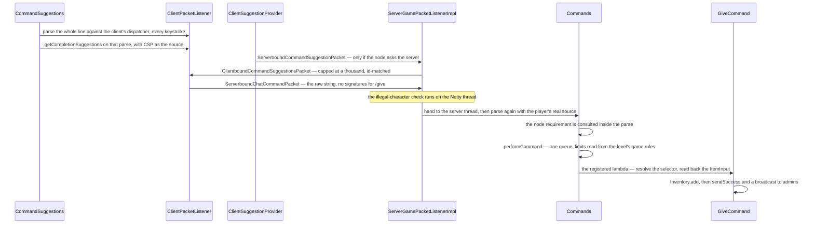

# Brigadier and commands

> Verified against **Minecraft 26.2** · Part XIII · You type `/give @p diamond_sword[minecraft:damage=5]` into the chat box: three parsers see that string, two of them throw their answer away — and not one of the completions you accepted along the way left your machine.

Open the chat box and type a slash. Before you have finished the word, the
text is coloured, a grey hint has appeared behind the cursor and a
completion popup is open — and every bit of that was produced by a **real
Brigadier dispatcher running on your own machine**, with real parsers built
against your own registries, from a tree the server sent you when you
joined. The client is not pattern-matching strings. It parses the whole line
on every keystroke, throws the parse away, and sends the string.

Which raises the question this page exists to answer: if the client can
parse the command, why is completing an item id instant and completing a
loot table not? Because the tree the client rebuilt says, node by node, who
is allowed to answer. Vanilla registers **459 argument nodes**, and only
**62** of them serialise as *ask the server* — so the local path is the
rule, not the exception. What makes the round trip feel ubiquitous is
*which* nodes take it: they are the ones that complete over data the client
was never sent.

## The cast

| class | what it decides | side |
|---|---|---|
| `Commands` | the one server-side `CommandDispatcher`, every registration, and what a failed parse is called | server |
| `CommandSourceStack` | *who is running this, from where* — position, rotation, level, entity, permissions, output sink. Immutable; a change returns a copy | server |
| `CommandBuildContext` | the registries an argument type parses against, so a data pack's biome is completable with no code change | both |
| `ArgumentTypeInfos` | the wire description of an argument type: a `ArgumentTypeInfo.Template` that can be written to a buffer and instantiated on the far side | both |
| `SuggestionProviders` | the three named providers a node may ask for. Everything else serialises as *ask_server* | both |
| `ClientSuggestionProvider` | the client's source: the tab list, the looked-at block and entity, and the one method that sends a packet | client |
| `CommandSuggestions` | the 688-line widget over it — the highlighter, the usage hint, the popup and the parse cache | client |
| `BrigadierExceptions` | installed once into Brigadier's global exception provider, which is why a parse error is a translatable `Component` | both |

Brigadier itself — the dispatcher, the tree of literal and argument nodes,
each with a requirement predicate and optionally executable — is Mojang's
parsing library and lives outside the game's packages. Everything on this
page is what Minecraft builds on top of it.

## Three parsers see one string

Each arrow is a decision.

**The client parses first, and the parse never leaves the machine.**
`CommandSuggestions.updateCommandInfo` runs the whole string through the
client's dispatcher on every keystroke, and that parse produces the red
underline, Brigadier's smart-usage hint and the completion list. What is
sent is the string.

**Item, block-state and component completion never leaves the machine
either.** `ItemArgument` and `BlockStateArgument` are registered as
**context-aware** singletons, so the client instantiated a real `ItemParser`
and a real `BlockStateParser` against its own registries. Item ids, data
components and block properties complete locally, and so does every argument
type whose suggestion method reads a synced registry.

**A node that asks for suggestions by hand almost always asks the server.**
This is the part the shape of the code invites you to get backwards — not
that the round trip is common, but that opting *in* to a provider is what
costs you one. `SuggestionProviders.getName` returns the registered name for
a `SuggestionProviders.RegisteredSuggestion` and *ask_server* **for
everything else**, so any node whose suggestions come from a plain lambda
serialises as a request. Of the **67** vanilla nodes that attach a provider
at all, five name one of the three registered providers and the other **62**
become *ask_server*. That is how `/function`, `/datapack`, `/bossbar`,
`/scoreboard`, `/team`, `/schedule` and `/whitelist` complete. The other 392
argument nodes attach nothing and fall back to their argument type's own
suggestions — which is why `/give`, the command in the line at the top of
this page, never asks the server anything. A second route reaches the same packet:
`ClientSuggestionProvider.suggestRegistryElements` failing to find a
server-only registry — loot tables, advancements, recipes — and falling
through. Two mechanisms, one packet.

**Replies are matched by id, so a stale answer never flashes.**
`ClientSuggestionProvider.customSuggestion` cancels the in-flight future and
increments a counter;
`ClientSuggestionProvider.completeCustomSuggestions` compares the reply's id
against that counter and drops anything older. The reply itself is
**truncated to a thousand entries, silently** — no marker, no message.

**Enter parses a second time on the client, for one reason.**
`ClientPacketListener.sendCommand` runs `SignableCommand.of` to find out
whether any argument is a `SignedArgument`. `/give` has none, so the plain
packet goes; a `/msg` would take a timestamp, a salt and the last-seen
message set, sign each signable argument and send the signed variant. A
command the player did *not* type — a dialog button, a click event, a sign —
goes through `ClientPacketListener.sendUnattendedCommand` instead and is
parsed twice more before anything is sent
([permissions](permissions.md)).

**The two inbound packets cross the thread boundary differently, on
purpose.** `ServerboundCommandSuggestionPacket` goes through
`PacketUtils.ensureRunningOnSameThread`, so its parse happens on the main
thread; the command packets are among the handful that do real work on the
Netty thread first ([the server
tick](../server/server-tick.md#every-packet-since-last-time-in-one-drain)
counts them, and [chat and
signing](../networking/chat-and-signing.md#three-ways-to-say-no) says what each
of those checks catches). What matters for a *command* is only that the
validation which can disconnect you runs before the parse does — so a command
whose text is illegal never reaches the dispatcher at all.

**The authoritative parse is the server's**, with a `CommandSourceStack`
from `ServerPlayer.createCommandSourceStack` carrying the real permission
set, and Brigadier consults each node's requirement *during* that parse.
Execution then is not a Java call: `Commands.performCommand` flattens the
parse into a context chain and hands it to
`Commands.executeCommandInContext`, which is
[the execution engine](the-execution-engine.md).

**`/give` itself is unremarkable and instructive.**
`EntityArgument.getPlayers` resolves the selector, `ItemArgument.getItem`
hands over the `ItemInput` that was built during *parsing*,
`ItemInput.createItemStack` validates it, and the stacks go through
`Inventory.add` with anything that will not fit dropped on the floor
([items and stacks](../items/items-and-stacks.md)). Success goes to
`CommandSourceStack.sendSuccess` — which takes a *supplier*, so the message
is never built when nobody will see it — and broadcasts to admins under two
game rules.

## Arguments that are recipes, not values

Three argument families do not produce a value at all. They produce
something evaluated against the `CommandSourceStack` at run time, which is
why one parsed command means different things at different links of an
`/execute` chain.

**`Coordinates` holds relativity, not a position.**
`Coordinates.getPosition` resolves it against the source, so `~` means
something different at every link and a single parsed argument yields N
positions in a forked execution. `LocalCoordinates` (`^ ^ ^`) is the
interesting one: it builds a basis from the source's rotation *and* its
`EntityAnchorArgument.Anchor`, so it is the only `Coordinates` shape that
depends on eye height — it is not itself an argument type, and both
`Vec3Argument` and `BlockPosArgument` can produce one. `SwizzleArgument`
parses an axis subset (*xz*), and `/execute align` is its only user.

**`EntitySelector` is a compiled query, not a parse tree** — thirteen final
fields with no reader and no grammar in them, assembled by
`EntitySelectorParser` from `EntitySelectorOptions` and resolved against a
`CommandSourceStack` much later, which is why one parsed selector yields a
different set at every link of a chain. `ScoreHolderArgument` and
`GameProfileArgument` reimplement the same selector-or-literal fork for their
own value types. The grammar, the twenty-one options, the two-phase
permission check and the two data structures a selector can be resolved
against are [entity selectors](entity-selectors.md).

**`FunctionArgument` reads an id and nothing else**, deferring the lookup to
execution — which is what lets a function be compiled against a null server
([functions and macros](functions-and-macros.md)).

## The parser under the parser

Five argument types and the whole SNBT reader are not hand-written
`StringReader` walks. They are grammars, written against
`net/minecraft/util/parsing/packrat` — Mojang's own parser-combinator
framework, with `Term` as the combinator algebra, `Dictionary` and
`NamedRule` binding named productions, `Scope` as the typed capture
environment, and `CachedParseState` as the memo table keyed by position and
rule. That memo table is the *packrat* in the name: a backtracking grammar
that would otherwise re-parse the same prefix once per alternative looks it
up instead.

The reason it matters to a command page is `ErrorCollector` and
`SuggestionSupplier`: **the grammar produces completions as a by-product of
failing.** A hand-written argument type can only suggest at a token boundary
it thought to check; a grammar knows every terminal that could have
continued the parse, which is why `/clear @s minecraft:diamond_sword[…`
still completes mid-token. The consumers are exactly nine —
`ComponentArgument`, `NbtTagArgument`, `ResourceOrIdArgument`,
`StyleArgument`, `ItemPredicateArgument`, `ComponentPredicateParser`, and
`TagParser` / `SnbtGrammar` / `SnbtOperations` on the NBT side
([codecs, NBT and JSON](../foundations/codecs-nbt-json.md)).

## The tree on the wire

`Commands.sendCommands` makes a deep copy of the dispatcher's tree, filtered
by each node's requirement for that player's source
(`Commands.fillUsableCommands`), and serialises it. An argument node carries
the registry id of its `ArgumentTypeInfo` plus whatever the template writes:
usually nothing (`SingletonArgumentInfo` writes zero bytes), often a flags
byte from `ArgumentUtils.createNumberFlags` or `EntityArgument`'s
single / players-only pair, sometimes a registry key. The client then
*builds real parsers* from those templates against its own
`CommandBuildContext`, which is why a data pack's biomes and dialogs are
parseable on the client for free.

`Commands.validate` is what keeps that honest — though only in development:
`Bootstrap` calls it under `SharedConstants.IS_RUNNING_IN_IDE` alone, so a
shipped client never runs it. It throws if any registered argument type is
missing from `ArgumentTypeInfos`. **Thirty-eight**
argument-type classes live in the top `net/minecraft/commands/arguments`
package, plus the *blocks*, *item*, *coordinates* and *selector*
subpackages; **fifty-seven** are registered on the wire.

Two things about that packet surprise people. It has exactly **one call
site**, `PlayerList.sendPlayerPermissionLevel`, so the tree and the op-level
entity event are always sent together — on join, respawn, a dimension
*change*, op and deop, and the four LAN toggles, and **not** after `/reload`.
And an **unknown argument type deletes the node, not its children**: a
modded type reaching a vanilla client decodes to a null stub,
`ClientboundCommandsPacket.NodeResolver` substitutes a bare
`RootCommandNode`, the children are resolved and attached to that throwaway
root, and the parent then skips any child that is a `RootCommandNode` — so
the node and everything under it vanish from the tree the player can see.
The packet is not rejected. What the *filtering* means, and the second
elision that rides the same packet, is [permissions](permissions.md).

`/reload` builds a whole new `Commands` and a whole new dispatcher inside
`ReloadableServerResources` and tells nobody. The consequence is narrower
than the folklore on either side: both server-side parses read through
`MinecraftServer.getCommands` and pick up the new dispatcher immediately, so
a newly added function *does* tab-complete after a reload — that completion
is an *ask_server* round trip. What goes stale on the client is the tree's
*shape* and its flags, which no vanilla data pack can change.

## Commands that are a door to somewhere else

Most of `net/minecraft/server/commands` — a hundred classes and 12,800
lines — is a thin lambda over machinery another part of this book owns. A
reader looking for "how does `/locate` work" wants the mechanism page, so
here is the index.

| command | what it really reaches | where that lives |
|---|---|---|
| `LocateCommand` | three barely related parts: `LocateCommand.locateStructure` can **drive world generation on the server thread**, because deciding whether a structure is at a chunk means asking the structure check; `LocateCommand.locateBiome` asks the biome source and never reads a stored palette; `LocateCommand.locatePoi` asks the POI index | [structure placement](../worldgen/structure-placement.md), [biomes](../worldgen/biomes.md) |
| `FillBiomeCommand` | writes the biome palette of the affected sections and resends them — the only command that edits a chunk's biomes | [chunk anatomy](../world/chunk-anatomy.md) |
| `PlaceCommand` | four doors: a configured feature with no placement layer, a whole structure, jigsaw assembly directly, and a structure template with rotation, mirror, integrity and a seed | [features and placement](../worldgen/features-and-placement.md), [jigsaw and templates](../worldgen/jigsaw-and-templates.md) |
| `LootCommand`, `ItemCommands` | `ItemCommands.applyModifier` runs a loot *function* over an existing stack — `/item modify`, and the `from … <modifier>` form of `/item replace`. Both take a table or modifier through `ResourceOrIdArgument`, so an inline literal works where an id does | [loot tables](../items/loot-tables.md) |
| `EnchantCommand`, `ExperienceCommand` | thin faces over two systems | [enchanting](../items/enchanting.md), [hunger and experience](../player/hunger-and-experience.md) |
| `ExecuteCommand`, `FunctionCommand` | not commands so much as the front end of the engine | [the execution engine](the-execution-engine.md) |
| `ScoreboardCommand`, `TeamCommand`, `TriggerCommand`, `DataCommands` | the entire write surface of the scoreboard and of stored NBT | [scores, teams and stored data](scoreboard-and-data.md) |

And one class of command a reader will look for in a shipped game and not
find. `Commands` registers `DebugConfigCommand`, `RaidCommand`,
`DebugPathCommand`, `DebugMobSpawningCommand`, `WardenSpawnTrackerCommand`,
`SpawnArmorTrimsCommand` and `ServerPackCommand` only when
`SharedConstants.DEBUG_DEV_COMMANDS` or `SharedConstants.IS_RUNNING_IN_IDE`
is set, and `ChaseCommand` behind a flag of its own. `DebugConfigCommand` is
additionally dedicated-server-only, which matters: it is the only vanilla
caller of the play-to-configuration transition and back
([protocol phases](../networking/protocol-phases.md)).

One more thing crosses the wire from here and belongs to nobody else:
`ClientboundCustomChatCompletionsPacket`, a server pushing arbitrary
non-command completions into the tab list, add / remove / set.

## Signed arguments, in one paragraph

`MessageArgument` is the **only** signed argument in the game — the sole
implementor of `SignedArgument` — and seven command classes register it
under ten literals a player can type: `/ban-ip`, `/ban`, `/me`, `/kick`,
`/say`, `/msg` with its `/tell` and `/w` redirects, and `/teammsg` with
`/tm`. All of
`SignableCommand`, `ArgumentSignatures`, `ArgumentVisitor` and
`CommandSigningContext` exists to serve them: `ArgumentVisitor.visitArguments`
walks a parse to find which arguments need a signature, and the map carries
them afterwards. A command with signable arguments sent *unsigned* is
refused outright when the server enforces secure profiles, and a signature
that does not match the parse breaks the player's whole message chain
([chat and signing](../networking/chat-and-signing.md)).

## Where to look

`Commands` for what exists and what a failed parse is called;
`CommandSourceStack` for what a command knows; `ArgumentTypeInfos` for the
catalogue of argument types and their wire forms; `EntitySelectorOptions`
for the grammar players actually write; `CommandSuggestions` for everything
that happens while you type; and `ClientboundCommandsPacket` for the one
place the two sides agree on a shape.

---

*Rules: names, never code · how the system works, not how the code reads ·
newest version only · every backticked name passes `tools/verify_names.py`.*
