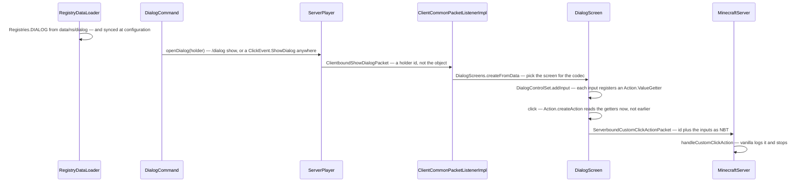
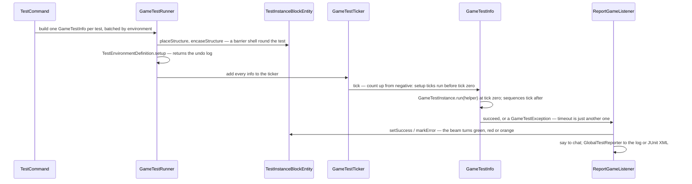

# Dialogs and game tests

> Verified against **Minecraft 26.2** · Part XIII · The same pattern applied twice: a data-pack registry whose element type dispatches through a codec registry, used once to put a form on a player's screen and once to run the game's own test suite.

## Responsibility

Two subsystems that share no class, no packet and no thread, and belong on
one page anyway — because they are the clearest two examples of a move
Mojang has been making everywhere: **take something that used to be Java
and make it a registry element loaded from a data pack.** A dialog used to
be a screen class; a game test used to be an annotated method. Both are now
JSON in `data/<ns>/…`, both are decoded by a `MapCodec` dispatched on a
built-in registry of *types*, and both are driven by one command gated on
`Commands.LEVEL_GAMEMASTERS`.

Learn the pattern once here and you will recognise it in
[loot tables](../items/loot-tables.md), [features](../worldgen/features-and-placement.md),
[density functions](../worldgen/density-functions.md) and half of Part XII.

The one sentence a player would recognise: *the server put a menu on my
screen that isn't part of Minecraft* — and, for the other half, *nothing,
because game tests are for the people who make the game.*

## The pattern, stated once

Both halves are built from the same four pieces:

1. A **data-pack registry** — `Registries.DIALOG`, `Registries.TEST_INSTANCE`
   — loaded by `RegistryDataLoader` from `data/<ns>/<registry path>/*.json`.
2. An **element type registry** in the jar —
   `BuiltInRegistries.DIALOG_TYPE`, `BuiltInRegistries.TEST_INSTANCE_TYPE` —
   holding one `MapCodec` per kind. The element's direct codec dispatches
   on it, so a data pack chooses the kind by a *type* field and the set of
   kinds is fixed by the jar.
3. A **holder on the wire**. Both registries (and
   `Registries.TEST_ENVIRONMENT`) are in
   `RegistryDataLoader.SYNCHRONIZED_REGISTRIES`, so a *playing* client
   already has every dialog and every test before either is named, and the
   packet carries a holder id rather than the object. In the configuration
   phase it does not, which is the whole reason the second codec below
   exists.
4. A **command** — `/dialog`, `/test` — at the same permission. `/dialog`'s
   argument type also accepts an inline literal, so an operator can write one
   without shipping a pack; `/test`'s does not, and takes registry ids and
   globs only.

Everything below is what each half does *with* that pattern.

## Dialogs: the data it owns

`net/minecraft/server/dialog` — thirty-one classes across four packages, all
in the server jar; the screens that render them are client-only, in
`net/minecraft/client/gui/screens/dialog`.

- **`Dialog`** — the registry element interface. `Dialog.DIRECT_CODEC`
  dispatches on `BuiltInRegistries.DIALOG_TYPE`; `Dialog.STREAM_CODEC` is
  the holder form and `Dialog.CONTEXT_FREE_STREAM_CODEC` the inline one that
  needs no registry access on the buffer (see the invariants).
- **`CommonDialogData`** — the record every dialog embeds: title, external
  title, whether escape closes it, whether it **pauses the game**, a
  `DialogAction` describing what happens after a button, the body elements
  and the inputs. Its `MapCodec` is where the pause validation lives.
- **`DialogAction`** — one of close, none or wait-for-response;
  `DialogAction.willUnpause` is what the validation checks
  against the pause flag.
- **The five kinds**, registered by `DialogTypes.bootstrap`: `NoticeDialog`
  and `ConfirmationDialog` (both `SimpleDialog`), and `MultiActionDialog`,
  `DialogListDialog` and `ServerLinksDialog` (all `ButtonListDialog`). Both
  of those supertypes are interfaces, not classes.
- **Body** (`server/dialog/body`) — `DialogBody` dispatching on
  `BuiltInRegistries.DIALOG_BODY_TYPE`, with `PlainMessage` and `ItemBody`.
- **Inputs** (`server/dialog/input`) — `InputControl` dispatching on
  `BuiltInRegistries.INPUT_CONTROL_TYPE`: `TextInput` (with
  `TextInput.MultilineOptions`), `SingleOptionInput`, `BooleanInput` and
  `NumberRangeInput`. An `Input` is a key plus a control, and the key must
  be a valid macro variable name — it is validated by `ParsedTemplate`
  against `StringTemplate.isValidVariableName`, which is the seam into
  [functions and macros](execution-and-functions.md).
- **Actions** (`server/dialog/action`) — `Action` produces an optional
  `ClickEvent` from the live input values, through `Action.ValueGetter`.
  `StaticAction` wraps a literal click event, `CommandTemplate` substitutes
  the inputs into a command through `ParsedTemplate`, and `CustomAll` packs
  every input value into an NBT compound. `ActionTypes` registers nine kinds
  — the seven click-event kinds a server is allowed to send, plus the two
  dynamic ones.
- **`ClickEvent`** — extended with `ClickEvent.ShowDialog` and
  `ClickEvent.Custom`. Any component whose click events are actually
  dispatched can therefore open a dialog, and there are three such places on
  the client: chat, a book, and any screen's own click handling. A sign is
  the fourth route and it is not a click dispatch at all — `SignBlockEntity`
  reads the event **server-side** and calls `ServerPlayer.openDialog`
  directly. An item's name or lore is tooltip text and dispatches nothing.
- **`ActionButton`** and **`CommonButtonData`** — label, tooltip, width.
- **`Dialogs`** and **`DialogTags`** (the latter in `net/minecraft/tags`) —
  the three built-in dialogs and the two tags
  (`DialogTags.PAUSE_SCREEN_ADDITIONS`, `DialogTags.QUICK_ACTIONS`) that let
  a data pack add buttons to the pause menu and to a hotkey.

Client side: `DialogScreens` maps the codec to a screen factory,
`DialogScreen` is the base, `DialogControlSet` owns the live value getters,
`DialogBodyHandlers` and `InputControlHandlers` are two more codec-to-factory
maps for the parts, `WaitingForResponseScreen` is the third dialog state, and
`DialogConnectionAccess` is the phase-specific way back to the server.

## Game tests: the data it owns

`net/minecraft/gametest/framework` — forty-four classes (forty-five files),
all server-side; `net/minecraft/gametest` adds the headless entry point.

- **`GameTestInstance`** — the registry element; `GameTestInstance.run`
  takes a `GameTestHelper` and is the body.
  `BlockBasedTestInstance` runs a test made purely of blocks;
  `FunctionGameTestInstance` invokes a `Registries.TEST_FUNCTION` entry.
- **`TestData`** — the declaration record every instance delegates to: the
  environment, the structure, the maximum and setup tick counts,
  required, rotation, manual-only, and the attempt and required-success
  counts (`RetryOptions`, and the retry loop is real —
  `ReportGameListener` counts attempts and successes and
  `GameTestRunner` re-queues a failure), sky access and padding.
- **`TestEnvironmentDefinition`** — seven kinds
  (`TestEnvironmentDefinition.AllOf`, `TestEnvironmentDefinition.ClockTime`,
  `TestEnvironmentDefinition.SetDifficulty`,
  `TestEnvironmentDefinition.Functions`,
  `TestEnvironmentDefinition.SetGameRules`,
  `TestEnvironmentDefinition.Timelines`, `TestEnvironmentDefinition.Weather`), and the interface's
  shape is an undo log: `TestEnvironmentDefinition.setup` returns a value
  that `TestEnvironmentDefinition.teardown` is handed back. Five of the seven
  return the *previous* state and restore it; `TestEnvironmentDefinition.Functions` returns nothing and
  runs a different data-pack function on the way out, and `AllOf` returns its
  children's activations and unwinds them in reverse.
- **`GameTestBatch`** and **`GameTestBatchFactory`** — a batch *is* an
  environment: `GameTestBatch` is keyed by the environment holder, tests are
  grouped by it, and each group is split into runs of fifty (a default the
  builder can change, not a cap).
- **`GameTestRunner`**, **`GameTestTicker`**, **`GameTestInfo`** — the
  runner owns the batches and the structure spawner; the ticker is a
  singleton the server ticks; a `GameTestInfo` is one *run* of one test,
  owning its position, its timeout, its sequences and its outcome.
  `StructureUtils` and `StructureGridSpawner` are the layer underneath:
  clearing the space, laying tests out in a grid, transforming the far
  corner, and finding every test block by position.
- **`GameTestSequence`** and **`GameTestEvent`** — the "do this, wait, then
  assert that" chain: `GameTestSequence.thenExecuteAfter`,
  `GameTestSequence.thenWaitUntil` and `GameTestSequence.thenSucceed`.
- **`GameTestHelper`** — 1,353 lines, and the whole surface a test body
  sees: coordinate translation between test-local and world space, world
  edits (`GameTestHelper.pressButton`, `GameTestHelper.pullLever`,
  `GameTestHelper.pulseRedstone`), spawning (`GameTestHelper.makeMockPlayer`,
  `GameTestHelper.spawnWithNoFreeWill`), assertions (`GameTestHelper.assertBlockPresent`,
  `GameTestHelper.assertContainerContains`, …) and outcomes.
- **The blocks**, which live in the world packages rather than here:
  `TestBlock` / `TestBlockEntity` with `TestBlockMode` — start, log, fail and
  accept — and `TestInstanceBlock` / `TestInstanceBlockEntity`, the block
  that owns a test's bounding box, status and beacon beam. The second is 551
  lines and does the real work: placing and saving the structure, building
  the barrier shell around it, force-loading the chunk, and carrying its own
  stream codec for the client's edit screen.
- **Reporting** — `GameTestListener`, `ReportGameListener` (which is what
  writes to chat), `MultipleTestTracker` (the progress bar, five states
  including a space for "not started"), `GlobalTestReporter`,
  `LogTestReporter` and `JUnitLikeTestReporter`.
- **`GameTestServer`** — a whole `MinecraftServer` subclass for headless
  runs, driven by `GameTestMainUtil` and `net/minecraft/gametest/Main`.
- **A client half the framework's package list hides:**
  `TestInstanceBlockEditScreen` and `TestBlockEditScreen` are how a test is
  authored in-game, `TestInstanceRenderer` draws the bounding box, and
  `GameTestBlockHighlightRenderer` is the sole consumer of
  `ClientboundGameTestHighlightPosPacket`. Both serverbound test packets are
  sent *by* the client.

## When each runs

**The dialog server side never ticks.** It is a packet send from whatever ran
the command or handled the click. The reply hops off the Netty thread onto
the server's `PacketProcessor` before `MinecraftServer.handleCustomClickAction`
sees it; on the client, `ClientCommonPacketListenerImpl.handleShowDialog`
hops to the client's processor before touching the screen stack. The client
half does tick, in one place: `WaitingForResponseScreen` counts ticks to
un-grey its escape button.

**Game tests tick on the server thread**, from
`MinecraftServer.tickChildren` in a profiler section named after the
subsystem — after connections and players and the debug subscribers, before
the server GUI refresh and chunk sending — and only when the tick-rate
manager reports the game running normally, so `/tick freeze` suspends them.
`GameTestServer.waitUntilNextTick` is overridden to drain tasks instead of
sleeping: the headless test server runs flat out, and installs a no-op
gizmo collector so debug drawing costs nothing
([what this book skips](../anatomy/what-this-book-skips.md)).

## The trace: a data pack's form, and a data pack's test

The dialog trace turns on one decision: **when are the input values read?**
Not at packet time and not at screen construction. `DialogControlSet` keeps
a map of live `Action.ValueGetter`s, and `Action.createAction` calls them at
the moment of the click — which is why the same `Action` object can produce
a different command each time and why `CommandTemplate` can be a template
rather than a string.

The test trace turns on **what a batch is**. Not a name, not a class: the
environment. `GameTestBatchFactory` groups by the `TestEnvironmentDefinition`
holder, because that is what a batch is keyed by; one environment is active
at a time on the runner, and moving between batches tears the old one down
and stands the new one up.

## Interfaces

- **Called by:** `/dialog` and `/test`; `ServerPlayer.openDialog` from a
  click event on a chat component, a book or a screen, and from
  `SignBlockEntity` server-side; the pause screen and a keybind, through the
  two dialog tags. And `DebugConfigCommand`, which is the only vanilla
  sender of a dialog in the configuration phase — behind
  `SharedConstants.DEBUG_DEV_COMMANDS` and dedicated-server-only.
- **Calls into:** for dialogs, the chat-command path and
  `MinecraftServer.handleCustomClickAction`, the single extension point —
  **vanilla only logs it**. For tests, the point-of-interest manager
  ([points of interest](../world/points-of-interest.md)), the structure
  template manager ([structures](../worldgen/structures.md)),
  `ServerFunctionManager` ([execution and functions](execution-and-functions.md))
  and `ServerLevel.setChunkForced`.
- **Crosses the network as:** `ClientboundShowDialogPacket`,
  `ClientboundClearDialogPacket` and `ServerboundCustomClickActionPacket`
  — all three registered in **both** the play and configuration protocols
  ([protocol phases](../networking/protocol-phases.md)), with the
  configuration registration using the context-free codec. For tests,
  `ClientboundGameTestHighlightPosPacket`,
  `ClientboundTestInstanceBlockStatus`, `ServerboundSetTestBlockPacket`
  and `ServerboundTestInstanceBlockActionPacket`, play phase only.
- **Data-driven by:** `data/<ns>/dialog/`, `data/<ns>/tags/dialog/`,
  `data/<ns>/test_instance/`, `data/<ns>/test_environment/`, and the test
  structures in `data/<ns>/structure/`. The *type* registries behind all of
  them are hard-coded in the jar.

## Invariants and surprises

- **A dialog can be shown during the configuration phase**, before the
  player has entered a world — and that is what the second stream codec is
  for. The configuration buffer is a plain byte buffer with no registry
  access, so the packet cannot carry a holder id and
  `Dialog.CONTEXT_FREE_STREAM_CODEC` sends the whole dialog inline. (What is
  "context-free" is the *buffer*, not the payload: actions and click events
  travel normally, and only a nested `ClickEvent.ShowDialog` cannot.) The
  configuration-phase `DialogConnectionAccess` refuses to run commands and
  logs a warning instead. A server really can put a form in front of you
  before you are in the world; vanilla only ever does it from a dev command.
- **Every dialog screen carries two escape hatches, and neither is
  optional.** `DialogScreen`'s initialisation is final: it always adds a
  warning button that opens a nested confirm screen offering to disconnect,
  and repositions it if a layout would push it off-screen. And an action
  that waits for a response swaps in `WaitingForResponseScreen`, which
  reveals a Back button after a second and enables it after five. A data
  pack cannot hide the exit.
- **A dialog button that runs a command is not simply a chat command.** It
  goes through `ClientPacketListener.sendUnattendedCommand`, which parses the
  string twice more and pops a confirmation screen if the command fails to
  parse, needs a signature, or needs a permission the client believes it
  lacks. The player is asked before an unattended command leaves the machine.
- **The set of dialog action types is derived from the click-event enum at
  class-init**, so every click-event kind a server is allowed to send is
  automatically a dialog action of the same name, and the one kind that is
  not allowed — opening a local file — can never be one.
- **Pausing is validated by the codec, wherever it decodes.** A dialog that
  pauses the game with an after-action that never unpauses is rejected,
  because it would strand the player in a paused world. Since the check sits
  on `CommonDialogData`'s codec rather than on the loader, it also runs on
  the *client* for a dialog sent inline in the configuration phase.
- **Vanilla does nothing with a custom click action.**
  `MinecraftServer.handleCustomClickAction` is one line, logging at debug.
  The entire custom-action mechanism exists for data packs and server
  software to build on; the game itself only defines the transport — and
  defends it with a 32 KB NBT accounter and a 64 KB frame cap.
- **The game-test annotations are gone.** There is no *GameTest* annotation
  and no test registry class. A test is a registry element and the Java body
  is a value in a second registry, `Registries.TEST_FUNCTION`, populated by
  `TestFunctionLoader`. The Java half is a payload the JSON points at.
- **The shipped jar contains one test and one environment.**
  `GameTestInstances` declares a single always-pass instance,
  `BuiltinTestFunctions` its body, and `GameTestEnvironments` a default that
  is an empty `TestEnvironmentDefinition.AllOf`. The real suite lives in
  Mojang's test sources, not in the game.
- **A test can be written with no Java at all.** `BlockBasedTestInstance`
  runs a test built from `TestBlock`s inside the structure: exactly one start
  block emits redstone, an accept block being triggered is a pass, a fail
  block is a failure with its stored message. That is a unit test authored
  in-game and shipped as a structure plus a JSON.
- **Test instance blocks are points of interest.** Locating every test in a
  250-block radius is a POI query, not a block scan — which is what makes
  `/test`'s radius subcommands cheap.
- **Setup ticks run before tick zero.** `GameTestInfo` starts its counter
  *negative* by the setup ticks, so the test body runs when the count
  reaches zero. And `GameTestSequence` uses an exception as ordinary control
  flow — at most one thrown and swallowed per sequence per tick, and only an
  assertion failure; a timeout is not caught there.
- **`/test` exists on every server**, not just in a development
  environment; only the export subcommands are gated on running from an
  IDE.

## Where to look

`Dialog` and `CommonDialogData`, then `Action` — the value-getter
indirection is the only subtle thing in that half. For tests,
`GameTestInstance` and `TestData` for what a test *is*, then `GameTestInfo`
for what actually happens, then `TestInstanceBlockEntity` for what a test
costs the world, and `GameTestHelper` when you want to write one.

---

*Rules: names, never code · how the system works, not how the code reads ·
newest version only · every backticked name passes `tools/verify_names.py`.*
