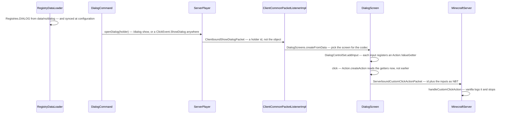

# Dialogs and game tests

> Verified against **Minecraft 26.2** · Part XIII · The same pattern applied twice: a data-pack registry whose element type dispatches through a codec registry, used once to put a form on a player's screen and once to run the game's own test suite.

## Responsibility

Two subsystems that share no class, no packet and no thread, and belong on
one page anyway — because they are the clearest two examples of a move
Mojang has been making everywhere: **take something that used to be Java
and make it a registry element loaded from a data pack.** A dialog used to
be a screen class; a game test used to be an annotated method. Both are now
JSON in `data/<ns>/…`, both are decoded by a `MapCodec` dispatched on a
built-in registry of *types*, and both are driven by one gamemaster-level
command.

Learn the pattern once here and you will recognise it in
[loot tables](../items/loot-tables.md), [features](../worldgen/features-and-placement.md),
[density functions](../worldgen/density-functions.md) and half of Part XII.

The one sentence a player would recognise: *the server put a menu on my
screen that isn't part of Minecraft* — and, for the other half, *nothing,
because game tests are for the people who make the game.*

## The pattern, stated once

Both halves are built from the same four pieces:

1. A **data-pack registry** — `Registries.DIALOG`, `Registries.TEST_INSTANCE`
   — loaded by `RegistryDataLoader` from `data/<ns>/<registry path>/*.json`.
2. An **element type registry** in the jar —
   `BuiltInRegistries.DIALOG_TYPE`, `BuiltInRegistries.TEST_INSTANCE_TYPE` —
   holding one `MapCodec` per kind. The element's direct codec dispatches
   on it, so a data pack chooses the kind by a *type* field and the set of
   kinds is fixed by the jar.
3. A **holder on the wire**. Both registries are in
   `RegistryDataLoader.SYNCHRONIZED_REGISTRIES`, so the client already has
   every dialog and every test before either is named. The packet usually
   carries a holder id, not the object.
4. A **command** at `Commands.LEVEL_GAMEMASTERS` — `/dialog`, `/test` —
   whose argument type also accepts an inline literal, so an operator can
   write one without shipping a pack.

Everything below is what each half does *with* that pattern.

## Dialogs: the data it owns

`net/minecraft/server/dialog` — thirty-five classes, all in the server jar;
the screens that render them are client-only, in
`net/minecraft/client/gui/screens/dialog`.

- **`Dialog`** — the registry element interface. `Dialog.DIRECT_CODEC`
  dispatches on `BuiltInRegistries.DIALOG_TYPE`; `Dialog.STREAM_CODEC` is
  the holder form and `Dialog.CONTEXT_FREE_STREAM_CODEC` the inline-only
  one (see the invariants).
- **`CommonDialogData`** — the record every dialog embeds: title, external
  title, whether escape closes it, whether it **pauses the game**, a
  `DialogAction` describing what happens after a button, the body elements
  and the inputs.
- **`DialogAction`** — one of close, none or wait-for-response;
  `DialogAction.willUnpause` is what the load-time validation checks
  against the pause flag.
- **The five kinds**, registered by `DialogTypes.bootstrap`: `NoticeDialog`
  and `ConfirmationDialog` (both `SimpleDialog`), and `MultiActionDialog`,
  `DialogListDialog` and `ServerLinksDialog` (all `ButtonListDialog`).
- **Body** (`server/dialog/body`) — `DialogBody` dispatching on
  `BuiltInRegistries.DIALOG_BODY_TYPE`, with `PlainMessage` and `ItemBody`.
- **Inputs** (`server/dialog/input`) — `InputControl` dispatching on
  `BuiltInRegistries.INPUT_CONTROL_TYPE`: `TextInput` (with
  `TextInput.MultilineOptions`), `SingleOptionInput`, `BooleanInput` and
  `NumberRangeInput`. An `Input` is a key plus a control, and the key must
  be a valid `StringTemplate` variable name — which is the seam into
  [functions and macros](execution-and-functions.md).
- **Actions** (`server/dialog/action`) — `Action` produces an optional
  `ClickEvent` from the live input values, through `Action.ValueGetter`.
  `StaticAction` wraps a literal click event, `CommandTemplate` substitutes
  the inputs into a command through `ParsedTemplate`, and `CustomAll` packs
  every input value into an NBT compound.
- **`ClickEvent`** — extended with `ClickEvent.ShowDialog` and
  `ClickEvent.Custom`, which is why *any* text component anywhere — chat, a
  book, a sign, an item name — can open a dialog.
- **`ActionButton`** and **`CommonButtonData`** — label, tooltip, width.
- **`Dialogs`** and **`DialogTags`** — the three built-in dialogs and the
  two tags (`DialogTags.PAUSE_SCREEN_ADDITIONS`, `DialogTags.QUICK_ACTIONS`)
  that let a data pack add buttons to the pause menu and to a hotkey.

Client side: `DialogScreens` maps the codec to a screen factory,
`DialogScreen` is the base, `DialogControlSet` owns the live value getters,
and `DialogConnectionAccess` is the phase-specific way back to the server.

## Game tests: the data it owns

`net/minecraft/gametest/framework` — forty-seven classes, all server-side.

- **`GameTestInstance`** — the registry element; `GameTestInstance.run`
  takes a `GameTestHelper` and is the body.
  `BlockBasedTestInstance` runs a test made purely of blocks;
  `FunctionGameTestInstance` invokes a `Registries.TEST_FUNCTION` entry.
- **`TestData`** — the declaration record every instance delegates to: the
  environment, the structure, the maximum and setup tick counts,
  required, rotation, manual-only, and the attempt and required-success
  counts (flaky-test support), sky access and padding.
- **`TestEnvironmentDefinition`** — `TestEnvironmentDefinition.setup`
  returns the *previous* value and `TestEnvironmentDefinition.teardown`
  restores it: a type-parameterised undo log. Kinds include
  `TestEnvironmentDefinition.SetGameRules`,
  `TestEnvironmentDefinition.Weather`, `TestEnvironmentDefinition.Functions`
  and `TestEnvironmentDefinition.AllOf` — difficulty, clock time and
  timelines have their own kinds too.
- **`GameTestBatch`** and **`GameTestBatchFactory`** — a batch *is* an
  environment: tests are grouped by the environment holder they declare,
  then split at `GameTestBatchFactory.MAX_TESTS_PER_BATCH`.
- **`GameTestRunner`**, **`GameTestTicker`**, **`GameTestInfo`** — the
  runner owns the batches and the structure spawner; the ticker is a
  singleton the server ticks; a `GameTestInfo` is one *run* of one test,
  owning its position, its timeout, its sequences and its outcome.
- **`GameTestSequence`** and **`GameTestEvent`** — the "do this, wait, then
  assert that" chain: `GameTestSequence.thenExecuteAfter`,
  `GameTestSequence.thenWaitUntil` and `GameTestSequence.thenSucceed`.
- **`GameTestHelper`** — the whole surface a test body sees: coordinate
  translation between test-local and world space, world edits
  (`GameTestHelper.pressButton`, `GameTestHelper.pullLever`,
  `GameTestHelper.pulseRedstone`), spawning (`GameTestHelper.makeMockPlayer`,
  `GameTestHelper.spawnWithNoFreeWill`), assertions (`GameTestHelper.assertBlockPresent`,
  `GameTestHelper.assertContainerContains`, …) and outcomes.
- **`TestBlock`** / **`TestBlockEntity`** with `TestBlockMode` —
  start, log, fail and accept. **`TestInstanceBlock`** /
  **`TestInstanceBlockEntity`** — the block that owns a test's bounding
  box, status and beacon beam.
- **Reporting** — `GameTestListener`, `ReportGameListener`,
  `MultipleTestTracker` (the `[+_xX]` progress bar),
  `GlobalTestReporter`, `LogTestReporter` and `JUnitLikeTestReporter`.
- **`GameTestServer`** — a whole `MinecraftServer` subclass for headless
  runs, driven by `GameTestMainUtil` and `net/minecraft/gametest/Main`.

## When each runs

**Dialogs never tick.** The server side is a packet send from whatever ran
the command or handled the click. The reply hops off the Netty thread onto
the server's `PacketProcessor` before `MinecraftServer.handleCustomClickAction`
sees it; on the client, `ClientCommonPacketListenerImpl.handleShowDialog`
hops to the client's processor before touching the screen stack.

**Game tests tick on the server thread**, from `MinecraftServer.tickServer`
in a profiler section named after the subsystem — after connections and
players, before chunk sending — and only when the tick-rate manager reports the game running normally, so `/tick freeze` suspends them.
`GameTestServer.waitUntilNextTick` is overridden to drain tasks instead of
sleeping: the headless test server runs flat out.

## The trace: a data pack's form, and a data pack's test



```mermaid
sequenceDiagram
    participant TC as TestCommand
    participant GR as GameTestRunner
    participant TIB as TestInstanceBlockEntity
    participant GT as GameTestTicker
    participant GI as GameTestInfo
    participant RL as ReportGameListener

    TC->>GR: build one GameTestInfo per test, batched by environment
    GR->>TIB: placeStructure, encaseStructure — a barrier shell round the test
    GR->>GR: TestEnvironmentDefinition.activate — returns the undo log
    GR->>GT: add every info to the ticker
    GT->>GI: tick — count up from negative: setup ticks run before tick zero
    GI->>GI: GameTestInstance.run(helper) at tick zero; sequences tick after
    GI->>RL: succeed, or a GameTestException — timeout is just another one
    RL->>TIB: setSuccess / markError — the beam turns green, red or orange
    RL->>RL: GlobalTestReporter — chat, log, or JUnit XML
```

The dialog trace turns on one decision: **when are the input values read?**
Not at packet time and not at screen construction. `DialogControlSet` keeps
a map of live `Action.ValueGetter`s, and `Action.createAction` calls them at
the moment of the click — which is why the same `Action` object can produce
a different command each time and why `CommandTemplate` can be a template
rather than a string.

The test trace turns on **what a batch is**. Not a name, not a class: the
environment. `GameTestBatchFactory` groups by the `TestEnvironmentDefinition`
holder, because the environment is applied once per batch and undone in
reverse, and applying it per test would be the expensive part.

## Interfaces

- **Called by:** `/dialog` and `/test`; `ServerPlayer.openDialog` from a
  click event on any component, including a sign; `ClickEvent.ShowDialog`
  and `ClickEvent.Custom` from anywhere a component is rendered; the pause
  screen and a keybind, through the two dialog tags.
- **Calls into:** for dialogs, the chat-command path (a dialog button that
  runs a command is a normal chat command) and
  `MinecraftServer.handleCustomClickAction`, the single extension point —
  **vanilla only logs it**. For tests, the point-of-interest manager
  ([game events and POI](../world/game-events-and-poi.md)), the structure
  template manager ([structures](../worldgen/structures.md)),
  `ServerFunctionManager` ([execution and functions](execution-and-functions.md))
  and `ServerLevel.setChunkForced`.
- **Crosses the network as:** `ClientboundShowDialogPacket`,
  `ClientboundClearDialogPacket` and `ServerboundCustomClickActionPacket`
  — all three registered in **both** the play and configuration protocols
  ([protocol phases](../networking/protocol-phases.md)). For tests,
  `ClientboundGameTestHighlightPosPacket`,
  `ClientboundTestInstanceBlockStatus`, `ServerboundSetTestBlockPacket`
  and `ServerboundTestInstanceBlockActionPacket`, play phase only.
- **Data-driven by:** `data/<ns>/dialog/`, `data/<ns>/tags/dialog/`,
  `data/<ns>/test_instance/`, `data/<ns>/test_environment/`, and the test
  structures in `data/<ns>/structure/`. The *type* registries behind all of
  them are hard-coded in the jar.

## Invariants and surprises

- **A dialog can be shown during the configuration phase**, before the
  player has entered a world. Because the configuration buffer has no
  registry access, that path uses
  `ClickEvent`-free `Dialog.CONTEXT_FREE_STREAM_CODEC` and must send the
  whole dialog inline; and the configuration-phase
  `DialogConnectionAccess` refuses to run commands. A server can put a form
  in front of you before you are in the world.
- **Every dialog screen carries a mandatory escape hatch.**
  `DialogScreen` adds a warning button that opens a nested confirm screen
  offering to disconnect, and repositions it if a layout would push it
  off-screen. A data pack cannot hide the exit.
- **The set of dialog action types is derived from the click-event enum at
  class-init**, so every click-event kind that is allowed from a server is
  automatically a dialog action of the same name, and the one kind that is
  not allowed can never be one.
- **Pausing is validated against the after-action at load time.** A dialog
  that pauses the game with an after-action that never unpauses is rejected
  by the codec, because it would strand the player in a paused world.
- **Vanilla does nothing with a custom click action.**
  `MinecraftServer.handleCustomClickAction` logs at debug. The entire
  custom-action mechanism exists for data packs and server software to
  build on; the game itself only defines the transport.
- **The game-test annotations are gone.** There is no `@GameTest` and no
  test registry class. A test is a registry element and the Java body is a
  value in a second registry, populated by `TestFunctionLoader`. The Java
  half is a payload the JSON points at.
- **A test can be written with no Java at all.** `BlockBasedTestInstance`
  runs a test built from `TestBlock`s inside the structure: a start block
  emits redstone, an accept block being triggered is a pass, a fail block
  is a failure with its stored message. That is a unit test authored
  in-game and shipped as a structure plus a JSON.
- **Test instance blocks are points of interest.** Locating every test in a
  250-block radius is a POI query, not a block scan — which is what makes
  `/test`'s radius subcommands cheap.
- **Setup ticks run before tick zero.** `GameTestInfo` starts its counter
  *negative* by the setup ticks, so the test body runs when the count
  reaches zero. And `GameTestSequence` uses an exception as ordinary
  control flow — one thrown and swallowed per pending step per tick.
- **`/test` exists on every server**, not just in a development
  environment; only the export subcommands are gated on running from an
  IDE.

## Where to look

`Dialog` and `CommonDialogData`, then `Action` — the value-getter
indirection is the only subtle thing in that half. For tests,
`GameTestInstance` and `TestData` for what a test *is*, then `GameTestInfo`
for what actually happens, then `GameTestHelper` when you want to write
one.

---

*Rules: names, never code · how the system works, not how the code reads ·
newest version only · every backticked name passes `tools/verify_names.py`.*
