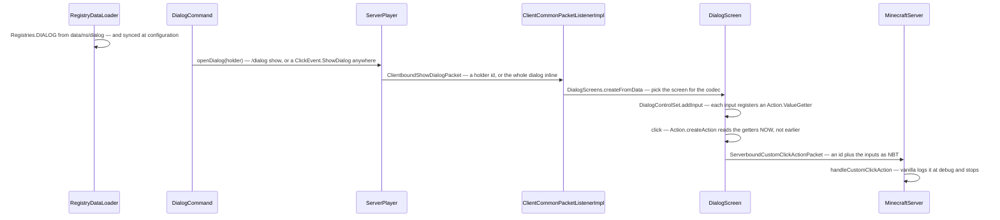

# Dialogs

> Verified against **Minecraft 26.2** · Part XIII · You click a server in the multiplayer list and, before the world has loaded — before you are in a world at all — a form appears with text boxes on it, and it is not part of Minecraft.

A dialog is a data pack's form: a title, some body text, some inputs and
some buttons, decoded from JSON and put on your screen. Nothing about that
is surprising until you notice which protocol phase it works in.
`ClientboundShowDialogPacket` is registered in **both** the play and the
configuration protocols ([protocol phases](../networking/protocol-phases.md)),
so a server can interrupt the join handshake to ask you something. Vanilla
only ever does it from a dev-flag-gated command — but the machinery is
there, complete, in the shipped jar.

And the reason it works there is not a special case bolted on; it is a
second codec, and it explains itself. The configuration buffer is a plain
byte buffer with **no registry access**, so the packet cannot carry a holder
id. `Dialog.CONTEXT_FREE_STREAM_CODEC` therefore sends the whole dialog
inline. What is "context-free" is the *buffer*, not the payload.

A dialog is also one of the two clearest instances of a move Mojang has been
making everywhere — take something that used to be a Java class and make it
a registry element loaded from a data pack. That argument is made once, for
all its instances, in
[the data-driven type pattern](../foundations/data-driven-types.md); this
page assumes it. Six of the pattern's registries are dialog registries.

## The cast

| class | what it decides | side |
|---|---|---|
| `Dialog` | the registry element. `Dialog.DIRECT_CODEC` dispatches on `BuiltInRegistries.DIALOG_TYPE`; there are two stream codecs, and which one is used decides the whole page | server |
| `CommonDialogData` | what every dialog embeds: titles, whether escape closes it, whether it **pauses the game**, the after-action, the body elements and the inputs. Its `MapCodec` is where the pause validation lives | server |
| `DialogAction` | close, none, or wait-for-response — and `DialogAction.willUnpause` is what that validation tests | server |
| `InputControl` | `TextInput`, `SingleOptionInput`, `BooleanInput`, `NumberRangeInput`. An `Input` is a key plus a control, and the key must be a valid **macro** variable name | server |
| `Action` | produces an optional `ClickEvent` from the *live* input values, through `Action.ValueGetter` | server |
| `ClickEvent` | extended with `ClickEvent.ShowDialog` and `ClickEvent.Custom`, which is how anything clickable can open a dialog | both |
| `DialogScreens` | the codec-to-screen-factory map, with `DialogScreen` as the base and `DialogControlSet` owning the live getters | client |
| `DialogConnectionAccess` | the phase-specific way back to the server — and the configuration-phase one refuses to run commands | client |

`net/minecraft/server/dialog` is thirty-one classes across four packages,
all in the server jar; the screens that render them are client-only in
`net/minecraft/client/gui/screens/dialog`. The five kinds
`DialogTypes.bootstrap` registers are `NoticeDialog` and `ConfirmationDialog`
(both `SimpleDialog`) and `MultiActionDialog`, `DialogListDialog` and
`ServerLinksDialog` (all `ButtonListDialog`) — and both of those supertypes
are interfaces, not classes.

## The trace: a data pack puts a form on the screen

The trace turns on one decision: **when are the input values read?** Not at
packet time and not at screen construction. `DialogControlSet` keeps a map
of live `Action.ValueGetter`s and `Action.createAction` calls them at the
moment of the click — which is why the same `Action` object produces a
different command each time, and why `CommandTemplate` can be a template
rather than a string. `ActionTypes` registers nine kinds: the seven
click-event kinds a server is allowed to send, plus `CommandTemplate` and
`CustomAll`, which packs every input value into an NBT compound.

That set of nine is derived from the click-event enum **at class-init**, so
every click-event kind a server may send is automatically a dialog action of
the same name — and the one kind that is not allowed, opening a local file,
can never be one.

Nothing on the server side of this ever ticks. A dialog is a packet send
from whatever ran the command or handled the click; the reply hops off the
Netty thread onto the server's `PacketProcessor` before
`MinecraftServer.handleCustomClickAction` sees it, and on the client
`ClientCommonPacketListenerImpl.handleShowDialog` hops to the client's
processor before touching the screen stack. Exactly one thing in this system
ticks: `WaitingForResponseScreen`, counting ticks to un-grey its escape
button.

## Four ways a dialog opens, and one of them is not a click

`ServerPlayer.openDialog` is the server-side entry point, and `/dialog show`
is the obvious caller. The interesting ones are the click events, because
"a component with a click event" is not the same as "a component whose click
events are dispatched". There are three places on the client where they
actually are — chat, a book, and any screen's own click handling — and one
route that is not a click dispatch at all: `SignBlockEntity` reads the event
**server-side** and calls `ServerPlayer.openDialog` directly. An item's name
or lore is tooltip text and dispatches nothing.

Two tags round it out. `DialogTags.PAUSE_SCREEN_ADDITIONS` and
`DialogTags.QUICK_ACTIONS` let a data pack add buttons to the pause menu and
to a hotkey, so a dialog need not be pushed by the server at all — and
`Dialogs` holds the three the jar ships. Closing one from the server is
`ClientboundClearDialogPacket`, registered in both phases like the other
two.

Inside a dialog, the parts dispatch on registries of their own the same way
the dialog does: `DialogBody` over `BuiltInRegistries.DIALOG_BODY_TYPE`
(`PlainMessage` and `ItemBody`), `InputControl` over
`BuiltInRegistries.INPUT_CONTROL_TYPE`, and `ActionButton` carrying a
`CommonButtonData` of label, tooltip and width. `DialogBodyHandlers` and
`InputControlHandlers` are the client-side factory maps that mirror them.
An input's key is validated by `ParsedTemplate` against
`StringTemplate.isValidVariableName` — the same rule a macro function's
parameters obey, which is the seam into
[functions and macros](functions-and-macros.md), and why `CommandTemplate`
can substitute a dialog's inputs into a command at all.

## What a data pack cannot do

Three defences are built into the model rather than into any particular
dialog, and each one exists because the feature would otherwise be a way to
trap a player.

**The exit is not optional.** `DialogScreen`'s initialisation is final: it
*always* adds a warning button that opens a nested confirm screen offering
to disconnect, and repositions it if a layout would push it off-screen. An
action that waits for a response swaps in `WaitingForResponseScreen`, which
reveals a Back button after a second and enables it after five.

**Pausing is validated by the codec, wherever it decodes.** A dialog that
pauses the game with an after-action that never unpauses is rejected,
because it would strand the player in a paused world. The check sits on
`CommonDialogData`'s codec rather than on the loader — so for a dialog sent
inline in the configuration phase it runs on the **client**.

**A button that runs a command is not simply a chat command.** It goes
through `ClientPacketListener.sendUnattendedCommand`, which parses the string
twice more and pops a confirmation screen if the command fails to parse,
needs a signature, or needs a permission the client believes it lacks
([permissions](permissions.md)). The player is asked before an unattended
command leaves the machine. And the configuration-phase
`DialogConnectionAccess` refuses to run commands at all, logging a warning
instead.

## The extension point vanilla does not use

`MinecraftServer.handleCustomClickAction` is one line, logging at debug.
The entire custom-action mechanism — an arbitrary id plus an arbitrary NBT
payload, sent by a screen the server described — exists for data packs and
server software to build on. The game itself only defines the transport, and
defends it with a 32 KB NBT accounter and a 64 KB frame cap.

The same is true one level up: the only vanilla sender of a
configuration-phase dialog is `DebugConfigCommand`, which is gated on
`SharedConstants.DEBUG_DEV_COMMANDS` **and** dedicated-server-only. A server
really can put a form in front of you before you are in the world. Vanilla
never does.

## Where to look

`Dialog` and `CommonDialogData` for the model, then `Action` — the
value-getter indirection is the only subtle thing in the whole system.
`DialogScreens` for how a codec becomes a screen, and
`MinecraftServer.handleCustomClickAction` for the one line that is the
extension point.

---

*Rules: names, never code · how the system works, not how the code reads ·
newest version only · every backticked name passes `tools/verify_names.py`.*
