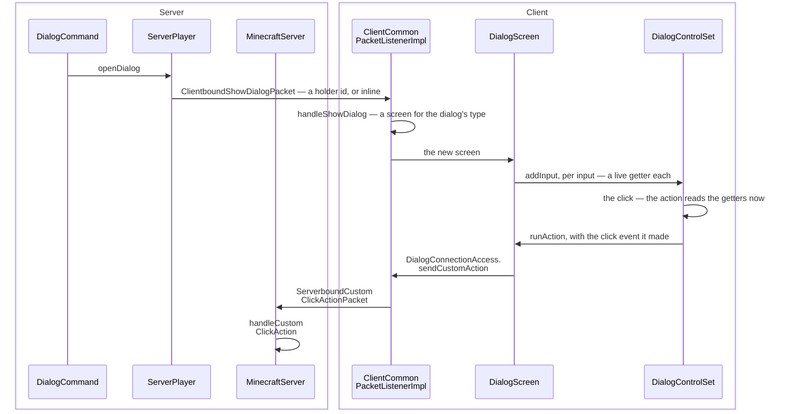

# Dialogs

> Verified against **Minecraft 26.3** · Part XIII · You click a server in the multiplayer list and, before the world has loaded — before you are in a world at all — a form appears with text boxes on it, and a vanilla server sends one only from a command it registers behind debug flags.

A dialog is a data pack's form: a title, some body text, some inputs and
some buttons, decoded from JSON and put on your screen. Nothing about that
is surprising until you notice which protocol phase it works in.
`ClientboundShowDialogPacket` is registered in **both** the play and the
configuration protocols, with a different codec in each, so a server can
interrupt the join handshake to ask you something — configuration being the
phase a joining client is parked in, and the one a play session can be sent
back to ([protocol
phases](../networking/protocol-phases.md#configuration)). Vanilla
only ever does it from a dev-flag-gated command — but the machinery is
there, complete, in the shipped jar.

And the reason it works there is not a special case bolted on; it is a
second codec, and it explains itself. The configuration buffer is a plain
byte buffer with **no registry access** ([packets and stream
codecs](../networking/packets-and-stream-codecs.md#which-buffer-and-why-play-needs-its-own)),
so the packet cannot carry a holder id. `Dialog.CONTEXT_FREE_STREAM_CODEC` therefore sends the whole dialog
inline. The dialog is encoded with no registry access at all, so a dialog it refers to goes inline too, and an element that can only be named by id — an enchantment on an item body's item, say — cannot be sent at all.

A dialog is also one of this part's two clearest instances of a pattern found across the game — [game tests](game-tests.md) is the other — a thing made a registry element loaded from a data pack rather than a Java class. That argument is made once, for
all its instances, in
[the data-driven type pattern](../foundations/data-driven-types.md); this
page assumes it. Four of the pattern's registries are dialog
registries: `BuiltInRegistries.DIALOG_TYPE` for the dialog itself, and
`BuiltInRegistries.DIALOG_BODY_TYPE`,
`BuiltInRegistries.INPUT_CONTROL_TYPE` and
`BuiltInRegistries.DIALOG_ACTION_TYPE` for the three kinds of part inside
it.

## The cast

| class | what it decides | side |
|---|---|---|
| `Dialog` | the registry element. `Dialog.DIRECT_CODEC` dispatches on `BuiltInRegistries.DIALOG_TYPE`; there are two stream codecs, and which one is used decides the whole page | both |
| `CommonDialogData` | what every dialog embeds: titles, whether escape closes it, whether it **pauses the game**, the after-action, the body elements and the inputs. Its `MapCodec` is where the pause validation lives | both |
| `DialogAction` | close, none, or wait-for-response — and `DialogAction.willUnpause` is what that validation tests | both |
| `InputControl` | `TextInput`, `SingleOptionInput`, `BooleanInput`, `NumberRangeInput`. An `Input` is a key plus a control, and the key must be a valid **macro** variable name | both |
| `Action` | produces an optional `ClickEvent` from the *live* input values, through `Action.ValueGetter` | client |
| `ClickEvent` | extended with `ClickEvent.ShowDialog`, which is how a chat message, a book, a dialog or a sign can open a dialog, and `ClickEvent.Custom`, which carries a custom action | both |
| `DialogScreens` | the codec-to-screen-factory map, with `DialogScreen` as the base and `DialogControlSet` owning the live getters | client |
| `DialogConnectionAccess` | the phase-specific way back to the server — and the configuration-phase one refuses to run commands | client |

`net/minecraft/server/dialog` spans four packages, all in the server jar; the screens that render them are client-only in `net/minecraft/client/gui/screens/dialog` — `SimpleDialogScreen` for both simple kinds, and `MultiButtonDialogScreen`, `DialogListDialogScreen` and `ServerLinksDialogScreen` over an abstract `ButtonListDialogScreen` — which is the same
one-more-screen pattern [GUI and
screens](../client/gui-and-screens.md) covers everywhere else. The five kinds
`DialogTypes.bootstrap` registers are `NoticeDialog` and `ConfirmationDialog`
(both `SimpleDialog`) and `MultiActionDialog`, `DialogListDialog` and
`ServerLinksDialog` (all `ButtonListDialog`) — and both of those supertypes
are interfaces, not classes.

## From a JSON file to a click the server reads

```mermaid
sequenceDiagram
    box Server
    participant DlgC as DialogCommand
    participant SP as ServerPlayer
    participant MS as MinecraftServer
    end
    box Client
    participant CComPL as ClientCommon<br/>PacketListenerImpl
    participant DlgS as DialogScreen
    participant DCS as DialogControlSet
    end

    DlgC->>SP: openDialog
    SP->>CComPL: ClientboundShowDialogPacket — a holder id, or inline
    CComPL->>CComPL: handleShowDialog — a screen for the dialog's type
    CComPL->>DlgS: the new screen
    DlgS->>DCS: addInput, per input — a live getter each
    DCS->>DCS: the click — the action reads the getters now
    DCS->>DlgS: runAction, with the click event it made
    DlgS->>CComPL: DialogConnectionAccess.<br/>sendCustomAction
    CComPL->>MS: ServerboundCustom<br/>ClickActionPacket
    MS->>MS: handleCustom<br/>ClickAction
```

*One `/dialog show` and one click on a custom button — the input values are read at the click, by the control set that has held a live getter for each input since the screen was built, and the packet that carries them back reaches a handler that, in vanilla, writes a debug log line and nothing else.*

The trace turns on one decision: **when are the input values read?** Not at
packet time and not at screen construction. `DialogControlSet.addInput`
registers a live `Action.ValueGetter` for each input as the screen is built,
and `Action.createAction` calls them at the
moment of the click — which is why the same `Action` object produces a
different command each time, and why `CommandTemplate` can be a template
rather than a string. The button hands the click event it made to
`DialogScreen.runAction`, and a custom one leaves through
`DialogConnectionAccess.sendCustomAction`, the phase's way back to the
server. `ActionTypes` registers nine kinds. Seven are
generated in a loop over the click-event kinds a server is allowed to send,
each keeping that kind's own name, so a click-event kind is automatically a
dialog action — and the one kind that is not allowed, opening a local file,
can never be one. The other two are registered by hand under names of their
own: `CommandTemplate` as *dynamic/run_command*, and `CustomAll` as
*dynamic/custom*, which packs every input value into an NBT compound.

The packet on the way out is the play-phase form, which names a
registered dialog by its holder id and sends an unregistered one inline; in
the configuration phase the same packet is always inline, for the reason at
the top of this page.

Nothing on the server side of this ever ticks. A dialog is a packet send
from whatever ran the command or handled the click; the reply hops off the
Netty thread onto the server's `PacketProcessor` before
`MinecraftServer.handleCustomClickAction` sees it, and on the client
`ClientCommonPacketListenerImpl.handleShowDialog` hops to the client's
processor before touching the screen stack. Exactly one thing in this system
ticks: `WaitingForResponseScreen`, counting ticks to reveal and then enable
its Back button.

## Four ways a dialog opens, and two of them never ask the server

Four things open a dialog in play; the configuration-phase sender, `DebugConfigCommand`, sends its packet itself (below). Two of the four go through `ServerPlayer.openDialog`, the server-side entry point, and the other two open it on the client with no packet at all.

**`/dialog show`** is the obvious one. **A click event dispatched on the
client** is the interesting one, because "a component with a click event" is
not the same as "a component whose click events are dispatched": there are exactly three places on the client where a *show dialog* event actually is — chat, a book, and `DialogScreen` itself, which dispatches its own buttons and body text.
An item's name or lore is tooltip text and dispatches nothing.

**A sign** is clicked, but its click event is never dispatched on the client. `SignBlockEntity`
reads the event **server-side** and calls `ServerPlayer.openDialog`
directly — the same way it runs a *run command* event, and the reason a sign
is the one clickable thing the client never gets to vet
([permissions](permissions.md#asking-a-question-the-client-cannot-answer)).

**A tag** is the fourth, and it needs no server at all in the moment.
`DialogTags.PAUSE_SCREEN_ADDITIONS` and `DialogTags.QUICK_ACTIONS` let a data pack put dialogs behind a pause-menu button and behind a hotkey (with the shipped tags empty, that button opens the server's links, when it sent any), and `Dialogs` holds the
three the jar ships. Closing one from the server is
`ClientboundClearDialogPacket`, and it is registered in both phases, as the two packets already on this page are —
`ClientboundShowDialogPacket` going out and
`ServerboundCustomClickActionPacket` coming back. Three packets, both
protocols, one system.

## What a dialog is made of

Inside a dialog, the parts dispatch on registries of their own the same way
the dialog does: `DialogBody` over `BuiltInRegistries.DIALOG_BODY_TYPE`
(`PlainMessage` and `ItemBody`), `InputControl` over
`BuiltInRegistries.INPUT_CONTROL_TYPE`, and `ActionButton` carrying a
`CommonButtonData` of label, tooltip and width. `DialogBodyTypes`,
`InputControlTypes` and `ActionTypes` are the three bootstraps that fill them
in code, `StaticAction` is the plain "do this fixed click event" action, and
`DialogCommand` is `/dialog` itself. `DialogBodyHandlers` and
`InputControlHandlers` are the client-side factory maps that mirror them.

One of those parts reaches outside the system. An input's key is validated
by `ParsedTemplate` against `StringTemplate.isValidVariableName` — the same
rule a macro function's parameters obey — which is why every input can be named in a `CommandTemplate`, and the seam into
[functions and macros](functions-and-macros.md).

## What a data pack cannot do

Three defences are built into the model rather than into any particular
dialog, and each one exists because the feature would otherwise be a way to
trap a player.

**The exit is not optional.** `DialogScreen`'s initialisation is final: it
*always* adds a warning button that opens a nested confirm screen offering
to disconnect, and repositions it if a layout would push it off-screen. A dialog whose after-action waits for a response swaps in `WaitingForResponseScreen`, which
reveals a Back button after a second and enables it after five.

**Pausing is validated by the codec, wherever it decodes.** A dialog that
pauses the game with an after-action that never unpauses is rejected,
because it would strand the player in a paused world. The check sits on
`CommonDialogData`'s codec rather than on the loader, and `MapCodec.validate` is
applied to both directions of the codec — so it runs on the server as it
encodes *and* on the client as it decodes, which is what covers a dialog sent
inline in the configuration phase.

**A button that runs a command is not simply a chat command.** It goes
through `ClientPacketListener.sendUnattendedCommand`, which parses it up to twice and, on three of its four outcomes, shows you a confirmation screen before
sending anything ([permissions](permissions.md#asking-a-question-the-client-cannot-answer)
owns the four outcomes). What is this system's own is the phase: the
configuration-phase `DialogConnectionAccess` refuses to run a command at all,
logging a warning instead, so a button on a dialog shown before you are in a
world can do everything except that.

## The extension point vanilla does not use

`MinecraftServer.handleCustomClickAction` is one line, logging at debug.
The entire custom-action mechanism — an arbitrary id plus an arbitrary NBT payload, sent from a dialog, a chat message or a book (a sign's is handed to it on the server) — exists for data packs and
server software to build on. The game itself only defines the transport, and
defends it with a 32 KB NBT accounter and a 64 KB cap on the payload's own length prefix.

The same is true one level up: the only vanilla sender of a
configuration-phase dialog is `DebugConfigCommand`, which the game registers only in a dedicated server's command set, and only when started with its debug system properties ([Brigadier and commands](brigadier-and-commands.md#commands-that-are-a-door-to-somewhere-else)). A server really can put a form in front of you before you are in the world. Vanilla does it only there.

## Where to look

`Dialog` and `CommonDialogData` for the model, then `Action` — the
value-getter indirection is the only subtle thing in the whole system.
`DialogScreens` for how a codec becomes a screen, and
`MinecraftServer.handleCustomClickAction` for the one line that is the
extension point.

---

*Rules: names, never code · how the system works, not how the code reads ·
newest version only · every backticked name passes `tools/verify_names.py`.*
