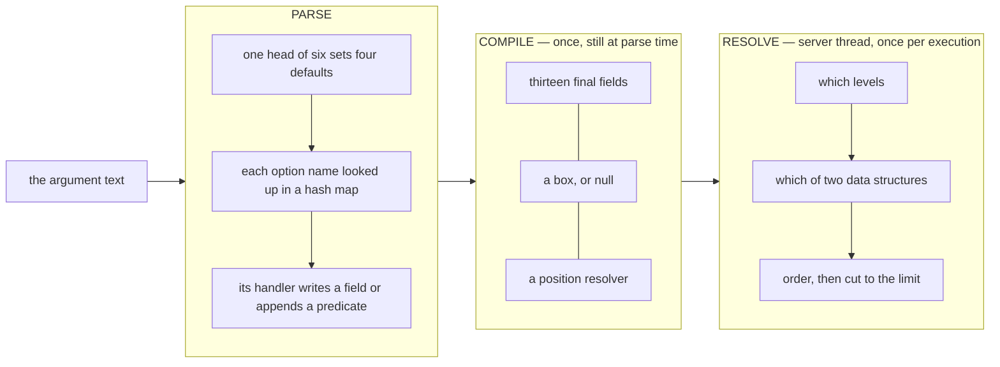
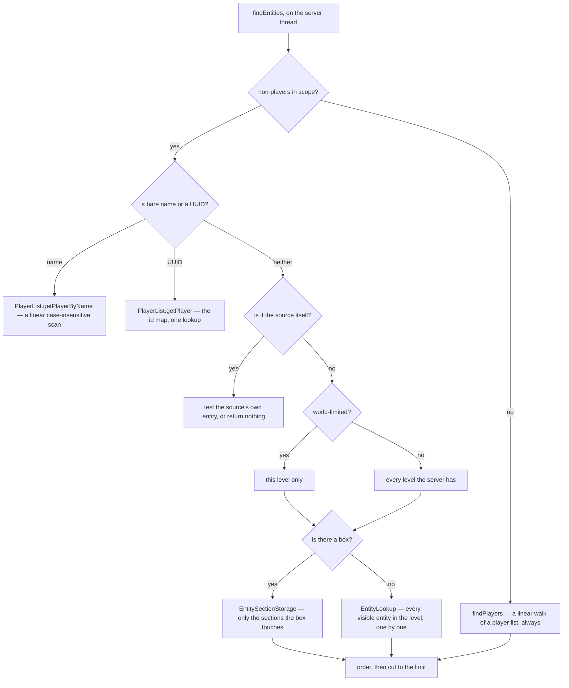

# Entity selectors

> Verified against **Minecraft 26.2** · Part XIII · you type */kill @e[type=!player,distance=..8,sort=nearest,limit=1]*, and the characters inside the brackets decide, between them, which levels are searched and which of two entirely different data structures answers.

Put a command block at the Overworld origin and give it */tp @p 0 100 0*.
One player is two hundred blocks away across the Overworld; another is
standing on the Nether roof directly "above" the block, at the Nether's own
*0, 128, 0*. The command block teleports the one in the Nether. *@p* is not
"the nearest player in this world": it is the player whose raw *x*, *y* and
*z* are nearest, chosen from the list of everybody on the server, compared as
though the dimensions were stacked in the same coordinate space. (Type the
same command yourself and you always win it — a player's own source sits at
distance zero from a player's own position.) Nothing in a selector is confined to
one level unless you write one of **seven** options that says so — and the
cheapest of those seven, *distance*, is also the one that decides whether the
game walks every entity in the level or asks the chunk sections for a box.

That is the shape of the whole subject. A selector looks like a filter
language, and it is one, but a handful of its twenty-one option names are not
filters at all: they are the query plan. This page is about which is which.

## The cast

| class | what it decides | when it runs |
|---|---|---|
| `EntitySelectorParser` | the reader, the grammar and thirty-two half-built fields. It owns the selector's own syntax; the brace grammars of *scores* and *advancements* are read by the handlers themselves | parse time |
| `EntitySelectorOptions` | the name-to-handler map — twenty-one entries, filled once by `Bootstrap.bootStrap` and never again | class init |
| `InvertableSetOptionState` | the three-state machine behind *type=!zombie,!skeleton*: one positive assertion **or** any number of negations and tags, never both | parse time |
| `SetOnceOptionState` | one boolean, for the four options that may appear at most once | parse time |
| `EntitySelector` | the compiled query: thirteen final fields, no reader, no grammar, no string | built at parse time, run later |
| `EntityArgument` | four argument shapes (single or many, entities or players) and the parse-time rejections that enforce them | parse time and on the wire |
| `CommandSourceStack` | the only thing a selector can be resolved against — origin, level, server, permission set | resolve time |
| `LevelEntityGetterAdapter` | the fork in the road: an `EntityLookup` walk, or an `EntitySectionStorage` box query | resolve time |

`net/minecraft/commands/arguments/selector` is five classes and 1,717 lines,
and every one of them is in the server jar *and* the client jar. That matters
later.

> **For a 1.21-era reader.** The parser's crowd of *hasNameEquals* /
> *hasNameNotEquals* / *hasGamemodeEquals* booleans is gone, replaced by
> eight state objects — four `InvertableSetOptionState` and four
> `SetOnceOptionState` — that enforce the same rules structurally. *ResourceLocation* is `Identifier`. And the check
> that used to be an op-level comparison is now an atom,
> `Permissions.COMMANDS_ENTITY_SELECTORS` ([permissions](permissions.md)).

## Three stages, and the last one is not on the parser's clock

The first two stages happen while Brigadier walks the command tree; the third
happens when the command's lambda asks for its argument. In between, the
selector is an ordinary immutable object sitting in a parsed context, which is
why an */execute* chain can resolve the same parsed selector once per source
and get a different answer each time
([the execution engine](the-execution-engine.md)).

## Parse: six heads and twenty-one names

`EntitySelectorParser.parseSelector` reads the character after the *@* and
sets four things — a result limit, whether non-players are in scope, an order,
and sometimes a type. There are six, and no more: the default branch of that
switch throws.

| head | limit | non-players | order | extras |
|---|---|---|---|---|
| *@a* | unbounded | no | arbitrary | typed to player |
| *@e* | unbounded | yes | arbitrary | adds an `Entity.isAlive` test |
| *@n* | 1 | yes | nearest | adds an `Entity.isAlive` test |
| *@p* | 1 | no | nearest | typed to player |
| *@r* | 1 | no | random | typed to player |
| *@s* | 1 | yes | arbitrary | resolves to the source's own entity |

Only *@e* and *@n* add that test, and only `LivingEntity.isAlive` makes it
mean anything — it is the override that adds "and has health left" to the
base class's "and has not been removed". So a player sitting on the death
screen is invisible to *@e* and still a target for *@a* and *@p*.

Then the bracket. `EntitySelectorParser.parseOptions` reads a name, looks it
up through `EntitySelectorOptions.get`, and hands the reader to the handler it
finds. **Twenty-one** names are registered, counted by reading every
`EntitySelectorOptions.register` call in `EntitySelectorOptions.bootStrap`.

| option | what its handler does | repeatable? |
|---|---|---|
| *name* | compares `Nameable.getPlainTextName` | one positive, or many negatives |
| *team* | compares `Entity.getTeam` — the empty string means *no team* | one positive, or many negatives |
| *gamemode* | compares `ServerPlayer.gameMode`, **and drops non-players** | one positive, or many negatives |
| *type* | an id sets the `EntityTypeTest`; a tag only adds a test | one positive id, or many negatives and tags |
| *tag* | reads `Entity.entityTags` — empty means *no tags at all* | freely |
| *nbt* | serialises the candidate and compares with `NbtUtils.compareNbt` | freely |
| *predicate* | runs a loot condition in `LootContextParamSets.SELECTOR` | freely |
| *scores* | a brace map of objective to `MinMaxBounds.Ints` | once |
| *advancements* | a brace map of advancement to done-ness, **players only** | once |
| *limit* | sets the result cap, rejects anything below 1 | once, never on *@s* |
| *sort* | picks one of four orders | once, never on *@s* |
| *distance* | a `MinMaxBounds.Doubles`, rejects negatives, **world-limits** | once |
| *level* | a `MinMaxBounds.Ints`, rejects negatives, **drops non-players** | once |
| *x*, *y*, *z* | override one axis of the resolve origin, **world-limit** | once each |
| *dx*, *dy*, *dz* | build the box, **world-limit** | once each |
| *x_rotation*, *y_rotation* | angle ranges that wrap through 360 | once each |

Three of the twenty-one are freely repeatable — *tag*, *nbt* and *predicate* —
because they are the three registered as always available, with no state
object behind them at all. That is why *tag=a,tag=b* is the idiom for "has
both" and *type=zombie,type=skeleton* is a parse error rather than an empty
result: `InvertableSetOptionState` moves to a terminal state the moment a
positive id is accepted, and `EntitySelectorOptions.get` then refuses the
whole option by name before its handler ever runs. Its *other* terminal state
is the permissive one — after a negation or a tag, more negations and more
distinct tags are allowed, which is why *type=!zombie,!skeleton* works and why
two entity tags can be written together and AND.

## Compile: what a box is, and where it comes from

`EntitySelectorParser.getSelector` runs once, at the end of the parse, and
turns the pile of fields into thirteen final ones. Two of the thirteen are the
interesting decisions.

**The box.** If any of *dx*, *dy* or *dz* was written,
`EntitySelectorParser.createAabb` builds the box from those three, treating
the missing ones as zero and adding one to each maximum — a *dx=0* volume is
one block wide, not zero. Otherwise, if *distance* was written **and has a
maximum**, the box is a cube of that radius, again with one added to the
positive corner. Otherwise there is no box. So *distance=8..* — a minimum with
no maximum — produces no box at all, and *dx=3,distance=..64* ignores the
distance entirely when choosing the box, because the delta branch wins.

**The origin.** If any of *x*, *y* or *z* was written, the position becomes a
function that overrides those axes of the source's position and keeps the
rest. Otherwise it is the identity. This is applied per execution, which is
what makes *x=0* mean the same thing everywhere and *@s* mean something
different at each link of a chain.

Everything else that was written is already a test in a list, in written
order — with exceptions appended afterwards whatever order they appeared in.
`EntitySelectorParser.finalizePredicates` adds the two rotation tests and the
experience-level test last, and `EntitySelector.getPredicate` then appends up
to three more at resolve time: the feature-flag test, the exact box test and
the range test. `Util.allOf` evaluates them in that order and short-circuits,
so the range test — the cheapest thing in a selector — runs **after** an *nbt*
comparison that serialised the whole entity.

## Resolve: which levels, which structure, which order

**World-limited is a parse-time flag, not a runtime one.** Exactly seven
option handlers call `EntitySelectorParser.setWorldLimited`: *distance*, *x*,
*y*, *z*, *dx*, *dy* and *dz*. Write none of them and
`EntitySelector.findEntities` iterates every level the server has. */kill
@e[type=item]* is a three-dimension operation.

**The two structures are genuinely different.** With a box,
`Level.getEntities` goes through `EntitySectionStorage`, which visits only the
accessible non-empty 16-cubes the box overlaps. Without one,
`ServerLevel.getEntities` goes through `EntityLookup`, which walks the level's
entire visible-entity map and calls `EntityTypeTest.tryCast` on each. **There
is no index by entity type.** *type=zombie* narrows nothing structurally; it
is a cast applied one entity at a time, ahead of the tests. Only the seven
box options narrow the search itself, and only when they add up to a box.

**And the box path finds things the walk cannot.** `Level.getEntities` also
offers each ender dragon's eight `EnderDragonPart` sub-entities to the type
test and the predicate, and every part reports its parent's type. So a box
query in the End can return the dragon and up to eight more "ender dragons";
the same selector without a box returns one.

**Players never get a box.** Both player paths — `ServerLevel.getPlayers` for
one level, `PlayerList.getPlayers` for the whole server — are linear walks of
a list, and the box survives only as one more test. *@a[distance=..8]* costs
what *@a* costs.

**Sort is what takes the limit away.** `EntitySelector.getResultLimit` returns
the parsed limit **only when the order is arbitrary**, and the unbounded value
otherwise, because a sort has to see everything before it can know what comes
first. When it is the parsed limit, it reaches the level query as an early
abort. So *@e[limit=1]* stops at the first match, and *@e[limit=1,sort=nearest]*
collects every match in range, sorts the list and throws all but one away.
*@n* and *@p* live permanently in the second mode: their heads set the nearest
order, so they always collect first and cut afterwards.

**So the query plan is written by eight of the twenty-one names.** Seven of
them build the box and world-limit the search — *distance*, *x*, *y*, *z*,
*dx*, *dy* and *dz* — and the eighth, *sort*, un-decides part of it by taking
the limit away. The other thirteen only filter what the plan returns.

## One permission, checked in two places, for two different reasons

The gate is a single atom, `Permissions.COMMANDS_ENTITY_SELECTORS`, granted by
`LevelBasedPermissionSet` from gamemaster upward as the one hard-coded
exception in that class ([permissions](permissions.md)). It is read in seven
places, all of them under `commands/arguments`, and they divide cleanly in
two.

**At parse time**, `EntitySelectorParser.allowSelectors` asks the source and
the answer becomes a constructor argument. If it is false, an *@* throws
`EntitySelectorParser.ERROR_SELECTORS_NOT_ALLOWED` immediately, and a bare
name or UUID still parses. This is the check that matters for the three
vanilla commands that take a selector-capable argument with **no permission
requirement at all** — `MsgCommand`, `EmoteCommands` and `TeamMsgCommand`, so
*/msg*, */tell*, */w*, */me*, */teammsg* and */tm*. For an ordinary player
this atom is the only gate on those.

`MessageArgument` alone treats a refusal as a formatting decision rather than
an error: without the permission the message is taken as literal text, so an
unopped */msg Bob @a* sends those two characters. With the permission, an *@*
that is not a valid selector head is skipped and the scan continues — which is
how an email address survives — but a *malformed* selector body throws, and
the whole command fails to parse.

**At resolve time**, `EntitySelector.checkPermissions` asks again, guarding on
`EntitySelector.usesSelector`, which only `EntitySelectorParser.parseSelector`
ever sets. A selector compiled from a bare player name is exempt. The second
check is not redundant, because there is a whole route into the machinery that
never passed the first one: `EntitySelector.COMPILABLE_CODEC` compiles a
selector out of a **text component** — the *selector* content type, the
*score* name field and the *entity* NBT data source — and does so with
selectors unconditionally allowed, because a codec has no source to ask. The
resolve-time check is what decides whether a */tellraw* written by a data pack
may actually enumerate entities, and it asks the source the component is being
resolved *against*, never whoever wrote it.

## Questions a command author asks

**Does the client parse selectors?** Yes, by two routes, and it cannot resolve
one. All five selector classes ship in the client jar.
`EntityArgument.listSuggestions` builds a real `EntitySelectorParser` against
the client's own permission set, parses as far as it can, swallows the
exception and asks the half-finished parser for its suggestions — which is why
completion inside a bracket knows which options are still legal. And
`ComponentSerialization` decodes a *selector* content type on the client with
the same compiler the server uses. What the client cannot do is run one: every
find method takes a `CommandSourceStack`, and the client's suggestion source
is a `ClientSuggestionProvider`. The one place a client resolves a component
that might contain a selector is `ServerStatusPinger`, whose
`ResolutionContext` deliberately carries no source, so a server-list
description containing a selector renders as nothing at all.

**Why did */damage @e 1* complain before it touched the world?** Because
`EntityArgument` rejects on the compiled selector's *shape*, during the parse:
a limit above one in a single-target slot — which is what `/damage`, `/ride`
and `/data get entity` all take — or non-players in a players-only slot, as
in */msg @e*. Note that */kill @e* is fine: `/kill` takes the many-entities
shape, so neither rejection can fire on it. *@s* is exempt from the second
test, so */msg @s* parses and then finds nobody when the source is not a
player.

**What does the client suggest for an entity argument?** Online player names,
plus — from `ClientSuggestionProvider.getSelectedEntities` — the UUID of
whatever your crosshair is on. Point at a cow, press tab, and it offers you
that cow.

**Is *sort=random* seeded?** No. It is the JDK's list shuffle, with no world
seed and no `RandomSource` anywhere near it, so *@r* is not reproducible from
a save.

**Why does *distance=..8* not return something 8.9 blocks away?** Because the
box is only a pre-filter. The cube built for a maximum of 8 spans −8 to +9 on
each axis, deliberately larger than the sphere it approximates, and the exact
test that follows is `MinMaxBounds.Doubles.matchesSqr`, which compares squared
distances against pre-squared bounds and so never takes a square root.

## Where to look

`EntitySelector` first — thirteen fields and four find methods, and the design
is in them. Then `EntitySelectorParser.getSelector` for the one place those
thirteen are decided, and `EntitySelectorOptions.bootStrap` for the grammar
players actually write. `LevelEntityGetterAdapter` is six methods long and is
where the cost of every selector is settled. Note that the name
`EntitySelector` is used twice in the game: this one, and an unrelated bag of
predicate constants in `world/entity` that the mob AI and the hoppers use.

---

*Rules: names, never code · how the system works, not how the code reads ·
newest version only · every backticked name passes `tools/verify_names.py`.*
