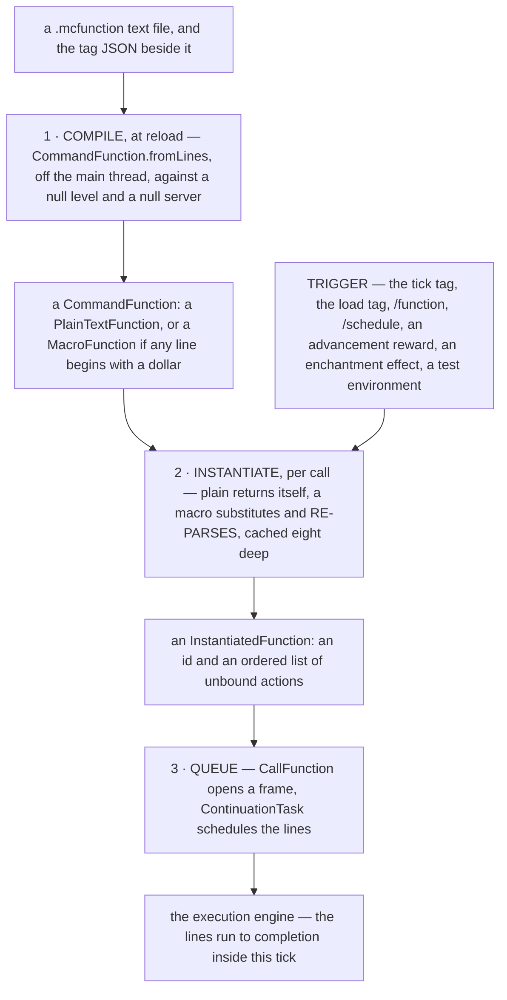

# Functions and macros

> Verified against **Minecraft 26.2** · Part XIII · A macro function in `#minecraft:tick` is reached with no arguments: it fails, silently, twenty times a second, forever — nothing logged, nothing printed, nothing counted.

Put a `$`-prefixed line in a function, add that function to
`#minecraft:tick`, and the game will call it every tick with no argument
compound at all. Instantiating it raises a
`FunctionInstantiationException`, `ServerFunctionManager.execute` catches
that one exception with an **empty body**, and the tick moves on. Any
*other* exception from the same call is logged at *warn*; this one is the
single case the manager was written to swallow, because the `/function`
command is expected to report it instead — and `#minecraft:tick` is not the
`/function` command.

That is the sharp end of a two-step model that is otherwise very tidy: a
`.mcfunction` file becomes a runnable thing in two steps, and for the
overwhelming majority of functions the second step does nothing at all.

## The pipeline

The two halves of that live in `net/minecraft/commands/functions` (the model)
and `net/minecraft/server` (the two managers), and both are entirely
server-side.

| class | what it decides |
|---|---|
| `ServerFunctionLibrary` | the reload listener: parses every file, holds the volatile function and tag maps, and the compile-time `PermissionSet` |
| `ServerFunctionManager` | the runtime face: the two tags, the source they run as, and the one empty catch |
| `CommandFunction` | the compiled, uninstantiated function — `CommandFunction.fromLines` is the compiler |
| `PlainTextFunction` | a macro-free function. It is both the compiled *and* the instantiated form, so instantiating one allocates nothing |
| `MacroFunction` | the other case: parameters, an eight-entry LRU, and a re-parse per miss |
| `StringTemplate` | the `$(name)` syntax and what a valid variable name is |
| `InstantiatedFunction` | an id and an ordered list of `UnboundEntryAction`s. That is the entire runnable representation |
| `FunctionInstantiationException` | carries a `Component`, which is why `/function` can render the failure and the tick loop can swallow it |

## 1 · Compile, at reload

**In:** the raw lines of one file. **Out:** a `CommandFunction`, or nothing
at all.

`CommandFunction.fromLines` walks the lines. A trailing backslash joins the
next one (`CommandFunction.shouldConcatenateNextLine`), and a continuation
at end of file is an error; blank lines and `#` comments are skipped; a
leading `/` is a hard error with two different messages depending on whether
you wrote one slash or two; a leading `$` is a macro line, kept as text; and
anything else goes through `CommandFunction.parseCommand`, which produces a
`BuildContexts.Unbound`. So **a compiled function line is literally a parsed
context chain plus its input string, waiting for a source.**
`CommandFunction.checkCommandLineLength` caps a line at two million
characters.

A syntax error on any line fails the *whole file*, which is logged at error
and then simply absent from the map. There is no partial function.

Two constraints make this stage unusual, and they are the same constraint
seen twice. `ServerFunctionLibrary` parses every file **in parallel on the
reload's background executor**, and it does so against a source built by
`Commands.createCompilationContext` with a **null level and a null server**.
Only the map swap happens on the main thread, and the maps are volatile
because the library object is built on a background thread and read from
several. An argument type that dereferenced the world during parsing would
break a reload — which is exactly why `FunctionArgument` reads an id and
defers the lookup. In 26.2 no argument type actually tests the constraint:
the four that parse against a source consult only its permissions, and those
come from the *function-permission-level* server property, gamemaster by
default.

## 2 · Instantiate, per call

**In:** a `CommandFunction` and an optional argument compound. **Out:** an
`InstantiatedFunction`, or a `FunctionInstantiationException`.

For a `PlainTextFunction` this step returns the very same object: nothing
is allocated, nothing is parsed, and the overwhelming majority of functions
in the world take this path.

A `MacroFunction` looks up each declared parameter in the argument compound,
stringifies it, and uses the **ordered list of strings** as a cache key over
an eight-entry LRU (`MacroFunction.MAX_CACHE_ENTRIES`). On a miss it
substitutes into every macro line and **re-parses** it, and a parse failure
there is the exception above. Note what the cache is keyed on: the values,
in parameter order — so nine distinct argument tuples cycling round will
miss every time.

Stringification is where macros surprise people, because it is not SNBT for
everything. `MacroFunction` has explicit cases for float and double (a
decimal format with up to fifteen fraction digits, so `1.0` becomes `1`),
for byte, short and long, and for strings (the **unquoted** value).
Everything else — integers, compounds, lists — falls through to SNBT.
Integers merely happen to render bare; byte, short and long need their own
cases precisely because SNBT would suffix them.

`StringTemplate` also decides what a parameter may be called, and the rule is
the narrowest in the area: inside `$(…)`, letters, digits and underscore and
nothing else, checked by `StringTemplate.isValidVariableName` at compile time.
That rule is borrowed — a dialog's input keys obey it too, which is what lets
a dialog substitute its inputs into a command ([dialogs](dialogs.md#four-ways-a-dialog-opens-and-one-of-them-is-not-a-click)).

Three smaller rules complete the model. One `$` line anywhere makes the
whole *file* a macro function, though its non-macro lines keep their
already-compiled form and are never re-parsed. A `$` line containing no
substitution at all is a **load-time error**, not a plain command. And a
macro function's instantiated variants all share **one synthetic id**,
derived from the parameter *names* rather than the values.

## 3 · Queue

**In:** an `InstantiatedFunction` and a source. **Out:** entries on the
execution queue.

`CallFunction` spends one cost unit, opens a frame at the next depth, and
hands the function's line list to `ContinuationTask.schedule` — the same
call the fan-out over an entity selector makes. **A hundred-line function
and a hundred-player fork are therefore the same shape in the queue**, which
is what makes `/return` cheap: discarding one self-entry abandons every line
not yet materialised. Everything after this point is
[the execution engine](the-execution-engine.md).

## What calls a function, and when

`ServerFunctionManager.tick` runs in the first profiler zone
`MinecraftServer.tickChildren` opens — *commandFunctions*, with only the
suspension of every player's packet flushing ahead of it — and so before the
clocks, before the time sync, before any level ticks, and long before
connections and players tick, which in 26.2 happen *after* the levels ([the
server tick](../server/server-tick.md#what-minecraftservertickchildren-runs-and-in-what-order)). It no-ops entirely when the
tick-rate manager is not running normally, so `/tick freeze` suspends data
packs. `#minecraft:load` runs once after a reload or start, and
`#minecraft:tick` runs every tick from a list **snapshotted at reload** and
never consulted again, so nothing can join or leave the tick loop between
reloads.

Each function in a tag gets its **own** `ExecutionContext`, so the budget is
per function rather than shared across the tag.

`/schedule` is the one way out of the current tick, and it books its callback
into the server-wide `TimerQueue` that only the overworld's clock advances
([the level tick](../server/server-level-tick.md#a-freeze-stops-the-clock-and-not-the-sleep-check)) —
so a scheduled function fires once per tick, not once per dimension, and
stands still while the world is frozen. What belongs to functions rather than
to the clock is what `ScheduleCommand` refuses outright: a macro function, and
a delay of zero.

Everything else that runs a function is a short list: `/function` itself and
the two constructs the engine builds on it, `execute if function` and
`/return run function` ([the execution
engine](the-execution-engine.md#the-two-commands-that-are-part-of-the-engine));
`AdvancementRewards`, whose `CacheableFunction` holds the id and resolves it
once ([advancements](advancements.md#questions-players-ask)); `RunFunction`,
one of the `EnchantmentEntityEffect`s
([enchantments](../items/enchantments.md#seven-families-of-moment)); and
`TestEnvironmentDefinition.Functions` for a game test's environment setup
([game tests](game-tests.md)).

## The two permission verbs

A function body is one of the places a command source's permission set is
deliberately rewritten, and the game reaches the same answer down two
differently-named routes.

`ServerFunctionManager.getGameLoopSender` takes the server's own source —
which is `LevelBasedPermissionSet.OWNER` — and calls
`CommandSourceStack.withPermission` with gamemaster. That is a flat
**replacement**: the tick and load tags run at gamemaster.

`FunctionCommand` and `DebugCommand` instead call
`CommandSourceStack.withMaximumPermission` at gamemaster, which is
`PermissionSet.union` — and for the level-based sets a player or the console
actually carries, that union returns the **lower** of the two rather than the
higher ([permissions](permissions.md#a-question-an-answer-and-a-check)). So an
owner's source comes out at gamemaster on this route as well. Both verbs land
on the same rung: there is no way to reach a function body above gamemaster.

## Where to look

`CommandFunction` for the compiler, and `MacroFunction` for the only part of
it that runs per call. `ServerFunctionLibrary` for what a reload does off
the main thread, `ServerFunctionManager` for the tick hook and the one empty
catch, and `StringTemplate` for the substitution rules a pack author will
actually trip over.

---

*Rules: names, never code · how the system works, not how the code reads ·
newest version only · every backticked name passes `tools/verify_names.py`.*
