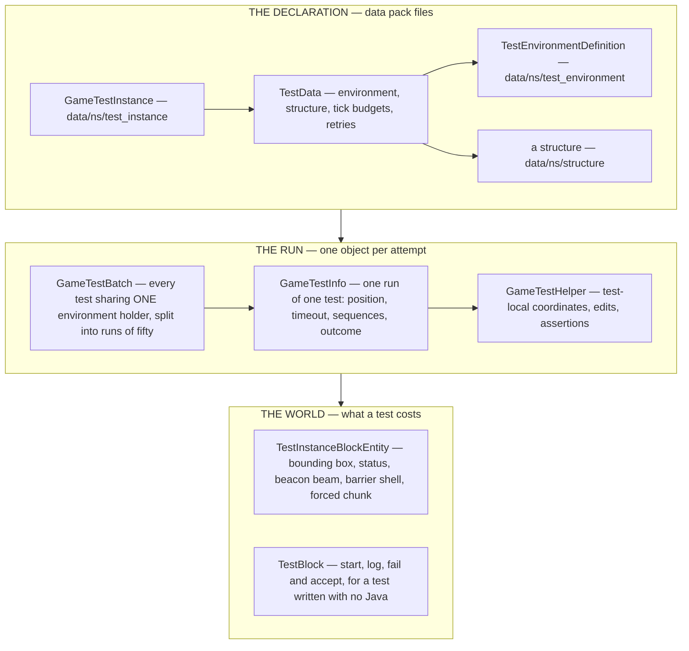
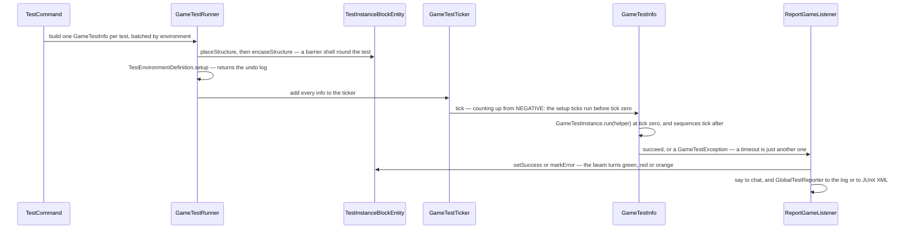

# Game tests

> Verified against **Minecraft 26.2** · Part XIII · Run `/test runall` on a vanilla server and one test runs, and passes. The suite is not in the game — a test is a data-pack file, the Java body is a value the JSON points at, and the shipped jar declares exactly one of each.

Game tests are how Mojang checks that a piston still pushes and a hopper
still pulls: a small structure is pasted into a spare corner of a world, a
test body runs against it for a bounded number of ticks, and a block beside
it turns green or red. That much has been true for years. What changed is
where a test *lives*.

There is no *GameTest* annotation any more, and no test registry class. A
test is a **registry element** loaded from `data/<ns>/test_instance/`, and
the Java body — when there is one — is a value in a second registry,
`Registries.TEST_FUNCTION`, that the JSON points at. The Java half is a
payload, not the declaration. Which means the shipped jar contains
`GameTestInstances`' single always-pass instance, `BuiltinTestFunctions`'
body for it, and `GameTestEnvironments`' default environment — an empty
`TestEnvironmentDefinition.AllOf` — and the real suite lives in Mojang's
test sources, not in the game you downloaded.

This is [the data-driven type pattern](../foundations/data-driven-types.md)
again, and game tests are its most complete instance: three data-pack
registries and one built-in type registry between them.

## The cast

| class | what it decides |
|---|---|
| `GameTestInstance` | the registry element. `GameTestInstance.run` takes a `GameTestHelper` and is the body — `BlockBasedTestInstance` needs no Java at all, `FunctionGameTestInstance` invokes a `Registries.TEST_FUNCTION` entry |
| `TestData` | the declaration record every instance delegates to: environment, structure, tick budgets, required, rotation, manual-only, `RetryOptions`, sky access, padding |
| `TestEnvironmentDefinition` | the seven ways to bend the world for a test, shaped as an **undo log** |
| `GameTestBatch` | a group of tests keyed by their environment holder. A batch *is* an environment |
| `GameTestRunner` | owns the batches and the structure spawner, and re-queues a failure when the retry options say so |
| `GameTestInfo` | one *run* of one test: its position, its timeout, its sequences, its outcome |
| `GameTestHelper` | 1,353 lines, and the entire surface a test body sees — coordinate translation, world edits, spawning, assertions, outcomes |
| `TestInstanceBlockEntity` | 551 lines: the block that owns a test's bounding box, status and beacon beam, and does the real work of placing, saving and encasing the structure |

`net/minecraft/gametest/framework` is forty-four classes, all server-side,
with `net/minecraft/gametest/Main` as the headless entry point beside it.

## The objects, and how they nest

**A batch is not a name and not a class: it is an environment.**
`GameTestBatchFactory` groups tests by their `TestEnvironmentDefinition`
holder, because that is what `GameTestBatch` is keyed by, and each group is
split into runs of fifty (a default the builder can change, not a cap). One
environment is active at a time on the runner, and moving between batches
tears the old one down and stands the new one up.

**The environment interface is an undo log.**
`TestEnvironmentDefinition.setup` returns a value that
`TestEnvironmentDefinition.teardown` is handed back. Five of the seven kinds
return the *previous* state and restore it;
`TestEnvironmentDefinition.Functions` returns nothing and runs a *different*
data-pack function on the way out; and `TestEnvironmentDefinition.AllOf`
returns its children's activations and unwinds them in reverse.

## The trace: one test runs

Game tests tick on the server thread, from `MinecraftServer.tickChildren` in
a profiler section named after the subsystem — after connections and players
and the debug subscribers, before the server GUI refresh and chunk sending —
and only when the tick-rate manager reports the game running normally, so
`/tick freeze` suspends them.

**Setup ticks run before tick zero.** `GameTestInfo` starts its counter
*negative* by the declared setup ticks, so the body runs when the count
reaches zero. `GameTestSequence` is the "do this, wait, then assert that"
chain — `GameTestSequence.thenExecuteAfter`,
`GameTestSequence.thenWaitUntil`, `GameTestSequence.thenSucceed` — and it
uses an exception as ordinary control flow, at most one thrown and swallowed
per sequence per tick, and only for an assertion failure. A timeout is not
caught there.

**Reporting is a listener chain, and it writes to three places.**
`ReportGameListener` is what says something in chat; `MultipleTestTracker`
is the progress bar, with five states including a space for *not started*;
and `GlobalTestReporter` dispatches to `LogTestReporter` or
`JUnitLikeTestReporter`.

## A test with no Java in it

`BlockBasedTestInstance` runs a test built entirely from `TestBlock`s inside
the structure. `TestBlockMode` has four values — start, log, fail and accept
— and the rules are as simple as they sound: exactly one start block emits
redstone to begin, an accept block being triggered is a pass, and a fail
block being triggered is a failure carrying its stored message. That is a
unit test authored in-game with a redstone circuit and shipped as a
structure plus a JSON.

The client half the framework's package list hides is what makes that
practical: `TestInstanceBlockEditScreen` and `TestBlockEditScreen` are how a
test is authored in game, `TestInstanceRenderer` draws the bounding box, and
`GameTestBlockHighlightRenderer` is the sole consumer of
`ClientboundGameTestHighlightPosPacket`. Both serverbound test packets are
sent *by* the client — this is the one system in Part XIII where the client
writes.

## Two things a running server should know

**`/test` exists on every server**, not only in a development environment.
Only the export subcommands are gated on running from an IDE. The command
sits at `Commands.LEVEL_GAMEMASTERS` like every other data-pack command in
this part.

**Test instance blocks are points of interest.** Locating every test within
a 250-block radius is a POI query, not a block scan
([points of interest](../world/points-of-interest.md)), which is what makes
`/test`'s radius subcommands cheap — and what makes a world full of saved
tests carry them in its POI storage.

Underneath both, `StructureUtils` and `StructureGridSpawner` are the layer
that clears the space, lays tests out in a grid, transforms the far corner
and finds every test block by position
([jigsaw and templates](../worldgen/jigsaw-and-templates.md) owns the
template machinery they call). `GameTestServer` is a whole `MinecraftServer`
subclass for headless runs, driven by `GameTestMainUtil`, and it overrides
`GameTestServer.waitUntilNextTick` to drain tasks instead of sleeping: the
headless test server runs flat out, and installs a no-op gizmo collector so
debug drawing costs nothing
([what this book skips](../anatomy/what-this-book-skips.md)).

## Where to look

`GameTestInstance` and `TestData` for what a test *is*, then `GameTestInfo`
for what actually happens on a tick, then `TestInstanceBlockEntity` for what
a test costs the world, and `GameTestHelper` when you want to write one.

---

*Rules: names, never code · how the system works, not how the code reads ·
newest version only · every backticked name passes `tools/verify_names.py`.*
