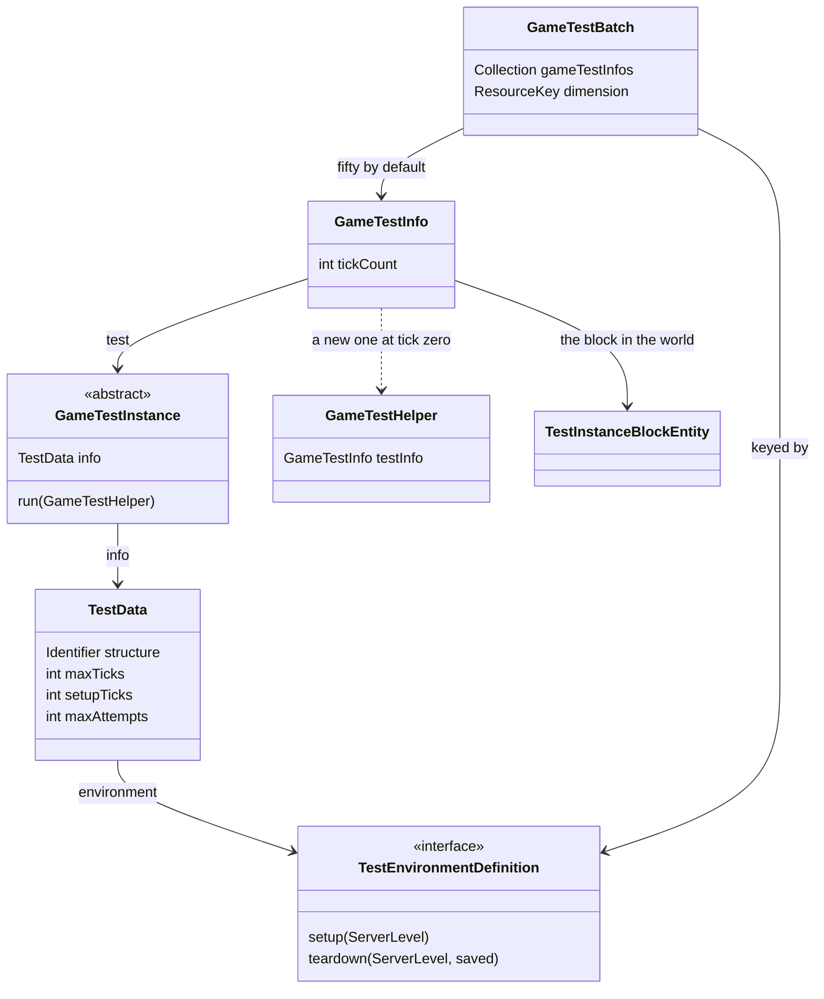
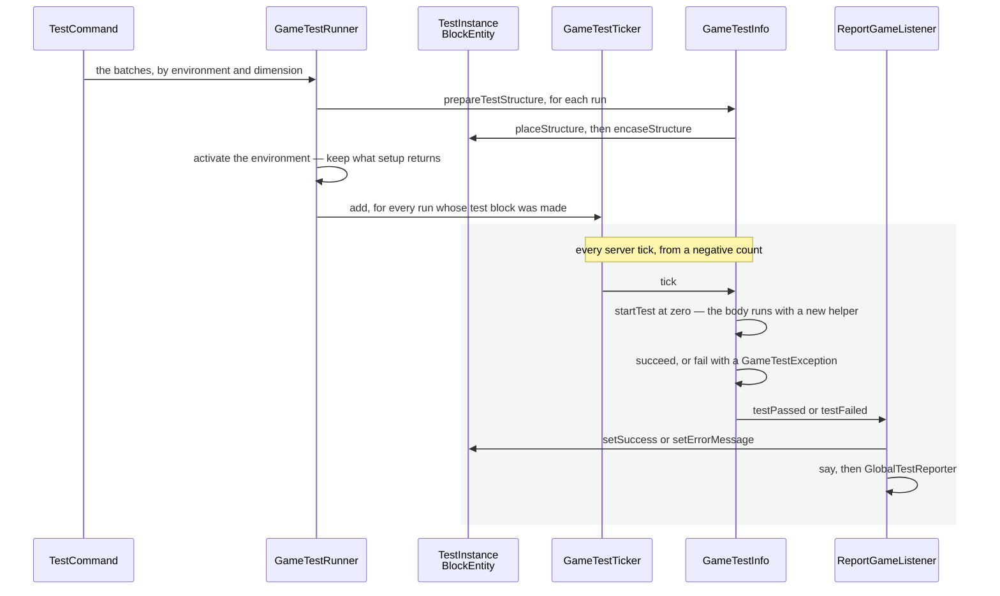

# Game tests

> Verified against **Minecraft 26.3** · Part XIII · Run `/test run *` on a vanilla server and one test runs, and passes. The suite is not in the game — a test is a data-pack file, the Java body is a value the JSON points at, and the shipped jar declares exactly one of each.

Game tests are how Mojang checks that a piston still pushes and a hopper
still pulls: a small structure is pasted into a spare corner of a world, a
test body runs against it for a bounded number of ticks, and a block beside
it turns green or red. That much is the familiar part. The unusual part is where a test *lives*.

There is no *GameTest* annotation and no test registry class. A
test is a **registry element** loaded from `data/<ns>/test_instance/`, and
the Java body — when there is one — is a value in a second registry,
`Registries.TEST_FUNCTION`, that the JSON points at. The Java half is a
payload, not the declaration. Which means the shipped jar contains
`GameTestInstances`' single always-pass instance, `BuiltinTestFunctions`'
body for it, and `GameTestEnvironments`' default environment — an empty
`TestEnvironmentDefinition.AllOf` — and the real suite lives in Mojang's
test sources, not in the game you downloaded.

This is [the data-driven type pattern](../foundations/data-driven-types.md)
again, and game tests are its most complete instance. Five registries hold the system: `Registries.TEST_INSTANCE` and `Registries.TEST_ENVIRONMENT` are loaded from a data pack, `BuiltInRegistries.TEST_INSTANCE_TYPE` and `BuiltInRegistries.TEST_ENVIRONMENT_DEFINITION_TYPE` are the built-in type registries the JSON in those two dispatches on, and `Registries.TEST_FUNCTION` holds the Java bodies.

## The cast

| class | what it decides |
|---|---|
| `GameTestInstance` | the registry element. `GameTestInstance.run` takes a `GameTestHelper` and is the body — `BlockBasedTestInstance` needs no Java at all, `FunctionGameTestInstance` invokes a `Registries.TEST_FUNCTION` entry |
| `TestData` | the declaration record every instance delegates to: environment, dimension, structure, tick budgets, required, rotation, manual-only, the two retry counts, sky access, padding |
| `TestEnvironmentDefinition` | the seven ways to bend the world for a test, shaped as an **undo log** |
| `GameTestBatch` | a group of tests keyed by their environment holder and their dimension. A batch *is* an environment, in one dimension |
| `GameTestRunner` | owns the batches and the two structure spawners, and runs a test again when `ReportGameListener`, reading the run's retry options or the test's own two retry counts, asks it to |
| `GameTestInfo` | one *run* of one test: its position, its timeout, its sequences, its outcome |
| `GameTestHelper` | the entire surface a test body sees — coordinate translation, world edits, spawning, assertions, outcomes |
| `TestInstanceBlockEntity` | the block entity that owns a test's bounding box, status and beacon beam, and does the real work of placing, saving and encasing the structure |

Every class in `net/minecraft/gametest/framework` is server-side, and `net/minecraft/gametest/Main` is the headless entry point beside it. The
screens that *author* a test are not in it — they are client-only and live
with the rest of the GUI, and they are below.

## The objects, and how they nest

What a test is and what running it builds are two sets of objects, and the
figure shows what each one holds.

```mermaid
classDiagram
    class GameTestInstance {
        <<abstract>>
        TestData info
        run(GameTestHelper)
    }
    class TestData {
        Identifier structure
        int maxTicks
        int setupTicks
        int maxAttempts
    }
    class TestEnvironmentDefinition {
        <<interface>>
        setup(ServerLevel)
        teardown(ServerLevel, saved)
    }
        class GameTestBatch {
        Collection gameTestInfos
        ResourceKey dimension
    }
    class GameTestInfo {
        int tickCount
    }
    class GameTestHelper {
        GameTestInfo testInfo
    }
    class TestInstanceBlockEntity

    GameTestInstance --> TestData : info
    TestData --> TestEnvironmentDefinition : environment
    GameTestBatch --> TestEnvironmentDefinition : keyed by
    GameTestBatch --> GameTestInfo : fifty by default
    GameTestInfo --> GameTestInstance : test
    GameTestInfo --> TestInstanceBlockEntity : the block in the world
    GameTestInfo ..> GameTestHelper : a new one at tick zero
```

*A run at the top — a batch is one environment's worth of test runs in one dimension — and the declaration below it, an instance, its record and the environment the record names; a solid arrow is a field, labelled with its name or its meaning, and the dotted one is the helper each run makes for its body.*

**A batch is not a name: it is an environment, in a dimension.** `GameTestBatchFactory` groups tests by their `TestEnvironmentDefinition` holder and their dimension, because that pair is what `GameTestBatch` is keyed by, and each group is
split into runs of fifty (a default, not a cap — `/test verify` builds batches of a hundred). One
environment is active at a time on the runner, and moving between batches
tears the old one down and stands the new one up.

**The environment interface is an undo log.**
`TestEnvironmentDefinition.setup` returns a value that
`TestEnvironmentDefinition.teardown` is handed back, and the seven kinds
divide three ways. Five bend one thing about the world and hand back what it was, so teardown puts it back (the weather to its kind, not to its old countdowns): `TestEnvironmentDefinition.ClockTime`,
`TestEnvironmentDefinition.SetDifficulty`,
`TestEnvironmentDefinition.SetGameRules`,
`TestEnvironmentDefinition.Timelines` and `TestEnvironmentDefinition.Weather`.
`TestEnvironmentDefinition.Functions` is the exception with no state to
return — it runs one data-pack function on the way in and another on the way out, either one optional. And `TestEnvironmentDefinition.AllOf` is the composite: it
returns its children's activations and unwinds them in reverse.

## One test, from a command to a green block

```mermaid
sequenceDiagram
    participant TC as TestCommand
    participant GTR as GameTestRunner
    participant TIB as TestInstance<br/>BlockEntity
    participant GTT as GameTestTicker
    participant GI as GameTestInfo
    participant RGL as ReportGameListener

    TC->>GTR: the batches, by environment and dimension
    GTR->>GI: prepareTestStructure, for each run
    GI->>TIB: placeStructure, then encaseStructure
    GTR->>GTR: activate the environment — keep what setup returns
    GTR->>GTT: add, for every run whose test block was made
    rect rgba(0, 0, 0, 0.04)
    Note over GTT,GI: every server tick, from a negative count
    GTT->>GI: tick
    GI->>GI: startTest at zero — the body runs with a new helper
    GI->>GI: succeed, or fail with a GameTestException
    GI->>RGL: testPassed or testFailed
    RGL->>TIB: setSuccess or setErrorMessage
    RGL->>RGL: say, then GlobalTestReporter
    end
```

*One test from `/test run` to its beam — the structure is placed before the environment is set up, the body runs once when a negative tick count reaches zero, and the listener writes the outcome to the block, whose beam is green, red, or orange for an optional test that failed.*

Game tests tick on the server thread, from `GameTestTicker` in one of the last
zones `MinecraftServer.tickChildren` opens, and only while the tick-rate
manager reports the game running normally — so `/tick freeze` suspends a
running test where it stands ([the server
tick](../server/server-tick.md#what-minecraftservertickchildren-runs-and-in-what-order)
for the order, and its questions for what a freeze does and does not stop).

**The structure comes first, then the environment.** For every run in a batch `GameTestRunner` has its spawner call `GameTestInfo.prepareTestStructure`, which has
the run's block entity paste the structure
(`TestInstanceBlockEntity.placeStructure`) and wall it in with barriers
(`TestInstanceBlockEntity.encaseStructure`); only then is the batch's environment activated, and only the runs whose test block was made are handed to the ticker — a run whose paste failed goes too, already carrying its error.

**Setup ticks run before tick zero.** `GameTestInfo.startExecution` starts
its counter *negative* — by the declared setup ticks, plus the spawner's own
tick delay, plus one — so the body runs when the count reaches zero, in
`GameTestInfo.startTest`, which hands it a new `GameTestHelper`.

**A sequence catches one kind of exception and only one.**
`GameTestSequence` is the "do this, wait, then assert that"
chain — `GameTestSequence.thenExecuteAfter`,
`GameTestSequence.thenWaitUntil`, `GameTestSequence.thenSucceed` — and it
uses an exception as ordinary control flow, at most one thrown and swallowed
per sequence per tick. What it catches is a `GameTestAssertException`: an
assertion that has not come true *yet* is not a failure, so the sequence
swallows it and tries again next tick. A timeout is a different subclass —
`GameTestTimeoutException`, which `GameTestInfo` builds and records when the tick count passes the budget, never throwing it — so nothing can swallow it: to `GameTestInfo`, which records whatever
`GameTestException` ends the run, a timeout is one more failure.

**Reporting is a listener chain, and it writes to up to four places.** Chat, the
block, the progress bar and the report. A finished run calls
`GameTestListener.testPassed` or `GameTestListener.testFailed` on each of its
listeners, and `ReportGameListener` answers with
`TestInstanceBlockEntity.setSuccess` or
`TestInstanceBlockEntity.setErrorMessage`, which is what colours the beam. `ReportGameListener` is also what says something in chat, to every player; `MultipleTestTracker` is the progress bar, which only the headless server prints; and `GlobalTestReporter` hands the outcome to one of two reporters, `LogTestReporter`, which logs the failures, or `JUnitLikeTestReporter`, which writes every result to an XML file.

**What a test leaves behind is not undone.** The environment has its undo
log; the world does not. A passing test has its barrier shell removed and the non-player entities in and around it discarded, and nothing else: the pasted blocks stay where they were put and the test instance block stays with them — except under `/test verify`, which clears each finished batch's space and breaks its test blocks before the next. When its batch finishes, or under `/test verify` when a test fails, the runner unforces every force-loaded chunk in the level, the test's and any other's. A
*failing* test does not even lose its shell, which is the point — the
failure is left standing so it can be walked into and looked at. Clearing
any of it is a command: `/test clearall` walks the test instance blocks in
range, clears the space around each, takes the barriers off and breaks the
block, and a test instance block's own reset re-pastes the structure over
whatever the last run left.

## A test with no Java in it

`BlockBasedTestInstance` runs a test built entirely from `TestBlock`s inside
the structure. `TestBlockMode` has four values — start, log, fail and accept
— and the rules are as simple as they sound: exactly one start block emits
redstone to begin, an accept block being triggered is a pass, and a fail
block being triggered is a failure carrying its stored message. That is a
unit test authored in-game with a redstone circuit and shipped as a
structure plus a JSON.

The client half the framework's package list hides is what makes that
practical: `TestInstanceBlockEditScreen` and `TestBlockEditScreen` are how a
test is authored in game, `TestInstanceRenderer` draws the bounding box, and
`GameTestBlockHighlightRenderer` is the sole consumer of
`ClientboundGameTestHighlightPosPacket`. Both serverbound test packets are sent *by* the client, from those screens: one sets a test block's fields, and the other sets a test instance block's test, size and rotation and queries, runs, resets or saves it, from inside the game. `TestInstanceBlock` is the block itself; `TestInstanceBlockEntity`, in the cast above, is where the work is.

## Three things a running server should know

**`/test` exists on every server**, not only in a development environment.
Only `TestCommand`'s export subcommands are gated on running from an IDE; the rest sit at `Commands.LEVEL_GAMEMASTERS` ([permissions](permissions.md#the-requirement-is-consulted-inside-the-parse)).
How it addresses a test is the data-driven move again: `TestFinder` hands a subcommand the tests it names, as `Registries.TEST_INSTANCE` holders where it takes an id selector or asks for the last failures, and as test blocks found by position otherwise, and the
glob in `/test run *` is `ResourceSelectorArgument`, the one argument type in
the game that takes one.

**Test instance blocks are points of interest.** Locating every test within
a 250-block radius is a POI query, not a block scan
([points of interest](../world/points-of-interest.md)), which is what makes
`/test`'s radius subcommands cheap — and what makes a world full of saved
tests carry them in its POI storage.

**Underneath both sits a layer with no command of its own.**
`StructureUtils` and `StructureGridSpawner` clear the space, lay tests out in a grid, transform the far corner and find every test block by position
([jigsaw and templates](../worldgen/jigsaw-and-templates.md) owns the
template machinery they call). `GameTestServer` is the third
`MinecraftServer` subclass — beside the integrated and the dedicated ones
([anatomy](../anatomy/anatomy.md#from-main-to-a-world)) — driven by
`GameTestMainUtil`, and one thing it changes that matters here is `GameTestServer.waitUntilNextTick`: it drains tasks instead of sleeping, so a
headless test run goes flat out rather than at twenty ticks a second. It also
installs a no-op gizmo collector ([debugging the running
game](../client/debugging-the-running-game.md#a-renderer-does-not-draw-a-gizmo-it-appends-one)).

## Where to look

`GameTestInstance` and `TestData` for what a test *is*, then `GameTestInfo` for what happens on a tick, then `TestInstanceBlockEntity` for what
a test costs the world, and `GameTestHelper` when you want to write one.

---

*Rules: names, never code · how the system works, not how the code reads ·
newest version only · every backticked name passes `tools/verify_names.py`.*
