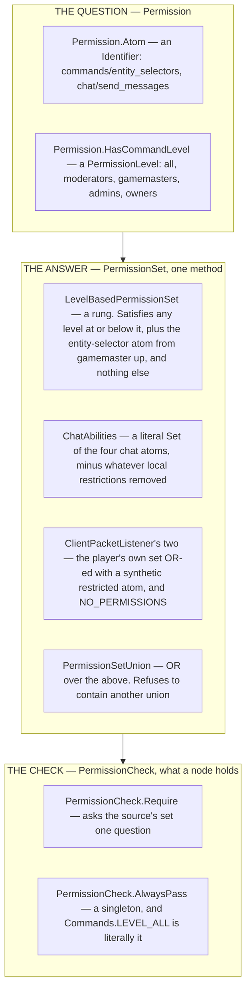
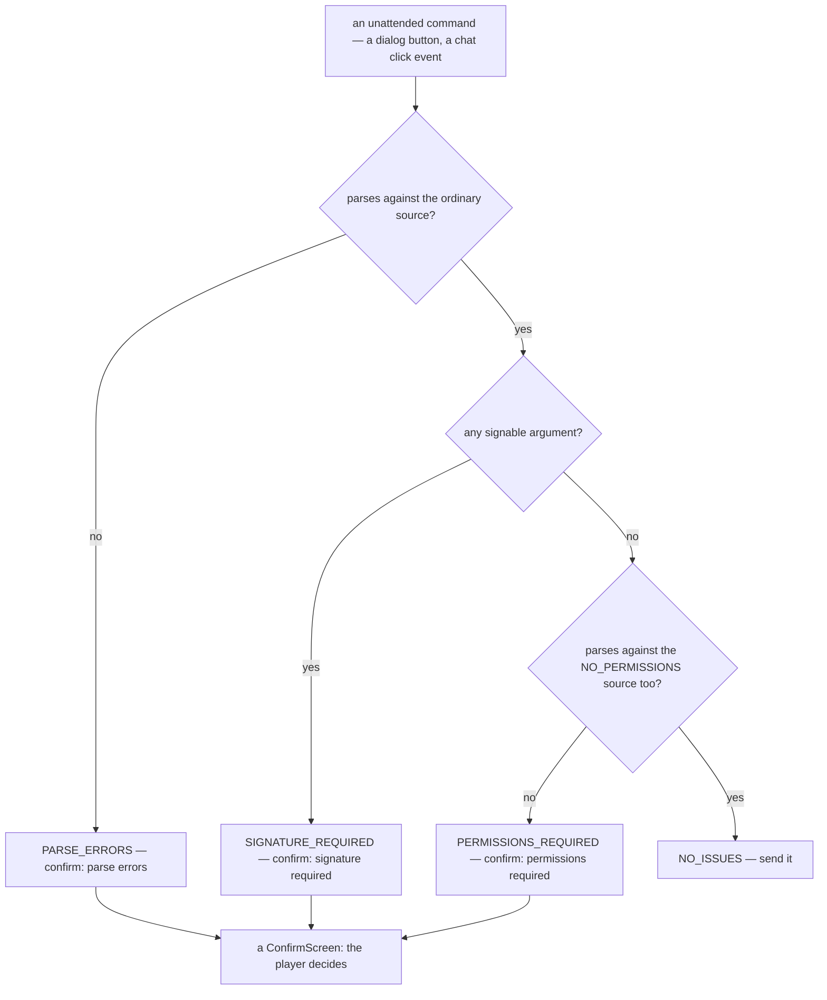

# Permissions

> Verified against **Minecraft 26.2** · Part XIII · You are a level-four operator, you type `/msg`, and the server's own answer to *may this player send a chat command* is **no** — because an operator's permission set grants exactly one thing that is not a command level.

Op yourself to four, the highest rung there is, and ask the server whether
you hold `Permissions.CHAT_SEND_COMMANDS` — one of nine named capabilities
the class `Permissions` holds, each of them a `Permission.Atom`. It says no.
Not because you are restricted — because the set you were given is a
`LevelBasedPermissionSet`, and its answer to any permission that is not a
command level is *false*, with one hard-coded exception. The chat atoms
live only in the *client's* set, which the server never sees and never
sends. There are two permission universes in this game and they overlap in
one place.

That is the shape of the change 26.2 made, and it is the largest API break
in this book: **a permission is no longer an integer.** The five levels are
still there, still numbered nought to four, still stored as integers in
*ops.json* — but a command node no longer asks for a number. It asks a
`PermissionSet` a question, and a set is free to answer however it likes.

## The cast

| class | what it decides | where it lives |
|---|---|---|
| `Permission` | *what is being asked for*: a `Permission.Atom` (a named capability with an `Identifier`) or a `Permission.HasCommandLevel` (a rung) | both jars |
| `Permissions` | the nine the game actually defines, as constants — four rungs and five atoms. The plural class is the catalogue; the singular one is the shape | both |
| `PermissionLevel` | the five rungs — *all*, *moderators*, *gamemasters*, *admins*, *owners* — and `PermissionLevel.isEqualOrHigherThan` | both |
| `PermissionSet` | *the answer*. A functional interface with one method, `PermissionSet.hasPermission` | both |
| `LevelBasedPermissionSet` | the ordinary answer: an interface with five constants, one rung each | both |
| `PermissionSetUnion` | the OR of several sets, and the rule that a union may not contain a union | both |
| `PermissionCheck` | *what a node demands*: `PermissionCheck.Require` or `PermissionCheck.AlwaysPass` | both |
| `PermissionProviderCheck` | the `Predicate` Brigadier actually holds, over anything implementing `PermissionSetSupplier` | both |
| `ChatAbilities` | the client's own set, built by **subtraction** from local reasons | client only |

Eleven classes and 398 lines in `net/minecraft/server/permissions` — every
row above but `ChatAbilities`, which is the client's and sits with the
client's chat code. The smallest package in this book that changes how
everything above it is written.

## A question, an answer, and a check

Three types do three jobs that a single integer used to do, and keeping them
apart is what makes the rest legible.

`Permissions` holds all nine the game defines, and the split is four to five:
four `Permission.HasCommandLevel` constants — one per rung above zero — and
five `Permission.Atom`s, of which one is the entity-selector gate and the
other four are the chat abilities below.

The **question** is data: both shapes are records, both are codec-dispatched
over `BuiltInRegistries.PERMISSION_TYPE`, and `Permission.CODEC` accepts an
atom written as a bare identifier as well as the full dispatched form. The
**answer** is behaviour: `PermissionSet` is one method, so every set in the
game above is a lambda or a small object, and there is no set-of-permissions
data structure anywhere except inside `ChatAbilities`. The **check** is what
a command node carries: `Commands.hasPermission` wraps a `PermissionCheck`
in a `PermissionProviderCheck`, and that predicate is what Brigadier
consults.

**Ninety-five** — `Commands.hasPermission` call sites, which is every
requirement predicate on every command node in the game. Ninety-four are server-side
command registrations; the ninety-fifth is on the *client*, in
`ClientPacketListener`'s node builder.

Two things about `LevelBasedPermissionSet` decide most of this page. It is
an **interface with five constants**, not a class carrying a level, so
`LevelBasedPermissionSet.GAMEMASTER` is a singleton and comparing two sets
is comparing two references. And its `LevelBasedPermissionSet.hasPermission`
tests a `Permission.HasCommandLevel` against its own rung, grants
`Permissions.COMMANDS_ENTITY_SELECTORS` from gamemaster upward as a special
case written into the method, and returns **false to every other atom**.
An operator does not have everything; an operator has a number and one
exception.

Union is where that bites, and the rule is what its name says:
`PermissionSet.union` falls through to `PermissionSetUnion`, which ORs its
operands, so a set holding an atom and a set holding a rung together satisfy
both. The exception is the case the game actually uses.
`LevelBasedPermissionSet.union` of two *level-based* sets never builds a
`PermissionSetUnion` at all, and it does not take the higher of the two: both
branches of the override return the **lower**-levelled set, so it is a
minimum. `CommandSourceStack.withMaximumPermission` is that union, so the one
method in the game named for a ceiling enforces a floor instead — which is
how a function body is held down to gamemaster however high the caller sits
([functions and
macros](functions-and-macros.md#the-two-permission-verbs)).

## Where a set comes from

`MinecraftServer.getProfilePermissions` is the whole of it, and it returns a
`LevelBasedPermissionSet` — never a union, never an atom set. It is
consulted afresh every time `ServerPlayer.permissions` is called; nothing is
cached on the player.

Its cascade is short. Not on the operator list at all, and you get
`LevelBasedPermissionSet.ALL` — rung zero, and deprecated in place. On the
list, and the entry's own set wins — `ServerOpListEntry` holds a
`LevelBasedPermissionSet`, built when the file was read from the integer the
file stores. Failing that: the
singleplayer owner gets `LevelBasedPermissionSet.OWNER`; any other
singleplayer player gets owner or rung zero depending on the *allow cheats
for other players* toggle; and on a dedicated server the fallback is the
configured *op-permission-level* property.

The integer survives at every edge of that model, which is worth knowing
before you go looking for a permissions file. *ops.json* stores a number.
*server.properties* stores a number. The op level reaches the client as one
of five values on `ClientboundEntityEventPacket`. And
`PermissionLevel.byId` **clamps** rather than failing, so an *ops.json*
hand-edited to level 9 is an owner and level −1 is rung zero. What does not
exist anywhere is a data pack that grants a permission:
`PermissionCheck.CODEC` has exactly one consumer in the whole game,
`ArgumentUtils.serializeNodeToJson` writing the generated command report,
and both type registries are bootstrapped in code by `PermissionTypes` and
`PermissionCheckTypes`.

## The requirement is consulted inside the parse

This is the design decision a server administrator feels most often, and it
is not a message-formatting choice. Brigadier evaluates a node's requirement
predicate *while walking the tree*, so a node you may not use is a node that
is not there. `Commands.getParseException` then reports an empty parse range
as an **unknown command** and a non-empty one as an unknown *argument*.

An unopped player typing `/give` is told there is no such command. The
server cannot tell them otherwise without a second parse, and it does not
do one.

One permission escapes the parse entirely.
`Permissions.COMMANDS_ENTITY_SELECTORS` is tested at parse time *and* again
when the selector is resolved against the world, because a parsed selector
outlives its parse — which is exactly what an `/execute` chain relies on, and
why [entity selectors](entity-selectors.md#one-permission-checked-in-two-places-for-two-different-reasons)
owns the two checks and the route that reaches only the second.

Two more consequences worth naming. `Commands.LEVEL_MODERATORS` gates
**nothing**: the rung exists, is settable and is stored, and no vanilla
command asks for it. And the ninety-five gates divide four ways. Ninety-one
name a level constant outright — sixty-six gamemaster, sixteen admin, nine
owner. Two are the ternary in `SeedCommand` and `VersionCommand`, which drop
to `Commands.LEVEL_ALL` when the server is the integrated one, and those are
the only two appearances of that constant in the game. The last two name a
`PermissionCheck` rather than a rung: `GameModeCommand.PERMISSION_CHECK`,
which the end of this page is about, and the client's own synthetic
restricted-command check.

## What the client is allowed to believe

The client has permissions of its own, and they are not a copy of the
server's — no packet carries a `PermissionSet`. It has four sources of
belief, and they behave differently enough to be worth separating. Three of
them the server sent or the machine decided; the fourth is a constant the
two sides literally share.

**The op level**, which arrives on an entity event and is mapped by
`LocalPlayer.handleEntityEvent` onto one of the five sets — except on an
integrated server, where `IntegratedServer.updatePermissionAndChatAbilities`
writes the host's own `LocalPlayer` directly and no packet is involved. Note the bottom
rung: level zero maps to `PermissionSet.NO_PERMISSIONS`, not to
`LevelBasedPermissionSet.ALL`. The two are indistinguishable in practice —
rung zero satisfies no level and no atom either — but the client's copy is a
different object from the server's.

**The command tree**, whose nodes were filtered for this player before being
sent ([Brigadier and
commands](brigadier-and-commands.md#the-tree-on-the-wire) for what the packet
carries). Two elisions ride that packet and they mean different things.
A node whose requirement the player failed is simply **absent**, and the
filter is recursive, so a gated literal takes its whole subtree with it. A
node that a *no-permission* source would fail is **flagged**
(`ClientboundCommandsPacket.FLAG_RESTRICTED`) — "this needs some
permission", asserted independently of you. `Commands` computes that flag
against a source it builds once from `PermissionSet.NO_PERMISSIONS`, and
only for nodes that already survived your own filter.

**Its own atoms.** `ClientPacketListener` mints a single synthetic
`Permission.Atom` for restricted commands and keeps two sources over its one
dispatcher: the ordinary one, whose set is the player's own **OR-ed with**
that atom, so restricted nodes still highlight and complete; and a
no-permission one. `ChatAbilities` is the other client-only set, and it is
built the opposite way round from everything else here — it starts from all
four chat atoms *granted* and lets each `ChatRestriction` remove some. The
four are what this client will do at all: send messages, send commands,
accept messages from other players, and accept system messages; a client with
the first taken away refuses before the server is ever asked ([chat and
signing](../networking/chat-and-signing.md#questions-players-ask)). Three
of the four are decisions the machine you are sitting at makes — two chat
options and a launcher flag — and the fourth, `ChatRestriction.DISABLED_BY_PROFILE`, comes
from the account service: a user flag fetched with your profile. The
client's chat permissions are never granted by the *game* server; they are
only ever taken away, and only ever from outside it.

**The server's own constants, read locally.** The client runs *server*
permission checks against its own set in several places —
`WorldOptionsScreen` gates the hardcore and gamemode buttons on
`Permissions.COMMANDS_OWNER` and `Permissions.COMMANDS_GAMEMASTER`,
`KeyboardHandler` gates three debug keys — and almost all of those are the
client asking its own copy a question the server will ask again later. One
is shared outright. `GameModeCommand.PERMISSION_CHECK`, a
`PermissionCheck.Require` for gamemaster exported from the command class, is
read by its own command registration, twice by `KeyboardHandler`, once by
`GameModeSwitcherScreen` against `LocalPlayer`'s own set — which is why
F3+F4 refuses to open the switcher at all, with *debug.gamemodes.error*,
rather than opening a greyed-out one — and once more by
`ServerGamePacketListenerImpl` when the packet arrives. One constant, five
references in four classes, two sides of the network: the one object both
universes read, and the place they overlap.

## Asking a question the client cannot answer

Put those two client sources together and you get the one thing the client
*can* diagnose: it can tell "you would need permission for this" apart from
"that is a typo", for a command it was asked to send on your behalf. A
dialog button and a chat click event both route through
`ClientPacketListener.sendUnattendedCommand`, whose two callers are
`Screen.clickCommandAction` and an adapter `ClientPacketListener` builds for
itself. A **sign does not**. A sign's click command is stored in the block entity
and never travels to the client as a command at all: `SignBlockEntity` runs
it on the server, through a `CommandSourceStack` it builds itself at a
hard-coded `LevelBasedPermissionSet.GAMEMASTER`. There is nothing for the
client to vet, because the client was never told what the text does.

`ClientPacketListener.verifyCommand` parses the same string against both
sources and reads the *difference*. Succeeding with your set and failing
without it means some node on the path was gated — which is as much as the
client can ever know, because it was never told which permission or whose.
Three of the four outcomes pop a confirmation screen; the fourth,
`ClientPacketListener.CommandCheckResult` *NO_ISSUES*, sends with no screen at all. So an unattended command that is
merely *unusual* is always shown to you first — but a clean one goes
straight out, and a sign's command never came this way to begin with.

Which answers the operator at the top of this page. Their `/msg` goes
through, and it goes through because nothing on the server's side of the
wire ever asks for `Permissions.CHAT_SEND_COMMANDS`: the `/msg` node's
requirement is a rung, the atom lives only in this client's `ChatAbilities`,
and the one participant that consults it is the machine the player is
sitting at. The server's *no* is real and it is never asked. That is what
two permission universes overlapping in one place buys — and the one place
they overlap is the paragraph above.

> **For a 1.21-era reader.** *ServerPlayer.hasPermissions(int)* and
> *CommandSourceStack.hasPermission(int)* are gone. The nearest thing is
> `PermissionSet.hasPermission(Permission)` reached through
> `ServerPlayer.permissions` or `CommandSourceStack.permissions`, and the
> names that survived the rewrite unchanged — `Commands.LEVEL_GAMEMASTERS`
> and its siblings — **changed type**, from an integer to a `PermissionCheck`. Code
> that compiles against the old signature does not exist; code that reads
> the old *semantics* ("an op has everything") compiles and is wrong.

## Where to look

`PermissionSet` first — seventeen lines, and the whole model is in them.
Then `LevelBasedPermissionSet` for the two special cases that decide
everything, `Permissions` for the nine vanilla permissions, and
`Commands.hasPermission` for the one idiom every command registration uses.
`MinecraftServer.getProfilePermissions` for where a player's set is
decided, and `ClientPacketListener.verifyCommand` for the only place either
side reasons about a permission it does not have.

---

*Rules: names, never code · how the system works, not how the code reads ·
newest version only · every backticked name passes `tools/verify_names.py`.*
