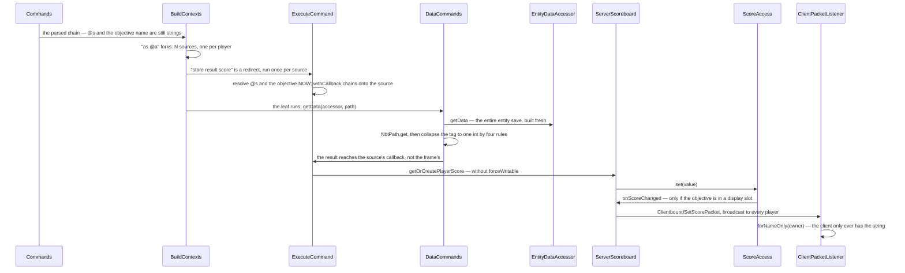

# Scores, teams and stored data

> Verified against **Minecraft 26.2** · Part XIII · `execute as @a store result score @s ticks_frozen run data get entity @s TicksFrozen`: one command that writes a scoreboard through a callback the inner command has never heard of, and the two data models `execute store` exists to join.

## Responsibility

Three systems that share a command and a design instinct, and that no other
page in this corpus owns.

The **scoreboard** is the game's general-purpose *number per thing* store: six
maps on one object, per server rather than per level, saved beside the world.
The **teams** live in the same package and are read by collision, by nametag
rendering, by friendly fire, by the locator bar and by item tint — five
subsystems that have nothing to do with scores. **Command storage** and the
**NBT path** language are the other half: a place to put a tag that belongs to
no block and no entity, and a query language for reaching into any tag at all.

And `execute store` is the seam. It is the only construct in the game that
takes the result of an arbitrary command and writes it somewhere, and its two
sinks are exactly the two models here. A page that explained the scoreboard
without `execute store` would be a data-structure tour; a page that explained
`execute store` without both sinks would have nothing to point at.

The design instinct they share is worth stating first, because it explains
three otherwise-odd decisions: **the server is the only participant that knows
anything.** The client is sent scores it can draw and nothing else — not an
objective's criteria, not a score's lock bit, not which objectives exist. There
is no serverbound packet in this whole system. Every write is a command.

The one sentence a player would recognise: *the list of numbers down the right
of the screen.*

## The data it owns

`net/minecraft/world/scores` is sixteen files and 1,442 lines — the whole
model — and every class in it ships in both jars.

- **`Scoreboard`** — six maps and nothing else.
  `Scoreboard.objectivesByName`, `Scoreboard.objectivesByCriteria` (an
  **identity** map from criteria to the objectives watching it — the reverse
  index that makes a health change cost one lookup rather than a scan),
  `Scoreboard.playerScores` keyed by the holder's *string*,
  `Scoreboard.displayObjectives` as an enum map over the slots, and
  `Scoreboard.teamsByName` with `Scoreboard.teamsByPlayer` as the two halves
  of membership — kept consistent by hand, and throwing if they ever disagree.
  Ten empty hooks (`Scoreboard.onScoreChanged`,
  `Scoreboard.onObjectiveAdded`, `Scoreboard.onTeamChanged` and their
  siblings) are the entire extension surface. The base class is a pure data
  structure and the client uses it unmodified.
- **`Objective`** — a criteria, a display name, a render type, an optional
  number format, an auto-update flag, and a **back-pointer to the
  scoreboard**, so every setter reports its own change rather than being
  reported. `Objective.createFormattedDisplayName` precomputes the bracketed,
  hoverable form that command messages quote — the same trick `Advancement`
  uses.
- **`PlayerScores`** — package-private, one identity-keyed map from objective
  to `Score`. Nothing outside the package can hold one, and
  `Scoreboard.resetSinglePlayerScore` deletes the whole row when its last
  score goes, so the outer map never accumulates empties.
- **`Score`** — four mutable fields: the value, a lock bit, an optional
  display component and an optional number format. **`ReadOnlyScoreInfo`** is
  the read interface it implements (and where
  `ReadOnlyScoreInfo.formatValue` lives), **`PlayerScoreEntry`** is the
  snapshot a sidebar row is drawn from, and **`ScoreAccess`** is the write
  handle. Four types for one number, and the distinction is load-bearing.
- **`ScoreHolder`** — an interface `Entity` implements, with
  `ScoreHolder.forNameOnly` and `ScoreHolder.fromGameProfile` minting
  anonymous ones so a bare string is interchangeable with an entity. See the
  invariants; this is the most consequential class on the page.
- **`Team`** and **`PlayerTeam`** — the abstract base and its *only* subclass,
  which will surprise a modder. `Team` declares everything a reader asks
  (`Team.isAllowFriendlyFire`, `Team.getCollisionRule`,
  `Team.getNameTagVisibility`, `Team.getDeathMessageVisibility`,
  `Team.getColor`, `Team.isAlliedTo`); `PlayerTeam` owns the mutable state and
  the setters, precomputes its display style, and packs friendly-fire and
  see-invisibles into one wire byte.
- **`TeamColor`** — sixteen values, each pinned to one text colour **and one
  display slot**. (There is a second, unrelated `TeamColor` in
  `net/minecraft/client/color/item`, an item tint source.)
- **`DisplaySlot`** — nineteen: the list, the sidebar, below-name, and sixteen
  per-team sidebars.
- **`ObjectiveCriteria`** (in `world/scores/criteria`) — what an objective
  watches. Forty-three constants, of which six are read-only, and an open-ended
  tail: see below.
- **`ServerScoreboard`** — three fields. The server, a
  `ServerScoreboard.trackedObjectives` set, and one boolean dirty flag. It
  overrides eleven hooks and each does the same two things: conditionally
  broadcast, then mark dirty. **`ScoreboardSaveData`** is the `SavedData`
  behind it.
- **`net/minecraft/network/chat/numbers`** — seven files, 167 lines:
  `NumberFormat` with `BlankFormat`, `StyledFormat` and `FixedFormat`, the
  three kinds `NumberFormatTypes` registers.
- **`CommandStorage`** — a lazy façade over one `SavedData` *per namespace*,
  so `minecraft:foo` and `mypack:foo` are different files.
- **`NbtPathArgument`** — 874 lines, the largest argument type in the game,
  and a whole query language: six node kinds, a depth limit of 512, and
  creation semantics described below.
- **`net/minecraft/server/commands/data`** — `DataCommands` (467 lines) over
  three `DataAccessor` implementations, `BlockDataAccessor`,
  `EntityDataAccessor` (the `/data` one — there is an unrelated class of that
  name in `network/syncher`) and `StorageDataAccessor`.
- **The commands:** `ScoreboardCommand` (620 lines, the fourth-largest command
  class in the game), `TeamCommand`, `TriggerCommand`, `TeamMsgCommand`, and
  the seven argument types `ScoreHolderArgument`, `OperationArgument`,
  `ObjectiveArgument`, `ObjectiveCriteriaArgument`, `TeamArgument`,
  `TeamColorArgument`, `ScoreboardSlotArgument`.

## When it runs

**Nothing here is ticked.** `MinecraftServer` mentions the scoreboard five
times in total: the field, the constructor, the load, the getter, and one call
to `ServerScoreboard.storeToSaveDataIfDirty` inside
`MinecraftServer.saveAllChunks`. There is no periodic sweep and no dirty-queue
drain. Every mutation broadcasts its own packet synchronously, inside the call
that made it, on the server thread. Every client handler begins with
`PacketUtils.ensureRunningOnSameThread`.

There is **one scoreboard per server, not per level** —
`ServerLevel.getScoreboard` delegates to the server — so scores and teams are
global across dimensions.

Criteria-driven scores are the only part with a schedule, and it is narrower
than it sounds. `Scoreboard.forAllObjectives` has **seven call sites and every
one is in `ServerPlayer`**: the six read-only criteria, the death count, two
kill counts, the two team-kill criteria, and the two statistics hooks. Nothing
in `Entity`, `LivingEntity` or `Mob` ever touches the scoreboard, so a skeleton
killing a zombie increments nobody's kill count.

The six read-only criteria are change-detection diffs — six consecutive
comparisons against remembered fields — and they live in
`ServerPlayer.doTick`, which runs in the **connection** phase, after the levels
have ticked ([the server tick](../server/server-level-tick.md)). So damage
taken during the level tick reaches the scoreboard, and the wire, later in the
same tick rather than during it.

## The trace: a store through both models

Each arrow is a decision.

**The store target is resolved before the inner command runs, not after.**
`ExecuteCommand.wrapStores` builds the store node as a **redirect with a
modifier**, not as a step after the leaf. The modifier resolves the score holder and the
objective against *this* source, and then decorates the source with a callback
chained onto whatever was already there. So the store is a property of the
source, which is why several stores compose, and why each forked player writes
their own row without the leaf command knowing a scoreboard exists.

**The result travels by callback, not by return value.** The leaf reports
through the source's own callback
([execution and functions](execution-and-functions.md)), which is precisely why
`execute store` works on a command typed in chat whose *frame* callback is
empty.

**`/data get` builds the whole entity to read one field.**
`EntityDataAccessor.getData` produces the entity's entire save tag, freshly, and
`NbtPathArgument.NbtPath` then walks it. That is the real cost of `/data get`, and it is why
a per-tick `/data get` on a busy entity is a measurable expense.

**Four rules collapse a tag to one integer.** A numeric tag floors its double
value; a collection and a compound both yield their *size*; a string yields its
length. Nothing yields the value you might have meant: `data get entity @s
Inventory` returns 36 because that is how many slots there are. A path matching
more than one tag is an error, and a path matching none is a different error.

**The write can be a silent no-op.** `ScoreAccess.set` writes nothing and sends
nothing when the value is unchanged and the score is not new — unless the
objective has auto-update on, in which case it refreshes the display name first
and a changed display counts as a change on its own.

**And it may never reach the wire at all.** `ServerScoreboard.onScoreChanged`
is gated on the objective being in `ServerScoreboard.trackedObjectives`, and the
only way in is to occupy a display slot.

## `ScoreAccess`: why a write is a handle

`Scoreboard.getOrCreatePlayerScore` does not return a `Score`. It returns a
`ScoreAccess` — an anonymous object closing over the score, the objective, the
holder, and **two decisions computed once, at handle-creation time**:

- may this be modified? (the caller asked for a force-writable handle, or the criteria is not
  read-only)
- was this score *newly created* by the lookup that produced this handle?

That is the whole answer to "why not a setter". A setter would have to
re-derive the first fact on every call, and the second is unrecoverable after
the fact — once the `Score` exists, nothing can tell whether *this* call
created it. Newness is what decides whether an unchanged value still needs a
packet, so it has to survive from the lookup to the write.

The handle is also the one place that knows when to fire the change hook, so
every write path in the game funnels through it: `ScoreAccess.set`,
`ScoreAccess.add`, `ScoreAccess.increment`, `ScoreAccess.reset`,
`ScoreAccess.lock`, `ScoreAccess.unlock` and
`ScoreAccess.numberFormatOverride`. Three of them behave unlike the others and
each surprise is in the invariants.

## What a criterion can be

`ObjectiveCriteria` looks like an enum of eleven values and is not. Forty-three
constants exist, thirty-two of them generated — sixteen team-kill and sixteen
killed-by-team criteria, one per team colour. Six are read-only: health, food, air,
armour, experience and level.

And then the tail. **`Stat` extends `ObjectiveCriteria`**, so every statistic in
the game *is* a criterion, and `ObjectiveCriteria.byName` parses a
colon-separated name by looking the left half up as a stat type and the right
half in that stat type's own registry. `minecraft.mined:minecraft.stone` is not
a special case; it is the statistics registry addressed through a string
([what this book skips](../anatomy/what-this-book-skips.md) covers the
statistics side). Nine stat types over the block, item, entity-type and
custom-stat registries make thousands of valid criteria names, which is why
`/scoreboard objectives add` suggests forty-three and accepts far more.

The identity-keyed reverse index is what makes it work: `ServerPlayer.awardStat`
hands the `Stat` object itself to `Scoreboard.forAllObjectives`, and object
identity finds the objectives watching it. That is sound only because stat
objects are interned in their registries.

## The NBT path language

Six node kinds — a named child, a match on an object, a match on the root
object, a match on a list element, all elements, and an index — with a depth
limit of 512.

The elegant part is **creation**. `NbtPathArgument.NbtPath`'s parent-creating
walk goes through the nodes and, for each one, asks *the next node* what shape its parent has to be: a
named child wants a compound, an index wants a list. So a *set* through
`a.b[0].c` materialises a compound, a list and a compound without any node
knowing more than its own type. Removal is the same walk with a plain
lookup instead, so it never creates.

The three accessors are a coarser abstraction than they look. `DataAccessor`
has two methods that matter — read the whole tag, write the whole tag — and no
path-aware write anywhere. Every `/data modify` is *read everything, mutate in
memory, write everything back*, which is why a block-entity write reloads the
block entity and marks the chunk dirty, and why an entity write round-trips the
entity through its own load path and then restores the UUID by hand, because
loading would have overwritten it.

What each accessor *does* contribute is its own grammar subtree, which is how
`DataCommands` builds the target half and the source half of every subcommand
from one list of three providers applied twice.

## Interfaces

- **Called by:** `/scoreboard`, `/team`, `/trigger`, `/teammsg`, `/data` and
  `execute store`; `ServerPlayer` for the criteria-driven scores;
  `ScoreContents` and `NbtContents` when a text component resolves; the loot
  system through the score condition
  ([contexts and predicates](../items/contexts-and-predicates.md)); the entity selector's *scores* and
  *team* options.
- **Reads it:** collision through `EntitySelector.pushableBy`; nametag
  visibility through `LivingEntityRenderer.shouldShowName`; invisibility
  through `Entity.isInvisibleTo`; friendly fire through `Player.canHarmPlayer`;
  death-message routing through `ServerPlayer.die`; the locator bar through
  `ServerScoreboard.updateTeamWaypoints` into
  `ServerWaypointManager.remakeConnections`; and the client's `Hud`,
  `PlayerTabOverlay` and item tint. Every one of the first five has **exactly
  one** call site in the game.
- **Crosses the network as:** five packets, all server → client, and no
  serverbound counterpart exists —
  `ClientboundSetObjectivePacket`, `ClientboundSetDisplayObjectivePacket`,
  `ClientboundSetScorePacket`, `ClientboundResetScorePacket` and
  `ClientboundSetPlayerTeamPacket`. All five go through
  `PlayerList.broadcastAll`: no distance filter, no dimension filter. See
  [what the client is told](../networking/what-the-client-is-told.md).
- **Saved as:** `ScoreboardSaveData` under `minecraft:scoreboard`, and one
  command-storage file per namespace, both beside the world in the data folder
  and both through the data fixer
  ([level data and rules](../../reference/level-data-and-rules.md)). The NBT field
  names are the archaeology — *Objectives*, *PlayerScores*, *DisplaySlots*,
  *Teams*, and inside them *Name*, *CriteriaName*, *RenderType*, *Locked* —
  capitalised, pre-flattening conventions, preserved by codec.

The join burst is worth naming: `PlayerList.updateEntireScoreboard` sends every
team with its full member list, then walks all nineteen display slots and ships
each distinct occupying objective with **all of its scores**.

## Invariants and surprises

- **A player's score is keyed by their name; a mob's is keyed by its UUID.**
  `Entity.getScoreboardName` returns the UUID string and
  `Player.getScoreboardName` overrides it with the profile name. One flat map
  holds both, plus rows belonging to no entity at all. That single override
  explains most of scoreboard folk practice: why fake players exist, why a mob's
  score can never appear in the tab list (whose holder is built from a profile
  name), and why renaming a player orphans their scores.
- **A `#` prefix does two unrelated things.** In `ScoreHolderArgument` it skips
  entity resolution entirely, so the token is taken as a literal name; and in
  the sidebar `PlayerScoreEntry.isHidden` filters the row out. One character,
  two mechanisms, and together they are the whole "hidden fake player" idiom.
  The argument type has four resolution branches in order — the wildcard, a
  `#` name, a UUID (searched across every level), an online player — and every
  one of them falls back to a bare name.
- **An objective in no display slot does not exist on the network.**
  `ServerScoreboard.onObjectiveAdded` sends nothing at all; the only path into
  the tracked set is `ServerScoreboard.setDisplayObjective`. A scoreboard with
  two hundred objectives and an empty sidebar costs zero bandwidth. Putting one
  *into* a slot then ships every score it holds, to every player, at once.
- **The client is told the render type and never the criteria.**
  `ClientPacketListener` constructs every objective it receives with
  `ObjectiveCriteria.DUMMY`. A client cannot tell a health objective from a
  dummy one — it only knows to draw hearts — and the score packet carries no
  lock bit, which is why `/trigger`'s suggestions have to be computed on the
  server.
- **`Team.isAlliedTo` is reference equality.** Two teams with byte-identical
  settings are never allied. Every "same team?" test in the game is really
  "same object?", which is safe only because `Scoreboard.teamsByName` is the
  single owner of every instance.
- **Nametag visibility *widens* visibility for a teamed entity.** When an
  entity has a team, `LivingEntityRenderer.shouldShowName` returns from the
  team switch directly and never reaches the checks that hide a name behind F1,
  for the camera entity, or for a vehicle. A mob on a team set to *always* keeps
  its name through the HUD toggle.
- **A team has two visibility settings and only one of them ships.** The wire
  parameters carry nametag visibility; death-message visibility has a single
  reader, in `ServerPlayer.die`, and the client never learns the rule because
  it does not need to — it either receives the message or does not. (The
  team-only broadcast also excludes the dying player, who has already had a
  combat packet.)
- **`/scoreboard` refuses a read-only objective and `execute store` does not
  check.** The command resolves its write targets through
  `ObjectiveArgument.getWritableObjective`; `ExecuteCommand.wrapStores` uses
  the plain lookup and does not ask for a force-writable handle. So
  `execute store result score @s <a health objective>` reaches `ScoreAccess.set`
  with modification disallowed and raises a raw runtime exception from
  inside a result callback rather than a command error. The same hole is
  reachable through `/scoreboard players operation` with `><`, the one operator
  that writes both sides.
- **`execute store … <a data target>` swallows every error in silence.** Its
  read-mutate-write is wrapped in a catch with an empty body: a malformed
  target, an uncreatable path, a too-deep path, a block that stopped being a
  block entity — no message, no failure, no write. The score sink has no such
  catch.
- **`/data modify entity` on a player is refused outright; `/data get` is not.**
  The accessor's write path rejects any `Player` before doing anything else, and
  the read path has no such check. That one asymmetry is why every player-NBT
  technique is read-only.
- **A no-op is a hard failure, in three places.** `/data merge`, `/data modify`
  and `/data remove` all throw when they changed nothing, which makes them
  usable as conditionals in a function — the same choice `/advancement grant`
  makes. `/scoreboard players enable` does it too.
- **`Score`'s lock bit starts locked and its codec defaults unlocked.** A score
  created by `/scoreboard players set` is locked, so `/trigger` fails on it
  until enabled; a score loaded from a file that omits the field is not. The
  bit is saved and never transmitted.
- **`/trigger` is the only command an unprivileged player can use to write a
  score**, and its gate is three-part: the objective's criteria must be the
  trigger criteria, the score must already exist, and it must be unlocked — and
  the command re-locks it immediately, so each *enable* buys exactly one use. It
  is also the only command in this area registered with no permission
  requirement at all.
- **The sidebar you see may not be `DisplaySlot.SIDEBAR`.** If the local player
  is on a team *with a colour*, `Hud` uses that colour's own display slot and
  falls back to the plain sidebar otherwise. The colour-to-slot mapping lives on
  `TeamColor`, not on `DisplaySlot`, and it is what the sixteen team sidebars
  are for.
- **The sidebar shows fifteen rows, and hides before it cuts.** Hidden rows are
  filtered out, then the rest are sorted by value descending and name
  case-insensitively, and *then* truncated to fifteen.
- **A number format can ignore the number.** `FixedFormat` renders a constant
  component whatever the score is. Resolution order is per-score override, then
  per-objective, then a per-site default — red in the sidebar, yellow in the
  tab list, unstyled below the name.
- **Below-name numbers are computed in `Entity`, not in a renderer**, and their
  range is an **attribute**: `Attributes.BELOW_NAME_DISTANCE`, syncable,
  default ten, maximum 512. A server can change how far away a player's
  below-name score is legible, per entity
  ([attributes](../entities/attributes.md)).
- **A score component in a text component is resolved on the server.** A
  `{"score":…}` in a `/tellraw` reads the authoritative scoreboard when the
  component resolves and puts the *result* on the wire, never the reference.
- **The scoreboard reaches into the waypoint manager.** Every team join, leave
  and modification calls through to `ServerWaypointManager` to remake the
  locator-bar connections and re-colour the icons. A class in the scores
  package driving a waypoint system is the coupling to remember.
- **Nothing is saved on write.** The dirty flag is one boolean for the entire
  scoreboard, and clearing it re-packs the whole thing; that happens only from
  the server's autosave. A score set and a crash a tick later is a score lost.
- **A mob's scores survive unloading and die with the mob.**
  `Scoreboard.entityRemoved` runs from the level's destruction callback and is
  gated on the entity being both non-player and not alive.

One thing this corpus cannot settle from the decompile: **what a *failing*
command writes under `store result`.** For the custom-executor path the answer
is visible and explicit — `CustomCommandExecutor.WithErrorHandling` reports
failure through the callback, and a failure result is a zero, so a failing
`/function` under `store result` writes 0. For an ordinary leaf the result
consumer is driven by Brigadier, which is outside the game's own packages and
outside the decompile. The mechanism is named here; the value is not asserted.

## Where to look

`Scoreboard` for the six maps, `ScoreAccess` for why a write is a handle, and
`ServerScoreboard.trackedObjectives` for the one field that decides what a
client ever knows. `ObjectiveCriteria.byName` for the statistics bridge.
`NbtPathArgument.NbtPath` for the nicest ten lines in the area, and
`ExecuteCommand.wrapStores` for the one that makes `execute store` stop feeling
like magic.

---

*Rules: names, never code · how the system works, not how the code reads ·
newest version only · every backticked name passes `tools/verify_names.py`.*
