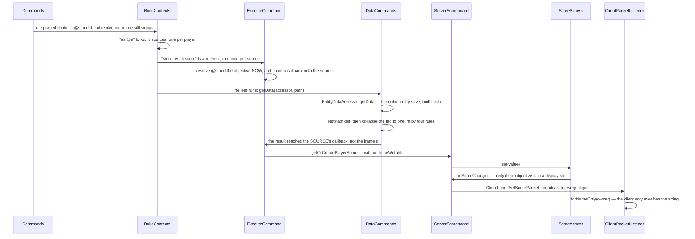

# Scores, teams and stored data

> Verified against **Minecraft 26.2** · Part XIII · `execute as @a store result score @s ticks_frozen run data get entity @s TicksFrozen`: one command writing a scoreboard through a callback the inner command has never heard of, and the two data models `execute store` exists to join.

Look at the sidebar on a well-built server and some of the names in it are
not players. *#total*, *constant*, *.timer* — rows belonging to nothing
alive. That is not a hack layered on top of the scoreboard; it is the
scoreboard working exactly as written, and one method override explains it.

`Entity.getScoreboardName` returns the entity's UUID string.
`Player.getScoreboardName` overrides it with the profile name. There is one
flat map from *string* to a row of scores, holding players by name, mobs by
UUID, and anything else you care to type. From that single override follows
the whole of scoreboard folk practice: **why fake players exist** (nothing
checks that a key belongs to an entity), **why a mob's score can never
appear in the tab list** (whose holder is built from a profile name), and
**why renaming a player orphans their scores**.

Three systems share this page because they share a command and an instinct.
The scoreboard is the game's general-purpose *number per thing*. The teams
live in the same package and are read by five subsystems that have nothing
to do with scores. Command storage and the NBT path language are the other
half — a place to put a tag belonging to no block and no entity, and a query
language for reaching into any tag at all. And `execute store` is the seam:
the only construct in the game that takes the result of an arbitrary command
and writes it somewhere. It has **three** sinks, and two of them are these
two models — a score, and a path into a block, an entity or a storage. (The
third is a boss bar's value or maximum, which shares its implementation with
the score sink and belongs to
[the HUD](../client/hud.md).)

The instinct they share is worth stating before the classes, because it
explains three otherwise-odd decisions: **the server is the only participant
that knows anything.** The client is sent scores it can draw and nothing
else — not an objective's criteria, not a score's lock bit, not which
objectives exist. There is **no serverbound packet in this whole system**.
Every write is a command.

## The cast

| class | what it decides | side |
|---|---|---|
| `Scoreboard` | six maps and nothing else, plus ten empty hooks that are the entire extension surface. A pure data structure, used unmodified by the client | both |
| `Objective` | criteria, display name, render type, number format, auto-update — and a **back-pointer to the scoreboard**, so every setter reports its own change | both |
| `Score` | four mutable fields: the value, a lock bit, a display component and a number format. `ReadOnlyScoreInfo`, `PlayerScoreEntry` and `ScoreAccess` are the other three faces of it | both |
| `ScoreHolder` | the interface `Entity` implements, with `ScoreHolder.forNameOnly` minting anonymous ones — the most consequential class on the page | both |
| `PlayerTeam` | the **only** subclass of `Team`: the mutable state, the setters, a precomputed display style, and friendly-fire plus see-invisibles packed into one wire byte | both |
| `ServerScoreboard` | three fields — the server, `ServerScoreboard.trackedObjectives`, and one dirty boolean — and eleven hook overrides that each conditionally broadcast, then mark dirty | server |
| `NbtPathArgument` | 874 lines, the largest argument type in the game, and a whole query language: six node kinds and a depth limit of 512 | both |
| `DataCommands` | `/data`, over three `DataAccessor`s — `BlockDataAccessor`, `EntityDataAccessor` and `StorageDataAccessor` | server |

`net/minecraft/world/scores` is sixteen files and 1,442 lines — the whole
model — and every class in it ships in both jars. Beside it:
`CommandStorage`, a lazy façade over one `SavedData` *per namespace*, so
`minecraft:foo` and `mypack:foo` are different files; and
`net/minecraft/network/chat/numbers`, seven files and 167 lines, holding
`NumberFormat` with the three kinds `NumberFormatTypes` registers.

## The trace: a store through both models

Each arrow is a decision.

**The store target is resolved before the inner command runs, not after.**
`ExecuteCommand.wrapStores` builds the store node as a **redirect with a
modifier**, not as a step after the leaf. The modifier resolves the score
holder and the objective against *this* source, then decorates the source
with a callback chained onto whatever was already there. So the store is a
property of the *source*, which is why several stores compose, and why each
forked player writes their own row without the leaf command knowing a
scoreboard exists.

**The result travels by callback, not by return value** — the source's own
callback, which is precisely why `execute store` works on a command typed in
chat whose *frame* callback is empty
([the execution engine](the-execution-engine.md)).

**`/data get` builds the whole entity to read one field.**
`EntityDataAccessor.getData` produces the entity's entire save tag, freshly,
and the path then walks it. That is the real cost of `/data get`, and it is
why a per-tick `/data get` on a busy entity is a measurable expense.

**Four rules collapse a tag to one integer.** A numeric tag floors its double
value; a collection and a compound both yield their *size*; a string yields
its length. Nothing yields the value you might have meant:
`data get entity @s Inventory` returns 36 because that is how many slots
there are. A path matching more than one tag is an error; a path matching
none is a different error.

**The write can be a silent no-op, and may never reach the wire at all.**
`ScoreAccess.set` writes nothing and sends nothing when the value is
unchanged and the score is not new — unless the objective has auto-update
on, in which case it refreshes the display name first and a changed display
counts as a change on its own. And `ServerScoreboard.onScoreChanged` is
gated on the objective being in `ServerScoreboard.trackedObjectives`, whose
only entrance is occupying a display slot.

## Why a write is a handle

`Scoreboard.getOrCreatePlayerScore` does not return a `Score`. It returns a
`ScoreAccess` — an anonymous object closing over the score, the objective
and the holder, plus **two decisions computed once, at handle-creation
time**: may this be modified (did the caller ask for a force-writable
handle, or is the criteria not read-only), and was this score *newly
created* by the lookup that produced this handle.

That is the whole answer to "why not a setter". A setter would have to
re-derive the first fact on every call, and the second is unrecoverable
after the fact — once the `Score` exists, nothing can tell whether *this*
call created it. Newness is what decides whether an unchanged value still
needs a packet, so it has to survive from the lookup to the write. The
handle is also the one place that knows when to fire the change hook, which
is why every write path in the game funnels through
`ScoreAccess.set`, `ScoreAccess.add`, `ScoreAccess.increment`,
`ScoreAccess.reset`, `ScoreAccess.lock`, `ScoreAccess.unlock` and
`ScoreAccess.numberFormatOverride`.

Nothing here is ticked, either. `MinecraftServer` mentions the scoreboard
five times in total — the field, the constructor, the load, the getter, and
one call to `ServerScoreboard.storeToSaveDataIfDirty` inside
`MinecraftServer.saveAllChunks`. There is no periodic sweep and no
dirty-queue drain: every mutation broadcasts its own packet synchronously,
inside the call that made it, and there is **one scoreboard per server, not
per level**, so scores and teams are global across dimensions.

## What a criterion can be, which is nearly anything

`ObjectiveCriteria` looks like an enum of eleven values and is not.
Forty-three constants exist, thirty-two of them generated — sixteen
team-kill and sixteen killed-by-team criteria, one per team colour. Six are
read-only: health, food, air, armour, experience and level.

And then the tail. **`Stat` extends `ObjectiveCriteria`**, so every
statistic in the game *is* a criterion, and `ObjectiveCriteria.byName`
parses a colon-separated name by looking the left half up as a stat type and
the right half in that stat type's own registry.
`minecraft.mined:minecraft.stone` is not a special case; it is the
statistics registry addressed through a string. Nine stat types over the
block, item, entity-type and custom-stat registries make thousands of valid
criteria names, which is why `/scoreboard objectives add` suggests
forty-three and accepts far more.

The identity-keyed reverse index is what makes that cheap.
`Scoreboard.objectivesByCriteria` is an **identity** map from criteria to
the objectives watching it, `ServerPlayer.awardStat` hands the `Stat` object
itself to `Scoreboard.forAllObjectives`, and object identity finds the
watchers — sound only because stat objects are interned in their registries.

Criteria-driven scores are the one part of this page with a schedule, and it
is narrower than it sounds. `Scoreboard.forAllObjectives` has **seven call
sites and every one is in `ServerPlayer`**: the six read-only criteria, the
death count, two kill counts, the two team-kill criteria and the two
statistics hooks. Nothing in `Entity`, `LivingEntity` or `Mob` ever touches
the scoreboard, so a skeleton killing a zombie increments nobody's kill
count. The six read-only criteria are change-detection diffs — six
consecutive comparisons against remembered fields — living in
`ServerPlayer.doTick`, which runs in the **connection** phase, after the
levels have ticked ([the level tick](../server/server-level-tick.md)). So
damage taken during the level tick reaches the scoreboard, and the wire,
later in the same tick rather than during it.

## The path language, and the accessor that is coarser than it looks

Six node kinds — a named child, a match on an object, a match on the root
object, a match on a list element, all elements, and an index — with a depth
limit of 512.

The elegant part is **creation**. The parent-creating walk goes through the
nodes and, for each one, asks *the next node* what shape its parent has to
be: a named child wants a compound, an index wants a list. So a *set*
through `a.b[0].c` materialises a compound, a list and a compound without
any node knowing more than its own type. Removal is the same walk with a
plain lookup instead, so it never creates.

The three accessors, by contrast, are coarse. `DataAccessor` has two methods
that matter — read the whole tag, write the whole tag — and **no path-aware
write anywhere**. Every `/data modify` is *read everything, mutate in
memory, write everything back*, which is why a block-entity write reloads
the block entity and marks the chunk dirty, and why an entity write
round-trips the entity through its own load path and then restores the UUID
by hand, because loading would have overwritten it. What each accessor
*does* contribute is its own grammar subtree, which is how `DataCommands`
builds the target half and the source half of every subcommand from one list
of three providers applied twice.

## Teams, which five systems read and none of them are scores

`Team` declares everything a reader asks for and `PlayerTeam` is its only
subclass. What makes teams worth their own paragraph is who consults them,
because it is not the scoreboard: collision through
`EntitySelector.pushableBy`; nametag visibility through
`LivingEntityRenderer.shouldShowName`; invisibility through
`Entity.isInvisibleTo`; friendly fire through `Player.canHarmPlayer`; and
death-message routing through `ServerPlayer.die`. Every one of those five
has **exactly one call site in the game**. The locator bar is a sixth
reader, reached the other way round: every team join, leave and modification
calls through to `ServerWaypointManager` to remake the connections and
re-colour the icons — a class in the scores package driving a waypoint
system.

Two team behaviours are worth pinning. `Team.isAlliedTo` is **reference
equality**, so two teams with byte-identical settings are never allied;
every "same team?" test in the game is really "same object?", safe only
because `Scoreboard.teamsByName` is the single owner of every instance. And
a team has two visibility settings of which only one ships: the wire
parameters carry nametag visibility, while death-message visibility has a
single reader in `ServerPlayer.die` and the client never learns the rule
because it does not need to. Nametag visibility also *widens*: when an
entity has a team, `LivingEntityRenderer.shouldShowName` returns from the
team switch directly and never reaches the checks that hide a name behind
F1, for the camera entity, or for a vehicle — so a mob on a team set to
*always* keeps its name through the HUD toggle.

## What the client is ever told

Five packets, all server → client, and no serverbound counterpart exists:
`ClientboundSetObjectivePacket`, `ClientboundSetDisplayObjectivePacket`,
`ClientboundSetScorePacket`, `ClientboundResetScorePacket` and
`ClientboundSetPlayerTeamPacket`. All five go through
`PlayerList.broadcastAll` — no distance filter, no dimension filter
([what the client is told](../networking/what-the-client-is-told.md)).

An objective in no display slot **does not exist on the network**.
`ServerScoreboard.onObjectiveAdded` sends nothing at all; the only path into
the tracked set is `ServerScoreboard.setDisplayObjective`. A scoreboard with
two hundred objectives and an empty sidebar costs zero bandwidth — and
putting one *into* a slot then ships every score it holds, to every player,
at once. The join burst is the same shape:
`PlayerList.updateEntireScoreboard` sends every team with its full member
list, then walks all nineteen display slots and ships each distinct
occupying objective with all of its scores.

What the client is told is also less than it looks. `ClientPacketListener`
constructs every objective it receives with `ObjectiveCriteria.DUMMY`, so a
client cannot tell a health objective from a dummy one — it only knows to
draw hearts — and the score packet carries no lock bit, which is why
`/trigger`'s suggestions have to be computed on the server.

There is a third route by which a score reaches a client, and it carries no
score packet at all: a `{"score":…}` or `{"nbt":…}` in a text component.
`ScoreContents` and `NbtContents` resolve on the **server**, against the
authoritative scoreboard, and put the *result* on the wire — never the
reference ([text components](../foundations/text-components.md)). A
`/tellraw` is a photograph, not a subscription.

Saving is one boolean for the entire scoreboard, cleared by re-packing the
whole thing, and it happens only from the server's autosave: **a score set
and a crash a tick later is a score lost.** `ScoreboardSaveData` sits under
`minecraft:scoreboard` beside the world, with one command-storage file per
namespace, both through the data fixer
([level data and rules](../../reference/level-data-and-rules.md)). The NBT
field names are the archaeology — *Objectives*, *PlayerScores*,
*DisplaySlots*, *Teams*, and inside them *Name*, *CriteriaName*,
*RenderType*, *Locked* — capitalised, pre-flattening conventions, preserved
by codec.

## Questions players ask

**Why does a `#` in front of a name hide the row?** Because `#` does two
unrelated things. In `ScoreHolderArgument` it skips entity resolution
entirely, so the token is taken as a literal name; and in the sidebar
`PlayerScoreEntry.isHidden` filters the row out. One character, two
mechanisms, and together they are the whole hidden-fake-player idiom. (The
argument type has four resolution branches in order — the wildcard, a `#`
name, a UUID searched across every level, an online player — and every one
of them falls back to a bare name.)

**Why is my sidebar not `DisplaySlot.SIDEBAR`?** If the local player is on a
team *with a colour*, `Hud` uses that colour's own display slot and falls
back to the plain sidebar otherwise. The colour-to-slot mapping lives on
`TeamColor`, not on `DisplaySlot`, and it is what the sixteen team sidebars
are for. The sidebar shows fifteen rows and **hides before it cuts**: hidden
rows are filtered out, then the rest sorted by value descending and name
case-insensitively, and *then* truncated to fifteen.

**Why did `/trigger` say the objective is not enabled?** `Score`'s lock bit
starts **locked** and its codec defaults **unlocked**, so a score created by
`/scoreboard players set` is locked while a score loaded from a file that
omits the field is not. `/trigger` is the only command an unprivileged
player can use to write a score, and its gate is three-part — the criteria
must be the trigger criteria, the score must already exist, and it must be
unlocked — and the command re-locks it immediately, so each *enable* buys
exactly one use. It is also the only command in this area registered with no
permission requirement at all.

**Why did my `execute store` throw an internal error?** Because
`/scoreboard` refuses a read-only objective and `execute store` does not
check. The command resolves its write targets through
`ObjectiveArgument.getWritableObjective`; `ExecuteCommand.wrapStores` uses
the plain lookup and never asks for a force-writable handle. So
`execute store result score @s <a health objective>` reaches
`ScoreAccess.set` with modification disallowed and raises a raw runtime
exception from inside a result callback rather than a command error. The
same hole is reachable through `/scoreboard players operation` with `><`,
the one operator that writes both sides.

**Why did my `execute store` into a data target do nothing at all?** Its
read-mutate-write is wrapped in a catch with an **empty body**: a malformed
target, an uncreatable path, a too-deep path, a block that stopped being a
block entity — no message, no failure, no write. The score sink has no such
catch.

**Why can I read a player's NBT but not write it?** The entity accessor's
write path rejects any `Player` before doing anything else, and the read
path has no such check. That one asymmetry is why every player-NBT technique
is read-only. Relatedly, a no-op is a **hard failure** in four places —
`/data merge`, `/data modify`, `/data remove` and
`/scoreboard players enable` all throw when they changed nothing, which
makes them usable as conditionals in a function, the same choice
`/advancement grant` makes.

**Do a mob's scores survive it despawning?** They survive *unloading* and
die with the mob: `Scoreboard.entityRemoved` runs from the level's
destruction callback and is gated on the entity being both non-player and
not alive.

Two smaller things. A number format can ignore the number entirely —
`FixedFormat` renders a constant component whatever the score is — and
resolution order is per-score override, then per-objective, then a per-site
default: red in the sidebar, yellow in the tab list, unstyled below the
name. And below-name numbers are computed in `Entity`, not in a renderer,
with their range as an **attribute**: `Attributes.BELOW_NAME_DISTANCE`,
syncable, default ten, maximum 512, so a server can change how far away a
player's below-name score is legible, per entity
([attributes](../entities/attributes.md)).

One thing this corpus cannot settle from the decompile: **what a *failing*
command writes under `store result`.** For the custom-executor path the
answer is visible and explicit — `CustomCommandExecutor.WithErrorHandling`
reports failure through the callback and a failure result is a zero, so a
failing `/function` under `store result` writes 0. For an ordinary leaf the
result consumer is driven by Brigadier, which is outside the game's own
packages. The mechanism is named here; the value is not asserted.

## Where to look

`Scoreboard` for the six maps, `ScoreAccess` for why a write is a handle,
and `ServerScoreboard.trackedObjectives` for the one field that decides what
a client ever knows. `ObjectiveCriteria.byName` for the statistics bridge,
`NbtPathArgument.NbtPath` for the nicest ten lines in the area, and
`ExecuteCommand.wrapStores` for the one that makes `execute store` stop
feeling like magic.

---

*Rules: names, never code · how the system works, not how the code reads ·
newest version only · every backticked name passes `tools/verify_names.py`.*
