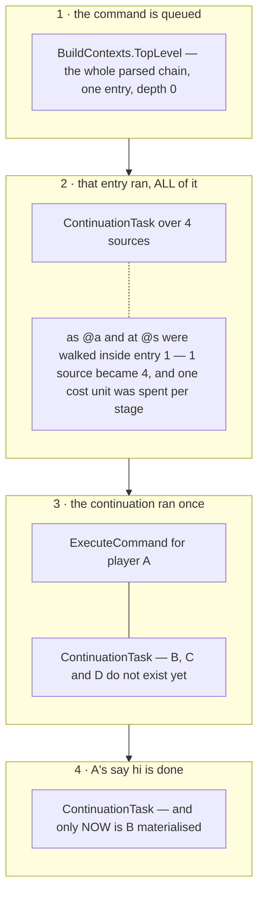

# The execution engine

> Verified against **Minecraft 26.2** · Part XIII · `/execute as @a at @s run say hi` on a server with four players: a command engine with no Java recursion, a fan-out that materialises one player at a time, and a `/return` that deletes work out of a queue rather than unwinding a stack.

Write a data pack that calls a function that calls itself, load it, and the
server does not crash. It runs a very large number of commands, logs one
line at *info*, and carries on. That is not a recursion limit — there is no
recursion limit, and no depth game rule either. It is that **nothing in
command execution uses the Java call stack.**

Every construct that used to nest — `/execute … run`, `/function`,
`execute if function`, `/return run` — is expressed as *queued work* on a
heap-allocated deque, and the driver is a flat loop. A stack made of heap
objects costs you nothing except the obvious, and buys you three things a
real stack cannot give: you can inspect it, you can **delete** entries out
of the middle of it, and you can hand each entry to a tracer on the way
past. `/return`, `/debug function` and the fork limit all exist because of
that one decision.

## The cast

| class | what it decides | notes |
|---|---|---|
| `ExecutionContext` | one per outermost command: the queue, the staging list, the budget, the fork limit, the tracer | 153 lines, and the whole engine is in its `ExecutionContext.runCommandQueue` loop |
| `CommandQueueEntry` | a `Frame` and an `EntryAction`. That is the entire unit of work | — |
| `Frame` | **not** a stack frame: a depth, a `CommandResultCallback` a `/return` feeds, and a `Frame.FrameControl` that knows how to delete this frame's pending work | one object shared by reference across a whole function body |
| `BuildContexts` | walks the stages of a parsed chain, forking sources as it goes | `BuildContexts.TopLevel`, `BuildContexts.Continuation` and `BuildContexts.Unbound` |
| `ContinuationTask` | the lazy fan-out: emits one element's entry, then re-queues itself | the reason N players cost N entries, not N at once |
| `CallFunction` / `IsolatedCall` | the only two things besides the top level that open a frame | `IsolatedCall`'s `/return` cannot reach the caller |
| `ExecutionCommandSource` | the interface the engine is generic over, which is why none of it mentions `CommandSourceStack` | `CommandSourceStack` implements it |
| `CommandResultCallback` | a success flag and an integer. This pair is what "the result of a command" means everywhere in the game | `CommandResultCallback.EMPTY` short-circuits |

`net/minecraft/commands/execution` is the whole engine and it is entirely
server-side. Nothing here crosses the network; only the *effects* of
commands produce packets.

## The queue, four moments apart

`/execute as @a at @s run say hi`, four players online. Read each panel as
the queue at one moment, head at the top.

**A fork does not create frames, and it does not create entries.**
`BuildContexts.execute` walks every non-execute stage inside a *single*
queue entry, spending one cost unit per stage no matter how many sources
that stage produces, and turning a one-element source list into an
N-element one. Frames are opened in exactly three places:
`ExecutionContext.createTopFrame`, `CallFunction` and `IsolatedCall`. A
hundred-player fork opens none.

**The queue is a stack with a staging buffer, and that is what makes it
depth-first.** An action does not push directly: it appends to
`ExecutionContext.newTopCommands` while it runs, and
`ExecutionContext.pushNewCommands` splices that list onto the *head*
afterwards, in order. So whatever the current action spawned runs before
whatever was already pending — the semantics of a call stack, out of an
`ArrayDeque`.

**The fan-out is lazy, and the arithmetic is exact.**
`ContinuationTask.schedule` queues nothing for an empty list, one entry for
one element, **two entries for two**, and for **three or more** queues
exactly one: a `ContinuationTask` that emits the current element's entry and
then re-queues itself behind it. Because staging preserves order, element
*i* and everything it spawns runs to completion before element *i+1* is even
materialised. The queue cost is constant in N.

**A chain can split across entries, and only a custom modifier does it.**
When the stage walk meets a `CustomModifierExecutor` it hands off and
returns mid-walk; the rest of the chain resumes later as a
`BuildContexts.Continuation`. That is how `execute if function` and
`/return run` interrupt a chain that otherwise runs to its leaf inside one
entry.

## Deleting work, which is what `/return` is

`/return` does not unwind and does not throw. `Frame.returnSuccess` pushes
the value sideways into the callback the caller installed on that frame, and
`Frame.discard` splices the abandoned work out of the queue. There is no
search.

The splice is one rule: **pop from the head while the entry's depth is at
least *d***. That works because the queue is depth-first, so entries deeper
than a frame are always in front of that frame's own remaining entries —
which means the rule removes exactly the callee's pending work plus the rest
of this frame's body, and nothing older. Depth-zero frames are the special
case: their frame control clears the queue outright.

The laziness pays off here too. Discarding one `ContinuationTask` self-entry
abandons every element not yet materialised, so `/return` out of a
thousand-line function is the same cost as `/return` out of a two-line one.

Who installed the callback decides where a returned value goes, and this is
the part the page's shape invites getting backwards. Two corrections worth
carrying:

- The single-source reduction on the `/return run` path lives in
  `BuildContexts.execute`, not in `ReturnCommand`, and it is gated twice —
  on return mode, and on the leaf *not* being a `CustomCommandExecutor`. So
  `return run execute as @a run function foo` queues one function call per
  player with no reduction at all.
- The chaining runs the opposite way from "inner onto outer": what is
  chained is the *source's own* callback with the current frame's return
  consumer, and on the `/return run function` path the outer frame's
  consumer is chained **into** the inner frame.

## A result is a flag and a number, and nothing aggregates

The result of a command is always a `CommandResultCallback` pair: a success
flag and an integer. There is no aggregation anywhere in the engine. A fork
over N players delivers N independent results to N sources, so an
`execute store result` writes N times and the last one wins — there is no
success count. A sum exists in exactly one place: `/function` on a *tag*,
and only when the caller installed a real callback.

A command typed in chat has an *empty* frame callback and
`Commands.performCommand` returns nothing — yet `execute store` still works
on it, because the result also reaches the **source's** own callback, which
is what `ExecuteCommand.wrapStores` decorated
([scores, teams and stored data](scoreboard-and-data.md)).
`FallthroughTask` exists so that a chain which produced no sources still
*fails* rather than returning nothing, and every site that queues it is
inside a return or a conditional.

Six classes implement the escape hatch for a command that wants the engine
rather than Brigadier's plain "return an int" —
`FunctionCommand.FunctionCustomExecutor`,
`ReturnCommand.ReturnValueCustomExecutor`,
`ReturnCommand.ReturnFailCustomExecutor`,
`DebugCommand.TraceCustomExecutor`,
`ExecuteCommand.ExecuteIfFunctionCustomModifier` and
`ReturnCommand.ReturnFromCommandCustomModifier` — and
`CustomCommandExecutor.WithErrorHandling` is the base *two* of the six use —
`FunctionCommand.FunctionCustomExecutor` and `DebugCommand.TraceCustomExecutor` —
routing a thrown `CommandSyntaxException` to both the source's error handler
and its callback. The other four handle their own.

## Two ways to die, and they are not the same event

**The quota runs out.** `ExecutionContext.runCommandQueue` checks at the top
of every iteration, logs at *info*, and breaks. The queue is **not** cleared;
it is simply abandoned with the context. Nothing reaches the player.

**The queue overflows.** `ExecutionContext.queueNext` trips when staged plus
queued entries exceed ten million; `ExecutionContext.handleQueueOverflow`
clears *both* lists and sets a latch that silently drops every subsequent
queue attempt, and the driver then logs at **error**. Different level,
different clean-up, and a latch the quota path has no equivalent of.

The budget itself is spent in exactly three places — `BuildContexts` on a
modifier stage, `CallFunction` on a function call, and the leaf
`ExecuteCommand` task on an executed command — and the first has a gate
worth knowing. The increment happens only when the stage carries a non-null
redirect modifier, and only after the custom-modifier hand-off has been
ruled out. So a plain `execute run` costs nothing for its redirect, and
**`execute if function` and `/return run` are free**: neither custom
modifier ever reaches the counter. A `ContinuationTask` is free too, so an
N-way fan-out costs N, not N+1.

**Ten million** — the cap on *queue length*, staged plus queued
(`ExecutionContext`). The constant that names it reads as though it bounded
depth, and is never read by name.

## Questions a data-pack author asks

**Can a function yield?** No. Work it queues drains inside the same driver
loop, in the same tick, before the call returns. The only escape is
`/schedule` ([functions and macros](functions-and-macros.md)).

**How deep can recursion go?** Unbounded, structurally. Depth is used only
to order discards and to indent the tracer. Recursion is bounded
transitively by the cost budget and fan-out by the ten-million entry cap.

**Why did my command fail silently inside `execute if`?** Because
conditionals are fork nodes. `execute as @s`, `execute at @s`,
`execute if block` and friends set the forked flag on `ChainModifiers` for
the rest of the chain, and **a forked source suppresses failure messages**.
Putting a harmless-looking conditional in front of a command converts its
errors into nothing. They still reach the tracer, which is what
`/debug function` is for.

**Does `/return` inside a fork stop the other sources?** Not normally.
`/function` dispatches its N sources eagerly in a plain Java loop, each
opening its own frame at the next depth, so a `/return` in one discards only
that callee. It is `return run …` that sets
`CallFunction.returnParentFrame`, making the inner discard run at the outer
frame's depth and delete the siblings.

**Why does my fork stop one short?** The fork limit is checked per
contributing source with a greater-or-equal comparison, so the effective
ceiling is one below the configured value. When it trips the handler returns
without queueing even a `FallthroughTask`, so a `/return run` chain that
hits the fork limit yields nothing at all rather than a failure. The limits
are `GameRules.MAX_COMMAND_FORKS` and
`GameRules.MAX_COMMAND_SEQUENCE_LENGTH`, both 65536 by default — and both
are read **once**, by the outermost command, so a `/gamerule` changed part
way through a long fan-out does not take effect until the next top-level
command. (There is nothing dimensional in this: `ServerLevel.getGameRules`
returns the server's one `GameRules` instance, so no level has rules of its
own to pick up.)

**Does a nested command get its own budget?** No.
`Commands.CURRENT_EXECUTION_CONTEXT` is a thread-local: a command that
starts another top-level execution appends to the running queue rather than
making a new context, and the limits were read once by the outermost call.
Its top frame is nested one depth deeper, so its discards cannot eat the
outer queue.

## The two commands that are part of the engine

`ExecuteCommand.scheduleFunctionConditionsAndTest` is how `execute if
function` works and it is the cleverest thing in the area: instantiate each
function once, wrap every source in an `IsolatedCall` whose callback appends
that source to a list, then queue a `BuildContexts.Continuation` over *the
same mutable list*, which the isolated calls fill before the continuation
reads it. The staging order is what makes that safe, and the inner
`CallFunction` opens against the isolated frame, which is why a `/return`
inside a condition function cannot reach the caller.

`DebugCommand.Tracer` installs itself on the whole `ExecutionContext` rather
than per frame, so it traces everything in that context. It refuses to nest,
refuses return mode, and implements `CommandSource` as well, so a traced
function's chat output lands in the trace file alongside the call lines.

## Where to look

`ExecutionContext` and `Frame` first — 153 lines and 24 explain the
whole design. Then `BuildContexts` for how a parse becomes work,
`ContinuationTask` for the laziness both the fan-out and the function body
ride on, and `ExecutionCommandSource` for why none of it names a command
source.

---

*Rules: names, never code · how the system works, not how the code reads ·
newest version only · every backticked name passes `tools/verify_names.py`.*
