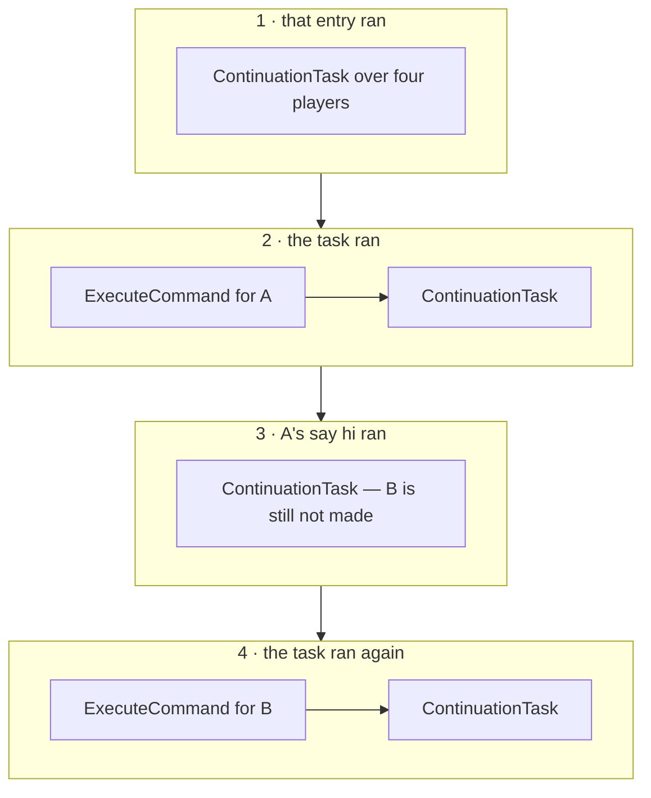

# The execution engine

> Verified against **Minecraft 26.3** · Part XIII · `/execute as @a at @s run say hi` on a server with four players: a command engine with no Java recursion, a fan-out that materialises one player at a time, and a `/return` that deletes work out of a queue rather than unwinding a stack.

Write a data pack that calls a function that calls itself, load it, and the
server does not crash. It runs a very large number of commands, logs one
line at *info*, and carries on. That is not a recursion limit — there is no
recursion limit, and no depth game rule either. What stopped it was a
*budget*: a count of units of work spent by one outermost command, whose
ceiling is a game rule and whose exhaustion is the log line. It is that
**nothing in command execution uses the Java call stack.**

Every construct that nests — `/execute … run`, `/function`,
`execute if function`, `/return run` — is expressed as *queued work* on a
heap-allocated deque, and the driver is a flat loop. A stack made of heap
objects costs you nothing except the obvious, and buys you three things a
real stack cannot give: you can inspect it, you can **delete** pending entries from it before they run, and a tracer can watch the work as it runs. `/return` and `/debug function` are built on that one decision.

## The cast

| class | what it decides | notes |
|---|---|---|
| `ExecutionContext` | one per outermost command: the queue, the staging list, the budget, the fork limit, the tracer | the whole engine is in its `ExecutionContext.runCommandQueue` loop |
| `CommandQueueEntry` | a `Frame` and an `EntryAction`. That is the entire unit of work | — |
| `Frame` | **not** a stack frame: a depth, a `CommandResultCallback` a `/return` feeds, and a `Frame.FrameControl` that knows how to delete this frame's pending work | one object shared by reference across a whole function body |
| `BuildContexts` | walks the stages of a parsed chain, forking sources as it goes | `BuildContexts.TopLevel`, `BuildContexts.Continuation` and `BuildContexts.Unbound` |
| `ContinuationTask` | the lazy fan-out: emits one element's entry, then re-queues itself | the reason three or more players cost one element's entry at a time rather than N at once |
| `CallFunction` / `IsolatedCall` | the only two things besides the top level that open a frame | `IsolatedCall`'s `/return` cannot reach the caller |
| `ExecutionCommandSource` | the interface the engine is generic over, which is why none of it mentions `CommandSourceStack` | `CommandSourceStack` implements it |
| `CommandResultCallback` | a success flag and an integer. This pair is what "the result of a command" means everywhere in the game | `CommandResultCallback.EMPTY` short-circuits |

`net/minecraft/commands/execution` is the whole engine and it is entirely
server-side. Nothing here crosses the network; only the *effects* of
commands produce packets. What arrives is a `ParseResults` and a
`CommandSourceStack` that [Brigadier and
commands](brigadier-and-commands.md#three-parsers-see-one-string) has already
built: `Commands.performCommand` flattens the parse into a context chain and
`Commands.executeCommandInContext` is the door — it reads the two game rules
that bound an execution, installs the context in a thread-local and drives
the loop.

## The queue, four moments apart

`/execute as @a at @s run say hi`, four players online. The command starts
as one entry — a `BuildContexts.TopLevel` holding the whole parsed chain, at
depth 0 — and the figure is the queue at the four moments after that.

```mermaid
flowchart TD
    subgraph T2["1 · that entry ran"]
        B1["ContinuationTask over four players"]
    end
    subgraph T3["2 · the task ran"]
        direction LR
        C1["ExecuteCommand for A"] --> C2["ContinuationTask"]
    end
    subgraph T4["3 · A's say hi ran"]
        D1["ContinuationTask — B is still not made"]
    end
    subgraph T5["4 · the task ran again"]
        direction LR
        E1["ExecuteCommand for B"] --> E2["ContinuationTask"]
    end
    T2 --> T3 --> T4 --> T5
```

*The whole queue at four moments — an arrow inside a panel runs from the head to the entry behind it, an arrow between panels is one entry run, every entry shown shares the top frame at depth 0, and `ExecuteCommand` here is the leaf task in `commands/execution/tasks`, not the `/execute` command's class of the same name.*

**A fork does not create frames, and it does not create entries.**
`BuildContexts.execute` walks every non-execute stage inside a *single*
queue entry, spending one cost unit per modifier stage — here *as @a* and
*at @s*, not *run* — no matter how many sources that stage produces, and turning a one-element source list into an
N-element one. Frames are opened in exactly three places:
`ExecutionContext.createTopFrame`, `CallFunction` and `IsolatedCall`. A
hundred-player fork opens none.

**The queue is a stack with a staging buffer, and that is what makes it
depth-first.** An action does not push directly: it appends to
`ExecutionContext.newTopCommands` while it runs, and
`ExecutionContext.pushNewCommands` splices that list onto the *head*
afterwards, in order. So whatever the current action spawned runs before
whatever was already pending — the semantics of a call stack, out of an
`ArrayDeque`. A queued action is handed the `ExecutionContext` itself. A custom executor or modifier is handed an `ExecutionControl` instead, the (context, frame) pair, through which it can queue an action, read or install a `TraceCallbacks`, and reach its current frame — which is how `/return` finds the frame it discards.

**The fan-out is lazy, and the arithmetic is exact.**
`ContinuationTask.schedule` queues nothing for an empty list, one entry for
one element, **two entries for two**, and for **three or more** queues
exactly one: a `ContinuationTask` that emits the current element's entry and
then re-queues itself behind it. Because staging preserves order, element *i* and everything it spawns runs to completion before element *i+1* runs — and, from three elements up, before it is even materialised. The queue cost is constant in N.

**A chain can split across entries, and only a custom modifier does it.**
When the stage walk meets a `CustomModifierExecutor` it hands off and
returns mid-walk; the rest of the chain resumes later as a
`BuildContexts.Continuation`. That is how `execute if function` and
`/return run` interrupt a chain that otherwise runs to its leaf inside one
entry.

## Deleting work, which is what `/return` is

`/return` does not unwind and does not throw. `Frame.returnSuccess` pushes
the value sideways into the callback the caller installed on that frame, and
`Frame.discard` splices the abandoned work out of the queue. There is no
search.

The splice is one rule. Call the discarding frame's own depth *d*: **pop
from the head while the entry's depth is at least *d***. That works because the queue is depth-first, so entries deeper
than a frame are always in front of that frame's own remaining entries —
which means the rule removes exactly the callee's pending work plus the rest
of this frame's body, and nothing older. Depth-zero frames are the special
case: their frame control clears the queue outright.

The laziness pays off here too. Discarding one `ContinuationTask` self-entry
abandons every element not yet materialised, so `/return` out of a
thousand-line function is the same cost as `/return` out of a two-line one.

Who installed the callback decides where a returned value goes, and two details settle it:

- The single-source reduction on the `/return run` path lives in
  `BuildContexts.execute`, not in `ReturnCommand`, and it is gated twice —
  on return mode, and on the leaf *not* being a `CustomCommandExecutor`. So
  `return run execute as @a run function foo` queues one function call per player, unreduced — and the first to finish, by returning or by falling through, discards the rest.
- The chaining runs the opposite way from "inner onto outer": what is
  chained is the *source's own* callback with the current frame's return
  consumer, and on the `/return run function` path the outer frame's
  consumer is chained **into** the inner frame.

## A result is a flag and a number, and only a function tag sums them

The result of a command is always a `CommandResultCallback` pair: a success
flag and an integer. The engine aggregates nothing, and there is one exception, which `/function` makes. A fork
over N players delivers N independent results to N sources, so an `execute store result` whose target every forked source shares — one placed before the fork, or one naming a fixed holder — writes N times and the last one wins — there is no
success count. The exception is `/function` on a *tag*, which sums its members' results, and only when the caller installed a real callback and it is not under `return run`.

A command typed in chat has an *empty* frame callback and
`Commands.performCommand` returns nothing — yet `execute store` still works
on it, because the result also reaches the **source's** own callback, which
is what `ExecuteCommand.wrapStores` decorated
([scores, teams and stored data](scoreboard-and-data.md)).
`FallthroughTask` makes a chain that produced no sources, or a called function that ended without `/return`, *fail* rather than return nothing, and every site that queues it is
inside a return or a conditional.

Six classes implement the escape hatch for a command that wants the engine
rather than Brigadier's plain "return an int", and between them they belong to four commands: `/function`, `/return`, `/debug` and `/execute`, whose `if function` is one. Two of the six
extend `CustomCommandExecutor.WithErrorHandling` —
`FunctionCommand.FunctionCustomExecutor` and
`DebugCommand.TraceCustomExecutor` — which routes a thrown
`CommandSyntaxException` to both the source's error handler *and* its
callback, so a failing `/function` under `execute store` still writes. The
other four handle their own.

## What actually stops a command

Three things end an execution before its work is done. One is an exception thrown out of an action, which `Commands.executeCommandInContext` passes up: `Commands.performCommand` tells the source the command failed, and `ServerFunctionManager.execute` only logs it. The other two are the budget running out and the queue overflowing, and they are not the same event.

**The budget runs out.** `ExecutionContext.runCommandQueue` checks at the top
of every iteration, logs at *info*, and breaks. The queue is **not** cleared;
it is simply abandoned with the context. Nothing reaches the player.

**The queue overflows.** `ExecutionContext.queueNext` trips when staged plus
queued entries exceed **ten million** — a cap on queue *length*, not on
depth, whatever the constant that names it suggests; `ExecutionContext.handleQueueOverflow`
clears *both* lists and sets a latch that silently drops every subsequent
queue attempt, and the driver then logs at **error**. Different level,
different clean-up, and a latch the budget path has no equivalent of.

### What the two numbers are

Both are game rules, and both are 65536 by default.
`GameRules.MAX_COMMAND_SEQUENCE_LENGTH` is the budget — how many units of
work one outermost command may spend before the budget path above fires — and
`GameRules.MAX_COMMAND_FORKS` is the fork limit, how many sources one stage
may contribute. **Both are read once, by the outermost command**, so a
`/gamerule` changed part way through a long fan-out does not take effect
until the next top-level command. (There is nothing dimensional in it:
`ServerLevel.getGameRules` returns the server's one `GameRules` instance, so
no level has rules of its own to pick up.) The fork limit is checked per
contributing source with a greater-or-equal comparison, so the effective
ceiling is one below the configured value, and when it trips the handler
returns without queueing even a `FallthroughTask` — a `/return run` chain
that hits it yields nothing at all rather than a failure.

Depth is not on that list, and that is the answer to the function at the top
of this page. **Recursion is unbounded structurally**: depth is used only to
order discards and to indent the tracer. What bounds a self-calling function
is the budget, transitively — every call it makes spends a unit — and what bounds a fan-out is the fork limit, with the budget again at one unit a leaf.

And a budget belongs to a *context*, not to a command.
`Commands.CURRENT_EXECUTION_CONTEXT` is a thread-local: a command that
starts another top-level execution *while one is running* queues its work into the running context, to run next, rather than making a new context, and the limits were read once by the outermost call. Its top frame sits one depth deeper than the running entry's, except under a depth-zero entry, where it shares depth zero; every vanilla re-entry is a function call whose body opens a frame one level further down, so its discards never reach the outer queue. The thread-local is null again the
moment a queue drains, so two commands run back to back each open their own
context — which is why every function in `#minecraft:tick` gets a budget of
its own ([functions and
macros](functions-and-macros.md#what-calls-a-function-and-when)).

### Where a unit is spent

The budget is spent in exactly three places — `BuildContexts` on a
modifier stage, `CallFunction` on a function call, and the leaf
`ExecuteCommand` task on an executed command — and the first has a gate
worth knowing. The increment happens only when the stage carries a non-null
redirect modifier, and only after the custom-modifier hand-off has been
ruled out. So a plain `execute run` costs nothing for its redirect, and **the `execute if function` and `/return run` stages are free**: neither custom modifier ever reaches the counter, though what they go on to run pays like anything else. A `ContinuationTask` is free too, and that is
the +1 an N-way fan-out does not pay: N leaves cost N, the continuation that
materialised them costs nothing, and each modifier stage that forked in the
first place was charged one unit, however many sources it produced.

## The two commands that are part of the engine

`ExecuteCommand.scheduleFunctionConditionsAndTest` is how `execute if
function` works and it is the cleverest thing in the area: instantiate each
function once, wrap every source in an `IsolatedCall` whose callback appends
that source to a list, then queue a `BuildContexts.Continuation` over *the
same mutable list*, which the isolated calls fill before the continuation
reads it. The staging order is what makes that safe, and the inner
`CallFunction` opens against the isolated frame, which is why a `/return`
inside a condition function cannot reach the caller.

`/debug function` installs a `DebugCommand.Tracer` on the whole `ExecutionContext` rather than per frame, so it traces everything in that context. The command refuses to nest a trace and refuses return mode, and the tracer implements `CommandSource` as well, so a traced
function's chat output lands in the trace file alongside the call lines.

## Questions players ask

**Can a function yield?** No. Work it queues drains inside the same driver
loop, in the same tick, before the call returns. The only escape is
`/schedule` ([functions and macros](functions-and-macros.md)).

**Why did my command fail silently inside `execute if`?** Because
conditionals are fork nodes. `execute as @s`, `execute at @s`,
`execute if block` and friends set the forked flag on `ChainModifiers` for
the rest of the chain, and **a forked source suppresses failure messages**.
Putting a harmless-looking conditional in front of a command converts its errors into nothing: in forked mode Brigadier catches a plain command's error and returns zero, which is all a trace shows of it, though the engine's own commands, a forked `/function` naming a missing function among them, still write their error to a trace through `CommandSourceStack.handleError`.

**Does `/return` inside a fork stop the other sources?** Not normally. A forked `/function` has its N calls queued at once, in a plain Java loop, and each opens its own frame at the next depth when it runs, so a `/return` in one discards only
that callee. It is `return run …` that sets `CallFunction.returnParentFrame` against the caller's own frame, making the inner discard run at the outer
frame's depth and delete the siblings.

## Where to look

`ExecutionContext` and `Frame` first — two short files that explain the whole design. Then `BuildContexts` for how a parse becomes work,
`ContinuationTask` for the laziness both the fan-out and the function body
ride on, and `ExecutionCommandSource` for why none of it names a command
source.

---

*Rules: names, never code · how the system works, not how the code reads ·
newest version only · every backticked name passes `tools/verify_names.py`.*
