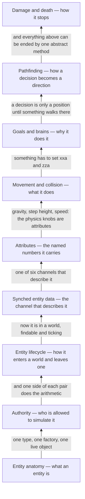

# VI · Entities

> Verified against **Minecraft 26.2** · Part VI · Everything in the world that is not a block: what one is, who is allowed to move it, how it is described to the other side, and how it stops.

Part V was about a position in a chunk section changing its mind. This part
is about everything that is *not* in the grid — the zombie, the arrow, the
boat, the dropped pickaxe, the invisible marker a data pack left as a
bookmark. They share one base class that is deliberately thin *on behaviour*,
one numbered array for telling clients about themselves, one bag of named numbers, one
collision resolver and one abstract method for being hurt. A player
recognises the part by the things that seem inconsistent about it: a mob
glides where your own movement is crisp, a sheared sheep changes on every
screen at once, a mob you named never despawns, and a hit that lands during
the red flash does nothing at all. Every one of those is the same question in
a different costume — **which of the two programs is allowed to decide
this?**

## The shape of the part

Part VI is a ladder. Each page needs the one below it and nothing above it,
and the second rung is the one everything else leans on.

One dependency runs forward instead of back, and it is Part X's rather than
this part's: [the client level](../client/the-client-level.md) opens by saying
it is *not* an authority either, which only lands once
[authority](authority.md) has said what one is. So this part is watched first,
and nothing here waits on Part X.

## Before you start

[The level tick](../server/server-level-tick.md), because half this part's
surprises are claims about *which phase* something ran in — the entity phase
runs *after* the phase that broadcasts entity changes, and that one ordering
explains why an attribute change is a tick late while a sheep sheared out of
the packet queue, before the tick proper, is not. [Tickets and
loading](../world/tickets-and-loading.md), because whether an entity ticks at
all is a property of the chunk it is standing in — for everything except a
player, which is exempt — and [chunk anatomy](../world/chunk-anatomy.md) for the heightmaps that decide
where a mob may spawn. [Points of interest](../world/points-of-interest.md),
because a villager's whole day is claims on them and [goals and
brains](ai-goals-and-brains.md) draws `PoiManager` as a lane rather than
explaining it. [Blocks and states](../blocks/blocks-and-states.md) for the shapes that entities collide
with, and Part IV's *scheduled ticks* is *not* needed — entities keep no
appointment book.

One more Part IV page, for one lecture: [environment attributes and
timelines](../world/environment-attributes-and-timelines.md) before [goals
and brains](ai-goals-and-brains.md). A villager's schedule is a data-pack
`Timeline` looked up at a position, and this part asks that system a
question rather than teaching it.

## Watch in this order

1. [Entity anatomy](entity-anatomy.md) — one `EntityType` from the registry,
   through a factory, to a live object the level ticks. The registry's
   default is a pig, and that default reaches the network and never reaches
   your save file.
2. [Authority](authority.md) — a zombie, a player and a boat each take one
   step on both sides. The client runs no physics at all for the mob chasing
   you, and the server runs your own player's physics every tick and then
   overwrites the answer with a number you sent it.
3. [Entity lifecycle](entity-lifecycle.md) — a zombie appears in the dark,
   is ticked for a while, and is either forgotten or written to disk. The
   spawner rolls one height per category per chunk per tick, so caves and the
   open field compete for the same slice.
4. [Synched entity data](synched-entity-data.md) — a sheep is sheared and
   every screen in range agrees within the tick. The slot the wool lives in
   is written nowhere in `Sheep`: it is 18 because eighteen slots were handed
   out above it, and the packet stops at 254 because 255 means stop.
5. [Attributes](attributes.md) — Strength II lands, and no packet is sent at
   all. Eight of the forty attributes never reach the client, and attack
   damage is one of them.
6. [Movement and collision](movement-and-collision.md) — one tick of a
   falling zombie. The mover answers *what did I walk through* afterwards, by
   replaying the tick's movement, which is why fire and water touched in one
   step always end in the extinguish.
7. [AI: goals and brains](ai-goals-and-brains.md) — a villager's day, and the
   same machinery under a zombie that has none of it. Schedules are gone: a
   villager goes to bed because it asked the world what time it is where it
   is standing.
8. [Pathfinding](pathfinding.md) — the other half of the same lecture. Giving
   up is machinery: the node being walked towards carries a timeout, and the
   mob you watch walk into a wall and then wander off is running a scheduled
   surrender.
9. [Damage and death](damage-and-death.md) — the part's closer. An arrow, a
   dozen multiplications and one abstract method. A hit that lands inside the
   red flash usually does nothing at all, and when it is stronger than the
   last, only its excess lands — silently.

## Reference this part uses

Three of them were written for this part.
[Attributes](../../reference/attributes.md) — all forty, with defaults,
ranges and the syncable flag. [Entity data
serializers](../../reference/entity-data-serializers.md) — all 43, in wire-id
order. [Damage outside `LivingEntity`](../../reference/non-living-damage.md)
— what each of the twenty-one non-living classes does when you hit it. Then
[packets](../../reference/packets.md), [registries](../../reference/registries.md),
[game rules](../../reference/gamerules.md), [math and
primitives](../../reference/math-and-primitives.md) and [diagram
lanes](../../reference/lanes.md).

The part stops at `Avatar`, the class 26.2 inserted below `Player`:
everything player-shaped is Part VIII, drawing an entity is Part XI, and the
prediction ledger behind the blocks you place is Part X.

---

*Rules: names, never code · how the system works, not how the code reads ·
newest version only · every backticked name passes `tools/verify_names.py`.*
