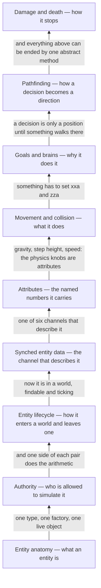

# VI · Entities

> Verified against **Minecraft 26.2** · Part VI · Everything in the world that is not a block: what one is, who is allowed to move it, how it is described to the other side, and how it stops.

A zombie glides where your own movement is crisp. A sheared sheep changes on
every screen at once. A mob you named never despawns, a hit that lands during
the red flash usually does nothing, and Strength II raises your damage without
a single packet leaving the server. Those are five different systems and one
question: **which of the two programs is allowed to decide this, and how does
the other one find out?** Part VI is that question asked about everything in
the world that is not in the grid — the zombie, the arrow, the boat, the
dropped pickaxe, the invisible marker a data pack left as a bookmark. They
share one base class that is deliberately thin *on behaviour*, one numbered
array for telling clients about themselves, one collision resolver and one
abstract method for being hurt; the living ones share a bag of named numbers
besides.

## Where the part stops, and how much of it there is

This is the largest part of the book —
{{#include ../../generated/part-entities.md}} in `world/entity` (less
`world/entity/player`), `network/syncher`, `world/level/pathfinder`,
`world/damagesource` and `world/effect` — and about 40% of those lines are
named on no page in the book at all. That is the right answer rather than a
gap: the bulk of them are one class per species, and a species is the *same*
nine pages instantiated. `Panda` is 1,121 lines of `Mob` with a sitting
animation; `AbstractHorse` is 1,114 lines of `Mob` with an inventory; the 103
classes under `world/entity/ai/behavior` and the 61 under
`world/entity/ai/goal` are one shape each, described once on [goals and
brains](ai-goals-and-brains.md#what-holds-the-state). The part explains the
machine and declines to enumerate its instances.

Four mechanisms in these packages are more than a species and are still
explained nowhere: the minecart's two movement models, the ender dragon's
sixteen flight phases, a raid, and villager gossip. A second edition should
take them; this one names them and says so.

The part also stops at `Avatar`, the rung 26.2 inserted **above** `Player`:
everything player-shaped is Part VIII, drawing an entity is Part XI, and the
prediction ledger behind the blocks you place is [Part
X](../client/prediction-and-acks.md#the-four-writes).

## The shape of the part

Part VI is a ladder. Each page needs the ones below it and nothing above
them, and the second rung is the one everything else leans on — including
three later parts, which link back to *authority* rather than re-deriving it.

Two of the nine rungs are pairs rather than sequels. *Synched entity data*
and *attributes* are two channels doing the same job differently, and the
contrast is the lesson, so the second wants the first fresh in mind.
*Pathfinding* is the other half of *goals and brains* and watchable on its
own once that page has said where a wanted position comes from.

One dependency runs forward instead of back, and it is Part X's rather than
this part's: [the client level](../client/the-client-level.md) opens by saying
it is *not* an authority either, which only lands once
[authority](authority.md#five-predicates-and-the-final-one-the-other-four-hang-off)
has said what one is. So this part is watched first, and nothing here waits on
Part X.

## Before you start

[The level tick](../server/server-level-tick.md#the-broadcast-which-is-why-entities-are-a-tick-behind),
because half this part's surprises are claims about *which phase* something
ran in — the entity phase runs *after* the phase that broadcasts entity
changes, which is why an attribute change waits for the next tick the entity's
update interval allows, while a sheep sheared out of [the packet
queue](../server/server-tick.md#every-packet-since-last-time-in-one-drain),
before the tick proper, does not. [Tickets and
loading](../world/tickets-and-loading.md#the-four-statuses), because whether an
entity ticks at all is a property of the chunk it is standing in — for
everything except a player, which is exempt — and [chunk
anatomy](../world/chunk-anatomy.md#the-six-heightmaps) for the heightmaps that
decide where a mob may spawn. [Points of
interest](../world/points-of-interest.md#a-ticket-is-a-claim-nothing-enforces),
because a villager's whole day is claims on them and [goals and
brains](ai-goals-and-brains.md) draws `PoiManager` as a lane rather than
explaining it. [Blocks and
states](../blocks/blocks-and-states.md#four-decisions-four-lookups) for the
shapes that entities collide with, and Part IV's *scheduled ticks* is *not*
needed — entities keep no appointment book.

One more Part IV page, for one lecture: [environment attributes and
timelines](../world/environment-attributes-and-timelines.md#the-four-timelines)
before [goals and brains](ai-goals-and-brains.md). A villager's schedule is a
data-pack `Timeline` looked up at a position, and this part asks that system a
question rather than teaching it.

## Watch in this order

1. [Entity anatomy](entity-anatomy.md) — one `EntityType` from the registry,
   through a factory, to a live object the level ticks. The registry's
   default is a pig, and that default reaches the network and never reaches
   your save file.
2. [Authority](authority.md) — a zombie, a player and a boat each take one
   step on both sides. The client runs no physics at all for the mob chasing
   you, and the server runs your own player's physics every tick and then
   throws the answer away.
3. [Entity lifecycle](entity-lifecycle.md) — a zombie appears in the dark,
   is ticked for a while, and is either forgotten or written to disk. The
   spawner rolls one height per category per chunk per tick, so caves and the
   open field compete for the same slice.
4. [Synched entity data](synched-entity-data.md) — a sheep is sheared and
   every screen in range agrees within the tick. The slot the wool lives in
   is written nowhere in `Sheep`: it is 18 because eighteen slots were handed
   out above it, and the ids stop at 254 because 255 means stop.
5. [Attributes](attributes.md) — Strength II lands, and no packet is sent at
   all. Eight of the forty attributes never reach the client, and attack
   damage is one of them.
6. [Movement and collision](movement-and-collision.md) — one tick of a
   falling zombie. The mover answers *what did I walk through* afterwards, by
   replaying the tick's movement, which is why fire and water touched in one
   step always end in the extinguish.
7. [AI: goals and brains](ai-goals-and-brains.md) — a villager's day, and the
   same machinery under a zombie that has none of it. Schedules are gone: a
   villager goes to bed because it asked the world what time it is where it
   is standing.
8. [Pathfinding](pathfinding.md) — the other half of the same lecture. Giving
   up is machinery: the node being walked towards carries a timeout, and the
   mob you watch walk into a wall and then wander off is running a scheduled
   surrender.
9. [Damage and death](damage-and-death.md) — the part's closer, and it
   assumes nothing above it. An arrow, a dozen owners of one number, and one
   abstract method. A hit that lands inside the red flash usually does nothing
   at all, and when it is stronger than the last, only its excess lands —
   silently.

## Reference this part uses

Three were written for this part.
[Attributes](../../reference/attributes.md) — all forty, with defaults,
ranges and the syncable flag, generated from the registrations.
[Entity data serializers](../../reference/entity-data-serializers.md) — all
43, in wire-id order, which is registration order.
[Damage outside `LivingEntity`](../../reference/non-living-damage.md) — what
each of the twenty-one non-living classes does with a `DamageSource`, on
either side.

Then the shelf the whole book shares:
[packets](../../reference/packets.md),
[registries](../../reference/registries.md),
[game rules](../../reference/gamerules.md) — eleven of which this part's pages
read — [math and primitives](../../reference/math-and-primitives.md) for
`AABB` and `VoxelShape`, [the glossary](../../reference/glossary.md),
[threads](../../reference/threads.md) and [diagram
lanes](../../reference/lanes.md).

---

*Rules: names, never code · how the system works, not how the code reads ·
newest version only · every backticked name passes `tools/verify_names.py`.*
