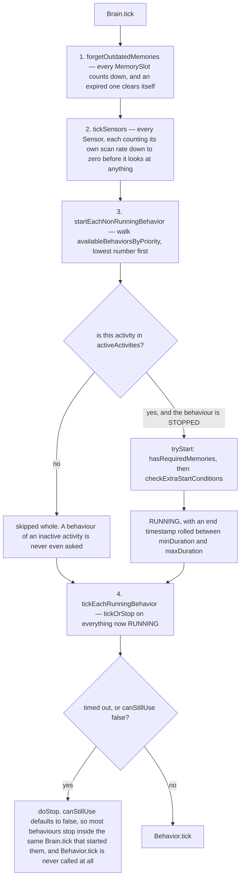
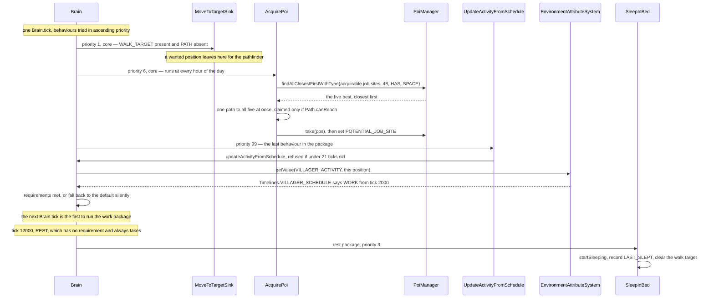

# AI: goals and brains

> Verified against **Minecraft 26.2** · Part VI · A villager's day — wake, claim a job site, work, meet at the bell, walk home to bed — and the same tick under a zombie that has none of it.

It is dawn in a village. One villager climbs out of bed, walks to its
composter and works there until the bell rings. Ten blocks away a zombie
catches fire, sees the villager, and comes for it. Both are `Mob`s, both are
driven by the same `Mob.serverAiStep` on the server thread, and neither is
running a script: each is being *re-asked*, every tick or every other tick,
what it would like to be doing now. They are asked in two completely
different ways, and the villager's is the surprising one. Its day looks like
a timetable, and a reader who goes hunting for the class holding that
timetable will not find one — *Schedule* does not exist in 26.2. A `Brain`
holds an `EnvironmentAttribute` of `Activity`, a pointer into the *world*
rather than a table on the mob, and `Brain.updateActivityFromSchedule` asks
the `EnvironmentAttributeSystem` what that attribute's value is **at this
position, at this time**. The villager goes to bed because it asked the world
what hour it is *where it is standing*. The answer comes out of a data-pack
`Timeline` — `Timelines.VILLAGER_SCHEDULE`, a 24000-tick loop whose adult
track reads *10 idle, 2000 work, 9000 meet, 11000 idle, 12000 rest* beside a
baby track that swaps *play* in — and because the lookup takes a position,
the day can in principle differ by location. That system is [environment
attributes and
timelines](../world/environment-attributes-and-timelines.md); this page only
asks it a question.

## The cast

| class | what it decides | thread |
|---|---|---|
| `GoalSelector` | which goals run, by holding a four-entry table of `Goal.Flag` to the goal that owns it | server, from `Mob.serverAiStep` |
| `Goal` | whether it wants to run, whether it may be interrupted, and which flags it needs | as above |
| `WrappedGoal` | the arbitration — `WrappedGoal.canBeReplacedBy` — plus the priority and the running bit | as above |
| `Brain` | which activity is active, what the memories hold, and which behaviours are asked at all | server, from `Mob.customServerAiStep` |
| `MemoryModuleType` | the vocabulary a brain thinks in: 116 constants, of which the 53 with a codec are the mob's entire saved mind | declared, never ticked |
| `Sensor` | when to look at the world, on its own scan rate, and which memories to write | server, from `Brain.tick` |
| `ActivityData` | one activity's prioritised behaviour list, its memory requirements, and the memories erased when it stops | built per body by `Brain.ActivitySupplier` |
| `Sensing` | whether this mob can see that entity, memoised for exactly one tick — and *both* systems go through it | server, cleared at the top of `Mob.serverAiStep` |

## Seven things they do differently

|  | the goal selector | the brain |
|---|---|---|
| **what holds the state** | `GoalSelector.availableGoals`, an insertion-ordered set of `WrappedGoal`, beside a lock table and a set of disabled flags | a memory map, a sensor map, and `Brain.availableBehaviorsByPriority` — priority to activity to behaviour set |
| **what fills it** | `Mob.registerGoals`, once, from the constructor, and only when the level is a `ServerLevel` | `Brain.Provider.makeBrain`, from an activity list built *per body* — and built again whenever the body changes |
| **what decides** | `Goal.canUse`, re-asked on every other tick | `Behavior.hasRequiredMemories` then `Behavior.checkExtraStartConditions`, asked once a tick |
| **what arbitrates** | the flag table. Lower priority number wins a contested flag, and a non-interruptable incumbent wins outright | the active activity. A behaviour whose activity is not active is not asked at all |
| **what persists across a save** | nothing. Not the running set, not the flags | 53 of the 116 memories, through `Brain.Packed` |
| **what the world can push in** | `Mob.updateControlFlags` every five ticks, and the leash, both on one selector only | the schedule attribute, POI claims, hostiles seen by sensors, `Attributes.FOLLOW_RANGE` |
| **which mobs use it** | every `Mob`. 58 goal classes and 10 targeting ones | 20 classes override `LivingEntity.makeBrain` — but only `Villager` sets a schedule |

Every row below is one of those lines, taken in turn.

### Where both of them sit in one mob tick

The profiler section names, because they are what a profile actually shows:

```
LivingEntity.tick
  LivingEntity.aiStep
    "ai"               the guard: server side, and Mob.isEffectiveAi
      "newAi"          Mob.serverAiStep
        "sensing"        Sensing.tick — the line-of-sight memo is cleared
        "targetSelector" ┐ GoalSelector.tick on the full pass,
        "goalSelector"   ┘ tickRunningGoals(false) on the off tick
        "navigation"     PathNavigation.tick — see pathfinding
        "mob tick"       Mob.customServerAiStep → "villagerBrain" → Brain.tick
        "controls"       "move" / "look" / "jump"
    "jump"             LivingEntity's own jump handling — outside the guard
    "travel"           LivingEntity.travel — where the body actually moves
  "headTurn"           Mob.tickHeadTurn — no side check, so both sides
```

Note the scope of that guard. `LivingEntity.aiStep` runs on the client too;
what it wraps in *server side and effective AI* is the one call to
`Mob.serverAiStep`, not the jump and travel sections beneath it.
`Mob.isEffectiveAi` is the more interesting half of the condition, because
`Mob` narrows it with `Mob.isNoAi` — which is where the *NoAI* tag takes
effect. On the client neither selector nor brain is ticked at all — only the
jump, travel and head-turn sections beneath the gate, and the debug
renderers.

## What holds the state

`GoalSelector` holds three things and none of them is a plan: a set of
`WrappedGoal`, a map from `Goal.Flag` to the goal currently holding it, and
a set of flags that have been switched off. There is no state machine and no
sequence. The only persistent state a goal system has is *which goals are
running* and *which flags are held*, and a `Mob` keeps two independent
copies of it, `Mob.goalSelector` and `Mob.targetSelector`.

A `Brain` holds a great deal more, and the piece to keep hold of is
`Brain.availableBehaviorsByPriority`: a sorted map from priority, to
activity, to a set of `BehaviorControl`. Priority is the *outer* key, so the
whole brain is walked in priority order regardless of which activity a
behaviour belongs to. Beside it sit the memory map, the sensor map, the
per-activity requirements, the per-activity erase lists, the core
activities, the active set and a default of `Activity.IDLE`.

Two things about ownership surprise people. `Brain` is declared on
`LivingEntity`, not on `Mob` — *every* living entity has one, the player
included, and the base implementation hands back an empty one that reports
itself `Brain.isBrainDead`. And the activity list is not static:
`Brain.ActivitySupplier` is asked for it **per body**, which is how a
villager's profession selects its work package.

## What fills it

Goals go in exactly once. The `Mob` constructor calls `Mob.registerGoals`
only when the level it is being built into is a `ServerLevel`, so a
client-side mob's selectors are empty for its whole life. After that the set
is fixed, but for the few mobs that add or remove a goal on a state change.

Memories are filled continuously, by sensors and by behaviours alike. A
`Sensor` looks at the world and writes what it saw: the default scan rate is
20 ticks (`Sensor.DEFAULT_SCAN_RATE`), `GolemSensor` uses 200 and
`SecondaryPoiSensor` 40, and `Sensor.randomlyDelayStart` offsets each one at
construction so a village does not scan in lockstep. What *registers* a
memory slot is declaring it — every memory a sensor lists in
`Sensor.requires` and every memory a behaviour names in its entry condition
is registered when the brain is built. Reading one that was never registered
throws *Unregistered memory fetched*: a behaviour has been installed on a mob
that has no idea what it is talking about.

The two systems share one piece of machinery here, and it is easy to file
under the wrong heading. `Sensing` is the per-mob line-of-sight memo, cleared
once per tick at the top of `Mob.serverAiStep`, and it is not the goal
system's alone: `TargetingConditions.test` routes every line-of-sight check
through `Mob.getSensing`, and the shared conditions the brain's sensors use
have that check on by default.

Those shared conditions deserve a second look. `Sensor` holds **six** static
`TargetingConditions` objects, used by every brain mob in the world, and
re-ranges all six from *this* body's `Attributes.FOLLOW_RANGE` immediately
before every scan. That is correct only because AI is strictly
single-threaded — there is not a future, an executor or a thread anywhere in
the AI packages — and it is about as clear a demonstration of the fact as the
codebase offers.

## What decides

A goal is asked `Goal.canUse` **every other tick**, staggered across mobs by
`tickCount + id`, with an exception for a mob's first two ticks, where the
full pass runs whatever the parity. On the off tick
`GoalSelector.tickRunningGoals` is called with *false*, so only goals that
answer `Goal.requiresUpdateEveryTick` are ticked at all — and, more
importantly, **no goal is stopped**, because the `Goal.canContinueToUse`
sweep lives in the full pass. A goal that lost its reason to run on an off
tick keeps running until the next even one.

The full pass, `GoalSelector.tick`, is three phases, and they are the next
level down in a profile. *goalCleanup* stops every running goal that either
holds a now-disabled flag or fails `Goal.canContinueToUse`, then drops every
lock whose holder is no longer running. *goalUpdate* walks the set again and
starts anything that is not running, holds no disabled flag, can take all its
flags, and answers `Goal.canUse`. *goalTick* — reached through
`GoalSelector.tickRunningGoals` with *true* — ticks the survivors.

A behaviour is asked once per tick, and the first question is not about the
behaviour at all. `Brain.tick` runs four fixed phases:



The branch marked *skipped whole* is what this page turns on. **An activity
is a filter, not a mode.** The brain's active set is always the core
activities plus exactly one other, so `Activity.CORE` behaviours run at every
hour of the day and switching activity only swaps the second half. (*Core
activities* is plural in the API and singular in practice: nothing in 26.2
calls `Brain.setCoreActivities` with anything but `Activity.CORE` alone.)

The *canStillUse* branch is sharper than "a behaviour runs for one tick".
`Behavior.canStillUse` defaults to false, and phases 3 and 4 are both inside
the *same* `Brain.tick` — so for a behaviour that does not override it,
`Behavior.tick` is not called once. Everything it does, it does in
`Behavior.start`. The duration rolled at start between the behaviour's
minimum and maximum (`Behavior.DEFAULT_DURATION` is 60) matters only for the
ones that do override it, which is why the same behaviour class configured
with different bounds behaves differently in two packages.

## What arbitrates

On the goal side, **the flag table is the arbiter, not the priority list**.
`GoalSelector.availableGoals` is insertion-ordered and never sorted; priority
only settles a contested flag. Two goals with no flag in common run together
whatever their numbers, and two that share one never do.
`WrappedGoal.canBeReplacedBy` is the whole rule: the incumbent must answer
`Goal.isInterruptable`, and the challenger's number must be strictly lower.

There is a small piece of craft in how that is arranged. `GoalSelector` never
puts a placeholder in its lock table; it reads the table with a *default* — a
sentinel `WrappedGoal` of maximum priority that reports itself not running —
so *this flag is free* and *this flag is held by someone worse than me* are
the same `WrappedGoal.canBeReplacedBy` call on an entry that may not exist.

On the brain side the arbiter is the active set, and the fallback is silent.
`Brain.setActiveActivityIfPossible` checks the target activity's memory
requirements and, if they do not hold, calls `Brain.useDefaultActivity`
instead. A jobless villager at tick 2000 is not "off schedule": the switch to
`Activity.WORK` fails its `MemoryModuleType.JOB_SITE` requirement and the
villager is idle by construction. Switching is also not free — the brain
first erases, for every activity leaving the set, the memories that
activity's `ActivityData` names as *memoriesToEraseWhenStopped*. It is one of
the few places the brain mutates state rather than reading it.

## What persists across a save

A goal system saves nothing. Which goals were running, which flags were held,
how far through an attack a mob was — all of it is rebuilt from scratch when
the chunk reloads and the constructor calls `Mob.registerGoals` again.

A brain saves `Brain.Packed`, and `Brain.pack` walks the memories keeping
only those whose `MemoryModuleType` can serialise: 53 of 116, the remaining
63 transient by construction. Time-to-live travels with them, so a memory can
expire across a reload as easily as within a tick — `MemorySlot` counts down
in phase 1 of every `Brain.tick` and clears itself at zero.

The reason `Brain.Packed` exists as a first-class shape is that a brain is
built more than once in a mob's life. `Villager.refreshBrain` stops every
running behaviour, packs the current memories, and runs the provider again
from the packed state with a fresh activity list. Changing profession does
that; so does growing up, which is how a baby swaps
`EnvironmentAttributes.BABY_VILLAGER_ACTIVITY` for
`EnvironmentAttributes.VILLAGER_ACTIVITY`.

## What the world can push in

Into a goal selector, two things. The first is `Mob.updateControlFlags`,
called from `Mob.tick` on the server every five ticks. It sets
`Goal.Flag.MOVE` and `Goal.Flag.LOOK` from one question — *is a `Mob`
steering me* — and `Goal.Flag.JUMP` from that **and** *am I in an
`AbstractBoat`*. So a mob a mob is riding loses all three, and a mob sitting
in a boat by itself loses only the jump. The second is the leash:
`Mob.leashTooFarBehaviour` disables `Goal.Flag.MOVE` outright and
`PathfinderMob.closeRangeLeashBehaviour` puts it back. Both touch
**`Mob.goalSelector` only**; `Mob.targetSelector` is never disabled.
`GoalSelector.tick` then stops any running goal holding a disabled flag and
refuses to start another.

Into a brain, rather more: the schedule attribute, whose value comes from the
world; hostiles, players, items, beds and golems, all written by sensors that
query the level; and POI claims, which go through the shared `PoiManager`
([points of interest](../world/points-of-interest.md)). Beyond that, a change
to `Attributes.FOLLOW_RANGE` or `Attributes.TEMPT_RANGE` reaches
`Mob.onAttributeUpdated`, which recomputes the pathfinder's node budget
([attributes](attributes.md), [pathfinding](pathfinding.md)).

**Neither of them crosses the network.** There is no AI packet. What a client
sees are consequences — head rotations, motion, position deltas, pose
changes, the occasional entity-event byte — plus a debug channel that costs
nothing until someone subscribes: `Mob.registerDebugValues` registers
`DebugSubscriptions.ENTITY_PATHS` and `DebugSubscriptions.GOAL_SELECTORS` for
every mob, and `DebugSubscriptions.BRAINS` only for one that is not
brain-dead.

Nor is either of them data-driven. The villager's day is data
(`Timelines.VILLAGER_SCHEDULE` in `Registries.TIMELINE`) — but
`VillagerProfession` and `PoiType` are not: both are `BuiltInRegistries`
bootstrapped from code, with no directory under the built-in data pack. And
**behaviours and goals are code** too,
plain Java lists in `VillagerGoalPackages` and the `*Ai` classes, not
registered and not addressable from a data pack.

## Which mobs use which

Every `Mob` has both fields, and almost every mob uses exactly one. Twenty
classes override `LivingEntity.makeBrain` — `Villager`, `Piglin`, `Warden`,
`Hoglin`, `Frog`, `Allay`, `Axolotl`, `Goat` and twelve more — and each keeps
its behaviour lists in a class named for the mob: `PiglinAi`, `WardenAi`,
`FrogAi`. There are eighteen such classes for twenty mobs, and the two
exceptions are worth naming. `Zoglin` keeps its lists inline, in the mob
itself. And `Villager`'s live in `VillagerGoalPackages` — genuinely the 26.2
name, and not a typo: it is the last survivor of the old convention, on a
mob that has no goals at all. Nor do most of the other nineteen: a brain mob
typically registers none.

**One** — brain mobs with a schedule. `Brain.setSchedule` has exactly two
call sites and both are in `Villager`, picking the adult attribute or the
baby one. The other nineteen never consult a clock: they call
`Brain.setActiveActivityToFirstValid`, which walks a priority list and takes
the first activity whose memory requirements hold. That is how `PiglinAi`
picks *fight* over *idle* and `FrogAi` picks *tongue* over *swim*, with no
time of day involved anywhere.

## The brain's trace: a villager's day



Read the priorities in that diagram as the ordering claims they are. The
schedule behaviour sits at 99, the last slot in every package that has one,
so the activity a villager switches to is never the one the rest of *this*
tick runs: the switch lands and the next tick acts on it. And it is only
consulted when a behaviour asks — `Brain.updateActivityFromSchedule` refuses
if fewer than 21 ticks have passed since the last one (the test is a strict
*greater than* 20). Five of the ten packages carry no such behaviour: core,
panic and hide have nothing at 99, pre-raid and raid have `ResetRaidStatus`
there instead. The omission is how they pin the
villager, and each of the three carries its own way out rather than leaving it
to the clock: `VillagerCalmDown` sits at priority 0 in the panic package and
calls `Brain.updateActivityFromSchedule` itself the moment the fear memories
clear, `SetHiddenState` does the same for hide, and `ResetRaidStatus` for the
two raid packages. Nothing is asking the clock on a schedule; the escape
hatch asks once, on its own terms.

The rest of the day hangs off that. **Claiming a job site** is `AcquirePoi`
from the core package: it asks `PoiManager.findAllClosestFirstWithType` for
free points of interest matching the profession within 48 blocks, takes the
best five, and runs a single pathfind with all five as targets at once — and
it claims only one the villager can actually *reach*, testing `Path.canReach`
before `PoiManager.take` ([pathfinding](pathfinding.md)). A bell across a
ravine is invisible to a villager. What it writes is
`MemoryModuleType.POTENTIAL_JOB_SITE`, not the job site itself;
`AssignProfessionFromJobSite` waits until the villager is within two blocks
of that position, then erases the memory, writes `MemoryModuleType.JOB_SITE`
and sets the profession — which is why walking to the workstation is a
required step and not decoration.

**Work** is a weighted `RunOne` over six: `WorkAtPoi` (or `WorkAtComposter`),
`StrollAroundPoi`, `StrollToPoi`, `StrollToPoiList`, `HarvestFarmland` and
`UseBonemeal`;
`WorkAtPoi` wants 300 ticks since the last check and 1.73 blocks or less to
the workstation. **Walking anywhere** is `MoveToTargetSink`, entered on *walk
target present, path absent*: it turns a `MemoryModuleType.WALK_TARGET` into
a path, hands it to the navigation, and records a failure as
`MemoryModuleType.CANT_REACH_WALK_TARGET_SINCE`. Below that hand-off is
[pathfinding](pathfinding.md) and then [movement and
collision](movement-and-collision.md). **Bed** is `SleepInBed`: a bed within
two blocks, unoccupied, in the right dimension, at least 100 ticks since it
was last woken. It never times out — it ends because `Brain.isActive` for
`Activity.REST` goes false at dawn and the core `WakeUp` behaviour calls
`LivingEntity.stopSleeping`.

## The goal selector's trace: the zombie

A `Zombie` has a `Brain`, because every `LivingEntity` does, but it is the
base one — no memories, no sensors, no behaviours, `Brain.isBrainDead` true.
Everything it will ever do comes out of `Mob.registerGoals`, run once in the
constructor: **seven** goals in `Mob.goalSelector` — a turtle-egg attack
goal, a `SpearUseGoal`, a `ZombieAttackGoal`, a `MoveThroughVillageGoal`, a
`WaterAvoidingRandomStrollGoal`, a `LookAtPlayerGoal` and a
`RandomLookAroundGoal` — and **five** in `Mob.targetSelector`, one
`HurtByTargetGoal` and four `NearestAttackableTargetGoal`s.

Every other tick each of the twelve is re-asked, and the flag table settles
it. The target goals hold `Goal.Flag.TARGET` and write `Mob.setTarget`. The
attack goals hold `Goal.Flag.MOVE` and `Goal.Flag.LOOK` and drive the
navigation, with `SpearUseGoal` at priority 2 sitting above `ZombieAttackGoal`
at 3, so it is usually the one holding them. `LookAtPlayerGoal` wants
`Goal.Flag.LOOK` alone and `RandomLookAroundGoal` wants `Goal.Flag.MOVE` as
well, and both lose to whoever already has them. No activity, no schedule,
nothing persisted, nothing the world can push in: the zombie's entire mind is
a handful of running bits and one target field. Even that field is not read
directly — `Mob.getTarget` filters through `Mob.asValidTarget` on every call,
so a target that turned creative or spectator is gone the moment it is asked
for, and brain mobs source theirs from `Mob.getTargetFromBrain` instead.

## Questions players ask

**Why does a ridden mob stop moving on its own but still glare at me?**
Because `Mob.updateControlFlags` disables `Goal.Flag.MOVE`, `Goal.Flag.JUMP`
and `Goal.Flag.LOOK` on `Mob.goalSelector` and never touches
`Mob.targetSelector`. Target selection is a separate `GoalSelector` with its
own lock table, and nothing in the game switches it off. A boat alone does
less than people expect: it costs the mob only `Goal.Flag.JUMP`.

**Why did the villager ignore a perfectly good workstation?** Either it could
not reach it — `AcquirePoi` pathfinds before it claims, and an unreachable
site is skipped — or it claimed it and has not walked there yet, in which
case the memory still says *potential* job site and the profession has not
changed. `PoiCompetitorScan` will also hand a contested claim to the more
experienced villager, and `ValidateNearbyPoi` erases it if the block is gone.

**Why does a spooked villager stay spooked past bedtime?** Because the
schedule does not push, it is pulled — and the panic package has nothing at
priority 99 to pull it. `VillagerCalmDown` is what lets the clock back in.

## Where to look

`GoalSelector.tick` · `WrappedGoal.canBeReplacedBy` · `Goal.Flag` ·
`Mob.registerGoals` · `Mob.serverAiStep` · `Mob.updateControlFlags` ·
`Sensing` · `TargetingConditions.test` · `Brain.tick` ·
`Brain.updateActivityFromSchedule` · `Brain.setActiveActivityIfPossible` ·
`Brain.setActiveActivityToFirstValid` · `Brain.Provider` · `Brain.Packed` ·
`ActivityData` · `MemoryModuleType` · `MemorySlot` · `Sensor` ·
`Behavior.tryStart` · `Behavior.canStillUse` · `BehaviorBuilder` ·
`GateBehavior` · `RunOne` · `VillagerGoalPackages` · `Villager.refreshBrain` ·
`AcquirePoi` · `MoveToTargetSink` · `SleepInBed` · `Timelines.VILLAGER_SCHEDULE`

---

*Rules: names, never code · how the system works, not how the code reads ·
newest version only · every backticked name passes `tools/verify_names.py`.*
