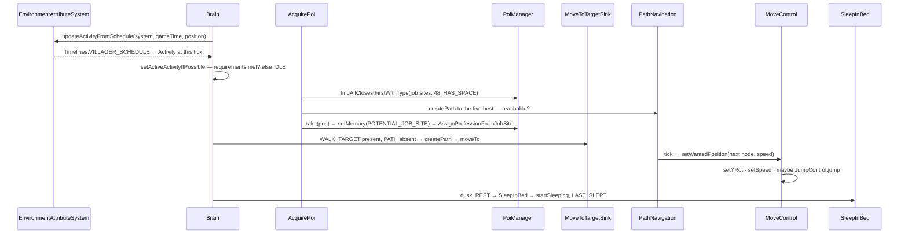

# AI: goals, brains and pathfinding

> Verified against **Minecraft 26.2** · Part VI · A villager's day — wake, claim a job site, work, socialise at the bell, walk home to bed — and the same machinery under a zombie that has none of it.

## Responsibility

Two decision systems coexist. The **goal selector** is the old one: a bag of
`Goal` objects, each asked every other tick whether it wants to run, with a
four-flag lock table deciding who wins. The **brain** is the newer one:
memories filled by sensors, behaviours grouped into activities, and one
activity active at a time. Every mob has both fields; most mobs use exactly
one of them. Below the waterline they are identical — both end at
`MoveControl.setWantedPosition`, and both get there through the same
pathfinder.

The one sentence a player recognises: *a zombie chases you because it keeps
re-asking "can I see a player"; a villager goes to bed at dusk because the
world told it what time it is.*

## The headline: schedules are gone

*Schedule* does not exist in 26.2. A `Brain` holds an
`EnvironmentAttribute` of `Activity` — a pointer into the *world*, not a
table on the mob — and `Brain.updateActivityFromSchedule` asks
`EnvironmentAttributeSystem` (reached through `Level.environmentAttributes`)
what that attribute's value is *at this position, at this time*. The value
comes from `EnvironmentAttributes.VILLAGER_ACTIVITY` or
`EnvironmentAttributes.BABY_VILLAGER_ACTIVITY`, whose keyframes live in a
data-pack `Timeline`: `Timelines.VILLAGER_SCHEDULE`, a 24000-tick loop whose
adult track reads *10 idle, 2000 work, 9000 meet, 11000 idle, 12000 rest*.

So the villager day is world data now, editable by a data pack, and — since
the lookup is positional — in principle able to differ by location. The
environment-attribute system is a page of its own; this one only asks it a
question.

## The data it owns

### Goals

- **`GoalSelector`** holds `GoalSelector.availableGoals` — an
  insertion-ordered set of `WrappedGoal`, never sorted — a lock table of
  `Goal.Flag` to the goal currently holding it, and a set of disabled flags.
  A `Mob` has two: `Mob.goalSelector` and `Mob.targetSelector`.
- **`Goal`** declares its flags (`Goal.Flag.MOVE`, `Goal.Flag.LOOK`,
  `Goal.Flag.JUMP`, `Goal.Flag.TARGET`) and answers `Goal.canUse`,
  `Goal.canContinueToUse`, `Goal.isInterruptable` and
  `Goal.requiresUpdateEveryTick`, with `Goal.start`, `Goal.tick` and
  `Goal.stop` as the lifecycle.
- **`WrappedGoal`** adds the priority and the running flag, and
  `WrappedGoal.canBeReplacedBy` is the arbitration rule: the incumbent must
  be interruptable and the challenger's priority number must be **lower**.
- Fifty-eight goal classes plus ten targeting ones — `MeleeAttackGoal`,
  `RandomStrollGoal`, `LookAtPlayerGoal`, `FloatGoal`, `PanicGoal`,
  `TemptGoal`, `BreedGoal`, `OpenDoorGoal`, `NearestAttackableTargetGoal`,
  `HurtByTargetGoal` and the rest.
- **`Sensing`** — not to be confused with `Sensor` — is the line-of-sight
  memo, cleared once per tick at the top of `Mob.serverAiStep` and consulted
  by anything that asks whether the mob can see something. It is *not* the
  goal system's alone: `TargetingConditions.test` routes every line-of-sight
  check through it, and the shared conditions the brain's sensors use have
  that check on by default, so brain mobs share the same memo.

### Brains

- **`Brain`** holds: the memory map, the sensor map, and
  `Brain.availableBehaviorsByPriority`, a sorted map from priority to
  activity to behaviour set. Plus the schedule attribute, per-activity
  memory requirements, the core activities, the currently active ones and a
  default (`Activity.IDLE`).
- **Memories.** `MemoryModuleType` — 116 constants, of which **53 have a
  codec and are saved and 63 are transient**. The live cell is
  `MemorySlot` (value, time-to-live, tick-down); `ExpirableValue` is now
  only the serialisation shape. `MemoryStatus` is the three-way condition a
  behaviour states: `MemoryStatus.VALUE_PRESENT`,
  `MemoryStatus.VALUE_ABSENT`, `MemoryStatus.REGISTERED`.
- **Sensors.** `Sensor` self-throttles — the default scan rate is 20 ticks
  (there is a `Sensor.DEFAULT_SCAN_RATE` constant, but the no-arg
  constructor writes the literal), and `Sensor.randomlyDelayStart` staggers
  mobs at construction so they do not all scan on the same tick.
  `SensorType` has 24 constants.
  `GolemSensor` scans every 200 ticks, `SecondaryPoiSensor` every 40.
- **Behaviours.** `BehaviorControl` is the interface; `Behavior` is the
  timed abstract class, with a duration rolled at random between a min and a
  max at start (`Behavior.DEFAULT_DURATION` is 60) — which is why the same
  behaviour class configured with different bounds behaves differently in
  two packages. Its `Behavior.canStillUse` defaults to *false*, and the
  consequence is sharper than "runs one tick": start and stop happen inside
  the *same* `Brain.tick`, so `Behavior.tick` is never called at all unless
  the behaviour says otherwise. `OneShot` is
  the shape `BehaviorBuilder` produces, and `BehaviorBuilder` is the
  declarative front end where a behaviour *states* the memories it needs and
  gets its requirement set for free. Composites: `GateBehavior` with its
  `GateBehavior.OrderPolicy` and `GateBehavior.RunningPolicy`, and `RunOne`.
- **Activities.** `Activity` — 26 constants, `Activity.CORE`,
  `Activity.IDLE`, `Activity.WORK`, `Activity.PLAY`, `Activity.REST`,
  `Activity.MEET`, `Activity.PANIC`, `Activity.RAID`, `Activity.FIGHT`,
  `Activity.ADMIRE_ITEM`, `Activity.ROAR`, `Activity.DIG` and so on.
- **`ActivityData`** is new: a record of an activity, its prioritised
  behaviour list, its memory requirements and the memories to erase when it
  stops — returned **per body** by `Brain.ActivitySupplier`, which is how a
  villager's profession selects its work package at construction.
- **`Brain.Packed`** is the save shape, produced by `Brain.pack` and
  consumed by `Brain.Provider.makeBrain`.

Twenty classes override `LivingEntity.makeBrain`: `Villager`, `Allay`,
`Armadillo`, `Axolotl`, `Camel`, `Frog`, `Tadpole`, `Goat`, `Sniffer`,
`Piglin`, `PiglinBrute`, `Hoglin`, `Zoglin`, `Warden`, `Breeze`, `Creaking`,
`HappyGhast`, `CopperGolem`, `Nautilus` and `ZombieNautilus`. Note that
`Brain` itself belongs to `LivingEntity`, not `Mob` — every living entity
has one, and the twenty are the ones that put anything in it. Their
behaviour packages are
`PiglinAi`, `WardenAi`, `FrogAi` and so on — with one exception:
`VillagerGoalPackages`, still named after goals, for the one mob that has
none.

### Pathfinding

- **`PathNavigation`** — the per-mob controller: the current `Path`, the
  speed modifier, stuck detection, the recompute cooldown
  (`PathNavigation.MAX_TIME_RECOMPUTE`, 20 ticks) and the node budget. Four
  subclasses: `GroundPathNavigation`, `WaterBoundPathNavigation`,
  `FlyingPathNavigation`, `AmphibiousPathNavigation`, plus
  `WallClimberNavigation`.
- **`PathFinder`** — plain A* over a `BinaryHeap`, bounded by
  `PathFinder.maxVisitedNodes`, which `PathNavigation` pushes into it. The
  budget starts at the *base* `Attributes.FOLLOW_RANGE` × 16 and is then
  recomputed as `PathNavigation.getMaxPathLength` × 16, where that length is
  the larger of the modified follow range and
  `PathNavigation.requiredPathLength` — 16 by default, but **48** for a
  villager, which also caps the region the search may read. The whole thing
  is scaled by `PathNavigation.maxVisitedNodesMultiplier`.
- **`NodeEvaluator`** decides what a block *is* for walking:
  `WalkNodeEvaluator`, `SwimNodeEvaluator`, `FlyNodeEvaluator`,
  `AmphibiousNodeEvaluator`. The verdict is a `PathType` — 27 constants,
  each with a cost, and **a negative cost means impassable**, not expensive.
  Per-mob overrides live in `Mob.getPathfindingMalus` /
  `Mob.setPathfindingMalus`.
- **`PathTypeCache`** — a fixed 4096-entry cache owned by
  `ServerLevel.getPathTypeCache` and invalidated from
  `ServerLevel.sendBlockUpdated`; `PathfindingContext` only attaches it on a
  server level.
- **`PathNavigationRegion`** — a snapshot of chunk references around the
  search, built with `ChunkSource.getChunkNow`, so a path search never
  forces a chunk load and never blocks.

### Controls

`MoveControl` (and `FlyingMoveControl`, `SmoothSwimmingMoveControl`),
`LookControl`, `JumpControl`, `BodyRotationControl`. These are the only
things that actually turn a decision into rotation and speed.

## When it runs

Server main thread, all of it: there is not a single future, executor or
thread anywhere in the AI packages or the pathfinder, and every behaviour
and sensor entry point takes a `ServerLevel`. `Mob` only registers its goals
when the level is a server level, and `LivingEntity.aiStep` guards the call
to `Mob.serverAiStep` on being effective-AI *and* not client-side. Note the
scope: it is that one call that is guarded, not the whole of
`LivingEntity.aiStep`, which runs on both sides — the jump and travel
sections below it are not part of the guard. `Mob.isEffectiveAi` is the more
interesting half of the condition anyway, because `Mob` narrows it with
`Mob.isNoAi`, which is where the *NoAI* tag actually takes effect. The
client runs the debug renderers and nothing else.

The order inside one mob tick, with the profiler section names, because they
are what a profile actually shows:

```
LivingEntity.aiStep → "ai"
  Mob.serverAiStep → "newAi"
    "sensing"        Sensing.tick — clear the line-of-sight memo
    "targetSelector" ┐ GoalSelector.tick on even (tickCount + id),
    "goalSelector"   ┘ tickRunningGoals only on odd
    "navigation"     PathNavigation.tick → "pathfind" / "find_path" on demand
    "mob tick"       Mob.customServerAiStep → "villagerBrain" → Brain.tick
    "controls"       "move" / "look" / "jump"
  "travel"           LivingEntity.travel — the body actually moves
"headTurn"           Mob.tickHeadTurn → BodyRotationControl.clientTick
```

**Goals are re-evaluated every *other* tick, staggered by entity id** —
except on a mob's first two ticks, where the full pass runs whatever the
parity. On the off tick only goals that ask for it are ticked at all, and
crucially **no goal is stopped**: the `Goal.canContinueToUse` sweep lives in
the full pass. `GoalSelector.tick` itself has three phases, and they are the
next level down in a profile: *goalCleanup* stops goals whose flag went
disabled or whose continue-condition failed and releases their locks,
*goalUpdate* tries to start the rest, *goalTick* ticks the survivors.
`Brain.tick` runs in four fixed phases: expire memories, tick sensors, try
to start every non-running behaviour in priority order — skipping any
activity that is not currently active — and tick the running ones.

## The trace: a villager's day



1. **Construction.** `LivingEntity.makeBrain` is called with an empty
   `Brain.Packed`, or with the packed memories read from disk.
   `Brain.Provider.makeBrain` asks `Brain.ActivitySupplier` for this
   villager's activity list — the work package depends on the profession, so
   the list is per-body — registers the nine villager sensors, auto-registers
   every memory the sensors and behaviours declare, replays the saved
   memories, sets `Activity.CORE` as always-on and defaults to
   `Activity.IDLE`. Then the schedule attribute is attached and consulted
   once.
2. **Dawn.** The rest package's schedule behaviour (priority 99 — the last
   thing tried) flips the activity to `Activity.IDLE`; the core `WakeUp`
   behaviour sees the villager still sleeping outside `Activity.REST` and
   calls `LivingEntity.stopSleeping`.
3. **Claiming a job site.** `AcquirePoi` runs from the core package. It asks
   `PoiManager.findAllClosestFirstWithType` for free points of interest
   matching the profession within 48 blocks
   ([points of interest](../world/game-events-and-poi.md)), takes the best
   five, and runs **one** pathfind with all five as targets at once — the
   pathfinder stops at whichever it reaches first. Only a POI the villager
   can actually *reach* is claimed with `PoiManager.take`, and what it writes
   is `MemoryModuleType.POTENTIAL_JOB_SITE`, not the job site itself.
   Failures go into a jittered retry list so they are not re-tried every
   scan. The promotion is a separate behaviour: `AssignProfessionFromJobSite`
   waits until the villager is within two blocks of the potential site, then
   erases that memory, writes `MemoryModuleType.JOB_SITE` and sets the
   profession — which is why *walking to the workstation* is a required step
   and not decoration. `GoToPotentialJobSite` and `YieldJobSite` are the two
   behaviours that move it along. `PoiCompetitorScan` compares experience
   between two villagers claiming the same block and erases the loser's
   memory; `ValidateNearbyPoi` erases it if the block is gone.
4. **Work.** At tick 2000 the schedule says `Activity.WORK`, and the brain
   checks that activity's requirement — `MemoryModuleType.JOB_SITE` present.
   With no job site the switch silently fails and the villager falls back to
   the default activity; with one, the work package runs a weighted
   `RunOne` over `WorkAtPoi` (or `WorkAtComposter`), `StrollAroundPoi`,
   `StrollToPoi`, `HarvestFarmland` and `UseBonemeal`. `WorkAtPoi` needs 300
   ticks since the last check and to be within 1.73 blocks of the
   workstation; it writes `MemoryModuleType.LAST_WORKED_AT_POI`, plays the
   work sound and restocks trades.
5. **Walking anywhere.** `SetWalkTargetFromBlockMemory` turns a remembered
   position into `MemoryModuleType.WALK_TARGET`. The core `MoveToTargetSink`
   — whose entry condition is *walk target present, path absent* — calls
   `PathNavigation.createPath`, which builds a `PathNavigationRegion` around
   the mob and runs `PathFinder.findPath` inside the *pathfind* profiler
   section. The resulting `Path` goes into `MemoryModuleType.PATH` and into
   the navigation. Every tick after that, `PathNavigation.tick` advances to
   the next node and calls `MoveControl.setWantedPosition` — **the single
   method where any decision, goal or brain, becomes movement.** (Not the
   single *call site*: a handful of goals — `TemptGoal`, `TryFindWaterGoal`,
   and the per-mob goals of `Blaze`, `Ghast`, `Vex` and `Bee` — call it
   directly and skip the pathfinder entirely.) It has to be re-issued every
   tick because `MoveControl.tick` resets itself to *wait* each time.
   `InteractWithDoor` opens doors on the way and remembers to close them.
   And the number that matters most about the result is not "was a path
   found" but `Path.canReach` — whether the path actually ends at the
   target. That is what `AcquirePoi` tests before claiming, and what
   `MoveToTargetSink` turns into a *cannot reach* memory when it fails.
6. **The bell.** At 9000 the schedule says `Activity.MEET`, gated on
   `MemoryModuleType.MEETING_POINT`, which the core `AcquirePoi` supplies
   from the bell. The meet package strolls around the bell, socialises,
   shows trades to nearby players and gives gifts to a raid hero. At 11000
   it returns to idle: interacting with other villagers, breeding, jumping
   on beds, doing nothing.
7. **Bed.** At 12000 the activity is `Activity.REST`, which has no memory
   requirement and therefore always takes. The rest package walks to
   `MemoryModuleType.HOME` and runs `SleepInBed`, which needs a bed within
   two blocks, unoccupied, in the right dimension, and at least 100 ticks
   since it was last woken. It closes the doors it opened, calls
   `LivingEntity.startSleeping`, records the time and clears the walk
   target. `SleepInBed` never times out — it ends because
   `Brain.isActive` for `Activity.REST` goes false at dawn. A villager with
   no home instead wanders towards the nearest village.
8. **Interruptions.** `HurtBySensor`, `VillagerHostilesSensor` and
   `GolemSensor` fill their memories at their own scan rates;
   `VillagerPanicTrigger` in the core package switches the activity to
   `Activity.PANIC`. The panic package deliberately has **no** schedule
   behaviour, so the clock cannot reclaim the villager until it calms down.

### The zombie, in one paragraph

A `Zombie` has a `Brain` — every `LivingEntity` does — but it is empty, with
no sensors, memories or behaviours, and it reports itself brain-dead.
Everything it does comes from `Mob.registerGoals`, called once in the
constructor: seven goals in `Mob.goalSelector` — a turtle-egg attack goal, a
`SpearUseGoal`, a `ZombieAttackGoal`, a `MoveThroughVillageGoal`, a
`WaterAvoidingRandomStrollGoal`, a `LookAtPlayerGoal` and a
`RandomLookAroundGoal` — and five in `Mob.targetSelector`, a
`HurtByTargetGoal` and four `NearestAttackableTargetGoal`s. Every other
tick, every goal's `Goal.canUse` is re-asked and the flag table decides: the
target goals hold `Goal.Flag.TARGET` and write `Mob.setTarget`; the attack
goals hold `Goal.Flag.MOVE` and `Goal.Flag.LOOK` and drive the navigation —
and `SpearUseGoal`, new in 26.2, sits at a *better* priority than
`ZombieAttackGoal`, so it is usually the one holding them; the look goals
want `Goal.Flag.LOOK` (`RandomLookAroundGoal` wants `Goal.Flag.MOVE` too)
and lose to whoever holds it. No
activity, no schedule, nothing persisted, and nothing the world can push
into it — the zombie's state is a handful of running flags and one target
field. Below that line it is the same navigation, the same move control, the
same physics.

## Interfaces

- **Called by:** `Mob.serverAiStep` for the selectors, the navigation and
  the controls; `Mob.customServerAiStep` for the brain (each brain mob
  pushes its own profiler section); `Mob.tickHeadTurn` for body rotation;
  `ServerLevel.sendBlockUpdated`, which invalidates the path-type cache
  unconditionally and then — *only if the collision shape actually changed*
  — asks every mob in `ServerLevel.navigatingMobs` whether the changed block
  is near its path. That is the one place the world pushes into AI, and it
  carries its own re-entrancy guard, because a navigation recompute can
  itself change blocks.
- **Calls into:** `MoveControl.setWantedPosition` → `LivingEntity.travel`
  ([movement](movement-and-collision.md)); `PoiManager`
  ([points of interest](../world/game-events-and-poi.md)); `Mob.setTarget`
  and, for damage, the paths in [damage and death](damage-and-death.md);
  `Attributes.FOLLOW_RANGE` and `Attributes.TEMPT_RANGE`
  ([attributes](attributes.md)).
- **Crosses the network as:** *nothing*. There is no AI packet. What the
  client sees are consequences — `ClientboundRotateHeadPacket`,
  `ClientboundSetEntityMotionPacket`, position deltas, pose changes, and the
  occasional entity-event byte for particles. `Path` does have a stream
  codec, but only for the debug channel: `Mob.registerDebugValues` registers
  `DebugSubscriptions.ENTITY_PATHS`, `DebugSubscriptions.GOAL_SELECTORS` and
  — only for a mob that is not brain-dead — `DebugSubscriptions.BRAINS`.
  (`DebugSubscriptions.POIS` is block-keyed and belongs to
  `TrackingDebugSynchronizer`, not to the mob.) The pathfinder only
  accumulates its closed set, and only attaches it to the `Path`, when
  someone is subscribed.
- **Data-driven by:** the villager day (`Timelines.VILLAGER_SCHEDULE` in
  `Registries.TIMELINE`); `VillagerProfession` and `VillagerType`;
  `PoiType`; trades (Part VII). **Behaviours and goals are code** — plain
  Java lists in `VillagerGoalPackages` and the `*Ai` classes, not
  registered, not addressable from data. `Activity`, `MemoryModuleType` and
  `SensorType` are code registries too.

## Invariants and surprises

- **Goals are re-evaluated, not sequenced.** There is no state machine. The
  only persistent state is which goals are running and which flags are held.
- **The flag table, not the priority list, is the arbiter.** The goal set is
  insertion-ordered and never sorted; priority only decides who wins a
  contested flag. Two goals with no shared flag run at once whatever their
  priorities; two with a shared flag never do. Lower number wins, and a
  non-interruptable goal cannot be replaced at all.
- **An activity is a filter, not a mode.** The brain's active set is always
  the core activities plus exactly one other, so `Activity.CORE` behaviours
  run at every hour and the day only swaps the second half. "Core
  activities" is plural in the API and singular in practice: nothing in 26.2
  sets it to anything but `Activity.CORE` alone.
- **A schedule change that fails its requirements falls back silently.** A
  jobless villager is not "off schedule"; it is idle by construction.
- **The schedule only advances when a behaviour asks it to**, no more often
  than every 21 ticks (the test is a strict *greater than* 20), from a
  behaviour sitting at priority 99 in every non-emergency package. Four
  packages omit it — panic, hide, pre-raid and raid, the last two carrying a
  raid-status behaviour at that slot instead — which is exactly how they pin
  the villager.
- **The flag table has a second writer, and it only touches one selector.**
  `Mob.updateControlFlags`, every five ticks on the server, enables or
  disables `Goal.Flag.MOVE`, `Goal.Flag.JUMP` and `Goal.Flag.LOOK` on
  `Mob.goalSelector` according to whether something else is steering — a
  controlling mob passenger, a boat. `Mob.targetSelector` is never disabled.
  `GoalSelector.tick` then stops any running goal holding a disabled flag
  and refuses to start another. That is the whole mechanism by which a
  ridden or boated mob stops driving itself.
- **An unheld flag and a contested one take the same code path.**
  `GoalSelector` seeds its lock table with a sentinel goal of maximum
  priority that reports itself not running, so "can I take this flag" is one
  `WrappedGoal.canBeReplacedBy` call in both cases.
- **Memories expire on the brain's clock**, and only the 53 with a codec
  survive a save. Reading a memory the brain never registered throws;
  declaring it in a behaviour or sensor is what registers it.
- **`AcquirePoi` pathfinds before it claims.** A job site is not a distance
  query — a bell across a ravine is invisible to a villager. And what it
  claims is only a *potential* job site; the profession does not change
  until the villager has walked to it.
- **Changing profession rebuilds the whole brain.**
  `Villager.refreshBrain` stops everything, packs the current memories and
  runs `LivingEntity.makeBrain` again from the packed state with the new
  activity supplier. Growing up does the same, which is how a baby swaps
  `EnvironmentAttributes.BABY_VILLAGER_ACTIVITY` for the adult one. A brain
  is built more than once in a villager's life.
- **Switching activity erases memories.** Each `ActivityData` names the
  memories to wipe when its activity stops, and the brain wipes them for
  every previously-active activity on a switch. Activity changes are not
  free, and they are one of the few places the brain mutates state rather
  than reading it.
- **Not every brain mob has a schedule.** `Brain.setActiveActivityToFirstValid`
  is the other entry point — walk a priority list, take the first activity
  whose memory requirements hold. It is how `Piglin`, `Warden` and `Hoglin`
  pick *fight* over *idle* with no clock involved at all.
- **Pathfinding is synchronous, bounded and load-free.** One A* call on the
  tick thread, capped by the node budget, reading only already-loaded
  chunks. A recompute is refused more often than every 20 ticks and deferred
  to the next tick instead. Giving up is its own machinery:
  `PathNavigation.doStuckDetection` samples every 100 ticks, and each node
  carries a timeout derived from its distance and the mob's speed — three
  times over and the path is abandoned. That is the mob you watch walk into
  a wall and then wander off.
- **`BodyRotationControl.clientTick` runs on the server too.** The name is a
  leftover: `LivingEntity.tick` calls `Mob.tickHeadTurn` with no side check
  at all, so it runs on both sides every tick, and it is what makes a mob's
  body swing to follow its head after ten stable ticks.
- **Six shared static targeting conditions are re-ranged on every sensor
  fire.** Every brain mob in the world uses the same objects — correct only
  because AI is strictly single-threaded, and a good demonstration that it
  is.
- **`Mob.getTarget` is a filtered read, not a field read**, re-validating
  every call; brain mobs source it from `Mob.getTargetFromBrain` and the
  attack-target memory instead.
- **`VillagerGoalPackages` is genuinely the 26.2 name** — the sole survivor
  of the old convention, on the one mob with no goals at all.

## Where to look

`GoalSelector` · `Goal` · `Goal.Flag` · `WrappedGoal` · `Sensing` ·
`Mob.serverAiStep` · `Mob.registerGoals` · `Brain` · `Brain.tick` ·
`Brain.Provider` · `Brain.Packed` · `ActivityData` · `Activity` ·
`MemoryModuleType` · `MemorySlot` · `MemoryMap` · `Sensor` · `SensorType` ·
`Mob.updateControlFlags` · `Villager.refreshBrain` ·
`Brain.setActiveActivityToFirstValid` · `Path.canReach` ·
`PathNavigation.doStuckDetection` ·
`BehaviorControl` · `Behavior` · `OneShot` · `BehaviorBuilder` ·
`GateBehavior` · `VillagerGoalPackages` · `AcquirePoi` · `WorkAtPoi` ·
`SleepInBed` · `MoveToTargetSink` · `PathNavigation` · `PathFinder` ·
`NodeEvaluator` · `PathType` · `PathTypeCache` · `PathNavigationRegion` ·
`MoveControl` · `BodyRotationControl` · `TargetingConditions`

---

*Rules: names, never code · how the system works, not how the code reads ·
newest version only · every backticked name passes `tools/verify_names.py`.*
