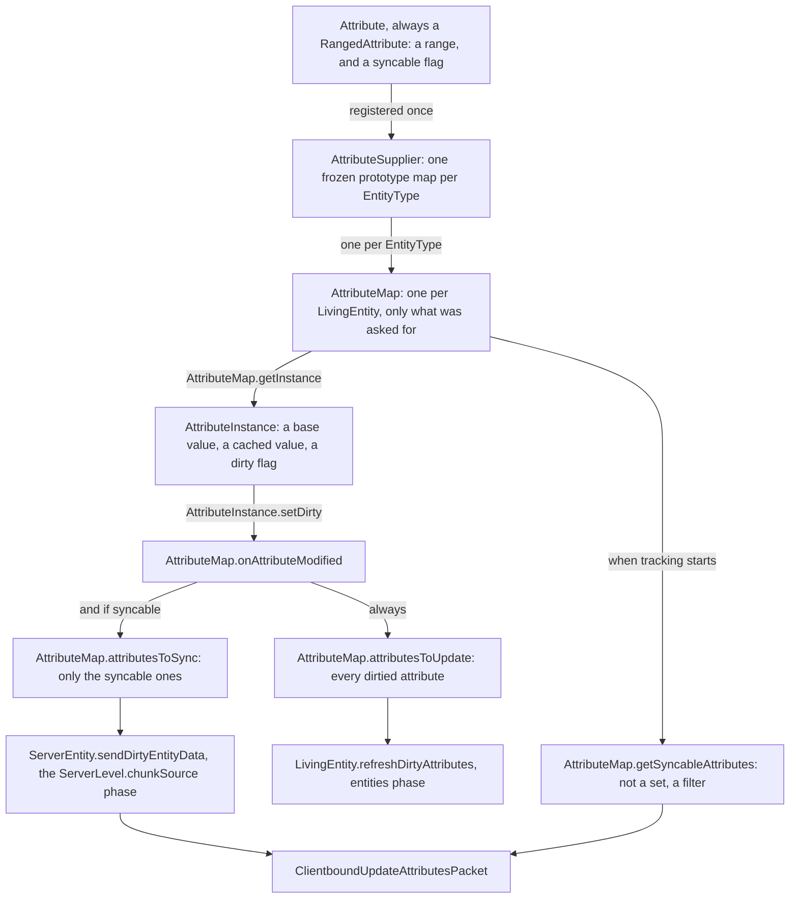
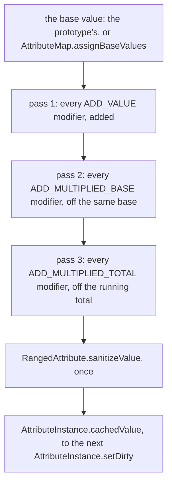
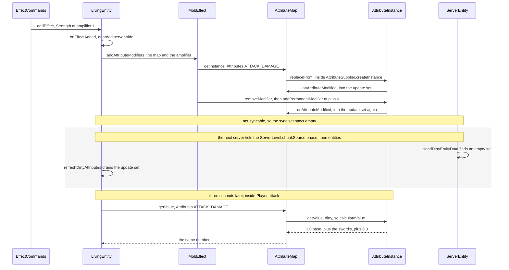

# Attributes

> Verified against **Minecraft 26.2** · Part VI · Strength II is applied to a player: one modifier lands on one attribute, nothing goes on the wire, and the swing three seconds later reads the new number.

Strength II lands on you and thirty seconds later it wears off. In between,
one `AttributeModifier` — an amount of +6, an operation of
`AttributeModifier.Operation.ADD_VALUE`, an id of *effect.strength* — sits on
one attribute of one entity, and every swing you make asks for that attribute
and gets a bigger number back. The same mechanism is behind armour points, a
horse's jump strength, the extra reach of a creative-mode player and the
distance at which a mob notices you: *ask a question, get a number*, cheaply,
with a defined order of operations. What is surprising is what does not
happen. **Strength II sends no packet at all.** Eight of the forty registered
attributes are not client-syncable and `Attributes.ATTACK_DAMAGE` is one of
them, so for the whole thirty seconds your own client's copy of your attack
damage sits at the base value it was born with — 1.0 — and nothing ever tells
it otherwise.

> **A different system with the same words.** `world/attribute` is
> *environment* attributes — per-position world properties like sky darkness
> ([environment attributes and
> timelines](../world/environment-attributes-and-timelines.md#the-stack-a-value-falls-through)) — with its own
> registries and its own class also named `AttributeModifier`. Nothing on this
> page refers to it.

## The cast

| class | what it decides | thread |
|---|---|---|
| `Attribute` | one named number's default, its description id, its `Attribute.Sentiment` (tooltip colour only) and the one boolean that decides whether the client is ever told | built in the `Attributes` class initialiser, read from every thread after |
| `RangedAttribute` | the minimum and the maximum, and `RangedAttribute.sanitizeValue` — the clamp. The only subclass, and every registered attribute is one | as above |
| `AttributeSupplier` | what attributes an `EntityType` has at all, and their base values. Frozen | built at class-init, inside `DefaultAttributes` |
| `AttributeMap` | which of two dirty sets a change lands in, and therefore whether a packet is sent | server main thread for mutations, client main thread for the mirror |
| `AttributeInstance` | the number: a base value, three modifier indices, a dirty flag and a cache | as above |
| `AttributeModifier` | an `Identifier`, an amount and an operation. A record, and the identifier alone is its identity | immutable, shared |
| `LivingEntity` | when the update set drains, and what reacts to a change | both sides, in `LivingEntity.tick` |
| `ServerEntity` | when the sync set drains and what goes on the wire | server main thread, in the level tick's *chunkSource* phase |

## Four objects, two dirty sets, and one list that is neither

*The four objects and the three collections — and every collection is the
`AttributeMap`'s, which is the thing to look at: the instance only calls
`AttributeInstance.setDirty`, and the map decides which sets that lands in.*

Four objects carry the whole system — the `Attribute`, the frozen
`AttributeSupplier` per type, the `AttributeMap` per entity, and the
`AttributeInstance` per number actually asked for. The instance keeps three
lists of its own, and they are [the next section](#the-instance-three-indices-and-one-cached-number)'s;
the three in the figure all belong to the map.

Two of them are the dirty sets, and they are **not a partition**:
`AttributeMap.onAttributeModified` always adds to the update set and
*additionally* to the sync set when the attribute is syncable, so a syncable
attribute is in both and a non-syncable one is in the update set alone. The
third is not a dirty set at all:
`AttributeMap.getSyncableAttributes` filters the whole live map every time it is
asked, and it exists for one caller — `ServerEntity.sendPairingData`, which has
to describe an entity to a player who has never seen it and so cannot work from
what has changed since last time.

## Forty numbers, every one of them clamped

The forty constants of `Attributes` register themselves in their own static
field initialisers, into `BuiltInRegistries.ATTRIBUTE` under
`Registries.ATTRIBUTE`. `Attributes.bootstrap` does nothing but return
`Attributes.MAX_HEALTH`, and exists only as the class-loading trigger
`BuiltInRegistries` needs — which is also why a data pack can *reference* an
attribute but never add one.

Every one of the forty is a `RangedAttribute`, and `RangedAttribute` is the
only subclass of `Attribute`, so every attribute in the game has a minimum
and a maximum and every computed value passes through one clamp. Several of
those bounds are the reason a mechanic behaves the way it does:
`Attributes.MAX_HEALTH` has a minimum of 1, so no entity's maximum health can
reach zero, and `Attributes.KNOCKBACK_RESISTANCE` has a minimum of −2, so
*amplified* knockback is a legal value rather than a bug. The full list — id,
constant, default, minimum, maximum, syncable, sentiment — is
[the attribute table](../../reference/attributes.md).

### The syncable flag, and the eight that never travel

What has to be said here is the syncable flag, because it explains most of
what a client and a server disagree about. **Eight** of the forty never reach
the client: `Attributes.ATTACK_DAMAGE`, `Attributes.ATTACK_KNOCKBACK`,
`Attributes.KNOCKBACK_RESISTANCE`, `Attributes.FOLLOW_RANGE`,
`Attributes.TEMPT_RANGE`, `Attributes.SPAWN_REINFORCEMENTS_CHANCE` — whose
registry id is *spawn_reinforcements*, disagreeing with its own constant name
— and the pair `Attributes.WAYPOINT_TRANSMIT_RANGE` and
`Attributes.WAYPOINT_RECEIVE_RANGE`. An attribute is syncable only because
its registration line called `Attribute.setSyncable`, and that setter is
public and has no freeze behind it, on an object that lives in a registry.
Nothing calls it after bootstrap. Nothing stops it either.

The client is not left with a blank where an unsyncable attribute should be,
which is the part that makes the silence hard to notice: both sides run the
same `Attributes` class initialiser and build the same `DefaultAttributes`
prototypes, so your client's copy of your attack damage holds the prototype's
1.0 from the moment the entity exists. It is not missing. It is a number that
was right once and is never corrected — and the client reads it, for the
field-of-view change in `AbstractClientPlayer.getFieldOfViewModifier` and for
reach through `Player.blockInteractionRange`, from whatever the last packet
left in the map ([authority](authority.md#three-cases-read-on-both-sides)).

## The prototype, frozen at class-init

`DefaultAttributes` holds one `AttributeSupplier` per `EntityType`, each
built by chaining builders: `LivingEntity.createLivingAttributes` is the
twenty-six-entry base, `Mob.createMobAttributes` adds
`Attributes.FOLLOW_RANGE` at 16, `Monster.createMonsterAttributes` adds
`Attributes.ATTACK_DAMAGE` and nothing else, and each species' own builder
finishes the job. `AttributeSupplier.Builder.build` keeps the **last** entry
for a repeated attribute, so a species builder does not have to know what its
ancestors declared: of the five attributes `Zombie.createAttributes` names,
four are already in the chain and are simply overwritten — attack damage from
the monster builder, follow range from the mob builder, movement speed and
armour from the twenty-six-entry living base — and only
`Attributes.SPAWN_REINFORCEMENTS_CHANCE` is new. Anything
outside `MobCategory.MISC` with no supplier at all is logged by
`DefaultAttributes.validate`.

A prototype is frozen in the sense that `AttributeSupplier.Builder.build`
arms a callback that throws on any later write: reading one is fine, dirtying
one throws. Reading an attribute the type does not have is also fatal — the
fallback in `AttributeSupplier` raises rather than returning a default, which
is why `LivingEntity.getAttribute` is nullable and
`LivingEntity.getAttributeValue` is not.

`Player.createAttributes` is on `Player`, not on `Avatar`. That intermediate
class ([entity anatomy](entity-anatomy.md#the-tree-and-the-class-that-was-inserted-into-it))
owns the player-shaped hitbox but not the attribute set, so `Mannequin` — the other `Avatar` —
is registered with `LivingEntity.createLivingAttributes` and gets the plain
living set, including the registry's default movement speed of 0.7 rather
than a player's 0.1. The default is not a dead value: the wandering trader,
the phantom and the slime are registered with the bare `Mob` and `Monster`
builders, neither of which sets a speed either.

## The map, and which set a change lands in

`AttributeMap` starts empty. `AttributeMap.getValue` and
`AttributeMap.getBaseValue` answer from the prototype when the entity has no
instance of its own, and change nothing. `AttributeMap.getInstance` is
different: it creates the instance on demand through
`AttributeSupplier.createInstance`, which copies the frozen template with
`AttributeInstance.replaceFrom` — which ends in `AttributeInstance.setDirty`.
So **asking for an instance is a mutation**: the first call to
`LivingEntity.getAttribute` for a syncable attribute enqueues it for
broadcast before any modifier exists, and a share of the attribute packets a
busy server sends are caused by something merely asking.

### The two sets drain in two different phases

The two sets drain in different phases of the same tick, and that is where
the visible lag comes from. `ServerEntity.sendDirtyEntityData` is reached
from `ChunkMap.tick`, which runs inside `ServerLevel.tick`'s *chunkSource*
phase — **before** the *entities* phase ([the level
tick](../server/server-level-tick.md#the-broadcast-which-is-why-entities-are-a-tick-behind)). An attribute dirtied during an
entity's own tick (equipment, an effect, sprinting, powder snow, anything in
`ServerPlayer.updatePlayerAttributes`) has therefore already missed this
tick's send — and a dirty *attribute* set is not one of the three things that
open `ServerEntity.sendChanges`'s gate ([synched entity
data](synched-entity-data.md#the-gate-that-holds-a-packet-back) owns that
gate), so it waits for the next tick whose
count is a multiple of the entity's `EntityType.updateInterval`: the tick after
next for a player, whose interval is 2, and the third for the default 3. Only a
mutation made *before* the
level tick — a command, an interaction handled out of the packet queue at the
top of the server tick — reaches the wire in the tick that produced it. It is
the same phase ordering that puts a block entity's writes a tick late
([block entities](../blocks/block-entities.md#a-furnace-tells-nobody-anything)).

The update set drains in the entities phase, in
`LivingEntity.refreshDirtyAttributes`, which calls
`LivingEntity.onAttributeUpdated` once per dirtied attribute and then clears
the set. That hook has exactly four branches: clamp health down to a reduced
maximum health, clamp absorption, call `Entity.refreshDimensions` on a scale
change, and register or unregister the transmitted waypoint with the
`ServerWaypointManager`. Subclasses add two more —
`ServerPlayer.onAttributeUpdated` takes the *receive* half of the waypoint
pair, and `Mob.onAttributeUpdated` recomputes the pathfinder's node budget
through `PathNavigation.updatePathfinderMaxVisitedNodes` on a change to
`Attributes.FOLLOW_RANGE` **or** `Attributes.TEMPT_RANGE`
([pathfinding](pathfinding.md#the-budget-which-is-also-the-map) owns that budget).

`LivingEntity.refreshDirtyAttributes` is called from `LivingEntity.tick` with
no side check, so the **client** runs `LivingEntity.onAttributeUpdated` too,
clamping health and resizing an entity whose scale changed — which is why the
waypoint branch inside it is the one that has to test for a `ServerLevel`
explicitly.

### A frozen mob is the worked example

Everything above has a cost attached, and the cheapest way to see it is a mob
standing in powder snow. `LivingEntity.aiStep` calls
`LivingEntity.removeFrost` and `LivingEntity.tryAddFrost` back to back,
server-side, with no test for whether anything changed. Each has a gate — the
remove only dirties when the modifier is actually there, the add needs a
non-air block underfoot *and* a non-zero frozen counter — but when both hold,
the pair destroys and re-creates a modifier on `Attributes.MOVEMENT_SPEED`,
dirtying a **syncable** attribute twenty times a second and re-sending that
entity's whole movement-speed modifier list for as long as it stays frozen.
Compare `ServerPlayer.updatePlayerAttributes`, which runs just as often but
uses `AttributeInstance.addOrUpdateTransientModifier` with a constant modifier
object, and so dirties nothing after the first tick. The whole difference is
which of the two sets each write lands in.

### What the map writes to disk

Two more things the map decides, and between them they answer *why did my
`/attribute` change survive death?* `AttributeMap.pack` writes **every
instantiated instance**, base value included, so a base value set by command
persists with no modifier attached to carry it — `AttributeInstance.pack`
writes only the permanent modifiers of each. And on respawn,
`ServerPlayer.restoreFrom` always calls `AttributeMap.assignBaseValues` but
calls `AttributeMap.assignPermanentModifiers` only on a *full* restore:
returning from the End, not an ordinary death. Base values always come
across, a command-added modifier only sometimes.

## The instance: three indices and one cached number

An `AttributeInstance` keeps its modifiers three times over: bucketed by
`AttributeModifier.Operation` for the arithmetic, indexed by `Identifier` for
lookup and duplicate detection, and a second id-index of the *permanent* ones
for saving. A modifier's identity is its `Identifier` alone — there is no
UUID and no name — so two systems that pick the same identifier for the same
attribute collide, and `AttributeInstance.addTransientModifier` and
`AttributeInstance.addPermanentModifier` **throw** rather than silently
overwrite. `AttributeInstance.addOrUpdateTransientModifier` and
`AttributeInstance.addOrReplacePermanentModifier` are the safe forms. Most of
vanilla removes by id before it adds; three mobs and `AttributeCommand`
instead guard with `AttributeInstance.hasModifier` before adding.

Transient versus permanent is *purely* about saving: both kinds sit in the
same indices, both affect the value identically, both go on the wire, and
only the permanent ones are packed. Mob-effect modifiers are added
permanently, and that is the only reason an effect's modifier survives a
reload ([status
effects](../player/status-effects.md#what-survives-a-save-and-why-the-modifiers-do)). On
the client, meanwhile, *every* modifier is transient, because
`ClientPacketListener.handleUpdateAttributes` sets the base value, wipes the
whole modifier list and re-adds the incoming ones with
`AttributeInstance.addTransientModifier`. A client attribute map is never
packed and never persisted.

`AttributeInstance.getValue` recomputes through
`AttributeInstance.calculateValue` only when the dirty flag is set, and the
flag starts true, so the first read always computes — three passes and one
clamp:

*The three passes, in the order they always run. What separates pass 2 from
pass 3 is the two words on their boxes: `the same base` against `the running
total`.*

That difference is the whole of the arithmetic. Every
`AttributeModifier.Operation.ADD_MULTIPLIED_BASE` modifier reads the base as pass 1 left it, so two of
them do **not** compound — +50% and +50% is +100%. Every
`AttributeModifier.Operation.ADD_MULTIPLIED_TOTAL` modifier reads the previous one's output, so two of
those **do** — +50% and +50% is +125%. The clamp runs once at the end:
`RangedAttribute.sanitizeValue` collapses a not-a-number result to the
minimum and otherwise holds the value between the minimum and the maximum.
Operation order is therefore global, not insertion order, and intermediate
values are never clamped. Within a bucket, iteration order is a hash map's —
safe only because each bucket's arithmetic is commutative.

### …except in the other implementation, which is insertion-ordered

`ItemAttributeModifiers.compute` is a second, disagreeing implementation of
the same idea. It walks an item's `ItemAttributeModifiers.Entry` list in
declaration order, applying each entry's operation to the running total as it
goes, with no three-pass grouping at all. It is not a duplicate of
`AttributeInstance.calculateValue` and it does not agree with it. Its one
caller in the whole game is `Mob.getApproximateAttributeWith` — the "would
this weapon be better than the one I am holding?" estimate a mob makes when
deciding whether to pick an item up.

## Where the modifiers come from

Equipment is the busiest source. `LivingEntity.detectEquipmentUpdates`, in
the server-only half of `LivingEntity.tick`, only dispatches;
`LivingEntity.collectEquipmentChanges` does the work, adding each incoming
stack's modifiers as *transient* (removing by id first) through
`ItemStack.forEachModifier`, which merges
`DataComponents.ATTRIBUTE_MODIFIERS` with the enchantment modifiers from
`EnchantmentHelper.forEachModifier`. Exactly eight vanilla enchantments carry
`EnchantmentEffectComponents.ATTRIBUTES` — fire and blast protection,
respiration, aqua affinity, depth strider, swift sneak, sweeping edge,
efficiency — and `EnchantmentAttributeEffect` has a second, location-based
path through `EnchantmentAttributeEffect.onChangedBlock` that exactly one
uses: soul speed, registered under
`EnchantmentEffectComponents.LOCATION_CHANGED` instead.

The rest, in one breath: `MobEffect` declarations, permanently and scaled by
amplifier; item components, whose `ItemAttributeModifiers.Display` decides
whether *and how* a tooltip line appears — its default form adds the reader's
own base value back in for `Item.BASE_ATTACK_DAMAGE_ID` and
`Item.BASE_ATTACK_SPEED_ID`, so a weapon shows a total rather than a bonus;
`SetAttributesFunction` in loot tables; `Zombie.handleAttributes` at spawn;
`LivingEntity.setSprinting`; `ServerPlayer.updatePlayerAttributes`; and
`AttributeCommand`, whose *modifier add* is **permanent**, and so saved.

One packet, one direction: `ClientboundUpdateAttributesPacket`, server to
every tracking player **and to the entity itself** — which is why your own
client has a live attribute map at all. At most 128 attributes fit in one
(checked on encode as well as decode), each snapshot carrying the attribute
holder, the base value and the complete, uncapped modifier list. There is no
serverbound attribute packet.

## Strength II lands, and nothing leaves the server

Put the four objects, the two sets and the two phases together and the whole
system runs once, end to end, for a number the wire never hears about:

*The lane to watch is `ServerEntity`, which does nothing: it is reached, finds
the sync set empty, and sends no packet at all. The shaded band is the tick
that follows, and the whole of what the wire hears about Strength II.*

`MobEffects.STRENGTH` is declared with one attribute modifier: +3 on
`Attributes.ATTACK_DAMAGE`, `AttributeModifier.Operation.ADD_VALUE`, under
the id *effect.strength*, and the amount is multiplied by amplifier + 1 when
the modifier is built — so Strength II is **+6**. (`MobEffects.WEAKNESS` is
the same construction at −4.) `LivingEntity.addEffect` puts the instance into
the active list and calls `LivingEntity.onEffectAdded`, which is guarded
server-side and hands the entity's `AttributeMap` to
`MobEffect.addAttributeModifiers`. If the effect was already running, the
path is `LivingEntity.onEffectUpdated` instead, which removes and re-adds and,
unlike the add path, refreshes the dirty attributes on the spot.

`MobEffect.addAttributeModifiers` calls `AttributeMap.getInstance`, and that
is where the instance for `Attributes.ATTACK_DAMAGE` is born, copying the
frozen prototype's base value: 1.0 for a player, 3.0 for a zombie. Creation
dirties it, before any modifier exists. Then the effect removes its own id
and adds the +6 with `AttributeInstance.addPermanentModifier` — the remove is
not optional, since the plain add throws on a duplicate id — and dirties it
again. Both times the callback adds to the update set and consults the
syncable flag before touching the sync set, so the sync set stays empty and
**no packet is sent at all**. Next tick, `ServerEntity.sendDirtyEntityData`
finds nothing to send and `LivingEntity.onAttributeUpdated` matches none of
its four branches.

Three seconds later `Player.attack` asks `LivingEntity.getAttributeValue` for
the attack damage. The instance is dirty, so `AttributeInstance.calculateValue`
runs: the addition bucket holds the sword's *base_attack_damage* modifier
from `DataComponents.ATTRIBUTE_MODIFIERS` and the effect's +6, the two
multiplication buckets are empty, the clamp passes, the result is cached. The
rest of the swing — cooldown scale, enchantment bonuses, the crit — belongs
to [the sword swing](../player/the-sword-swing.md#the-damage-one-number-two-curves-one-order). Expiry runs it backwards:
`LivingEntity.onEffectsRemoved` calls `MobEffect.removeAttributeModifiers`,
which removes by id from all three indices and dirties one last time.

### Swap Strength for Speed and the missing limb appears

`MobEffects.SPEED` targets `Attributes.MOVEMENT_SPEED` with
`AttributeModifier.Operation.ADD_MULTIPLIED_TOTAL`, and movement speed *is*
syncable. Everything above is identical until the callback, which now fills
the sync set too. `ServerEntity.sendDirtyEntityData` drains it in the next
chunkSource phase and emits a `ClientboundUpdateAttributesPacket` carrying
the base value and **every** modifier on that attribute — sprinting, powder
snow, the effect, all of them — and `ClientPacketListener.handleUpdateAttributes`
rebuilds the client's instance from scratch. That difference, one boolean on
the `Attribute`, is the whole design.

## Where to look

`Attributes` is forty field initialisers and the syncable flag is visible in
each of them, so start there; `DefaultAttributes` and
`AttributeSupplier.Builder.build` are the prototypes and the freeze. Then read
the three methods this page turns on, in this order:
`AttributeMap.getInstance`, because asking is a mutation;
`AttributeMap.onAttributeModified`, the four lines that decide which set a
change lands in; and `AttributeInstance.calculateValue`, the three passes and
the clamp. `LivingEntity.refreshDirtyAttributes` and
`ServerEntity.sendDirtyEntityData` are where the two sets drain, one phase
apart. Two doors: `ItemAttributeModifiers.compute`, the second and disagreeing
implementation of the arithmetic, and `AttributeCommand`, whose *modifier add*
is the one permanent modifier a player can create by hand.

---

*Rules: names, never code · how the system works, not how the code reads ·
newest version only · every backticked name passes `tools/verify_names.py`.*
