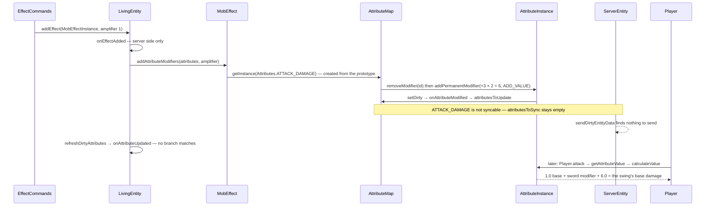

# Attributes

> Verified against **Minecraft 26.2** · Part VI · Strength II is applied to a player: one modifier lands on one attribute, no packet is sent, and the swing three seconds later reads the new number.

## Responsibility

An attribute is a named number an entity has — max health, movement speed,
attack damage, armour, step height, gravity, block reach — with a base value
from its type and a bag of modifiers from everything currently affecting it:
armour worn, effects active, enchantments in range, commands run. The
system's whole job is *ask a question, get a number*, cheaply, with a
defined order of operations, and to tell the client about the subset it
needs.

The one sentence a player recognises: *Strength adds damage, Speed makes you
faster, armour gives armour points, and a name tag on a horse tells you its
jump strength — those are all the same mechanism.*

Note for orientation: `world/attribute` is a **different
system** — environment attributes, per-position world properties like sky
brightness. It has its own registries and its own class also named
`AttributeModifier`. Nothing on this page refers to it.

## The data it owns

- **`Attribute`** — a default value, a description id, a syncable flag and a
  `Attribute.Sentiment` (which only decides tooltip colour). The one
  subclass is `RangedAttribute`, which adds a minimum and a maximum and
  implements `Attribute.sanitizeValue` as a clamp — and **every** registered
  attribute is a `RangedAttribute`. They live in
  `BuiltInRegistries.ATTRIBUTE` under `Registries.ATTRIBUTE`, registered in
  code by `Attributes.bootstrap`; a data pack can *reference* an attribute
  but cannot add one.
- **`AttributeModifier`** — a record of an `Identifier`, an amount and an
  `AttributeModifier.Operation`. **There is no UUID and no name**; identity
  is the identifier alone.
- **`AttributeInstance`** — one attribute on one entity: the base value, the
  modifiers indexed both by operation and by id, a second index of the
  *permanent* ones, a dirty flag and a cached value. `AttributeInstance.getValue`
  recomputes through `AttributeInstance.calculateValue` only when dirty.
- **`AttributeMap`** — every instance an entity has, its
  `AttributeSupplier` of prototypes, and **two** dirty sets:
  `AttributeMap.getAttributesToSync` (only syncable attributes, drained by
  the network layer) and `AttributeMap.getAttributesToUpdate` (everything,
  drained by the entity so it can react).
- **`AttributeSupplier`** and `DefaultAttributes` — the per-`EntityType`
  prototype maps, built at class-init by `LivingEntity.createLivingAttributes`,
  `Mob.createMobAttributes`, `Monster.createMonsterAttributes`,
  `Player.createAttributes` and each species' own builder. The prototypes
  are frozen: writing to one throws.

### The catalogue

Forty constants. Defaults in brackets; **bold** marks the ones that are
*not* client-syncable.

- **Movement:** `Attributes.MOVEMENT_SPEED` (0.7 on the registry, but every
  entity that cares overrides it — 0.1 for a player), `Attributes.FLYING_SPEED`,
  `Attributes.SNEAKING_SPEED`, `Attributes.MOVEMENT_EFFICIENCY`,
  `Attributes.WATER_MOVEMENT_EFFICIENCY`, `Attributes.JUMP_STRENGTH` (0.42),
  `Attributes.STEP_HEIGHT` (0.6), `Attributes.GRAVITY` (0.08),
  `Attributes.FRICTION_MODIFIER`, `Attributes.AIR_DRAG_MODIFIER`,
  `Attributes.BOUNCINESS` — see [movement](movement-and-collision.md).
- **Combat:** **`Attributes.ATTACK_DAMAGE`** (2), `Attributes.ATTACK_SPEED`
  (4), **`Attributes.ATTACK_KNOCKBACK`**, `Attributes.SWEEPING_DAMAGE_RATIO`,
  `Attributes.ARMOR` (max 30), `Attributes.ARMOR_TOUGHNESS` (max 20),
  **`Attributes.KNOCKBACK_RESISTANCE`** (minimum −2, so negative resistance
  is legal), `Attributes.EXPLOSION_KNOCKBACK_RESISTANCE` — see
  [damage](damage-and-death.md).
- **Mining and reach:** `Attributes.BLOCK_BREAK_SPEED`,
  `Attributes.MINING_EFFICIENCY`, `Attributes.SUBMERGED_MINING_SPEED`,
  `Attributes.BLOCK_INTERACTION_RANGE` (4.5),
  `Attributes.ENTITY_INTERACTION_RANGE` (3) — see
  [block breaking](../blocks/block-breaking.md).
- **Survival:** `Attributes.MAX_HEALTH` (20, **minimum 1**),
  `Attributes.MAX_ABSORPTION`, `Attributes.SAFE_FALL_DISTANCE` (3),
  `Attributes.FALL_DAMAGE_MULTIPLIER`, `Attributes.BURNING_TIME`,
  `Attributes.OXYGEN_BONUS`, `Attributes.LUCK`.
- **AI:** **`Attributes.FOLLOW_RANGE`** (32 on the registry, 16 from
  `Mob.createMobAttributes`), **`Attributes.TEMPT_RANGE`**,
  **`Attributes.SPAWN_REINFORCEMENTS_CHANCE`** — whose registry id is
  *spawn_reinforcements*, disagreeing with its own constant name.
- **Presentation:** `Attributes.SCALE`, `Attributes.CAMERA_DISTANCE`,
  `Attributes.NAME_TAG_DISTANCE`, `Attributes.BELOW_NAME_DISTANCE`,
  **`Attributes.WAYPOINT_TRANSMIT_RANGE`**, **`Attributes.WAYPOINT_RECEIVE_RANGE`**.

Eight of the forty are not syncable, and the list is worth memorising
because it explains most client/server disagreements: attack damage, attack
knockback, knockback resistance, follow range, tempt range, reinforcement
chance and the two waypoint ranges.

### The arithmetic

`AttributeInstance.calculateValue` runs in exactly three passes:

1. every `AttributeModifier.Operation.ADD_VALUE` modifier is summed into the
   base;
2. every `AttributeModifier.Operation.ADD_MULTIPLIED_BASE` adds
   *post-step-one base × amount* — so these do **not** compound with each
   other;
3. every `AttributeModifier.Operation.ADD_MULTIPLIED_TOTAL` multiplies the
   running total by one plus its amount — so these **do** compound;
4. `RangedAttribute.sanitizeValue` clamps once, at the end.

Intermediate values are unclamped, and a NaN collapses to the minimum.

## When it runs

**Server main thread** for every mutation: equipment changes from
`LivingEntity.detectEquipmentUpdates` inside the tick, effect apply and
expiry (`LivingEntity.onEffectAdded`, `LivingEntity.onEffectsRemoved`),
`AttributeCommand`, sprinting, powder snow, creative reach in
`ServerPlayer.tick`. Later in the same tick,
`ServerEntity.sendDirtyEntityData` drains the syncable dirty set and clears
it. `LivingEntity.refreshDirtyAttributes` drains the *other* set and calls
`LivingEntity.onAttributeUpdated` for each — which clamps health to max
health, clamps absorption, calls `Entity.refreshDimensions` on a scale
change, and registers or unregisters the waypoint; `Mob.onAttributeUpdated`
adds a pathfinder node-budget recompute on a follow-range change
([AI](ai-goals-and-brains.md)).

**Client main thread** for the receive: `ClientPacketListener.handleUpdateAttributes`
sets each base value, wipes every modifier and re-adds the incoming ones as
transient. Client-side reads then happen on the same thread — camera
distance, the health bar, name-tag distances, movement speed for the FOV
scale, reach for the crosshair pick.

## The trace: Strength II

1. **The effect.** `MobEffects.STRENGTH` is declared with an attribute
   modifier of +3 on `Attributes.ATTACK_DAMAGE`,
   `AttributeModifier.Operation.ADD_VALUE`, under the id
   *effect.strength*. The amount is scaled by amplifier + 1 at apply time,
   so Strength II is **+6**. (`MobEffects.WEAKNESS` is the same thing at −4.)
2. **Applying it.** `LivingEntity.addEffect` → `LivingEntity.onEffectAdded`,
   which is guarded server-side, calls `MobEffect.addAttributeModifiers`. If
   the effect was already active the path is
   `LivingEntity.onEffectUpdated`, which removes and re-adds.
3. **Finding the instance.** `AttributeMap.getInstance` creates it on demand
   from the `AttributeSupplier` prototype, copying the frozen base value —
   1.0 for a player, 3.0 for a zombie.
4. **Adding the modifier.** Remove-by-id first, then
   `AttributeInstance.addPermanentModifier`. The remove is not optional:
   `AttributeInstance.addTransientModifier` and its permanent twin **throw**
   on a duplicate id. `AttributeInstance.addOrUpdateTransientModifier` and
   `AttributeInstance.addOrReplacePermanentModifier` are the safe forms.
5. **Marking dirty.** `AttributeInstance.setDirty` fires the map's callback,
   which always adds to the update set and adds to the *sync* set only if
   the attribute is syncable. Attack damage is not — **so no packet is
   sent at all.** The client's copy of `Attributes.ATTACK_DAMAGE` stays at
   its prototype base for the whole duration of the effect.
6. **Reacting.** `LivingEntity.refreshDirtyAttributes` drains the update set
   next tick; `LivingEntity.onAttributeUpdated` has branches for max health,
   max absorption, scale and waypoint range, and attack damage matches none
   of them, so nothing happens.
7. **The read.** Three seconds later `Player.attack` asks
   `LivingEntity.getAttributeValue` for the attack damage: the instance is
   dirty, so `AttributeInstance.calculateValue` sums the addition bucket
   — the sword's *base_attack_damage* modifier from
   `DataComponents.ATTRIBUTE_MODIFIERS` and the effect's +6 — clamps, caches
   and returns. The rest of the swing — cooldown scale from
   `Attributes.ATTACK_SPEED`, enchantment bonus, crit — belongs to *the
   sword swing* in Part VIII.
8. **Removal.** Effect expiry → `LivingEntity.onEffectsRemoved` →
   `MobEffect.removeAttributeModifiers` → remove by id from all three
   indices, dirty again.

**Swap Strength for Speed and the missing limb appears.** `MobEffects.SPEED`
targets `Attributes.MOVEMENT_SPEED`, which *is* syncable, so step 5 also
fills the sync set, step 6 emits a `ClientboundUpdateAttributesPacket`
carrying the base value plus **every** modifier on that attribute, and the
client rebuilds the instance from scratch. That difference — one boolean on
the `Attribute` — is the whole design.

## Interfaces

- **Called by:** `LivingEntity.tick` (equipment, dirty refresh, powder
  snow), `LivingEntity.addEffect` / `LivingEntity.onEffectsRemoved`,
  `EnchantmentAttributeEffect` when a location-based enchantment activates
  or deactivates, `ServerPlayer.tick` (creative reach and the crouch
  waypoint modifier), `Mob.finalizeSpawn`, `AttributeCommand`,
  `LivingEntity.setSprinting`, `ServerPlayer.restoreFrom` on respawn,
  `LivingEntity.readAdditionalSaveData` on load.
- **Calls into:** `AttributeInstance.calculateValue` and, through the
  entity's reaction hook, `Entity.refreshDimensions`,
  `PathNavigation.updatePathfinderMaxVisitedNodes`, and the waypoint
  manager.
- **Crosses the network as:** `ClientboundUpdateAttributesPacket` only —
  server → tracking players, at most 128 attributes per packet, each snapshot
  carrying the attribute holder, the base value and its full modifier list.
  Sent from `ServerEntity.sendPairingData` (the whole syncable set, once,
  when a player starts tracking) and from `ServerEntity.sendDirtyEntityData`
  (the dirty set, then cleared). **There is no serverbound attribute
  packet.**
- **Data-driven by:** `DataComponents.ATTRIBUTE_MODIFIERS` on items — an
  `ItemAttributeModifiers` of entries, each an attribute, a modifier, an
  `EquipmentSlotGroup` and an `ItemAttributeModifiers.Display` that decides
  whether the tooltip shows it; `EnchantmentEffectComponents.ATTRIBUTES`
  holding `EnchantmentAttributeEffect`s (fire protection → burning time,
  respiration → oxygen bonus, aqua affinity → submerged mining speed, depth
  strider and soul speed → movement, swift sneak → sneaking speed, sweeping
  edge, efficiency → mining efficiency); `MobEffect` declarations;
  `SetAttributesFunction` in loot tables; and `/attribute`, whose *modifier
  add* is **permanent**, so a command-added modifier is written to disk.

## Invariants and surprises

- **Operation order is global, not insertion order.** All additions, then
  all base-multipliers (which do not compound), then all total-multipliers
  (which do). Within a bucket the iteration order is a hash map's — safe
  only because each bucket's arithmetic is commutative.
- **A modifier's identity is its `Identifier`, on that attribute.** Two
  systems that pick the same identifier collide, and the plain add methods
  throw rather than silently overwrite. Everything in vanilla that might
  double up removes first.
- **Transient versus permanent is purely about saving.** Both live in the
  same indices and both affect the value identically; only the permanent
  ones are packed into the entity's save data.
- **Mob-effect modifiers are permanent — and that is the only reason they
  survive a reload.** Effects are restored from NBT straight into the active
  list without going through the apply path, so the hook that adds the
  modifier never runs on load. The modifier comes back because it was
  saved, not because the effect re-applied it.
- **The client's every modifier is transient.** The packet handler wipes and
  re-adds, so a client attribute map is never packed and never persisted.
- **Reading an attribute the entity type does not have throws.** The
  fallback path goes to the `AttributeSupplier` and raises rather than
  returning a default — which is why `LivingEntity.getAttribute` is nullable
  while `LivingEntity.getAttributeValue` is not.
- **The prototypes are frozen and the builder keeps the last entry.** That
  is how `Zombie` overrides the attack damage and speed that
  `Monster.createMonsterAttributes` already added, and why writing to a
  prototype throws.
- **Clamping happens once, at the end.** `Attributes.MAX_HEALTH` has a
  minimum of 1, so no entity's maximum health can reach zero;
  `Attributes.KNOCKBACK_RESISTANCE` has a minimum of −2, so *amplified*
  knockback is a legal value, not a bug.
- **Powder snow re-creates its modifier every server tick.**
  `LivingEntity.aiStep` removes and re-adds the freeze slowdown
  unconditionally, so every frozen entity dirties a *syncable* attribute
  twenty times a second and sends its whole modifier list to every tracking
  player for the duration.
- **`Attribute.setSyncable` is a public setter with no freeze**, on objects
  that live in a registry. Nothing calls it after bootstrap; nothing stops
  it either.
- **`Player.createAttributes` is on `Player`, not `Avatar`** — the new
  intermediate class ([entity anatomy](entity-anatomy.md)) owns the
  player-shaped hitbox and skin data but not the attribute set, so a
  `Mannequin` gets the plain living set, including the unused registry
  default movement speed of 0.7.

## Where to look

`Attribute` · `RangedAttribute` · `Attributes` · `AttributeModifier` ·
`AttributeModifier.Operation` · `AttributeInstance` ·
`AttributeInstance.calculateValue` · `AttributeInstance.Packed` ·
`AttributeMap` · `AttributeMap.getAttributesToSync` ·
`AttributeSupplier` · `DefaultAttributes` ·
`LivingEntity.createLivingAttributes` · `LivingEntity.getAttributeValue` ·
`LivingEntity.onAttributeUpdated` · `ItemAttributeModifiers` ·
`EnchantmentAttributeEffect` · `MobEffect.addAttributeModifiers` ·
`ClientboundUpdateAttributesPacket` · `AttributeCommand`

---

*Rules: names, never code · how the system works, not how the code reads ·
newest version only · every backticked name passes `tools/verify_names.py`.*
