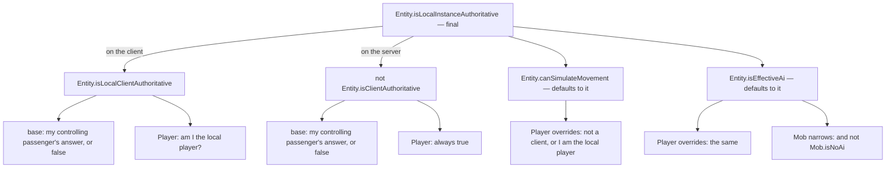
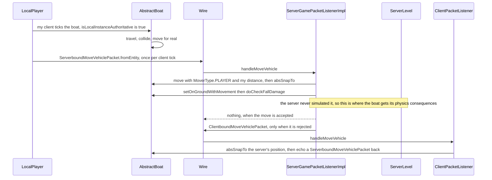

# Authority: who is allowed to simulate

> Verified against **Minecraft 26.2** · Part VI · A zombie, a player and a boat each take one step, on the server and on the client, and only one side of each pair does any arithmetic.

A zombie walks towards you across a field. Both programs have a `Zombie`
object; both tick it every twentieth of a second; both call the same
`Entity.tick`. Only one of them works out where it goes. Standing next to
the zombie is another player, and their copy is the other way up — and the
boat you are sitting in is a third case again, authoritative on your machine
and nowhere else. Four predicates on `Entity` decide all of it, and they
invert the naive picture in **both** directions: **the client runs no physics
at all for the mob chasing you, while the server runs your player's physics
every tick and then overwrites the answer with a number your client sent.**

This is the single most error-prone idea in the entity part, and four other
pages depend on it — [movement and collision](movement-and-collision.md)
here, [input to movement](../player/input-to-movement.md) in Part VIII,
[what the client is told](../networking/what-the-client-is-told.md) in Part
IX, and [the client loop](../client/the-client-loop.md) in Part X. It is
stated once, here.

## The cast

| class | what it decides | thread |
|---|---|---|
| `Entity` | the four predicates, and every gate inside `Entity.move` that reads them | both main threads |
| `Player` | overrides three of the four, and is the reason the picture inverts | both |
| `Mob` | narrows `Entity.isEffectiveAi` with `Mob.isNoAi` | server main |
| `LivingEntity` | `LivingEntity.aiStep`, which either simulates or coasts | both |
| `ClientPacketListener` | whether an inbound position packet moves the entity or only updates a codec | client main |
| `ServerGamePacketListenerImpl` | re-runs the client's numbers for the entities the client owns | server main |

## The four predicates, and the one that is not a question about sides

`Entity.isLocalInstanceAuthoritative` is the root and it is **final** — no
class overrides it. It asks a different question on each side: on the client,
*am I locally client-authoritative?*; on the server, *am I **not**
client-authoritative?* Everything else hangs off those two.

Two things in that picture are easy to miss. The base implementations of
both `Entity.isLocalClientAuthoritative` and `Entity.isClientAuthoritative`
**delegate to the controlling passenger** — an entity with nobody steering it
answers false to both, and an entity with a rider inherits the rider's answer.
That single line is the whole vehicle model. And `Player` overrides
`Entity.canSimulateMovement` and `Entity.isEffectiveAi` to something
*different* from the root — *not a client, or I am the local player* — which
is what lets the server simulate a player it is not authoritative for.

Two classes narrow the AI predicate further and are worth naming because
they are the exceptions people trip over: `Mob.isEffectiveAi` adds
`Mob.isNoAi`, which is where the *NoAI* tag actually bites, and both
`ArmorStand.isEffectiveAi` and `Mannequin.isEffectiveAi` add a physics or
immovability flag of their own.

## Three cases, read on both sides

The columns are the three shapes an entity can have; the rows are what each
predicate answers and what follows from it.

| | a tracked mob | a player | a boat you are riding |
|---|---|---|---|
| `Entity.isClientAuthoritative` | false | **true**, unconditionally | true, inherited from you |
| `Entity.isLocalInstanceAuthoritative`, **server** | **true** | false | false |
| `Entity.isLocalInstanceAuthoritative`, **client** | false | true only on *your own* player | **true**, on your machine only |
| `Entity.canSimulateMovement`, server | true | **true** — the override | false |
| `LivingEntity.travel` runs on the server | yes | yes, and the result is overwritten | n/a |
| `LivingEntity.travel` runs on the client | **never** | only for your own player | yes, driven by your input |
| `Entity.checkFallDamage` inside `Entity.move` | server only | neither side — the packet path does it | client only |
| what the other side does instead | coasts at 0.98 per tick | applies your movement packet | applies its own copy's packet |

The row that surprises people is the last-but-one. `Entity.move` gates
`Entity.checkFallDamage` on `Entity.isLocalInstanceAuthoritative`, which is
false for a player on **both** sides — so no player anywhere takes fall
damage from the mover. The server takes that path from
`Entity.doCheckFallDamage` instead, driven by the movement packet, which is
[Part VIII's subject](../player/input-to-movement.md).

### The mob: the client is not correcting, it is replaying

A client-side zombie fails `Entity.isLocalInstanceAuthoritative` because
nothing is riding it, so `Entity.canSimulateMovement` is false and
`LivingEntity.aiStep` never reaches `LivingEntity.travel`. What it does
instead is the first thing `LivingEntity.aiStep` does: if an
`InterpolationHandler` is running, step it; **otherwise scale the delta by
0.98 and stop**. There is no collision, no gravity, no friction and no
attempt at prediction. It is not simulating and being corrected — it is
replaying what `ClientboundMoveEntityPacket` and
`ClientboundEntityPositionSyncPacket` tell it, and coasting between them.

### The player: simulated twice, believed once

A `ServerPlayer` passes `Entity.canSimulateMovement` and
`Entity.isEffectiveAi` — both true on the server by `Player`'s override — so
the server's copy runs the whole of `LivingEntity.travel` during the entity
phase of its tick. It also fails `Entity.isLocalInstanceAuthoritative`, so
none of the consequences that gate on it fire. Then the next
`ServerboundMovePlayerPacket` arrives, and
`ServerGamePacketListenerImpl.handleMovePlayer` moves the player again with
`MoverType.PLAYER` and the *client's* distance, and finishes with
`Entity.absSnapTo` at the client's claimed position. The server's own
simulation is a sanity check that produced a number nobody uses.

One consequence reaches a block. `SweetBerryBushBlock.entityInside` needs to
know how far the entity moved this tick, and it asks
`Entity.isClientAuthoritative` to decide **how to find out**:
`Entity.getKnownMovement` for a player, whose movement the server did not
compute, and old-position-minus-current for everything else. Authority is not
only about physics — it is about which of two numbers is real.

### The boat: authoritative on exactly one machine

Sit in a boat and the base delegation makes it yours. On your client
`Entity.isLocalClientAuthoritative` walks to the controlling passenger, finds
you, and returns true, so your machine simulates the boat for real. On the
server the same delegation makes `Entity.isClientAuthoritative` true, so the
server's copy is *not* authoritative and does not simulate. Every other
client sees the boat as a tracked entity and coasts it.

The inbound half of that is the sharpest demonstration of what the predicate
is for. `ClientboundMoveVehiclePacket` is not a routine update — the server
sends it only when it has *rejected* your movement, and the client applies it
only for a vehicle it is authoritative for, and then immediately echoes a
`ServerboundMoveVehiclePacket` back to confirm. Meanwhile the ordinary
per-entity position packets take the opposite branch:
`ClientPacketListener.handleEntityPositionSync` and
`ClientPacketListener.handleMoveEntity` both check
`Entity.isLocalInstanceAuthoritative` and, when it holds, decode the value
into the entity's position codec and **do not move the entity**. The server's
opinion about where your boat is gets recorded and ignored.

## Where the gates actually sit

Authority is not one flag consulted once. It is read at six places in
`Entity.move` and `LivingEntity.aiStep` alone, and each reads a different
member of the family:

- the vertical collision flags and `Entity.setOnGroundWithMovement` run if
  the entity moved vertically **or** is locally authoritative — the
  horizontal flags are always updated;
- `Entity.checkFallDamage` runs only if it is locally authoritative;
- `Entity.restituteMovementAfterCollisions` — the bounce — runs on
  `Entity.canSimulateMovement`;
- the step sound and `GameEvent.STEP` run if this is not a client **or** the
  instance is locally authoritative;
- `Entity.applyEffectsFromBlocks` runs on the same condition;
- `Mob.serverAiStep` runs on `Entity.isEffectiveAi` **and** not client-side,
  and `LivingEntity.travel` on `Entity.canSimulateMovement` **and**
  `Entity.isEffectiveAi`.

The last one has a fork in front of it. If the controlling passenger is a
`Player` and the mob is alive, `LivingEntity.travelRidden` runs instead —
and it has its own `Entity.canSimulateMovement` test, zeroing the delta
outright when it fails. That is the path every horse, pig and happy ghast
takes.

## What the four predicates explain

**Why does a mob rubber-band and my own player does not?** Because your
player is the only entity your client simulates, and a mob is the only kind
your client never simulates. There is nothing to reconcile in either case;
what you see on a mob is the gap between position packets, filled by
`InterpolationHandler` or by a 0.98 coast.

**Why does a boat feel responsive and a horse feel heavy?** Both are ridden,
and both are authoritative on your machine — but a horse is a `LivingEntity`
going through `LivingEntity.travelRidden`, which asks the mob for its own
speed and drag, while a boat runs its own physics directly. The authority
answer is the same; the layer above it is not.

**Does *NoAI* stop a mob moving?** It stops `Mob.serverAiStep`, because
`Mob.isEffectiveAi` is what `LivingEntity.aiStep` gates that call on. It does
not stop `LivingEntity.travel`, which is gated on
`Entity.canSimulateMovement` — so a *NoAI* mob still falls.

## Where to look

`Entity.isLocalInstanceAuthoritative` · `Entity.isLocalClientAuthoritative` ·
`Entity.isClientAuthoritative` · `Entity.canSimulateMovement` ·
`Entity.isEffectiveAi` · `Player.isLocalPlayer` · `Mob.isNoAi` ·
`LivingEntity.aiStep` · `LivingEntity.travel` · `LivingEntity.travelRidden` ·
`Entity.move` · `Entity.checkFallDamage` · `Entity.doCheckFallDamage` ·
`ServerGamePacketListenerImpl.handleMovePlayer` ·
`ServerGamePacketListenerImpl.handleMoveVehicle` ·
`ClientPacketListener.handleEntityPositionSync` ·
`ClientPacketListener.handleMoveEntity` ·
`ClientPacketListener.handleMoveVehicle` · `InterpolationHandler` ·
`SweetBerryBushBlock.entityInside`

---

*Rules: names, never code · how the system works, not how the code reads ·
newest version only · every backticked name passes `tools/verify_names.py`.*
