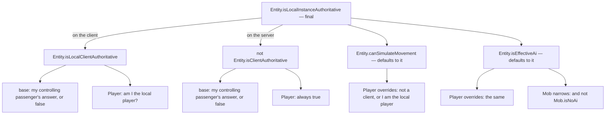
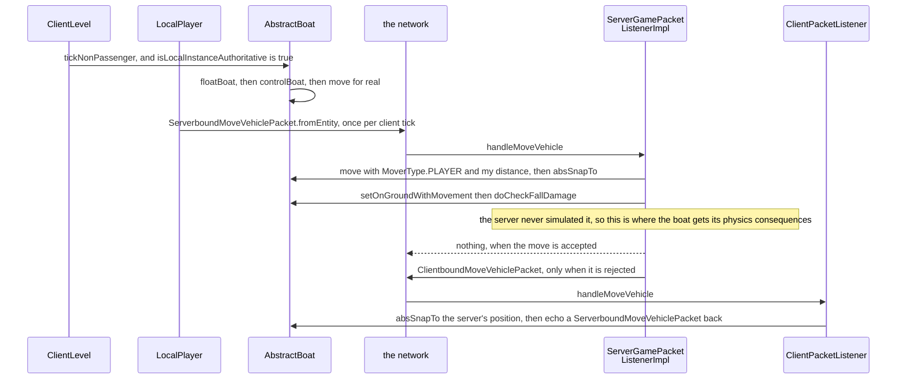

# Authority: who is allowed to simulate

> Verified against **Minecraft 26.2** · Part VI · A zombie, a player and a boat each take one step, on the server and on the client, and only one side of each pair does any arithmetic.

A zombie walks towards you across a field. Both programs have a `Zombie`
object; both tick it every twentieth of a second; both call the same
`Entity.tick`. Only one of them works out where it goes. Standing next to
the zombie is another player, and their copy is the other way up — and the
boat you are sitting in is a third case again, authoritative on your machine
and nowhere else. Five predicates on `Entity` — one of them final — decide
all of it, and they invert the naive picture in **both** directions: **the client runs no physics
at all for the mob chasing you, while the server runs your player's physics
every tick and then overwrites the answer with a number your client sent.**

This is the single most error-prone idea in the entity part, and four later
parts rest on it — [movement and collision](movement-and-collision.md#who-is-allowed-to-run-this-at-all)
here, every page in Part VIII about a player, [what the client is
told](../networking/what-the-client-is-told.md#gate-1-who-is-allowed-to-see-it)
in Part IX, and in Part X both [the client
level](../client/the-client-level.md#where-the-two-levels-differ), for what
the client is allowed to simulate, and [prediction and
acknowledgement](../client/prediction-and-acks.md#two-state-machines-running-against-each-other),
for what it is allowed to *guess* while it waits to be told.
Nineteen pages in this book link back to this one. It is stated in full once,
here.

## Three cases, read on both sides

The whole answer fits in one table, and the rest of the page is that table
explained. The columns are three shapes an entity can have; the rows are what
each predicate answers and what follows from it.

| | a tracked mob | a player | a boat you are riding |
|---|---|---|---|
| `Entity.isClientAuthoritative` | false | **true**, unconditionally | true, inherited from you |
| `Entity.isLocalInstanceAuthoritative`, **server** | **true** | false | false |
| `Entity.isLocalInstanceAuthoritative`, **client** | false | true only on *your own* player | **true**, on your machine only |
| `Entity.canSimulateMovement`, server | true | **true** — the override | false |
| `LivingEntity.travel` runs on the server | yes | yes, and the result is overwritten | n/a |
| `LivingEntity.travel` runs on the client | **never** | only for your own player | n/a — `AbstractBoat.floatBoat` and `AbstractBoat.controlBoat` do it instead |
| `Entity.checkFallDamage` inside `Entity.move` | server only | **your own client only** — the server reaches it by the packet path | client only |
| what the other side does instead | is interpolated, and stands still when the interpolation runs out | applies your movement packet | applies its own copy's packet |

*A tracked mob* is one the server has told your client about at all, which is
every mob you can see. A fourth shape is worth naming here so that it does not
look like an omission later: an entity nobody is riding and nothing is
steering — a dropped item, an arrow in flight — reaches the base
implementations, which answer false to both roots, and is simulated by the
server alone.

The row that surprises people is `Entity.checkFallDamage`. `Entity.move` gates
it on `Entity.isLocalInstanceAuthoritative`, which for a player is true on your
own client and **false on the server** — so the copy that runs it every tick is
the one that cannot hurt you. Three names sit close together here and they are
three different methods, not overrides of each other:
`Entity.checkFallDamage` is the gate inside `Entity.move`;
`LivingEntity.checkFallDamage` is the living override of it, and it needs a
`ServerLevel` before it computes any damage, so your client only accumulates
the fall distance and lets `Block.fallOn` fire; and
`Entity.doCheckFallDamage` is a separate entrance the server uses instead,
driven by the movement packet, which is [Part VIII's
subject](../player/input-to-movement.md#what-the-server-does-with-the-packet-it-gets).

## The cast

| class | what it decides | thread |
|---|---|---|
| `Entity` | the five predicates, and every gate inside `Entity.move` that reads them | both main threads |
| `Player` | overrides four of the five, and is the reason the picture inverts | both |
| `Mob` | narrows `Entity.isEffectiveAi` with `Mob.isNoAi` | both, but only the server's copy acts on the answer |
| `LivingEntity` | `LivingEntity.aiStep`, which either simulates or coasts | both |
| `ClientPacketListener` | whether an inbound position packet moves the entity or only updates a codec | client main |
| `ServerGamePacketListenerImpl` | re-runs the client's numbers for the entities the client owns | server main |

## Five predicates, and the final one the other four hang off

`Entity.isLocalInstanceAuthoritative` is the root and it is **final** — no
class overrides it. It asks a different question on each side: on the client,
*am I locally client-authoritative?*; on the server, *am I **not**
client-authoritative?* Everything else hangs off those two.

Two things in that picture are easy to miss. The base implementations of
both `Entity.isLocalClientAuthoritative` and `Entity.isClientAuthoritative`
**delegate to the controlling passenger** — an entity with nobody steering it
answers false to both, and an entity with a rider inherits the rider's answer.
That single line is the whole vehicle model. And `Player` overrides
`Entity.canSimulateMovement` and `Entity.isEffectiveAi` to something
*different* from the root — *not a client, or I am the local player*, the
second half being `Player.isLocalPlayer` — which
is what lets the server simulate a player it is not authoritative for. The
member that inverts the picture is `Player.isClientAuthoritative`, an
unconditional true.

Three classes narrow the AI predicate further and are worth naming because
they are the exceptions people trip over: `Mob.isEffectiveAi` adds
`Mob.isNoAi`, which is where the *NoAI* tag actually bites (what the guard
around it does and does not wrap is [goals and
brains](ai-goals-and-brains.md#where-both-of-them-sit-in-one-mob-tick)), and both
`ArmorStand.isEffectiveAi` and `Mannequin.isEffectiveAi` add a physics or
immovability flag of their own.

## The mob: the client is not correcting, it is replaying

A client-side zombie fails `Entity.isLocalInstanceAuthoritative` because
nothing is riding it, so `Entity.canSimulateMovement` is false and
`LivingEntity.aiStep` never reaches `LivingEntity.travel`. What it does
instead is the branch `LivingEntity.aiStep` opens with: if an
`InterpolationHandler` is running, step it; **otherwise scale the stored
delta by 0.98** — and nothing then applies that delta, because the only thing
that would is `Entity.move`, which nothing in the mob's own tick reaches on
this side — and this is precisely the seam where the client's other answer
begins: what it may guess rather than simulate is [prediction and
acknowledgement](../client/prediction-and-acks.md#two-state-machines-running-against-each-other)'s.
(A piston or a shulker box can still drive a client-side mob into
`Entity.move`, with a vector of their own rather than its stored delta —
[movement and collision](movement-and-collision.md#building-the-delta) has the
five `MoverType` constants that say who is pushing.) Inside the mob's own tick,
though, there is no collision, no gravity, no friction and no attempt at
prediction. It is not simulating and being corrected — it is replaying what
`ClientboundMoveEntityPacket` and `ClientboundEntityPositionSyncPacket` tell
it, and standing perfectly still when the interpolation runs out.

## The player: simulated twice, believed once

A `ServerPlayer` passes `Entity.canSimulateMovement` and
`Entity.isEffectiveAi` — both true on the server by `Player`'s override — so
the server's copy runs the whole of `LivingEntity.travel`. It also fails
`Entity.isLocalInstanceAuthoritative`, so none of the consequences that gate
on it fire. The predicates are why a copy that is not authoritative simulates
at all; what the server then does with the answer is [the two-phase
tick](../player/the-two-phase-tick.md#the-bracket-and-what-survives-it) —
the physics run in the connection phase, after every level has ticked, inside
a bracket that puts the player straight back where it found them, and the
authoritative position moves in the movement packet instead. The server's own
simulation is a sanity check whose position nobody uses.

## Authority is also about which of two numbers is real

A player's position on the server moved by the packet path rather than by the
server's own arithmetic, so *how far did this entity move this tick* has two
possible answers for a player and one for everything else — and a block has to
know which it is being given. `SweetBerryBushBlock.entityInside` asks
`Entity.isClientAuthoritative` to decide **how to find out**:
`Entity.getKnownMovement`, the distance the client reported, for a player
whose movement the server did not compute, and old-position-minus-current for
everything else. The predicate is not only a switch for physics.

## The boat: authoritative on exactly one machine

Sit in a boat and the base delegation makes it yours. On your client
`Entity.isLocalClientAuthoritative` walks to the controlling passenger, finds
you, and returns true, so your machine simulates the boat for real. On the
server the same delegation makes `Entity.isClientAuthoritative` true, so the
server's copy is *not* authoritative and does not simulate — it zeroes its
own delta outright. Every other client's copy does the same, and is moved
only by `AbstractBoat.interpolation`.

The inbound half of that is the sharpest demonstration of what the predicate
is for. `ClientboundMoveVehiclePacket` is not a routine update — the server
sends it only when it has *rejected* your movement, and
`ClientPacketListener.handleMoveVehicle` applies it
only for a vehicle the client is authoritative for, then immediately echoes a
`ServerboundMoveVehiclePacket` back to confirm. Meanwhile the ordinary
per-entity position packets take the opposite branch:
`ClientPacketListener.handleEntityPositionSync` and
`ClientPacketListener.handleMoveEntity` both check
`Entity.isLocalInstanceAuthoritative` and, when it holds, **do not move the
entity** — `ClientPacketListener.handleMoveEntity` decodes the delta into the
entity's position codec and stops there, and
`ClientPacketListener.handleEntityPositionSync` records the absolute position
in the codec on either branch. The server's opinion about where your boat is
gets recorded and ignored.

## Where the gates actually sit

Authority is not one flag consulted once. `Entity.move` and
`LivingEntity.aiStep` read a predicate at **eight** places between them, and
one of the eight reads two, so there are nine readings in all:

| where | which member | reads |
|---|---|---|
| the vertical collision flags, and `Entity.setOnGroundWithMovement` | `Entity.move` | locally authoritative **or** moved vertically — the horizontal flags are always updated |
| fall damage | `Entity.checkFallDamage` | locally authoritative |
| the bounce | `Entity.restituteMovementAfterCollisions` | `Entity.canSimulateMovement` |
| the step sound and `GameEvent.STEP` | `Entity.applyMovementEmissionAndPlaySound` | not a client **or** locally authoritative |
| the 0.98 decay of the stored delta | `LivingEntity.aiStep` | `Entity.canSimulateMovement` is **false** |
| the AI step | `Mob.serverAiStep` | `Entity.isEffectiveAi` **and** not client-side |
| the travel fork | `LivingEntity.travel` | `Entity.canSimulateMovement` **and** `Entity.isEffectiveAi` — the one place that reads a pair |
| the block effects that follow travel | `Entity.applyEffectsFromBlocks` | the same not-a-client-or-authoritative test as the step sound |

The row worth slowing down for is the fifth. The 0.98 decay is what runs
*because* `Entity.canSimulateMovement` is false — the not-authoritative
branch, not a fallback inside the authoritative one — which is the whole of
what a client-side mob does with its stored delta.

The travel fork has a fork of its own in front of it, the ridden branch, which
[movement and collision](movement-and-collision.md#building-the-delta) walks.
What belongs here is that `LivingEntity.travelRidden` is a **ninth site**:
an `Entity.canSimulateMovement` test that zeroes the delta outright when it
fails.

## Questions players ask

**Why does a mob rubber-band and my own player does not?** Neither one is
being corrected, and for opposite reasons. Your client does simulate your own
player, and the boat or horse you are riding — but it never simulates a
tracked mob, so there is nothing about the mob for the server to disagree
with. What you see on a mob is the gap between position packets, walked by
`InterpolationHandler`.

**Why does a boat feel responsive and a horse feel heavy?** Both are ridden,
and both are authoritative on your machine — but a horse is a `LivingEntity`
going through `LivingEntity.travelRidden`, which asks the mob for its own
speed and drag, while a boat runs its own physics directly. The authority
answer is the same; the layer above it is not.

**Does *NoAI* stop a mob moving?** Completely — a *NoAI* mob does not even
fall. `Mob.isEffectiveAi` is the gate on `Mob.serverAiStep`, which is the
obvious half, and it is also the second half of the gate on
`LivingEntity.travel`, so nothing reaches `Entity.move` for that mob at all.

## Where to look

Read the five predicates first, in the order the figure draws them:
`Entity.isLocalInstanceAuthoritative`, then the two it asks —
`Entity.isLocalClientAuthoritative` and `Entity.isClientAuthoritative` — then
`Entity.canSimulateMovement` and `Entity.isEffectiveAi`, which default to it.
`Player.isClientAuthoritative` and `Mob.isNoAi` are the two overrides that
matter. Then read the two methods that spend them, `Entity.move` and
`LivingEntity.aiStep`, with the table above open. For the packet half,
`ServerGamePacketListenerImpl.handleMoveVehicle` on the server and
`ClientPacketListener.handleEntityPositionSync` on the client are the two
branches the last section turns on, and `InterpolationHandler` is what moves a
mob when nothing simulates it. `SweetBerryBushBlock.entityInside` is a door
worth opening for one line: it is the only place in the game that reads a
predicate to choose *which number to believe*.

---

*Rules: names, never code · how the system works, not how the code reads ·
newest version only · every backticked name passes `tools/verify_names.py`.*
