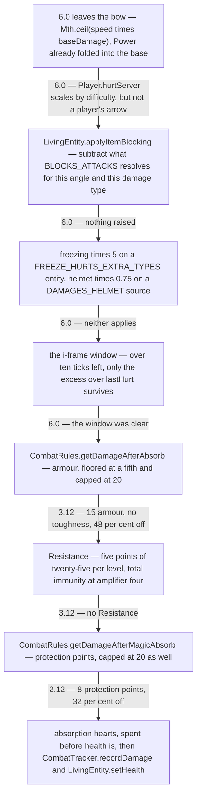
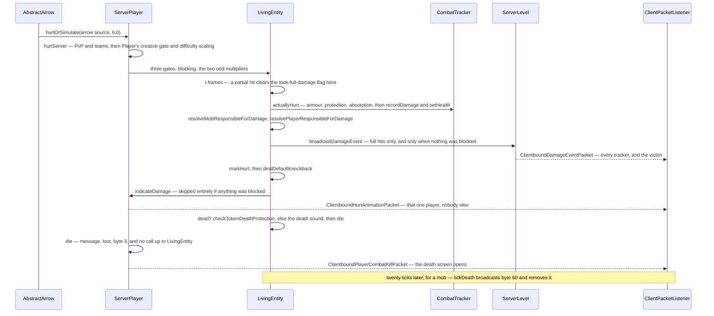

# Damage and death

> Verified against **Minecraft 26.2** · Part VI · An arrow hits a player in full iron with Protection II: six damage becomes two, and if it kills, a message, a loot drop and a death screen.

The arrow lands, the screen goes red, the hearts drop by one, and a
notification sound plays somewhere behind you. Six damage left the bow and
about two reached your health, which is the part everybody knows. The part
nobody sees is what happens when a second arrow arrives four ticks later,
inside the flash. If more than ten ticks of invulnerability remain, that hit
is worth only its *excess* over `LivingEntity.lastHurt`: a weaker one returns
immediately, having done nothing at all, and a stronger one takes a partial
branch that clears an internal *took full damage* flag. That one flag gates
the damage-event broadcast, the knockback, the hurt sound and the red flash
alike. Health goes down and nothing else happens — which means neither
`ClientboundDamageEventPacket` nor the red flash is a reliable "was hit"
signal. It is all in `LivingEntity.hurtServer`.

## The cast

| class | what it decides | thread |
|---|---|---|
| `DamageSource` | *what* hit and *who*: a direct entity, a causing entity, and — rarely — a position instead | built wherever the hit starts, server main |
| `DamageType` | the message id, the difficulty scaling, the food cost, the hurt sound and the kind of death message | a dynamic registry entry, loaded from a data pack and synced to clients |
| `DamageTypeTags` | almost every behavioural branch on the path below | read on the server main thread |
| `LivingEntity` | the whole reduction pipeline, the i-frames, the flash, the two attribution references and death | server main thread |
| `CombatRules` | the two pieces of arithmetic — armour and enchantment protection | stateless statics |
| `CombatTracker` | what killed you, and which entry gets the credit | server main, cleared on its own timer |
| `ServerPlayer` | PvP, the death screen packet, the death message, the inventory drop | server main thread |
| `Entity` | that `Entity.hurtServer` is **abstract** — there is no default behaviour to inherit | — |

Everything above is server-side, and `LivingEntity` declares no
`Entity.hurtClient` at all: no damage is ever *calculated* on a client. A
client does set health — from `LivingEntity.DATA_HEALTH_ID`, from
`ClientboundSetHealthPacket`, and to zero on the death event — but it never
decides a number, and the signature says so: `Entity.hurtServer` takes a
`ServerLevel`, so the side is enforced by the compiler rather than by a
convention. Which side is allowed to decide *anything* is
[authority](authority.md#five-predicates-and-the-final-one-the-other-four-hang-off).

## The number the arrow decides

`AbstractArrow.onHitEntity` builds the *source* first, because the number
needs it: `EnchantmentHelper.modifyDamage` takes the `DamageSource` as an
argument. It starts from `AbstractArrow.baseDamage`, 2.0 for an ordinary
arrow, runs
`EnchantmentHelper.modifyDamage` over the bow that fired it so Power raises
the *base*, then multiplies by the arrow's current speed and rounds up with
`Mth.ceil` — so the damage that leaves the bow is an integer, and a slowing
arrow does less. `AbstractArrow.isCritArrow` adds a random bonus of up to
half the damage plus one. Six is a fresh arrow at full draw.

`DamageSources.arrow` then names two entities: the arrow as the *direct*
entity, the shooter as the *causing* one — or, when the arrow has no owner
left, the arrow itself in both roles. `DamageSource.getWeaponItem` reaches
through the direct entity, which is how Breach on the attacker's weapon
reaches the victim's armour calculation. A source can carry a position
instead, though far less often than you would guess: ordinary explosions do
not, and fall back to the direct entity in `DamageSource.getSourcePosition`.
Exactly three sources are genuinely positional, and only they put a position
on the wire through `DamageSource.sourcePositionRaw` —
`DamageSources.badRespawnPointExplosion`, `/damage … at` (`DamageCommand`),
and `ExplodeEffect` unattributed.

The `DamageType` behind the source is five fields — message id,
`DamageScaling`, food exhaustion, `DamageEffects` (which picks the hurt
*sound*, and only for a `Player` — `Player.getHurtSound` is its one caller)
and `DeathMessageType` — and it lives in a data pack. There are 51
keys in `DamageTypes` and 35 tags in `DamageTypeTags`, and **almost every
behavioural branch below is tag-driven rather than type-driven**. The
exceptions are worth listing because they are the whole list: thorns picks
its own secondary sound in `LivingEntity.playSecondaryHurtSound`, wind charge
is excluded from mob-anger attribution against an
`EntityTypeTags.NO_ANGER_FROM_WIND_CHARGE` entity, and a `ServerPlayer`
mid-dimension-change is invulnerable to all but `DamageTypes.ENDER_PEARL`.

## Three gates before anything is computed

`LivingEntity.hurtServer` opens with three early returns: already
invulnerable, already dying, or a `DamageTypeTags.IS_FIRE` source against
`MobEffects.FIRE_RESISTANCE` — a mob-effect immunity sitting *outside* the
reduction pipeline entirely. Invulnerability itself is
`Entity.isInvulnerableToBase` (removed, the invulnerable flag, fire immunity,
fall immunity) **or** an enchantment-granted one through
`EnchantmentHelper.isImmuneToDamage`, which is how Frost Walker makes its
wearer immune to magma blocks.

Two subclasses get there first. `ServerPlayer.hurtServer` adds the PvP and
team check — `ServerPlayer.canHarmPlayer` refuses when the level forbids PvP
or the two share a team that disallows friendly fire — testing both a `Player`
causing entity directly and an `AbstractArrow` causing entity by asking it for
its owner. `ServerPlayer.isInvulnerableTo` adds the two conditions that have
no tag: mid-dimension-change, and a client that has not finished loading. Then
`Player.hurtServer` refuses a creative player unless the source is
`DamageTypeTags.BYPASSES_INVULNERABILITY`, and applies **difficulty
scaling** — halved and offset on easy, one and a half times on hard, zero on
peaceful — but only when `DamageSource.scalesWithDifficulty` says so. That
reads `DamageScaling` off the type, and `DamageTypes.ARROW` is
*when_caused_by_living_non_player*: a skeleton's arrow scales and a player's
does not. `Player.isInvulnerableTo` is also where `GameRules.DROWNING_DAMAGE`,
`GameRules.FALL_DAMAGE`, `GameRules.FIRE_DAMAGE` and
`GameRules.FREEZE_DAMAGE` live — switching one off makes a player *immune*
rather than making the damage smaller.

## One number, a dozen owners

Past the gates the number goes down a chain in which every link owns one
arithmetic step — five multiplications and three subtractions — and knows
about none of the others.

The first link is blocking, and **shields are no longer a mechanism, only a
vocabulary**. `LivingEntity.applyItemBlocking` asks the item being used —
through `LivingEntity.getItemBlockingWith`, which enforces
`BlocksAttacks.blockDelayTicks` — for a `DataComponents.BLOCKS_ATTACKS`
component, checks the damage type against `BlocksAttacks.bypassedBy`,
computes the angle between the source position and the victim's head
rotation, and lets `BlocksAttacks.resolveBlockedDamage` pick a reduction from
the component's own list. `BlocksAttacks.hurtBlockingItem` then charges
durability — for a blocking `Player` only; a mob's item never wears — and a
non-projectile block sends the *blocker* reeling through
`LivingEntity.blockedByItem`, which is how a `Hoglin` throws whoever blocked
it and a `Ravager` stuns itself while shoving them. An arrow with any piercing level skips all of
it before the angle is computed. `ShieldItem` still exists, the statistic is
still `Stats.DAMAGE_BLOCKED_BY_SHIELD`, and the axe-disables-shield rule
survives as `LivingEntity.getSecondsToDisableBlocking` — which `Warden`
overrides — feeding `Player.blockUsingItem` and `BlocksAttacks.disable`. None
of it is shield-specific code any more.

The two multipliers after it almost never fire and are both pure tag lookups:
`DamageTypeTags.IS_FREEZING` against an entity in
`EntityTypeTags.FREEZE_HURTS_EXTRA_TYPES` multiplies by five, and
`DamageTypeTags.DAMAGES_HELMET` against a helmeted victim calls
`LivingEntity.hurtHelmet` and multiplies by 0.75.

## Ten ticks in which nothing shows, and ten that protect nothing

`Entity.invulnerableTime` is set to 20 by a hit that lands in full and counted
down once a tick — from `LivingEntity.baseTick` for everything except a
`ServerPlayer`, and from `ServerPlayer.tick` for players, earlier in the tick.
`LivingEntity.hurtDuration` and `LivingEntity.hurtTime` are set to 10, so the
red flash covers half of it.

**It is the flashing half that is invulnerable.** The test is
`Entity.invulnerableTime` still being *above* ten, which is exactly the ten
ticks the flash is showing; once the counter falls to ten the next hit takes
the ordinary branch, lands in full, and resets both numbers. The second half
of what everyone calls the invulnerability window protects nothing at all.

Inside the first half, then, unless the type carries
`DamageTypeTags.BYPASSES_COOLDOWN`, the incoming damage is compared against
`LivingEntity.lastHurt` — what the last hit was worth — and only the excess
is applied. A hit that is not bigger returns before any sound, packet,
knockback or combat entry. A hit that *is* bigger applies the difference and
clears a local *took full damage* flag, and everything downstream sits inside
a test of that flag: no `ServerLevel.broadcastDamageEvent`, no
`Entity.markHurt`, no `LivingEntity.dealDefaultKnockback`, no hurt sound, no
reset of the flash. So the strongest hit in each window is the only one
anyone can see, and the rest are free damage that leaves no trace on the wire.

`LivingEntity.resolveMobResponsibleForDamage` and
`LivingEntity.resolvePlayerResponsibleForDamage` sit outside that test and run
on the silent *stronger* partial hit as well as the full one — only the
weaker hit, which returns before them, leaves no trace. They write
`LivingEntity.lastHurtByMob` and `LivingEntity.lastHurtByPlayer` (with its
hundred-tick `LivingEntity.lastHurtByPlayerMemoryTime` countdown), crediting a
tamed `Wolf`'s work to its owner. `LivingEntity.lastDamageSource` and
`LivingEntity.lastDamageStamp` are set beside them, but only when the hit
counted for something.

## Armour, and why big hits punch through it

`LivingEntity.actuallyHurt` is where the number meets the victim's gear.
`LivingEntity.getDamageAfterArmorAbsorb` first calls `LivingEntity.hurtArmor`
— which is **empty on `LivingEntity`** and overridden only by `Player`,
`Horse` and `Wolf`. A skeleton in full iron never wears its armour out. Where
it is implemented it routes to `LivingEntity.doHurtEquipment`: one durability
point per four damage, minimum one, per piece, and each piece must separately
be `Equippable.damageOnHurt`, damageable, and pass `ItemStack.canBeHurtBy`.

Then `CombatRules.getDamageAfterAbsorb` does the arithmetic. Effective armour
is the armour points *minus the incoming damage divided by two plus a quarter
of toughness*, clamped between `CombatRules.MIN_ARMOR_RATIO` of nominal and
`CombatRules.MAX_ARMOR`, and the reduction is that over
`CombatRules.ARMOR_PROTECTION_DIVIDER`. **Big hits punch through armour by
design**: the subtraction is what makes a 40-damage hit see less armour than a
6-damage one, and `Attributes.ARMOR_TOUGHNESS` is exactly the term that slows
it down. Full iron is 15 points and no toughness, so a 6-damage hit sees 12
effective armour, 48 per cent off, 3.12 left. Breach moves the resulting
fraction through `EnchantmentHelper.modifyArmorEffectiveness` first.

`LivingEntity.getDamageAfterMagicAbsorb` then applies Resistance and sums
`EnchantmentHelper.getDamageProtection` across every equipment slot.
Protection is not a class: it is
`EnchantmentEffectComponents.DAMAGE_PROTECTION` holding a conditional value
effect, confined to armour by its own *slots* declaration in the JSON rather
than by the helper, worth one point per level per piece — so Protection II on
four pieces is 8. `CombatRules.getDamageAfterMagicAbsorb` caps that sum at 20
and takes *sum over 25* off. 3.12 becomes about 2.12.

**Armour is capped twice and floored once.** Effective armour never drops
below a fifth of nominal and never counts above 20, and protection points cap
at 20 as well — so armour alone tops out at 80 per cent reduction, protection
at 80 per cent of what is left, 96 per cent combined — so armour alone can
never take a hit to nothing. An effect can: Resistance at amplifier four
multiplies by zero.
What survives comes off absorption first and health second, at which point
`CombatTracker.recordDamage` files a `CombatEntry`. `Player.actuallyHurt`
overrides the whole method to add food exhaustion (`DamageType.exhaustion`,
0.1 for an arrow) and the damage statistics.

## Telling everyone, and what a block replaces

`ServerLevel.broadcastDamageEvent` sends the type, the three entity ids and an
optional position to every tracking player *and the victim*, and it runs
**before** the knockback, not after. A successful block replaces it entirely:
if the blocking component absorbed anything, `BlocksAttacks.onBlocked` plays
the block sound and **no damage event is broadcast at all**, so a blocked hit
puts no flash on anyone's screen. Only then does `Entity.markHurt` queue the
velocity packet, and `LivingEntity.dealDefaultKnockback` compute a direction
(from the projectile for a projectile, from the source position otherwise)
for `LivingEntity.knockback`, which scales it by one minus
`Attributes.KNOCKBACK_RESISTANCE`. `ServerPlayer.indicateDamage` ends that
call, and is skipped when anything was blocked. The hurt sound comes after
all of it — after the death check, not with the flash.

Six packets carry the hit itself. `ClientboundDamageEventPacket` (type holder,
causing and direct entity ids, optional position) and
`ClientboundSetEntityMotionPacket` go to every tracker and the victim,
`ClientboundHurtAnimationPacket` and `ClientboundSetHealthPacket` only ever to
one player about themselves, `ClientboundSetEntityDataPacket` carries
`LivingEntity.DATA_HEALTH_ID` for a mob, and `ClientboundEntityEventPacket`
carries one byte — 3 for death, 60 for the poof, 35 for a totem. Inbound,
only the respawn command.

**The damage amount never crosses the wire.** The client picks a sound and a
flash from the type and infers magnitude from health — and only for your own
player, in `LocalPlayer.hurtTo`, the one place a hit is deduced from a health
*drop*. `LivingEntity.handleDamageEvent` sets `Entity.invulnerableTime` to 20
and the flash to 10 and plays the sound, touching health not at all.

## Death, or not

If health has reached zero, `LivingEntity.checkTotemDeathProtection` looks for
`DataComponents.DEATH_PROTECTION` in either hand — unless the source is
`DamageTypeTags.BYPASSES_INVULNERABILITY`, which is why `/kill` cannot be
totemed — and on a hit consumes one, sets health to one, applies
`DeathProtection`'s effects and broadcasts byte 35.

Otherwise `LivingEntity.die` runs, and its order matters. Kill credit is read
from the attribution references written a few lines earlier,
`LivingEntity.handleKillingBlow` sets `LivingEntity.dead`, and
`CombatTracker.recheckStatus` runs. Then — with a causing entity, **only if
`Entity.killedEntity` on it agrees**; with none, unconditionally — the death
game event fires,
`LivingEntity.dropAllDeathLoot` runs and the wither rose is planted. The
entity-event byte sits *outside* that veto and goes out to every watcher
**before** `Pose.DYING` is set — the byte first, the pose after.

Loot needs a *recent* player. `LivingEntity.dropAllDeathLoot` reads *killed by
a player* off `LivingEntity.lastHurtByPlayerMemoryTime` still being above
zero, so an attribution older than a hundred ticks costs the loot context its
`LootContextParams.LAST_DAMAGE_PLAYER` and its luck, and costs the experience
drop entirely unless the mob is an always-dropper. `LivingEntity.shouldDropLoot`
gates loot on `GameRules.MOB_DROPS` and on not being a baby — but
`Monster.shouldDropLoot` drops the baby condition, which is why baby zombies
and piglins do drop. `LivingEntity.shouldDropExperience` mirrors it. Only
`LivingEntity.dropEquipment` is outside both.

## The death screen, and what the client does alone

**`ServerPlayer.die` never calls up.** It reimplements the sequence, so
`LivingEntity.handleKillingBlow` never runs and `LivingEntity.dead` stays
**false** on a dead player for the whole death screen. It reads the message
from the combat log at the top and calls `CombatTracker.recheckStatus` at the
bottom, so the log survives long enough to be read.
`GameRules.SHOW_DEATH_MESSAGES` gates more than the chat line: with the rule
off the message is never assembled ([text
components](../foundations/text-components.md#built-on-the-server-in-no-language)
owns the assembling) and `ClientboundPlayerCombatKillPacket`
carries an **empty** component, so the death screen still opens and says
nothing. `ServerPlayer.die` also forgives neutral mobs under
`GameRules.FORGIVE_DEAD_PLAYERS`, drops the inventory through
`Player.dropEquipment` unless `GameRules.KEEP_INVENTORY`, and calls
`ServerGamePacketListenerImpl.markClientUnloadedAfterDeath`. `DeathScreen`
opens unless `GameRules.IMMEDIATE_RESPAWN`, and the object that comes back —
a new `ServerPlayer` wearing the old one's id and connection — is [players and
sessions](../server/players-and-sessions.md#the-object-and-the-reference-that-outlives-it)'s.

Two things then happen without a packet. **The client kills mobs on its own,
from one byte**: `LivingEntity.handleEntityEvent` for byte 3 sets a non-player
entity's health to zero and runs `LivingEntity.die` locally, so the twenty
tick animation in `LivingEntity.tickDeath` is client-driven, not a
consequence of a health update. And **`CombatTracker` clears itself** — after
`CombatTracker.RESET_DAMAGE_STATUS_TIME` out of combat or
`CombatTracker.RESET_COMBAT_STATUS_TIME` in it — from four places: a twenty
tick timer in `LivingEntity.tick`, the top of `CombatTracker.recordDamage`,
and both of `LivingEntity.die` and `ServerPlayer.die`, so a hit after a long lull discards the old log before
filing its entry.

### Who gets the credit for a fall

The log is not read in order, and the rule that reads it is the reason for
*was doomed to fall by*. `CombatTracker.getMostSignificantFall` walks the
entries looking for the biggest fall, and when it finds one it credits **the
entry before it** — whatever hit you just before you left the ground — taking
the fall entry itself only when the fall is the first thing in the log. It
keeps a second candidate beside that, the biggest-damage entry that carries a
`FallLocation`. Then the threshold: the fall counts only if it was **more than
five** blocks, and the alternative only if *its damage* was more than five;
below both, the tracker returns nothing and the death message falls back to
the ordinary one for the killing blow. So a two-block drop after a skeleton
shot you is a death by arrow, and a ten-block one is a death by skeleton —
same two entries, one number apart. The `FallLocation` is what turns the
credited entry into the wording (*fell out of the world*, *fell off a ladder*,
*fell while climbing*), and building the sentence out of it is [text
components](../foundations/text-components.md#built-on-the-server-in-no-language)'.

## Everything that calls it

`Entity.hurt` and `Entity.hurtOrSimulate` are deprecated final wrappers over
the abstract method: the second picks a side and returns `Entity.hurtClient`
off a client level, the first does nothing there. `Entity.hurtClient` has
nine declarations counting the base, and every one only ever answers *did
this connect* — including `RemotePlayer`, which returns true unconditionally
so a client-side arrow can play its own effects without knowing any numbers.

Environmental damage is ticked from more places than *base tick* suggests.
Fire (once per twenty fire ticks) is in `Entity.baseTick`, lava (four at a
time) in `Entity.lavaHurt`, and suffocation, world-border and drowning damage
in `LivingEntity.baseTick`. **Freezing and cramming are not**: freezing is in
`LivingEntity.aiStep` every forty ticks, and cramming inside
`LivingEntity.pushEntities`, called at the end of the same method under
`GameRules.MAX_ENTITY_CRAMMING`.

## Twenty-one classes with no pipeline at all

Everything above this line is `LivingEntity`'s, and none of it is inherited.
`Entity.hurtServer` is **abstract**: there is no default behaviour anywhere in
the tree, so every branch answers for itself. **Fifty-four** files override it
— a fifty-fifth, `Entity` itself, only declares it — thirty-three of them
`LivingEntity` descendants, `ArmorStand` among them, a `LivingEntity` despite
having no AI ([entity
anatomy](entity-anatomy.md#the-tree-and-the-class-that-was-inserted-into-it)).
The other **twenty-one** are not living entities at all, and they never touch
armour, i-frames, absorption, the combat tracker or the death sequence.

Six patterns cover all twenty-one, and the sharpest are the ones that read the
damage *number* — only four classes do. `ItemEntity` and `ExperienceOrb` keep a
plain integer of health and subtract from it; `VehicleEntity` adds *damage ×
10* to an accumulator and breaks past 40, which is why a minecart takes a
fixed number of hits rather than a fixed amount of damage. For the other
seventeen the answer is a yes or a no: ten do nothing whatever, two flinch,
four are destroyed by one hit of any size — an `EndCrystal` among them, and it
is **immune to the `EnderDragon` that eats it** — and `EnderDragonPart`
forwards the whole call to its parent. Which class does which is [the
non-living damage table](../../reference/non-living-damage.md).

## Where to look

`DamageSource` · `DamageType` · `DamageTypes` · `DamageSources` ·
`DamageTypeTags` · `Entity.hurtServer` · `Entity.isInvulnerableToBase` ·
`ServerPlayer.hurtServer` · `Player.hurtServer` · `LivingEntity.hurtServer` ·
`LivingEntity.applyItemBlocking` · `BlocksAttacks` ·
`LivingEntity.actuallyHurt` · `LivingEntity.getDamageAfterArmorAbsorb` ·
`LivingEntity.getDamageAfterMagicAbsorb` · `CombatRules` ·
`LivingEntity.dealDefaultKnockback` · `ServerLevel.broadcastDamageEvent` ·
`LivingEntity.checkTotemDeathProtection` · `LivingEntity.die` ·
`ServerPlayer.die` · `LivingEntity.dropAllDeathLoot` · `Entity.killedEntity` ·
`LivingEntity.tickDeath` · `CombatTracker` · `CombatEntry` · `FallLocation` ·
`ClientboundDamageEventPacket` · `ClientboundPlayerCombatKillPacket` ·
`VehicleEntity` · `ItemFrame` — and [attributes](attributes.md#forty-numbers-every-one-of-them-clamped)
for armour, toughness and knockback resistance as attribute values.

---

*Rules: names, never code · how the system works, not how the code reads ·
newest version only · every backticked name passes `tools/verify_names.py`.*
