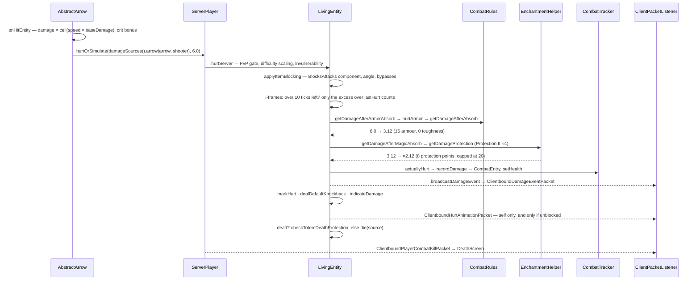

# Damage and death

> Verified against **Minecraft 26.2** · Part VI · An arrow hits a player in full iron with Protection II: six damage becomes two, and if it kills, a message, a loot drop and a death screen.

## Responsibility

Every way an entity can be hurt — a sword, an arrow, lava, suffocation, the
void, a cactus, a falling anvil — funnels into one abstract method that only
exists on the server. What varies is the `DamageSource` describing *what*
and *who*, and the tags on its `DamageType` describing which of the dozen
reduction and immunity steps apply. Death is the tail of the same path:
loot, experience, a message assembled from the victim's combat log, and one
byte broadcast to everyone watching.

The one sentence a player recognises: *armour and Protection stack, hits
inside the red flash do nothing, and the message says what killed you.*

## The data it owns

- **`DamageSource`** — a `DamageType` holder plus up to two entities: the
  *direct* one (the arrow) and the *causing* one (the archer), which are the
  same object for a melee hit (`DamageSource.isDirect`). It can also carry a
  position instead of an entity, though far less often than you would guess:
  ordinary explosions do **not** — they are entity-sourced and get their
  position from `DamageSource.getSourcePosition`'s fallback. The only
  genuinely positional sources in 26.2 are the bad-respawn-point explosion,
  `/damage … at`, and a loot-table explode effect.
  `DamageSource.getWeaponItem` reaches through the direct entity.
- **`DamageType`** — a record of a message id, a `DamageScaling`, a food
  exhaustion cost, a `DamageEffects` (which picks the hurt *sound*) and a
  `DeathMessageType`. It is a **dynamic registry**: the JSON lives in data
  packs and is synced to clients, which is why a hurt packet can carry a
  holder and the client can resolve the right sound.
- **`DamageTypes`** — 51 keys, from `DamageTypes.IN_FIRE` and
  `DamageTypes.LAVA` through `DamageTypes.FALL`, `DamageTypes.DROWN`,
  `DamageTypes.CRAMMING`, `DamageTypes.ARROW`, `DamageTypes.PLAYER_ATTACK`,
  `DamageTypes.MOB_ATTACK`, `DamageTypes.EXPLOSION`,
  `DamageTypes.SONIC_BOOM`, `DamageTypes.MACE_SMASH`,
  `DamageTypes.BAD_RESPAWN_POINT` (the only *intentional game design* one)
  and `DamageTypes.GENERIC_KILL`. `DamageSources` is the per-level factory
  that pre-builds the 25 entity-less ones and constructs the rest on demand;
  reach it from any entity through `Entity.damageSources`.
- **`DamageTypeTags`** — 35 tags, and **almost every behavioural branch in
  the hurt path is tag-driven rather than type-driven**. The exceptions are
  worth knowing because they are the whole list: thorns picks its own
  secondary sound, wind charge is excluded from mob-anger attribution, and a
  `ServerPlayer` mid-dimension-change is invulnerable to everything except
  an ender pearl. Everything else goes through a tag. The ones actually
  read:
  `DamageTypeTags.BYPASSES_INVULNERABILITY`, `DamageTypeTags.BYPASSES_COOLDOWN`,
  `DamageTypeTags.BYPASSES_ARMOR`, `DamageTypeTags.BYPASSES_EFFECTS`,
  `DamageTypeTags.BYPASSES_RESISTANCE`, `DamageTypeTags.BYPASSES_ENCHANTMENTS`,
  `DamageTypeTags.DAMAGES_HELMET`, `DamageTypeTags.IS_FIRE`,
  `DamageTypeTags.IS_FALL`, `DamageTypeTags.IS_FREEZING`,
  `DamageTypeTags.IS_PROJECTILE`, `DamageTypeTags.NO_IMPACT`,
  `DamageTypeTags.NO_KNOCKBACK`, `DamageTypeTags.NO_ANGER`,
  `DamageTypeTags.ALWAYS_MOST_SIGNIFICANT_FALL`.
- **The victim's state**, all on `LivingEntity`: `LivingEntity.hurtTime` and
  `LivingEntity.hurtDuration` (the red flash), `Entity.invulnerableTime` (the
  i-frames), `LivingEntity.lastHurt` (how much the last hit was worth),
  `LivingEntity.deathTime`, `LivingEntity.dead`, the two attribution
  references `LivingEntity.lastHurtByPlayer` (with its
  `LivingEntity.lastHurtByPlayerMemoryTime` countdown) and
  `LivingEntity.lastHurtByMob`, and the `CombatTracker`. The two references
  are written by `LivingEntity.resolveMobResponsibleForDamage` and
  `LivingEntity.resolvePlayerResponsibleForDamage`, which run on **every**
  hit including the silent partial one — and which credit a tamed wolf's
  work to its owner. `LivingEntity.lastDamageSource` and
  `LivingEntity.lastDamageStamp` are set beside them, but only when the hit
  actually counted.
- **`CombatTracker`** — a list of `CombatEntry` records (source, damage, an
  optional `FallLocation`, fall distance) that clears itself after 100 ticks
  out of combat or 300 in it, plus `CombatTracker.getDeathMessage` and the
  fall-attribution logic that produces "was doomed to fall by".
- **The formulas** live in `CombatRules`: `CombatRules.MAX_ARMOR` 20,
  `CombatRules.ARMOR_PROTECTION_DIVIDER` 25,
  `CombatRules.BASE_ARMOR_TOUGHNESS` 2, `CombatRules.MIN_ARMOR_RATIO` 0.2.

## When it runs

**Server main thread, always, for the damage itself.** `Entity.hurtServer`
takes a `ServerLevel` as its first parameter precisely so the compiler
enforces it, and `LivingEntity` does not override `Entity.hurtClient` — so
no health is ever changed client-side. There *is* one living override, and
it is the interesting one: `RemotePlayer.hurtClient` returns true
unconditionally, which is how a client-side arrow knows it hit another
player and can play its own effects without knowing anything about the
damage. Nine classes declare `Entity.hurtClient` in all, and they only ever
answer *did this connect*, never *how much*. `Entity.hurt` and
`Entity.hurtOrSimulate` survive as deprecated final wrappers; only the
second picks a side, the first simply does nothing off a `ServerLevel`.

The client's share is presentation, driven by packets:
`LivingEntity.handleDamageEvent` sets the flash and plays the sound without
touching health; health arrives separately, as synched data for a mob and as
`ClientboundSetHealthPacket` for your own player. `LocalPlayer.hurtTo` is
the one place the client infers a hit from a health *drop*.

`Entity.invulnerableTime` is decremented once per tick from two different
places — `LivingEntity.baseTick` for everything except a `ServerPlayer`, and
`ServerPlayer.tick` for players, earlier in the tick.

Environmental damage is ticked from two places, not one. Fire every twenty
ticks, lava at four a tick, suffocation, the world border and drowning come
from `LivingEntity.baseTick`. **Freezing and cramming do not** — freezing is
in `LivingEntity.aiStep`, every forty ticks, and cramming is inside
`LivingEntity.pushEntities`, which `LivingEntity.aiStep` calls at the end of
its movement work.

## The trace: an arrow hits

1. **The projectile decides a number.** `AbstractArrow.onHitEntity`
   multiplies the arrow's current speed by `AbstractArrow.baseDamage` (2.0
   for a player-fired arrow), lets `EnchantmentHelper.modifyDamage` apply
   Power via the bow that fired it, rounds up, and adds a random bonus for a
   critical arrow. `DamageSources.arrow` builds the source with the arrow as
   direct entity and the shooter as cause.
2. **Gates.** `LivingEntity.hurtServer` opens with three early returns —
   already invulnerable, already dying, or a `DamageTypeTags.IS_FIRE` source
   against `MobEffects.FIRE_RESISTANCE`, which is a mob-effect immunity
   sitting *outside* the reduction pipeline entirely. Invulnerability itself
   is `Entity.isInvulnerableToBase` **or** an enchantment-granted immunity,
   and `ServerPlayer` adds two more of its own: mid-dimension-change, and
   client-not-yet-loaded. Then `ServerPlayer.hurtServer` checks PvP and
   teams, unwrapping the arrow to find the shooter — though for a
   player-fired arrow the causing entity already *is* the shooter, so the
   unwrap only matters for an ownerless one. `Player.hurtServer` checks creative
   invulnerability and applies **difficulty scaling** — but only because
   `DamageTypes.ARROW` is `DamageScaling.WHEN_CAUSED_BY_LIVING_NON_PLAYER`,
   so a skeleton's arrow scales and a player's does not.
3. **Blocking.** `LivingEntity.applyItemBlocking` asks the item being used
   for `DataComponents.BLOCKS_ATTACKS`, checks the damage type against the
   component's bypass set, computes the angle between the incoming source
   and the victim's view against the component's blocking arc, and returns
   the *amount* blocked. An arrow with any piercing level skips all of it.
   Two multipliers sit between here and the i-frames and belong to the
   sequence even though they rarely fire: a `DamageTypeTags.IS_FREEZING`
   source against an entity in `EntityTypeTags.FREEZE_HURTS_EXTRA_TYPES`
   is multiplied by **five**, and a `DamageTypeTags.DAMAGES_HELMET` source
   against a helmeted victim damages the helmet and is multiplied by 0.75.
4. **I-frames, and the flag that makes them silent.** If more than ten ticks
   of invulnerability remain and the type does not bypass the cooldown, the
   hit is only worth its **excess over `LivingEntity.lastHurt`** — and a hit
   that is not bigger returns immediately, before any sound, packet,
   knockback or combat entry. A hit that *is* bigger takes that partial
   branch and clears an internal *took full damage* flag, and everything
   downstream is inside a test of that flag: no `ClientboundDamageEventPacket`,
   no `Entity.markHurt`, no knockback, no hurt sound and no red flash. The
   health simply drops. Otherwise the normal branch records the new
   `LivingEntity.lastHurt`, sets twenty ticks of invulnerability and ten of
   flash, and lets the rest of the pipeline run.
5. **Armour.** `LivingEntity.getDamageAfterArmorAbsorb` first calls
   `LivingEntity.hurtArmor` — which is **empty on `LivingEntity`** and
   overridden only by `Player`, `Horse` and `Wolf`, so a skeleton in iron
   never wears its armour out. Where it is implemented, the cost is one
   durability per four damage, minimum one, per piece, and each piece must
   separately be damageable and not immune to this damage type. Then
   `CombatRules.getDamageAfterAbsorb`: effective armour is the
   armour points *minus damage divided by (2 + toughness/4)*, clamped to
   between a fifth of nominal and 20; the reduction is that over 25. Full
   iron is 15 points and no toughness, so a 6-damage hit sees 12 effective
   armour, 48 % off — 3.12 left. Breach moves this number through
   `EnchantmentHelper.modifyArmorEffectiveness`.
6. **Enchantments and effects.** `LivingEntity.getDamageAfterMagicAbsorb`
   applies Resistance (20 % per level, immune at amplifier four), then sums
   `EnchantmentHelper.getDamageProtection` across every equipment slot —
   Protection is confined to armour by its own *slots* declaration in the
   JSON, not by the helper — Protection II
   contributes 2 per piece, 8 in total — and `CombatRules.getDamageAfterMagicAbsorb`
   caps that sum at 20 and reduces by *sum over 25*. 3.12 becomes about
   2.12. **Combined with armour the ceiling is 96 %: something always lands.**
7. **Absorption, then health.** Absorption hearts are subtracted first; then
   `Player.actuallyHurt` charges food exhaustion (0.1 for an arrow), records
   a `CombatEntry`, sets health and posts `GameEvent.ENTITY_DAMAGE`.
8. **Telling everyone.** `ServerLevel.broadcastDamageEvent` sends a
   `ClientboundDamageEventPacket` — the damage *type*, the two entity ids,
   an optional position, and **no amount** — and it runs *before* the
   knockback, not after. A successful block replaces it entirely: if the
   blocking component absorbed anything, `BlocksAttacks.onBlocked` plays the
   block sound and **no damage event is broadcast at all**. Then
   `Entity.markHurt` queues the velocity packet;
   `LivingEntity.dealDefaultKnockback` computes the direction from the
   projectile and scales it by one minus
   `Attributes.KNOCKBACK_RESISTANCE`; and for a player
   `ServerPlayer.indicateDamage` sends the directional
   `ClientboundHurtAnimationPacket` — to that player alone, and only when
   the hit was not blocked.
9. **Death, or not.** If health has reached zero,
   `LivingEntity.checkTotemDeathProtection` looks for
   `DataComponents.DEATH_PROTECTION` in either hand — unless the source is
   `DamageTypeTags.BYPASSES_INVULNERABILITY`, which is why `/kill` cannot be
   totemed — and on a hit consumes one of the item, sets
   health to one, applies the totem's effects and broadcasts the totem
   entity event. Otherwise `LivingEntity.die`: kill credit, the combat log
   read for a message, `LivingEntity.dropAllDeathLoot`
   (`LivingEntity.dropFromLootTable` with `LootContextParamSets.ENTITY`,
   then `LivingEntity.dropEquipment`, then `LivingEntity.dropExperience`),
   the wither rose, one entity-event byte to every watcher, and *then*
   `Pose.DYING` — the byte goes out before the pose, not after. The loot,
   the game event and the wither rose are all inside one gate the page's
   ordering hides: `Entity.killedEntity` on the killer, which can veto them
   outright.
10. **The death screen.** For a player, `ServerPlayer.die` sends
    `ClientboundPlayerCombatKillPacket`. `GameRules.SHOW_DEATH_MESSAGES`
    gates more than the chat line: with the rule off the message is never
    even assembled and the packet goes out carrying an **empty** component,
    so the death screen still opens but says nothing. With it on, the
    message is built from the combat log, sent in the packet and
    broadcast in chat. `ServerPlayer.die` also tells
    nearby angry mobs to forgive them under
    `GameRules.FORGIVE_DEAD_PLAYERS`, drops the inventory unless
    `GameRules.KEEP_INVENTORY`, and records the death location. The client
    opens the death screen — unless `GameRules.IMMEDIATE_RESPAWN` — and the
    button sends the respawn command back.
    [Player anatomy](../player/player-anatomy.md) owns the object that
    comes back.
11. **Cleanup.** A dead mob counts up `LivingEntity.deathTime` for twenty
    ticks, then broadcasts the poof event and removes itself with
    `Entity.RemovalReason.KILLED`.

## Interfaces

- **Called by:** everything that hurts — `Player.attack`,
  `Mob.doHurtTarget`, `AbstractArrow.onHitEntity` and the other projectiles,
  explosions, `Entity.lavaHurt`, the environmental tickers in
  `Entity.baseTick` and `LivingEntity.baseTick`, `Entity.thunderHit`,
  `LivingEntity.kill`, and the `/kill` and `/damage` commands.
- **Calls into:** `CombatRules`, `EnchantmentHelper`,
  `MobEffectInstance.onMobHurt`, `ItemStack.hurtAndBreak` for armour
  durability, the loot system (`LootContextParamSets.ENTITY` with
  `LootContextParams.DAMAGE_SOURCE`, `LootContextParams.ATTACKING_ENTITY`
  and `LootContextParams.LAST_DAMAGE_PLAYER`), `ExperienceOrb.award`,
  `CriteriaTriggers` and the `Stats` counters.
- **Crosses the network as:** `ClientboundDamageEventPacket` (type and ids,
  no amount, to all trackers and self); `ClientboundHurtAnimationPacket`
  (only ever to one player, about themselves);
  `ClientboundEntityEventPacket` — byte 3 for death, 60 for the poof, 35 for
  a totem; `ClientboundSetHealthPacket` for your own player;
  `ClientboundSetEntityDataPacket` carrying `LivingEntity.DATA_HEALTH_ID`
  for mobs; `ClientboundSetEntityMotionPacket` for knockback;
  `ClientboundPlayerCombatKillPacket`, `ClientboundPlayerCombatEnterPacket`
  and `ClientboundPlayerCombatEndPacket`. Inbound, only the respawn command.
- **Data-driven by:** the damage-type registry and its tags; loot tables;
  enchantment definitions, entirely — Protection is
  `EnchantmentEffectComponents.DAMAGE_PROTECTION` holding a conditional
  value effect, not a class; the item components
  `DataComponents.BLOCKS_ATTACKS`, `DataComponents.DAMAGE_RESISTANT`,
  `DataComponents.DEATH_PROTECTION`; the armour and toughness
  [attributes](attributes.md); and the game rules `GameRules.MOB_DROPS`,
  `GameRules.KEEP_INVENTORY`, `GameRules.SHOW_DEATH_MESSAGES`,
  `GameRules.FALL_DAMAGE`, `GameRules.FIRE_DAMAGE`,
  `GameRules.DROWNING_DAMAGE`, `GameRules.FREEZE_DAMAGE`,
  `GameRules.IMMEDIATE_RESPAWN`.

## Invariants and surprises

- **I-frames compare against the last damage, not zero.** Inside the window,
  only the excess over `LivingEntity.lastHurt` is felt, and a weaker hit
  returns immediately — no sound, no knockback, no packet, no combat entry.
  This is why the strongest hit in each window is the only one that counts.
- **A hit inside the window that *does* land is invisible.** The partial
  branch clears the took-full-damage flag, which gates the damage-event
  broadcast, the knockback, the hurt sound and the flash alike. Health goes
  down and nothing else happens — so `ClientboundDamageEventPacket` is not a
  reliable "was hit" signal, and neither is the red flash.
- **The damage amount never crosses the wire.**
  `ClientboundDamageEventPacket` carries the type and who, so the client can
  pick the right sound and flash; magnitude is inferred from health, and
  only for your own player.
- **The client kills mobs on its own, from one byte.** The death entity
  event makes a client-side non-player set its health to zero and run the
  death sequence locally — the twenty-tick animation is client-driven, not a
  consequence of a health packet.
- **Armour is capped twice and floored once.** Effective armour never drops
  below a fifth of nominal and never counts above 20; protection points also
  cap at 20. Armour alone tops out at 80 % reduction, enchantment protection
  at 80 % of the remainder — 96 % combined.
- **Big hits punch through armour** by design: effective armour is reduced
  by the incoming damage divided by the toughness term, which is exactly
  what toughness slows down.
- **Shields are no longer a mechanism, only a vocabulary.** Blocking is any
  item carrying `DataComponents.BLOCKS_ATTACKS`, held past its delay, with a
  data-defined arc, per-damage-type bypass set, reduction formula,
  durability cost and sounds; an arrow with piercing ignores it before the
  angle is even computed. But `ShieldItem` still exists, a statistic is
  still awarded under a shield-shaped name, and the disable rule survives as
  `LivingEntity.getSecondsToDisableBlocking` — which `Warden` overrides —
  feeding `Player.blockUsingItem`. And a successful non-projectile block
  knocks the *attacker* back.
- **`ServerPlayer.die` never calls up.** It reimplements the whole sequence,
  so the base death hook — and everything hung off it — does not run for a
  real player. One visible consequence: `LivingEntity.dead` is set inside
  the part that is skipped, so it stays **false** on a dead player for the
  whole death screen.
- **Death loot needs a *recent* player.** The player attribution expires
  after 100 ticks; without it the loot context gets no
  `LootContextParams.LAST_DAMAGE_PLAYER` and no luck, and experience is not
  dropped at all unless the mob is an always-dropper. Loot is gated on
  `GameRules.MOB_DROPS` and, on `LivingEntity`, on not being a baby — but
  `Monster` overrides that gate to drop the baby condition, so baby zombies
  and piglins do drop. Experience is gated on the same game rule; only
  **equipment** sits outside it.
- **`CombatTracker` clears itself**, after 100 ticks out of combat or 300
  in it — so the death message can only be built from a live window, and the
  status recheck happens *after* the message is read. The recheck is on a
  timer of its own: `LivingEntity.tick` runs it every twenty ticks, so the
  expiry is a background rule and not a side effect of the next hit.
- **Non-living entities have their own damage code entirely.** About thirty
  classes override `Entity.hurtServer` directly — `ArmorStand`,
  `VehicleEntity`, `ItemFrame`, `EndCrystal`, `EnderDragonPart`,
  `FallingBlockEntity`, `PrimedTnt`, `Display`, `Interaction` and the rest —
  and never touch armour, i-frames or the combat tracker. The armour-stand
  damage-type tags exist only for that code.
- **Fall attribution has a threshold.** The tracker only credits a fall when
  the best fall exceeds five, and when the fall was not the first entry it
  credits the *previous* one — which is where "was doomed to fall by" comes
  from.
- **`Entity.hurt` and `Entity.hurtOrSimulate` are deprecated final
  wrappers.** The method to override is `Entity.hurtServer`.
  `Entity.hurtClient` has nine declarations and answers only *did it
  connect* — including on `RemotePlayer`, the one living entity that has it.

## Where to look

`DamageSource` · `DamageType` · `DamageTypes` · `DamageSources` ·
`DamageTypeTags` · `Entity.hurtServer` · `Entity.isInvulnerableToBase` ·
`LivingEntity.hurtServer` · `LivingEntity.applyItemBlocking` ·
`LivingEntity.actuallyHurt` · `LivingEntity.getDamageAfterArmorAbsorb` ·
`LivingEntity.getDamageAfterMagicAbsorb` · `CombatRules` ·
`LivingEntity.knockback` · `LivingEntity.die` ·
`LivingEntity.dropAllDeathLoot` · `LivingEntity.tickDeath` ·
`ServerPlayer.die` · `Entity.killedEntity` · `LivingEntity.getKillCredit` ·
`LivingEntity.resolvePlayerResponsibleForDamage` ·
`CombatTracker` · `CombatEntry` · `FallLocation` ·
`BlocksAttacks` · `DeathProtection` · `ClientboundDamageEventPacket` ·
`ClientboundPlayerCombatKillPacket`

---

*Rules: names, never code · how the system works, not how the code reads ·
newest version only · every backticked name passes `tools/verify_names.py`.*
