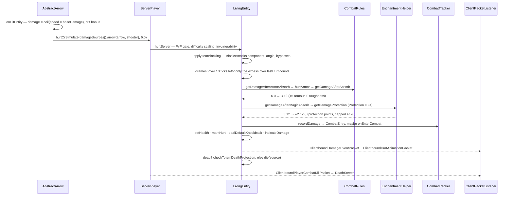

# Damage and death

> Verified against **Minecraft 26.2** · Part VI · An arrow hits a player in full iron with Protection II: six damage becomes two, and if it kills, a message, a loot drop and a death screen.

## Responsibility

Every way an entity can be hurt — a sword, an arrow, lava, suffocation, the
void, a cactus, a falling anvil — funnels into one abstract method that only
exists on the server. What varies is the `DamageSource` describing *what*
and *who*, and the tags on its `DamageType` describing which of the dozen
reduction and immunity steps apply. Death is the tail of the same path:
loot, experience, a message assembled from the victim's combat log, and one
byte broadcast to everyone watching.

The one sentence a player recognises: *armour and Protection stack, hits
inside the red flash do nothing, and the message says what killed you.*

## The data it owns

- **`DamageSource`** — a `DamageType` holder plus up to two entities: the
  *direct* one (the arrow) and the *causing* one (the archer), which are the
  same object for a melee hit (`DamageSource.isDirect`). Optionally a
  position instead, for sourceless things like an explosion.
  `DamageSource.getWeaponItem` reaches through the direct entity.
- **`DamageType`** — a record of a message id, a `DamageScaling`, a food
  exhaustion cost, a `DamageEffects` (which picks the hurt *sound*) and a
  `DeathMessageType`. It is a **dynamic registry**: the JSON lives in data
  packs and is synced to clients, which is why a hurt packet can carry a
  holder and the client can resolve the right sound.
- **`DamageTypes`** — 51 keys, from `DamageTypes.IN_FIRE` and
  `DamageTypes.LAVA` through `DamageTypes.FALL`, `DamageTypes.DROWN`,
  `DamageTypes.CRAMMING`, `DamageTypes.ARROW`, `DamageTypes.PLAYER_ATTACK`,
  `DamageTypes.MOB_ATTACK`, `DamageTypes.EXPLOSION`,
  `DamageTypes.SONIC_BOOM`, `DamageTypes.MACE_SMASH`,
  `DamageTypes.BAD_RESPAWN_POINT` (the only *intentional game design* one)
  and `DamageTypes.GENERIC_KILL`. `DamageSources` is the per-level factory
  that pre-builds the 25 entity-less ones and constructs the rest on demand;
  reach it from any entity through `Entity.damageSources`.
- **`DamageTypeTags`** — 38 tags, and **every behavioural branch in the hurt
  path is tag-driven, never type-driven**. The ones actually read:
  `DamageTypeTags.BYPASSES_INVULNERABILITY`, `DamageTypeTags.BYPASSES_COOLDOWN`,
  `DamageTypeTags.BYPASSES_ARMOR`, `DamageTypeTags.BYPASSES_EFFECTS`,
  `DamageTypeTags.BYPASSES_RESISTANCE`, `DamageTypeTags.BYPASSES_ENCHANTMENTS`,
  `DamageTypeTags.DAMAGES_HELMET`, `DamageTypeTags.IS_FIRE`,
  `DamageTypeTags.IS_FALL`, `DamageTypeTags.IS_FREEZING`,
  `DamageTypeTags.IS_PROJECTILE`, `DamageTypeTags.NO_IMPACT`,
  `DamageTypeTags.NO_KNOCKBACK`, `DamageTypeTags.NO_ANGER`,
  `DamageTypeTags.ALWAYS_MOST_SIGNIFICANT_FALL`.
- **The victim's state**, all on `LivingEntity`: `LivingEntity.hurtTime` and
  `LivingEntity.hurtDuration` (the red flash), `Entity.invulnerableTime` (the
  i-frames), `LivingEntity.lastHurt` (how much the last hit was worth),
  `LivingEntity.deathTime`, `LivingEntity.dead`, the two attribution
  references `LivingEntity.lastHurtByPlayer` (with its
  `LivingEntity.lastHurtByPlayerMemoryTime` countdown) and
  `LivingEntity.lastHurtByMob`, and the `CombatTracker`.
- **`CombatTracker`** — a list of `CombatEntry` records (source, damage, an
  optional `FallLocation`, fall distance) that clears itself after 100 ticks
  out of combat or 300 in it, plus `CombatTracker.getDeathMessage` and the
  fall-attribution logic that produces "was doomed to fall by".
- **The formulas** live in `CombatRules`: `CombatRules.MAX_ARMOR` 20,
  `CombatRules.ARMOR_PROTECTION_DIVIDER` 25,
  `CombatRules.BASE_ARMOR_TOUGHNESS` 2, `CombatRules.MIN_ARMOR_RATIO` 0.2.

## When it runs

**Server main thread, always.** `Entity.hurtServer` takes a `ServerLevel` as
its first parameter precisely so the compiler enforces it, and
`LivingEntity` does not override `Entity.hurtClient` at all — a living
entity never simulates damage client-side. `Entity.hurt` and
`Entity.hurtOrSimulate` survive as deprecated final wrappers that pick the
right side.

The client's share is presentation, driven by packets:
`LivingEntity.handleDamageEvent` sets the flash and plays the sound without
touching health; health arrives separately, as synched data for a mob and as
`ClientboundSetHealthPacket` for your own player. `LocalPlayer.hurtTo` is
the one place the client infers a hit from a health *drop*.

`Entity.invulnerableTime` is decremented once per tick from two different
places — `LivingEntity.baseTick` for everything except a `ServerPlayer`, and
`ServerPlayer.tick` for players, earlier in the tick.

Environmental damage is ticked from the base tick: fire every twenty ticks,
lava at four a tick, suffocation, the world border, drowning, freezing and
cramming from `LivingEntity.baseTick`.

## The trace: an arrow hits

1. **The projectile decides a number.** `AbstractArrow.onHitEntity`
   multiplies the arrow's current speed by `AbstractArrow.baseDamage` (2.0
   for a player-fired arrow), lets `EnchantmentHelper.modifyDamage` apply
   Power via the bow that fired it, rounds up, and adds a random bonus for a
   critical arrow. `DamageSources.arrow` builds the source with the arrow as
   direct entity and the shooter as cause.
2. **Gates.** `ServerPlayer.hurtServer` checks PvP and teams, unwrapping the
   arrow to find the shooter. `Player.hurtServer` checks creative
   invulnerability and applies **difficulty scaling** — but only because
   `DamageTypes.ARROW` is `DamageScaling.WHEN_CAUSED_BY_LIVING_NON_PLAYER`,
   so a skeleton's arrow scales and a player's does not.
3. **Blocking.** `LivingEntity.applyItemBlocking` asks the item being used
   for `DataComponents.BLOCKS_ATTACKS`, checks the damage type against the
   component's bypass set, computes the angle between the incoming source
   and the victim's view against the component's blocking arc, and returns
   the *amount* blocked. An arrow with any piercing level skips all of it.
4. **I-frames.** If more than ten ticks of invulnerability remain and the
   type does not bypass the cooldown, the hit is only worth its **excess over
   `LivingEntity.lastHurt`** — and a hit that is not bigger is discarded
   entirely, before any sound, packet, knockback or combat entry. Otherwise
   the normal branch records the new `LivingEntity.lastHurt`, sets twenty
   ticks of invulnerability and ten of flash.
5. **Armour.** `LivingEntity.getDamageAfterArmorAbsorb` first damages the
   armour (one durability per four damage, minimum one, on each of the four
   pieces), then `CombatRules.getDamageAfterAbsorb`: effective armour is the
   armour points *minus damage divided by (2 + toughness/4)*, clamped to
   between a fifth of nominal and 20; the reduction is that over 25. Full
   iron is 15 points and no toughness, so a 6-damage hit sees 12 effective
   armour, 48 % off — 3.12 left. Breach moves this number through
   `EnchantmentHelper.modifyArmorEffectiveness`.
6. **Enchantments and effects.** `LivingEntity.getDamageAfterMagicAbsorb`
   applies Resistance (20 % per level, immune at amplifier four), then sums
   `EnchantmentHelper.getDamageProtection` across the armour — Protection II
   contributes 2 per piece, 8 in total — and `CombatRules.getDamageAfterMagicAbsorb`
   caps that sum at 20 and reduces by *sum over 25*. 3.12 becomes about
   2.12. **Combined with armour the ceiling is 96 %: something always lands.**
7. **Absorption, then health.** Absorption hearts are subtracted first; then
   `Player.actuallyHurt` charges food exhaustion (0.1 for an arrow), records
   a `CombatEntry`, sets health and posts `GameEvent.ENTITY_DAMAGE`.
8. **Telling everyone.** `ServerLevel.broadcastDamageEvent` sends a
   `ClientboundDamageEventPacket` — the damage *type*, the two entity ids,
   an optional position, and **no amount**. `Entity.markHurt` queues the
   velocity packet; `LivingEntity.dealDefaultKnockback` computes the
   direction from the projectile, scales it by one minus
   `Attributes.KNOCKBACK_RESISTANCE`, and for a player
   `ServerPlayer.indicateDamage` sends the directional
   `ClientboundHurtAnimationPacket` — to that player alone.
9. **Death, or not.** If health has reached zero,
   `LivingEntity.checkTotemDeathProtection` looks for
   `DataComponents.DEATH_PROTECTION` in either hand, and on a hit sets
   health to one, applies the totem's effects and broadcasts the totem
   entity event. Otherwise `LivingEntity.die`: kill credit, the combat log
   read for a message, `LivingEntity.dropAllDeathLoot`
   (`LivingEntity.dropFromLootTable` with `LootContextParamSets.ENTITY`,
   then `LivingEntity.dropEquipment`, then `LivingEntity.dropExperience`),
   the wither rose, `Pose.DYING`, and one entity-event byte to every
   watcher.
10. **The death screen.** For a player, `ServerPlayer.die` sends
    `ClientboundPlayerCombatKillPacket` carrying the assembled message,
    broadcasts it in chat under `GameRules.SHOW_DEATH_MESSAGES`, tells
    nearby angry mobs to forgive them under
    `GameRules.FORGIVE_DEAD_PLAYERS`, drops the inventory unless
    `GameRules.KEEP_INVENTORY`, and records the death location. The client
    opens the death screen — unless `GameRules.IMMEDIATE_RESPAWN` — and the
    button sends the respawn command back.
    [Player anatomy](../player/player-anatomy.md) owns the object that
    comes back.
11. **Cleanup.** A dead mob counts up `LivingEntity.deathTime` for twenty
    ticks, then broadcasts the poof event and removes itself with
    `Entity.RemovalReason.KILLED`.

## Interfaces

- **Called by:** everything that hurts — `Player.attack`,
  `Mob.doHurtTarget`, `AbstractArrow.onHitEntity` and the other projectiles,
  explosions, `Entity.lavaHurt`, the environmental tickers in
  `Entity.baseTick` and `LivingEntity.baseTick`, `Entity.thunderHit`,
  `LivingEntity.kill`, and the `/kill` and `/damage` commands.
- **Calls into:** `CombatRules`, `EnchantmentHelper`,
  `MobEffectInstance.onMobHurt`, `ItemStack.hurtAndBreak` for armour
  durability, the loot system (`LootContextParamSets.ENTITY` with
  `LootContextParams.DAMAGE_SOURCE`, `LootContextParams.ATTACKING_ENTITY`
  and `LootContextParams.LAST_DAMAGE_PLAYER`), `ExperienceOrb.award`,
  `CriteriaTriggers` and the `Stats` counters.
- **Crosses the network as:** `ClientboundDamageEventPacket` (type and ids,
  no amount, to all trackers and self); `ClientboundHurtAnimationPacket`
  (only ever to one player, about themselves);
  `ClientboundEntityEventPacket` — byte 3 for death, 60 for the poof, 35 for
  a totem; `ClientboundSetHealthPacket` for your own player;
  `ClientboundSetEntityDataPacket` carrying `LivingEntity.DATA_HEALTH_ID`
  for mobs; `ClientboundSetEntityMotionPacket` for knockback;
  `ClientboundPlayerCombatKillPacket`, `ClientboundPlayerCombatEnterPacket`
  and `ClientboundPlayerCombatEndPacket`. Inbound, only the respawn command.
- **Data-driven by:** the damage-type registry and its tags; loot tables;
  enchantment definitions, entirely — Protection is
  `EnchantmentEffectComponents.DAMAGE_PROTECTION` holding a conditional
  value effect, not a class; the item components
  `DataComponents.BLOCKS_ATTACKS`, `DataComponents.DAMAGE_RESISTANT`,
  `DataComponents.DEATH_PROTECTION`; the armour and toughness
  [attributes](attributes.md); and the game rules `GameRules.MOB_DROPS`,
  `GameRules.KEEP_INVENTORY`, `GameRules.SHOW_DEATH_MESSAGES`,
  `GameRules.FALL_DAMAGE`, `GameRules.FIRE_DAMAGE`,
  `GameRules.DROWNING_DAMAGE`, `GameRules.FREEZE_DAMAGE`,
  `GameRules.IMMEDIATE_RESPAWN`.

## Invariants and surprises

- **I-frames compare against the last damage, not zero.** Inside the window,
  only the excess over `LivingEntity.lastHurt` is felt, and a weaker hit
  returns immediately — no sound, no knockback, no packet, no combat entry.
  This is why the strongest hit in each window is the only one that counts.
- **The damage amount never crosses the wire.**
  `ClientboundDamageEventPacket` carries the type and who, so the client can
  pick the right sound and flash; magnitude is inferred from health, and
  only for your own player.
- **The client kills mobs on its own, from one byte.** The death entity
  event makes a client-side non-player set its health to zero and run the
  death sequence locally — the twenty-tick animation is client-driven, not a
  consequence of a health packet.
- **Armour is capped twice and floored once.** Effective armour never drops
  below a fifth of nominal and never counts above 20; protection points also
  cap at 20. Armour alone tops out at 80 % reduction, enchantment protection
  at 80 % of the remainder — 96 % combined.
- **Big hits punch through armour** by design: effective armour is reduced
  by the incoming damage divided by the toughness term, which is exactly
  what toughness slows down.
- **Shields no longer exist as a concept.** There is no shield check and no
  shield method; blocking is any item carrying
  `DataComponents.BLOCKS_ATTACKS`, held past its delay, with a data-defined
  arc, per-damage-type bypass set, reduction formula, durability cost and
  sounds. An arrow with piercing ignores it before the angle is even
  computed.
- **`ServerPlayer.die` never calls up.** It reimplements the whole sequence,
  so the base death hook — and everything hung off it — does not run for a
  real player.
- **Death loot needs a *recent* player.** The player attribution expires
  after 100 ticks; without it the loot context gets no
  `LootContextParams.LAST_DAMAGE_PLAYER` and no luck, and experience is not
  dropped at all unless the mob is an always-dropper. Loot is also gated on
  not being a baby and on `GameRules.MOB_DROPS`, while equipment and
  experience sit outside that check.
- **`CombatTracker` clears itself**, after 100 ticks out of combat or 300
  in it — so the death message can only be built from a live window, and the
  status recheck happens *after* the message is read.
- **Fall attribution has a threshold.** The tracker only credits a fall when
  the best fall exceeds five, and when the fall was not the first entry it
  credits the *previous* one — which is where "was doomed to fall by" comes
  from.
- **`Entity.hurt` and `Entity.hurtOrSimulate` are deprecated final
  wrappers.** The method to override is `Entity.hurtServer`; the client one
  exists on five classes and none of them are living entities.

## Where to look

`DamageSource` · `DamageType` · `DamageTypes` · `DamageSources` ·
`DamageTypeTags` · `Entity.hurtServer` · `Entity.isInvulnerableToBase` ·
`LivingEntity.hurtServer` · `LivingEntity.applyItemBlocking` ·
`LivingEntity.actuallyHurt` · `LivingEntity.getDamageAfterArmorAbsorb` ·
`LivingEntity.getDamageAfterMagicAbsorb` · `CombatRules` ·
`LivingEntity.knockback` · `LivingEntity.die` ·
`LivingEntity.dropAllDeathLoot` · `LivingEntity.tickDeath` ·
`ServerPlayer.die` · `CombatTracker` · `CombatEntry` · `FallLocation` ·
`BlocksAttacks` · `DeathProtection` · `ClientboundDamageEventPacket` ·
`ClientboundPlayerCombatKillPacket`

---

*Rules: names, never code · how the system works, not how the code reads ·
newest version only · every backticked name passes `tools/verify_names.py`.*
