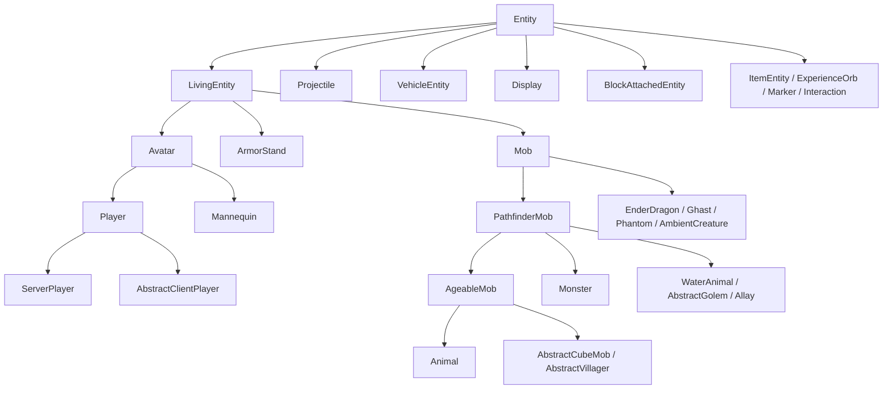
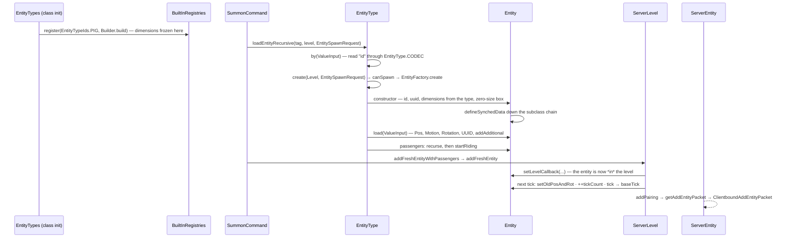

# Entity anatomy

> Verified against **Minecraft 26.2** · Part VI · What an entity *is*: one `EntityType` from the registry, through a factory, to a live object the level ticks.

## Responsibility

An entity is anything in the world that is not a block: mobs, players,
items on the ground, arrows, boats, item frames, experience orbs, the
invisible markers a data pack uses as bookmarks. `Entity` is the base class
all of them share, and it is deliberately thin on behaviour and thick on
state — a position, a hitbox, a numbered array of values the client is told
about, a vehicle and passengers, a removal reason. Everything interesting —
health, AI, damage, inventory — arrives further down the hierarchy.

This is the map page for Part VI. It says what the base class owns, how the
type registry produces one, what the class tree looks like, and where each
sibling page takes over.

The one sentence a player recognises: *everything you can hit, ride, pick up
or be killed by is an entity, and they all move, save and sync through the
same base class.*

## The data it owns

`Entity` implements nine interfaces (`Nameable`, `EntityAccess`,
`ScoreHolder`, `SyncedDataHolder`, `DataComponentGetter`, `ItemOwner`,
`SlotProvider`, `DebugValueSource`, and `TypedInstance` over `EntityType`),
which is a fair summary of how many systems reach into it. Its state falls
into seven groups.

- **Identity.** `Entity.type` (its `EntityType`), `Entity.id` — a per-level
  int handed out by `Level.getNextEntityId`, and the *only* thing
  `Entity.equals` and `Entity.hashCode` look at — `Entity.uuid`,
  `Entity.tags` (the `/tag` strings, capped at
  `Entity.MAX_ENTITY_TAG_COUNT`) and `Entity.customData`.
- **Place.** `Entity.position` (a `Vec3` at the **feet**), with
  `Entity.blockPosition` and `Entity.chunkPosition` cached beside it,
  `Entity.deltaMovement`, `Entity.yRot`/`Entity.xRot` and their previous-tick
  copies, and `Entity.bb`, the bounding box — a stored field, not a
  computation. `Entity.level` is the level it belongs to;
  `Entity.levelCallback` is the hook the level's entity manager installs, and
  it starts as `EntityInLevelCallback.NULL`.
- **Shape.** `Entity.dimensions` (an `EntityDimensions`) and
  `Entity.eyeHeight`, both **caches**, refreshed by
  `Entity.refreshDimensions`. See below.
- **Synched values.** `Entity.entityData`, filled by the abstract
  `Entity.defineSynchedData`, with eight accessors declared on `Entity`
  itself — the shared flags byte `Entity.DATA_SHARED_FLAGS_ID`, air supply,
  custom name and its visibility, silence, no-gravity, pose and frozen ticks.
  [Synched entity data](synched-entity-data.md) owns this.
- **Passengers.** `Entity.passengers` (an immutable list) and
  `Entity.vehicle`, with `Entity.startRiding`, `Entity.stopRiding`,
  `Entity.ejectPassengers`, `Entity.getRootVehicle`,
  `Entity.getIndirectPassengers`, `Entity.getControllingPassenger` and the
  positioning pair `Entity.positionRider` / `Entity.getPassengerRidingPosition`.
- **Liveness.** `Entity.removalReason` — nullable, and its nullness *is* the
  "am I alive" bit, read through `Entity.isRemoved`. `Entity.setRemoved` is
  final and first-reason-wins.
- **The tick counters.** `Entity.tickCount`, `Entity.firstTick`,
  `Entity.invulnerableTime`, `Entity.boardingCooldown`, and the per-tick
  movement journal (`Entity.movementThisTick`, `Entity.visitedBlocks`,
  `Entity.insideEffectCollector`) that [movement and
  collision](movement-and-collision.md) explains.

Plus the smaller state families that live on the base class because
everything can have them: fire (`Entity.remainingFireTicks`,
`Entity.igniteForSeconds`, `Entity.fireImmune`), freezing
(`Entity.getTicksFrozen`, `Entity.getPercentFrozen`,
`Entity.getTicksRequiredToFreeze`), fluids (`Entity.fluidInteraction`,
`Entity.isInWater`, `Entity.isEyeInFluid`), portals
(`Entity.portalProcess`, `Entity.portalCooldown`, `Entity.teleport`),
naming (`Entity.getName`, `Entity.getDisplayName`,
`Entity.setCustomName`), and item-component views
(`Entity.applyImplicitComponents`, `Entity.applyComponentsFromItemStack` —
see [data components](../foundations/data-components.md)).

### `EntityType`, and where the constants went

`EntityType` is one object per registered kind, in `Registries.ENTITY_TYPE`
— a **defaulted** registry whose default is *pig*, so an unrecognised id
resolves to a pig rather than throwing. Each carries an
`EntityType.EntityFactory`, a `MobCategory`, an `EntityDimensions`, a
`FeatureFlagSet`, an optional loot-table key, and the two numbers that
decide how it reaches clients: `EntityType.clientTrackingRange` (in
**chunks**, default 5) and `EntityType.updateInterval` (in ticks, default 3).
`EntityType.Builder` writes all of it, and `EntityType.Builder.build`
freezes the dimensions for the lifetime of the type.

In 26.2 the constants are **not on `EntityType`**. They live in two parallel
files: `EntityTypeIds` — 158 `ResourceKey`s, `EntityTypeIds.PIG` and
friends, with no reference to any entity class — and `EntityTypes`, the 158
matching objects, `EntityTypes.PIG`, `EntityTypes.ZOMBIE`,
`EntityTypes.MANNEQUIN`. `EntityTypes` is where every type's category,
size, eye height, tracking range and update interval is actually written
down; it is the most useful single table in the package.

`MobCategory` — `MobCategory.MONSTER`, `MobCategory.CREATURE`,
`MobCategory.AMBIENT`, `MobCategory.AXOLOTLS`,
`MobCategory.UNDERGROUND_WATER_CREATURE`, `MobCategory.WATER_CREATURE`,
`MobCategory.WATER_AMBIENT`, `MobCategory.MISC` — carries the spawn cap and
despawn distance that [entity lifecycle](entity-lifecycle.md) uses.

### Dimensions and pose

`EntityDimensions` is a record of width, height, eye height, an
`EntityAttachments` map and a *fixed* flag.
`EntityDimensions.makeBoundingBox` centres the box in X and Z on the
position and grows it **upward** — the position is the feet, never the
centre. `EntityDimensions.scalable` and `EntityDimensions.fixed` are the two
factories, and the flag earns its keep in `EntityDimensions.scale`, which
returns the record unchanged when *fixed*: that, and nothing else, is why some
mobs ignore `Attributes.SCALE`.

`EntityAttachments` answers "where does a passenger sit, where does the name
tag float, where does the lead attach" — `EntityAttachment.PASSENGER`,
`EntityAttachment.VEHICLE`, `EntityAttachment.NAME_TAG`,
`EntityAttachment.WARDEN_CHEST`, each with a fallback
(`EntityAttachment.Fallback.AT_HEIGHT` and friends) filled in by
`EntityAttachments.Builder.build`.

`Pose` is an 18-constant enum with explicit wire ids —
`Pose.STANDING`, `Pose.FALL_FLYING`, `Pose.SLEEPING`, `Pose.SWIMMING`,
`Pose.SPIN_ATTACK`, `Pose.CROUCHING`, `Pose.LONG_JUMPING`, `Pose.DYING`,
and the mob-specific `Pose.CROAKING`, `Pose.ROARING`, `Pose.SNIFFING`,
`Pose.EMERGING`, `Pose.DIGGING`, `Pose.SLIDING`, `Pose.INHALING` … —
decoded with an out-of-range strategy that silently yields
`Pose.STANDING`. Pose is the one synched value that changes physics: it
travels as `Entity.DATA_POSE`, and `Entity.onSyncedDataUpdated` turns a pose
change into `Entity.refreshDimensions`.

## The hierarchy

`Entity` has **18 direct subclasses** and 188 descendants in the jar. The
non-living branches are the short half: `Projectile`, `VehicleEntity`,
`Display`, `BlockAttachedEntity`, `ItemEntity`, `FallingBlockEntity`,
`PrimedTnt`, `ExperienceOrb`, `AreaEffectCloud`, `LightningBolt`, `Marker`,
`Interaction`, `OminousItemSpawner`, `EndCrystal`, `EnderDragonPart`,
`EvokerFangs`, `EyeOfEnder`.

`LivingEntity` has exactly three direct subclasses — `Avatar`, `ArmorStand`
and `Mob` — which is worth stating plainly: **`ArmorStand` is a living
entity with no AI at all**, no `Brain`, no `GoalSelector`, no
`PathNavigation`. `Mob` adds those, `PathfinderMob` adds navigation,
`AgeableMob` adds babies, `Animal` and `Monster` split by disposition, and
`Monster` implements the marker interface `Enemy`, which carries nothing but
the XP-reward constants.

**`Avatar` is new in 26.2 and it is the biggest structural change in the
part.** It sits between `LivingEntity` and `Player`, and it is 57 lines: the
player-shaped `Avatar.POSES` dimension map, the 1.62 eye height, the
skin-part and handedness synched values (`Avatar.DATA_PLAYER_MAIN_HAND`,
`Avatar.DATA_PLAYER_MODE_CUSTOMISATION`), and one abstract method,
`Avatar.getProfile`. Its point is `Mannequin` — a posable, profile-skinned,
player-looking entity in the decoration package that is *not* a `Player` and
carries none of the inventory, abilities or hunger. Anything written against
"`Player extends LivingEntity`" is now wrong by one level, and on the client
`AvatarRenderer` has replaced the old player renderer.

Cutting across the tree are the capability interfaces: `Leashable` (the
fattest of them, with `Leashable.tickLeash` called from `Entity.baseTick`),
`Bucketable`, `EquipmentUser`, `NeutralMob` (persistent anger),
`Attackable`, `Targeting`, `TraceableEntity`, `OwnableEntity`, `Shearable`,
`ContainerUser` (implemented by `Player`, not by `Mob`),
`PlayerRideableJumping`, `ItemSteerable`.

`EntityReference` deserves a name here: a reference to another entity that
stores either a UUID or the live object, resolving lazily and *decaying back
to the UUID* when the target is gone or unloaded. It is how "who last hurt
me", "who owns this pet" and "who shot this arrow" survive a chunk unload.

### Where the 716 files are

| subpackage | files | what |
|---|---:|---|
| `entity/ai` | 277 | goals, brains, navigation, attributes, sensors |
| `entity/animal` | 130 | one subpackage per species now |
| `entity/monster` | 84 | likewise |
| `entity/projectile` | 37 | arrows, fireballs, thrown items |
| `entity/boss` | 24 | dragon and wither |
| `entity/vehicle` | 24 | boats and minecarts |
| `entity/npc` | 15 | villagers and traders |
| `entity/player` | 14 | `Player`, `Inventory`, `Abilities` |
| `entity/decoration` | 12 | armour stands, frames, paintings, `Mannequin` |
| `entity/item`, `entity/raid`, `entity/variant`, `entity/ambient` | 22 | items, raids, mob variants, bats |

## When it runs

**Server main thread.** `ServerLevel.tickNonPassenger` calls
`Entity.setOldPosAndRot`, increments `Entity.tickCount`, opens a profiler
section named after the entity type, and then calls `Entity.tick` — through
`Level.guardEntityTick`, which turns any exception into a crash report with
the entity's details attached. Passengers are ticked separately through
`Entity.rideTick`.

**Client main thread.** `ClientLevel.tickEntities` does the same three
things and calls the same `Entity.tick`. Nothing entity-related runs on a
worker pool, and `Entity` is not thread-safe.

`Entity.tick`'s body on the base class is one line: call `Entity.baseTick`.
Everything you remember happening "in tick" is in `Entity.baseTick` — the
vehicle check, the portal handling, the fluid snapshot, swimming, fire
ticking, the lava halving of fall distance, the below-world check, the leash
— or in an override. `LivingEntity.tick` calls up and then runs
`LivingEntity.aiStep`; `Mob.tick` calls up and refreshes its goal-control
flags every five ticks.

## The trace: from registry entry to live object

1. **Boot.** `EntityTypes` runs `EntityType.Builder.build` for each of the
   158 keys in `EntityTypeIds` and registers the result. The
   `EntityDimensions` and its attachment points are computed here, once,
   and never change for the type.
2. **Name to type.** `EntityType.by` reads the *id* field through
   `EntityType.CODEC`. An unknown id becomes a pig, silently — the
   defaulted registry, not an error.
3. **Type to object.** `EntityType.create` checks `EntityType.canSpawn`
   (feature flags, and peaceful difficulty for hostile types) and calls the
   factory. The `Entity` constructor takes the next level-wide id, invents a
   UUID, copies the type's dimensions into its cache, starts at the origin
   with a **zero-size** bounding box, and builds its synched-data container
   by walking `Entity.defineSynchedData` down the subclass chain.
4. **Tag to state.** `Entity.load` reads position (clamped to ±3.0000512E7
   horizontally), motion, rotation and UUID, then calls the abstract
   `Entity.readAdditionalSaveData`. Passengers in the *Passengers* list are
   loaded recursively and mounted with `Entity.startRiding`.
5. **Object to level.** `ServerLevel.addFreshEntity` hands it to the level's
   entity manager, which installs a real `EntityInLevelCallback` in place of
   the null one. *That* is the moment it becomes an entity in a world rather
   than an object on the heap; [entity lifecycle](entity-lifecycle.md) takes
   it from here.
6. **Level to client.** When a player comes into range, `ServerEntity` asks
   `Entity.getAddEntityPacket` for a `ClientboundAddEntityPacket` — id,
   UUID, type, position, velocity, three rotation *bytes* and one int of
   type-specific data — and bundles it with the entity's non-default synched
   values, attributes and equipment. The client rebuilds the object with
   `EntityType.create` and `Entity.recreateFromPacket`.

**The pose side-trace**, because it is the one loop that ties the whole page
together: `Entity.setPose` writes a synched value → the value replicates →
`Entity.onSyncedDataUpdated` sees the pose accessor →
`Entity.refreshDimensions` asks `Entity.getDimensions` for the new box and
eye height → `Entity.reapplyPosition` → `EntityDimensions.makeBoundingBox`.
If the box grew, on the server, and this is not a player, the entity is
nudged out of any block it now overlaps
(`Entity.fudgePositionAfterSizeChange`).

## Interfaces

- **Called by:** `ServerLevel.tickNonPassenger` and
  `ClientLevel.tickEntities` (`Entity.tick`); `ServerEntity` (packets and
  the seen-by-player hooks); `SummonCommand` and `SpawnEggItem`
  (`EntityType.loadEntityRecursive`, `EntityType.spawn`);
  `ClientPacketListener.handleAddEntity`; the entity managers on both sides.
- **Calls into:** `Level` for the next id, collisions and fluids;
  `SynchedEntityData`; `Leashable.tickLeash`; the profiler; `ValueInput` and
  `ValueOutput` for saving ([codecs](../foundations/codecs-nbt-json.md)).
- **Crosses the network as:** `ClientboundAddEntityPacket` — the only packet
  this page owns. Everything else belongs to a sibling:
  `ClientboundSetEntityDataPacket`, `ClientboundEntityPositionSyncPacket`,
  `ClientboundEntityEventPacket`, `ClientboundRemoveEntitiesPacket`.
- **Data-driven by:** `Registries.ENTITY_TYPE` (code-registered, not
  data-pack extensible), `EntityTypeTags`, feature flags, the default loot
  table key *entities/&lt;id&gt;*, `DataComponents.ENTITY_DATA` on spawn eggs,
  and the per-species variant registries (`Registries.WOLF_VARIANT`,
  `Registries.PAINTING_VARIANT`, `Registries.CAT_VARIANT` and the rest),
  which *are* data-pack driven.

## Invariants and surprises

- **`Entity.equals` compares the network id and nothing else.** Not the
  UUID, not identity. Entities from two different levels with the same id
  are "equal"; never mix them in one set.
- **`Entity.isRemoved` means `Entity.removalReason` is non-null, and the
  first reason wins.** `Entity.RemovalReason` carries two independent flags:
  `Entity.RemovalReason.UNLOADED_TO_CHUNK` is the only one that saves,
  `Entity.RemovalReason.KILLED` and `Entity.RemovalReason.DISCARDED` are the
  only ones that destroy, and `Entity.RemovalReason.CHANGED_DIMENSION` does
  neither.
- **The hitbox is a cache with exactly one automatic refresh.**
  `Entity.dimensions`, `Entity.eyeHeight` and `Entity.bb` are stored, and
  only a pose change refreshes them by itself. Note also that
  `Entity.getEyeHeight` (no argument) reads the cache while the `Pose`
  overload recomputes — they disagree whenever the cache is stale.
- **The box grows up from the feet.** `Entity.position` is the bottom
  centre. Half the "why is my hitbox offset" confusion is this.
- **`Entity.tickCount` is incremented by the level, not by `Entity.tick`.**
  A subclass that never calls up still gets a rising tick count — and
  `Marker.tick` is genuinely empty: a ticked entity that does nothing.
- **`Mob.serverAiStep` is final; the hook is `Mob.customServerAiStep`.** And
  goals are not evaluated evenly — `Mob.serverAiStep` alternates on
  `tickCount + id`, so on any given tick about half of all mobs do the cheap
  goal pass instead of the full one.
- **`EntityTypes.PLAYER` has a factory that returns null**, plus no-save and
  no-summon. `EntityType.create` for a player always yields null, which is
  why the client hand-builds a `RemotePlayer` when a player enters view.
- **Tracking range is in chunks, update interval in ticks**, both fixed at
  registration. `EntityTypes.MARKER` has range 0 and is never sent to
  anyone; `EntityTypes.AREA_EFFECT_CLOUD` has an interval of two billion.
- **`Entity.viewScale` is a static field on `Entity`** — process-global
  state, set from the client's entity-distance option.
- **Passengers are saved inside their vehicle.** `Entity.save` returns false
  for anything currently riding; the vehicle writes them into its
  *Passengers* list, and `Entity.getEncodeId` is null for types that never
  serialise at all.

## Where to look

`Entity` · `Entity.baseTick` · `Entity.defineSynchedData` ·
`Entity.refreshDimensions` · `Entity.RemovalReason` · `Entity.setRemoved` ·
`EntityType` · `EntityType.Builder` · `EntityTypes` · `EntityTypeIds` ·
`EntityType.create` · `EntityType.loadEntityRecursive` · `MobCategory` ·
`EntityDimensions` · `EntityAttachments` · `Pose` · `LivingEntity` ·
`Avatar` · `Mob` · `PathfinderMob` · `Monster` · `Animal` ·
`EntityReference` · `ClientboundAddEntityPacket`

---

*Rules: names, never code · how the system works, not how the code reads ·
newest version only · every backticked name passes `tools/verify_names.py`.*
