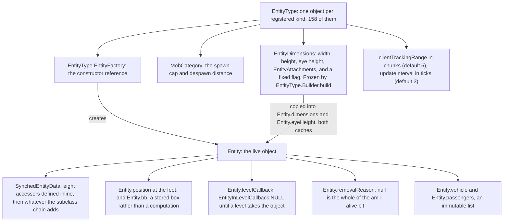
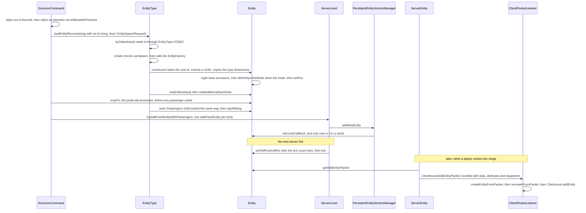

# Entity anatomy

> Verified against **Minecraft 26.2** · Part VI · What an entity *is*: one `EntityType` from the registry, through a factory, to a live object the level ticks.

You type */summon pig*, and by the next tick there is a pig standing where
you are. Between the command and the animal are three objects and one factory
call: a `ResourceKey` in `EntityTypeIds`, the `EntityType` that `EntityTypes`
built from it before any world existed, and the `Entity` that the type's
`EntityType.EntityFactory` returns. This page is the vocabulary of that chain,
and the rest of Part VI is built on it. The surprise is what happens when the
name is *wrong*, because that depends entirely on which door the name came
through. `Registries.ENTITY_TYPE` is one of the few **defaulted** registries
and its default is *pig* — and `DefaultedMappedRegistry` overrides nine
lookups to hand it back, `DefaultedMappedRegistry.byId` and
`DefaultedMappedRegistry.getValue` among them. So an entity-type id the client has never
heard of, arriving inside a `ClientboundAddEntityPacket`, is decoded by
`ByteBufCodecs.registry` through `IdMap.byIdOrThrow` — which cannot throw
here, because `DefaultedMappedRegistry.byId` never returns null — and a pig
walks out of the packet. One lookup is overridden the other way:
`DefaultedMappedRegistry.getOptional` calls the *superclass* method and so
still answers empty. `EntityType.CODEC` is `Registry.byNameCodec`, which
resolves through the plain `Registry.get`, untouched here. The same unknown
name in a region file therefore yields nothing at
all: `EntityType.create` logs *Skipping Entity with id …* and leaves a hole
where the entity was. The default reaches the network and never reaches your
save file.

## The cast

| class | what it decides | thread |
|---|---|---|
| `EntityType` | one registered kind: its factory, category, frozen dimensions, feature flags, and the two numbers that decide how it reaches clients | built in a class initialiser, read from both game threads after |
| `EntityTypes` | which 158 kinds exist and what every one of them is *sized* like — the most useful single table in the package | class initialiser, once |
| `Entity` | position, box, network id, synched values, vehicle, removal reason. Deliberately thin on behaviour | the tick thread of whichever level owns it |
| `EntityDimensions` | width, height, eye height, attachment points, and whether `Attributes.SCALE` may touch them | immutable record, shared by every entity of a type |
| `SynchedEntityData` | which of the entity's fields the other side is told about ([synched entity data](synched-entity-data.md)) | written on the owning side, applied on the receiving one |
| `EntityInLevelCallback` | whether the object is *in* a world or merely on the heap | installed by the level's entity manager |
| `ServerEntity` | when a tracked entity's state becomes packets ([entity lifecycle](entity-lifecycle.md)) | server main thread |
| `EntityReference` | how one entity remembers another across a chunk unload | wherever it is resolved |

Only one packet is this page's own: `ClientboundAddEntityPacket`, the birth
announcement. Everything after it — `ClientboundSetEntityDataPacket`,
`ClientboundEntityPositionSyncPacket`, `ClientboundEntityEventPacket`,
`ClientboundRemoveEntitiesPacket` — belongs to a sibling page.

## The type is frozen, the entity is not

An entity is anything in the world that is not a block: mobs, players, items
on the ground, arrows, boats, item frames, experience orbs, the invisible
markers a data pack uses as bookmarks. The kind is an `EntityType`, built once
and never changed. The individual is an `Entity`, and nearly all of its state
is mutable by design.

`Entity` implements nine interfaces — `Nameable`, `EntityAccess`,
`ScoreHolder`, `SyncedDataHolder`, `DataComponentGetter`, `ItemOwner`,
`SlotProvider`, `DebugValueSource` and `TypedInstance` over `EntityType` —
which is a fair measure of how many systems reach into it. Health, AI, damage
and inventory are all further down the tree.

In 26.2 the type constants are **not on `EntityType`**. They live in two
parallel files: `EntityTypeIds`, 158 `ResourceKey`s with no reference to any
entity class, and `EntityTypes`, the 158 matching objects that
`EntityType.Builder` produced from them. `MobCategory` — `MobCategory.MONSTER`,
`MobCategory.CREATURE`, `MobCategory.AMBIENT`, `MobCategory.AXOLOTLS`,
`MobCategory.UNDERGROUND_WATER_CREATURE`, `MobCategory.WATER_CREATURE`,
`MobCategory.WATER_AMBIENT`, `MobCategory.MISC` — carries the spawn cap and
despawn distance that [entity lifecycle](entity-lifecycle.md) uses. None of
this is data-driven: `Registries.ENTITY_TYPE` is code-registered, and what a
data pack *can* reach is the tags in `EntityTypeTags`, the loot table at
*entities/&lt;id&gt;*, `DataComponents.ENTITY_DATA` on a spawn egg, and the
per-species variant registries (`Registries.WOLF_VARIANT`,
`Registries.CAT_VARIANT`, `Registries.PAINTING_VARIANT` and the rest).

### Dimensions, attachments and pose

`EntityDimensions` is a record — width, height, eye height, an
`EntityAttachments` map and a *fixed* flag — and
`EntityDimensions.makeBoundingBox` centres the box in X and Z on the position
and grows it **upward**, because the position is the feet.
`EntityDimensions.scale` returns the record unchanged when it is fixed, and
also when both factors are 1. The flag is not the only way to escape `Attributes.SCALE`,
either: plain `Entity.getDimensions` never scales at all, so every non-living
entity ignores scale for free, and `LivingEntity.getDimensions` — which is
final, the overridable hook being `LivingEntity.getDefaultDimensions` —
short-circuits a sleeping entity to `LivingEntity.SLEEPING_DIMENSIONS` before
any scaling happens.

`EntityAttachments` answers where a passenger sits, where the name tag floats,
where the lead attaches: `EntityAttachment.PASSENGER`,
`EntityAttachment.VEHICLE`, `EntityAttachment.NAME_TAG` and
`EntityAttachment.WARDEN_CHEST`, each with a fallback such as
`EntityAttachment.Fallback.AT_HEIGHT` that `EntityAttachments.Builder.build`
fills in from the width and height.

`Pose` is eighteen constants with **explicit wire ids**, not ordinals — the
ones that matter are `Pose.STANDING`, `Pose.CROUCHING`, `Pose.SWIMMING`,
`Pose.FALL_FLYING`, `Pose.SLEEPING`, `Pose.SPIN_ATTACK` and `Pose.DYING`, and
the rest are single-mob animation states such as `Pose.EMERGING` and
`Pose.DIGGING`. `Pose.BY_ID` is built with
`ByIdMap.OutOfBoundsStrategy.ZERO`, so a pose id outside the range decodes
silently to `Pose.STANDING` rather than failing the connection. Pose is the
synched value on the *base* class that changes physics — a dozen subclasses
have their own, from a pufferfish's puff state to a slime's size — and the
loop is worth stating
because everything else on this page hangs off it: `Entity.setPose` writes the
value, `SynchedEntityData.set` calls `Entity.onSyncedDataUpdated`
**inside the setter**, before anything is marked dirty, and that sees
`Entity.DATA_POSE` and calls `Entity.refreshDimensions`, which asks
`Entity.getDimensions` for the new record, overwrites both caches, and calls
`Entity.reapplyPosition` to rebuild the box. The side that set the pose
resizes immediately, the other resizes when the value lands. If the box grew,
`Entity.fudgePositionAfterSizeChange` nudges the entity out of whatever it now
overlaps — but only on the server, only after the first tick, only with
physics on, only when the entity is not a `Player`, and only when the new box
is at most four blocks in both width and height.

## The tree, and the class that was inserted into it

`Entity` has **18** direct subclasses and 191 descendants. `LivingEntity` and
its 124 descendants are two thirds of that; the non-living branches are the
other 66.

<figure class="map">
{{#include ../../generated/tree-Entity.svg}}
<figcaption>The <code>Entity</code> tree to three levels, generated from the decompile. Click to enlarge.</figcaption>
</figure>

The full drawing, with the block, item and screen trees beside it, is in
[what extends what](../../maps/hierarchy.md). What matters here is the shape:
a long spine and a scattering. `LivingEntity` holds 124 of the 191 and has
exactly **three** direct subclasses — `Avatar`, `ArmorStand` and `Mob` —
which is worth saying plainly, because it means **an armour stand is a living
entity with no AI at all**: no `GoalSelector`, no `PathNavigation`, both of
those being `Mob`'s. The `Brain` is not `Mob`'s, though. It is declared on
`LivingEntity`, built in its constructor and written under a *Brain* tag by
every living entity, so an armour stand carries an empty one.
`PathfinderMob` is 86 lines that add walk-target valuation, not movement,
which is why `Ghast` and `Phantom` navigate without ever being one.
`AgeableMob` adds babies, `Animal` and `Monster` split by disposition, and
`Monster` implements `Enemy`, a marker interface carrying nothing but
XP-reward constants.

**`Avatar` is new and it is the biggest structural change in the part.** It
sits between `LivingEntity` and `Player`, and it is 57 lines: the
player-shaped `Avatar.POSES` dimension map, `Avatar.DEFAULT_EYE_HEIGHT` of
1.62, the skin-part and handedness synched values
(`Avatar.DATA_PLAYER_MAIN_HAND`, `Avatar.DATA_PLAYER_MODE_CUSTOMISATION`) and
one abstract method, `Avatar.getProfile`. Its point is `Mannequin` — a
posable, profile-skinned, player-looking entity in the decoration package that
is *not* a `Player` and carries none of the inventory, abilities or hunger.
Anything written against "`Player extends LivingEntity`" is now wrong by one
level. On the client `AvatarRenderer` serves both `AbstractClientPlayer` and
`ClientMannequin`, a client-only subclass that `Mannequin` accepts by holding
a mutable `Mannequin.constructor` factory the client swaps at startup.

Cutting across the tree are the capability interfaces, where most of the
shared behaviour actually lives: `Leashable` is the fattest, with
`Leashable.tickLeash` called from `Entity.baseTick`, and beside it
`Bucketable`, `EquipmentUser`, `NeutralMob`, `Attackable`, `Targeting`,
`TraceableEntity`, `OwnableEntity`, `Shearable`, `PlayerRideableJumping`,
`ItemSteerable`, and `ContainerUser`, with exactly two implementors: `Player`
and `CopperGolem`.

`EntityReference` deserves a name of its own. It stores either a UUID or the
live object, and `EntityReference.getEntity` resolves lazily *and decays back
to the UUID* the moment the target reports itself removed. It is how "who
last hurt me", "who owns this pet" and "who shot this arrow" survive a chunk
unload.

### Where the 716 files are

| subpackage | files | what |
|---|---:|---|
| `entity/ai` | 277 | goals, brains, navigation, attributes, sensors |
| `entity/animal` | 130 | one subpackage per species now |
| `entity/monster` | 84 | likewise |
| `world/entity` itself | 75 | `Entity`, `LivingEntity`, `Mob`, `Avatar`, `EntityType`, `EntityTypes`, the capability interfaces |
| `entity/projectile` | 37 | arrows, fireballs, thrown items |
| `entity/boss` | 24 | dragon and wither |
| `entity/vehicle` | 24 | boats and minecarts |
| `entity/npc` | 15 | villagers and traders |
| `entity/player` | 14 | `Player`, `Inventory`, `Abilities` |
| `entity/decoration` | 12 | armour stands, frames, paintings, `Mannequin` |
| `entity/variant` | 11 | the data-driven mob variants |
| `entity/item`, `entity/raid`, `entity/ambient`, `entity/schedule` | 13 | items, raids, bats, villager day plans |

## From a registry entry to a live object

`EntityTypes` runs `EntityType.Builder.build` for each of the 158 keys in
`EntityTypeIds` and registers the result, and it is that call which freezes
the `EntityDimensions` and its attachment points for the life of the type.
Everything below happens per entity, long afterwards.

**Name to type.** `EntityType.by` reads the *id* field through
`EntityType.CODEC`. An unknown id yields nothing, and the entity is dropped
with the log line the opening quoted — this is the save-file half of the hook.

**Type to object.** `EntityType.create` checks `EntityType.canSpawn`: the
feature flags, plus a peaceful-difficulty test gated on the type's own
`EntityType.isAllowedInPeaceful` flag, which is a declared property and not a
synonym for *hostile*. `EntitySpawnRequest.ignoreChecks` skips both. Then the
factory runs. The `Entity` constructor takes the next id from the level,
invents a UUID with `Mth.createInsecureUUID`, copies the type's dimensions
into its cache, and builds the synched-data container: eight accessors defined
inline — the shared flags byte, air supply, custom name and its visibility,
silence, no-gravity, pose and frozen ticks — and *then* the abstract
`Entity.defineSynchedData`, which contributes nothing on the base class and
exists only for the subclasses. It then calls `Entity.setPos` at the origin,
so a fresh entity already has a full-size box rather than the zero-size
`Entity.INITIAL_AABB` the field initialiser gave it.

**Tag to state.** `Entity.load` reads position (clamped to ±3.0000512E7
horizontally), motion, rotation and UUID, then calls the abstract
`Entity.readAdditionalSaveData`, then `Entity.reapplyPosition` again if
`Entity.repositionEntityAfterLoad` says so — which everything says except
`BlockAttachedEntity`, the corpus's one override, so paintings, item frames
and leash knots are precisely the entities that *skip* it and keep the
position their own load computed. The save twin is `Entity.addAdditionalSaveData`, and
passengers save inside their vehicle: `Entity.save` returns false for anything
currently riding, and the vehicle writes them into its *Passengers* list
through `Entity.saveAsPassenger`, using `Entity.getEncodeId`, which is null
for types that never serialise.

**Object to level.** `ServerLevel.tryAddFreshEntityWithPassengers` refuses if
any UUID in the stack is already loaded, then
`ServerLevelAccessor.addFreshEntityWithPassengers` calls
`ServerLevel.addFreshEntity` once per body.
`PersistentEntitySectionManager.addNewEntity` files it into a section and
replaces `EntityInLevelCallback.NULL` with a real callback. *That* is the
moment it stops being an object on the heap;
[entity lifecycle](entity-lifecycle.md) takes it from here.

**Level to client.** `ServerEntity.addPairing` sends
`ServerEntity.sendPairingData` as one bundle: the packet
`Entity.getAddEntityPacket` returns — id, UUID, type, position, velocity,
three rotation *bytes* and one varint of type-specific data — then the
non-default synched values, then attributes and equipment. On the client,
`ClientPacketListener.handleAddEntity` builds the object, calls
`Entity.recreateFromPacket`, and only then adds it to the level.

The spawn-egg path is a different pipeline that meets this one at the end.
`EntityType.spawn` snaps the new entity out of collision with
`EntityType.getYOffset`, aligns head and body rotation, runs
`Mob.finalizeSpawn`, applies a `PostSpawnProcessor`, adds it through
`ServerLevelAccessor.addFreshEntityWithPassengers` and plays an ambient
sound. `SummonCommand` also calls `Mob.finalizeSpawn`, but only when the
command asks for it, and it never touches the Y offset.

## The tick both sides share

`ServerLevel.tickNonPassenger` calls `Entity.setOldPosAndRot`, increments
`Entity.tickCount`, opens a profiler section named after the entity type and
calls `Entity.tick` — through `Level.guardEntityTick`, which turns any
exception into a crash report with the entity's details attached.
`ClientLevel.tickEntities` does the same, through the same guard, having first
skipped anything removed, riding or frozen by the tick-rate manager. No
entity is ever *ticked* on a worker pool, and `Entity` is not thread-safe —
though entities are constructed on one: `ChunkStatus.SPAWN` runs
`NaturalSpawner.spawnMobsForChunkGeneration` on the worldgen executor, so a
chunk's first animals are built and finalised off the main thread before the
chunk ever becomes live.

`Entity.tick` on the base class is one line: call `Entity.baseTick`.
Everything readers remember happening "in tick" is in `Entity.baseTick` — the
dead-vehicle check, the boarding cooldown, the portal handling, the fluid
snapshot, swimming, fire ticking, the lava halving of fall distance, the
below-world check, the leash — or in an override. `LivingEntity.tick` calls up
and then runs `LivingEntity.aiStep`, and `Mob.tick` calls up and refreshes its
goal-control flags through `Mob.updateControlFlags` every five ticks — and
only on the server, which is the one line of this section the client does not
run.

What differs between the sides is not the tick but what the tick is allowed to
*do*, and that is exactly the subject of the next page,
[authority](authority.md).

## Three things about the id

**Why do two entities from different worlds compare equal?** Because
`Entity.equals` compares the network id and nothing else — not the UUID, not
identity — and `Entity.hashCode` *is* the id. Ids are handed out by
`ServerLevel.getNextEntityId` from a static `AtomicInteger` on `ServerLevel`,
so they are process-global and the level is consulted only to avoid a
collision. Never put entities from two levels in one set.

**Why does a client-side entity throw before its packet arrives?**
`Level.getNextEntityId` returns a literal zero and `ClientLevel` does not
override it, while zero is the reserved invalid id and `Entity.getId` throws
*Tried to access entity ID before ID assignment* on it. Between construction
and `Entity.setId` — which `Entity.recreateFromPacket` performs — a
client-side entity has no id, and therefore no equality and no hash.
`ServerLevel.getNextEntityId` skips zero deliberately.

**Why is my hitbox offset from where I think the entity is?**
`Entity.position` is the bottom centre and the box grows up from the feet.

**Why did the hitbox not change when I changed the size?** Because
`Entity.dimensions`, `Entity.eyeHeight` and `Entity.bb` are caches, and only
two things refresh them unasked for every entity: a pose change on the base
class and `LivingEntity.onAttributeUpdated` on `Attributes.SCALE`. Ten
subclasses do the same for a value of their own — `AgeableMob` on the baby
bit among them — and everything else has to call `Entity.refreshDimensions`
itself.
The two eye-height accessors disagree while a cache is stale:
`Entity.getEyeHeight` with no argument reads the cache, the `Pose` overload
recomputes.

**Why is a player never created from its own entity type?** Because
`EntityTypes.PLAYER` was built with `EntityType.Builder.createNothing`, so its
factory returns null, and it is `EntityType.Builder.noSave` and
`EntityType.Builder.noSummon` besides. `EntityType.create` for a player always
yields null, which is why `ClientPacketListener.createEntityFromPacket`
special-cases it and hand-builds a `RemotePlayer` from the player info it
already has.

**Why does that entity never move smoothly?** Possibly because it is on a
list. `EntityType.trackDeltas` names ten types whose velocity is simply never
sent — `EntityTypes.PLAYER`, `EntityTypes.WITHER`, `EntityTypes.BAT`,
both item frames, `EntityTypes.PAINTING`, `EntityTypes.LEASH_KNOT`,
`EntityTypes.LLAMA_SPIT`, `EntityTypes.END_CRYSTAL` and
`EntityTypes.EVOKER_FANGS` — one of the few places in the codebase where
behaviour is a literal list of types rather than a tag or a flag. Or because
of the other two numbers: `EntityType.clientTrackingRange` is in **chunks**
and `EntityType.updateInterval` in ticks, both fixed at registration.
`EntityTypes.MARKER` has a tracking range of 0 and is never sent to anyone,
and `EntityTypes.AREA_EFFECT_CLOUD` has an update interval of
*Integer.MAX_VALUE*.

**Why does entity render distance depend on my render distance?** Because
`Entity.viewScale` is a **static** field on `Entity` — process-global state —
and `LevelExtractor` writes it from the effective render distance *and* the
entity-distance option together, not from the option alone.

## Where to look

`EntityTypeIds` · `EntityTypes` · `EntityType.Builder.build` ·
`EntityType.CODEC` · `EntityType.by` · `EntityType.create` ·
`EntityType.canSpawn` · `EntityType.loadEntityRecursive` ·
`EntityType.spawn` · `MobCategory` · `EntityDimensions.makeBoundingBox` ·
`EntityAttachments` · `Pose.BY_ID` · `Entity` · `Entity.defineSynchedData` ·
`Entity.load` · `Entity.refreshDimensions` · `Entity.setRemoved` ·
`Entity.baseTick` · `Entity.getAddEntityPacket` ·
`PersistentEntitySectionManager.addNewEntity` · `LivingEntity` · `Avatar` ·
`Mob` · `PathfinderMob` · `EntityReference` · `ClientboundAddEntityPacket`

---

*Rules: names, never code · how the system works, not how the code reads ·
newest version only · every backticked name passes `tools/verify_names.py`.*
