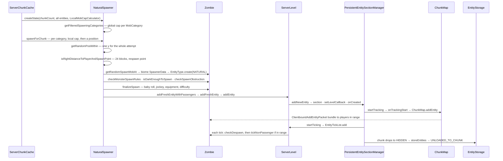

# Entity lifecycle

> Verified against **Minecraft 26.2** · Part VI · A zombie spawns in a dark chunk at night, is ticked for a while, and then either despawns or is written to disk when the chunk unloads.

## Responsibility

Between "an `Entity` object exists" and "an entity is in the world" sits a
whole subsystem: the natural spawner that decides what appears where, the
section manager that owns every entity in a level and decides which of them
are findable and which of them tick, the tick list itself, the *entities*
region files, and the five removal reasons that answer "is it saved, is it
destroyed, does the client hear about it". This page is that subsystem.

The one sentence a player recognises: *mobs appear in the dark 24 blocks
away, stop existing when you walk 128 blocks off, and are still there when
you come back — unless you named one.*

## The data it owns

- **The spawner's per-tick budget.** `NaturalSpawner.SpawnState`, built once
  per tick by `NaturalSpawner.createState`: a count of spawnable chunks, a
  per-`MobCategory` census, a `PotentialCalculator` charge field, and a
  `LocalMobCapCalculator` for the per-player caps. Constants:
  `NaturalSpawner.MIN_SPAWN_DISTANCE` 24,
  `NaturalSpawner.SPAWN_DISTANCE_CHUNK` 8,
  `NaturalSpawner.SPAWN_DISTANCE_BLOCK` 128, and the normalising
  `NaturalSpawner.MAGIC_NUMBER` — 289, which is 17².
- **The spawn rules,** which are Java, not data: `SpawnPlacements` maps each
  `EntityType` to a `SpawnPlacementType`
  (`SpawnPlacementTypes.ON_GROUND`, `SpawnPlacementTypes.IN_WATER`,
  `SpawnPlacementTypes.IN_LAVA`, `SpawnPlacementTypes.NO_RESTRICTIONS`), a
  `Heightmap.Types` and a predicate. The *lists* are data — biome
  `MobSpawnSettings` with its `MobSpawnSettings.SpawnerData` weights and
  `MobSpawnSettings.MobSpawnCost` energies.
- **Why something spawned.** `EntitySpawnReason` — nineteen constants, from
  `EntitySpawnReason.NATURAL` and `EntitySpawnReason.CHUNK_GENERATION`
  through `EntitySpawnReason.SPAWNER`, `EntitySpawnReason.BREEDING`,
  `EntitySpawnReason.JOCKEY`, `EntitySpawnReason.BUCKET`,
  `EntitySpawnReason.COMMAND`, `EntitySpawnReason.TRIAL_SPAWNER`,
  `EntitySpawnReason.LOAD`, `EntitySpawnReason.DIMENSION_TRAVEL` — wrapped
  for construction in the record `EntitySpawnRequest`, whose second field
  skips the feature-flag and peaceful checks (used only to build the
  display mob spinning inside a spawner).
- **The level's entity index.** `PersistentEntitySectionManager` on the
  server holds: the set of known UUIDs, an `EntityLookup` (by id and by
  UUID — the "can code find this" index), an `EntitySectionStorage` of
  `EntitySection`s keyed by section position (the "what is in this box"
  index), a per-chunk `Visibility`, a per-chunk load status, a queue of
  chunks to unload, and a concurrent inbox of chunks coming back off disk.
  The client's equivalent is `TransientEntitySectionManager`.
- **`Visibility`** is the whole idea in three constants:
  `Visibility.HIDDEN` (neither findable nor ticking), `Visibility.TRACKED`
  (findable, frozen), `Visibility.TICKING` (both), projected from
  `FullChunkStatus` by `Visibility.fromFullChunkStatus`.
- **The tick list.** `EntityTickList` — two id-keyed maps and a flag. It is a
  copy-on-first-write double buffer: mutating it *during* iteration copies
  the live map aside so the walk finishes on an untouched snapshot, and a
  second concurrent iteration throws.
- **Removal.** `Entity.RemovalReason` with two booleans each:
  `Entity.RemovalReason.KILLED` and `Entity.RemovalReason.DISCARDED`
  destroy and do not save; `Entity.RemovalReason.UNLOADED_TO_CHUNK` is the
  **only** reason that saves and does not destroy;
  `Entity.RemovalReason.UNLOADED_WITH_PLAYER` and
  `Entity.RemovalReason.CHANGED_DIMENSION` do neither.
- **Persistence.** `EntityStorage` over a `SimpleRegionStorage` rooted at
  *entities/*, separate from the block *region/* files
  ([chunk storage](../world/chunk-storage.md)). It writes an *Entities* list
  and a *Position* it re-checks on read, and remembers which chunks are
  empty so it never re-reads them.

## When it runs

Everything here is the **server main thread**. `ServerLevel.tick` runs the
entity block (skipped entirely once the level has had no tickets for 300
ticks), then block entities, then
`PersistentEntitySectionManager.tick` under its own profiler section — the
part that drains loaded chunks in and pushes unloaded chunks out. Spawning
runs earlier, inside `ServerChunkCache.tickChunks`, before entities tick.

The one genuinely cross-thread structure is the loading inbox.
`EntityStorage.loadEntities` reads bytes on the IO pool, then hands
deserialisation to a `ConsecutiveExecutor` that lands back on the main
thread, and the finished `ChunkEntities` goes into a concurrent queue the
manager drains next tick.

The client runs the same tick list class over
`TransientEntitySectionManager`, driven from `ClientLevel.tickEntities`.

## The trace: a zombie's life

1. **The budget.** `ServerChunkCache.tickChunks` asks
   `DistanceManager.getNaturalSpawnChunkCount` how many chunks lie inside
   somebody's eight-chunk square and builds a `NaturalSpawner.SpawnState`
   by walking every entity in the level — skipping `MobCategory.MISC` and
   anything persistent. `NaturalSpawner.getFilteredSpawningCategories` then
   drops any category already at its **global** cap:
   `MobCategory.getMaxInstancesPerChunk` × spawnable chunks ÷ 289.
   `GameRules.SPAWN_MOBS` gates the whole thing.
2. **The chunk.** `ChunkMap.collectSpawningChunks` gathers candidate chunks
   with a player near enough, they are shuffled, and each goes to
   `NaturalSpawner.spawnForChunk` — which re-checks the **local** cap
   through `LocalMobCapCalculator.canSpawn`: whether *any* player near this
   chunk is still under the category's limit on their own count.
3. **The position.** `NaturalSpawner.getRandomPosWithin` rolls a random x
   and z in the chunk and **one** y, uniform between the world bottom and
   the surface. Three group attempts follow, each with up to four rolls,
   jittering only x and z — so a whole tick's attempt for a chunk lives on
   one horizontal slice.
4. **The distance rules.** `NaturalSpawner.isRightDistanceToPlayerAndSpawnPoint`
   rejects anything within 24 blocks of the nearest player or of the world
   respawn point.
5. **The species.** `NaturalSpawner.getRandomSpawnMobAt` asks
   `ChunkGenerator.getMobsAt`, not the biome directly — so a structure can
   override the biome's list, which is how nether fortresses work — and
   picks a weighted `MobSpawnSettings.SpawnerData`.
6. **The checks.** `NaturalSpawner.isValidSpawnPostitionForType` (the typo is
   Mojang's) runs `SpawnPlacements.isSpawnPositionOk`, then
   `SpawnPlacements.checkSpawnRules` → `Monster.checkMonsterSpawnRules` →
   `Monster.isDarkEnoughToSpawn`, which reads sky light against a random
   roll, then the dimension's block-light limit
   (`DimensionType.monsterSpawnBlockLightLimit`), then the local brightness
   against a sample of `DimensionType.monsterSpawnLightTest` — the light
   rule is per-dimension data, not a constant. Then the mob is constructed,
   snapped to the position, and checked again with `Mob.checkSpawnRules` and
   `Mob.checkSpawnObstruction` (no liquid in the box, nothing in the way).
   `NaturalSpawner.SpawnState.canSpawn` also charges the spawn against the
   biome's energy budget, if it defines one.
7. **The details.** `Mob.finalizeSpawn` adds a small random
   `Attributes.FOLLOW_RANGE` bonus and a 5 % chance of being left-handed;
   `Zombie.finalizeSpawn` rolls baby, chicken jockey, equipment and the
   difficulty-scaled attributes, and **returns group data reused for the
   rest of the pack** — which is why a spawn group is all-baby or all-adult.
8. **Entry.** `ServerLevelAccessor.addFreshEntityWithPassengers` →
   `ServerLevel.addFreshEntity` → `PersistentEntitySectionManager.addNewEntity`:
   claim the UUID, put the entity in its `EntitySection`, install the level
   callback, fire `LevelCallback.onCreated`, then — in this order —
   *start tracking* (add to `EntityLookup`, and
   `ServerLevel.EntityCallbacks` hands it to `ServerChunkCache.addEntity` →
   `ChunkMap.addEntity`, which is where network tracking begins) and
   *start ticking* (add to `EntityTickList`).
9. **The tick.** Each `ServerLevel.tick`, the tick list is walked:
   `Mob.checkDespawn` runs for **every** entity in the list, then
   `ServerLevel.tickNonPassenger` runs only for those whose chunk is in
   entity-ticking range. Movement fires the level callback's move hook,
   which relocates the entity between sections *only* when the section
   changes.
10. **The end, one of two ways.** Walk far enough that the chunk drops below
    entity-ticking and the zombie stops ticking but stays findable; drop to
    hidden and the chunk queues for unload, and next
    `PersistentEntitySectionManager.tick` writes the section's savable
    entities through `EntityStorage.storeEntities` and marks each
    `Entity.RemovalReason.UNLOADED_TO_CHUNK` — the client gets a
    `ClientboundRemoveEntitiesPacket`, the UUID is freed, but
    `LevelCallback.onDestroyed` is *not* called, and the zombie is on disk.
    Or keep the chunk loaded and `Mob.checkDespawn` fires instead: beyond
    `MobCategory.getDespawnDistance` (128 blocks; 64 for
    `MobCategory.WATER_AMBIENT`) it is discarded instantly; beyond
    `MobCategory.getNoDespawnDistance` (32) it is discarded on a 1-in-800
    roll once `Mob.noActionTime` passes 600. `Entity.discard` destroys and
    does not save — that zombie is gone.

The other ways in, named but not traced: `BaseSpawner` and
`SpawnerBlockEntity` (the block; see
[block entities](../blocks/block-entities.md)), `TrialSpawner`,
`SpawnEggItem`, `SummonCommand`, breeding through
`AgeableMob.getBreedOffspring`, and the `CustomSpawner` implementations
`PhantomSpawner`, `PatrolSpawner`, `CatSpawner`, `WanderingTraderSpawner`
and `VillageSiege`, ticked from `ServerLevel.tickCustomSpawners`.

## Interfaces

- **Called by:** `ServerChunkCache.tickChunks` (spawning), `ServerLevel.tick`
  (ticking and the manager's own tick), `ChunkMap.onFullChunkStatusChange`
  (which is wired straight to
  `PersistentEntitySectionManager.updateChunkStatus` —
  [tickets and loading](../world/tickets-and-loading.md)), every caller of
  `LevelWriter.addFreshEntity`.
- **Calls into:** `EntityStorage` and the *entities* region files
  ([chunk storage](../world/chunk-storage.md)); `ServerChunkCache.addEntity`
  → `ChunkMap.addEntity` for tracking; `ServerLevel.EntityCallbacks`, which
  is where scoreboard removal, the navigating-mob set, dragon parts, the
  sleeping-player list, waypoints and the dynamic
  `DynamicGameEventListener` registration all hang
  ([game events](../world/game-events-and-poi.md)).
- **Crosses the network as:** `ClientboundAddEntityPacket` bundled with
  `ClientboundSetEntityDataPacket`, `ClientboundUpdateAttributesPacket`,
  `ClientboundSetEquipmentPacket`, `ClientboundSetPassengersPacket` and
  `ClientboundSetEntityLinkPacket` inside one `ClientboundBundlePacket`; and
  `ClientboundRemoveEntitiesPacket` on the way out. **Nothing about
  spawning itself crosses the wire** — `EntitySpawnReason` is server-only
  state.
- **Data-driven by:** biome `MobSpawnSettings` (weights, group sizes, spawn
  costs); `DimensionType` light rules; `GameRules.SPAWN_MOBS`,
  `GameRules.SPAWN_MONSTERS`, `GameRules.SPAWN_PATROLS`,
  `GameRules.SPAWN_PHANTOMS`, `GameRules.SPAWN_WANDERING_TRADERS`,
  `GameRules.SPAWNER_BLOCKS_WORK`; `BlockTags.PREVENT_MOB_SPAWNING_INSIDE`;
  `BiomeTags.REDUCED_WATER_AMBIENT_SPAWNS`. The `SpawnPlacements` table
  itself is code.

## Invariants and surprises

- **There are two mob caps and a mob must pass both.** The global one scales
  with how much chunk area the players collectively cover — so it *grows*
  with player count and *shrinks* when players stand together. The local one
  asks whether any nearby player is under the limit on their own count. 289
  is 17², a normalising constant: 70 means "70 monsters per 17×17 chunks".
- **The census is not "all mobs".** Persistent mobs — named, leashed,
  ridden, or explicitly marked — are skipped when the state is built, so
  they cost no cap. The same two predicates make `Mob.checkDespawn` return
  early, which is why "name it and it stays" and "it stops counting" are the
  same fact.
- **24, 128 and 32 mean different things.** 24 is the minimum distance from
  a player and from the world respawn point *to spawn*; 128 is both the
  "player close enough for this chunk to spawn" radius and the despawn
  distance; 32 is only the radius below which the slow random despawn stops.
- **A mob with no player anywhere near never despawns at all** —
  `Mob.checkDespawn` needs a nearest player to measure against, and does
  nothing without one.
- **The spawner picks one y per chunk per tick.** A single uniform roll
  between the world bottom and the surface, with only x and z jittered
  afterwards, so caves and the surface compete for the same rolls and a
  taller world dilutes surface spawning.
- **`LevelWriter.addFreshEntity` is a default method that returns false.**
  `Level` does not override it and neither does `ClientLevel`; only
  `ServerLevel` does. On the client the only way in is
  `ClientLevel.addEntity`, called from the packet handler — and it begins by
  *removing* whatever already holds that id.
- **`EntityTickList` is a double buffer, not a copy.** It copies the live
  map aside only when something is added or removed mid-iteration, and it
  refuses a second concurrent walk outright.
- **Despawn is checked for every entity in the tick list; ticking is not.**
  An entity whose chunk has fallen out of entity-ticking range can still be
  checked for despawn on a tick it is not otherwise simulated.
- **Transitions run tracked-before-ticking on the way up and
  ticking-before-tracked on the way down**, and anything that reports itself
  always-ticking is exempt from both.
- **An unloading chunk is not removed synchronously.** The unload is refused
  while a load of the same chunk is in flight — and a chunk with entities to
  save that has never been read will be *loaded first*, so it can be merged.
  Chunks can sit in the unload queue for several ticks.
- **`Entity.RemovalReason.UNLOADED_TO_CHUNK` does not "destroy".** The scoreboard entry, the
  waypoint and everything else hung off `LevelCallback.onDestroyed` survive;
  only the killed and discarded reasons fire it.
- **Passengers are written inside their vehicle**, and a vehicle whose only
  passenger is a player is not written at all — it travels in the player's
  own data.
- **`EntityReference` decays and re-resolves.** A saved reference to another
  entity holds a UUID until first resolution, upgrades to the object, and
  falls back to the UUID when the target is removed — which is how "who
  last hurt me" survives a chunk unload.

## Where to look

`NaturalSpawner` · `NaturalSpawner.SpawnState` · `LocalMobCapCalculator` ·
`SpawnPlacements` · `SpawnPlacementTypes` · `EntitySpawnReason` ·
`Mob.finalizeSpawn` · `Mob.checkDespawn` · `MobCategory` ·
`ServerLevel.addFreshEntity` · `PersistentEntitySectionManager` ·
`PersistentEntitySectionManager.updateChunkStatus` · `Visibility` ·
`EntityLookup` · `EntitySection` · `EntitySectionStorage` ·
`LevelCallback` · `EntityInLevelCallback` · `EntityTickList` ·
`ServerLevel.tickNonPassenger` · `Level.guardEntityTick` ·
`EntityStorage` · `Entity.RemovalReason` · `Entity.setRemoved` ·
`TransientEntitySectionManager`

---

*Rules: names, never code · how the system works, not how the code reads ·
newest version only · every backticked name passes `tools/verify_names.py`.*
