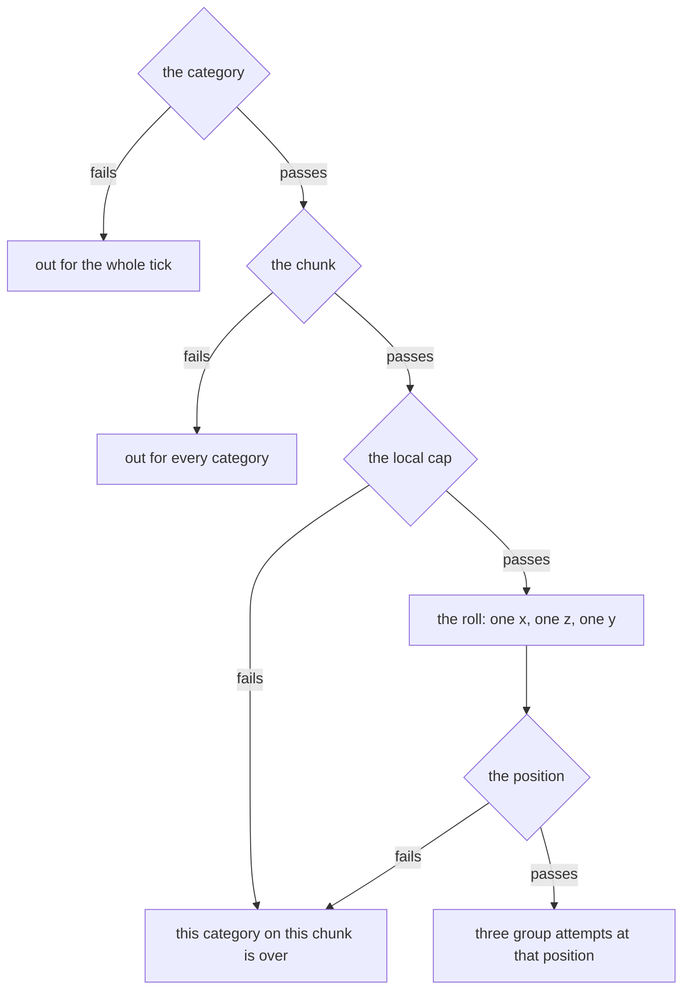
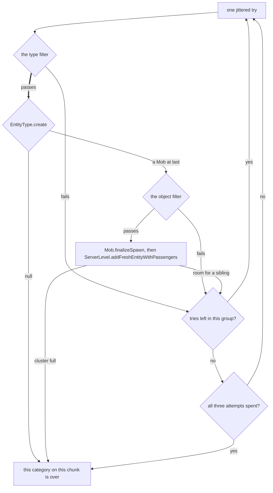
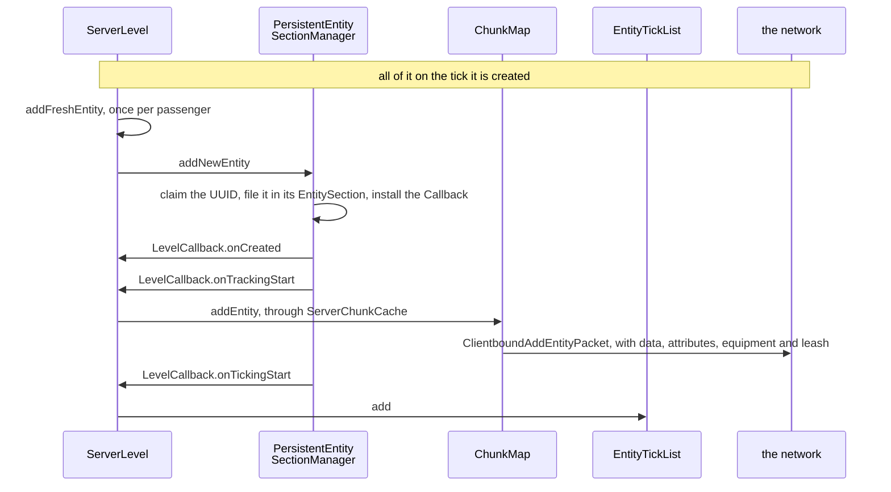
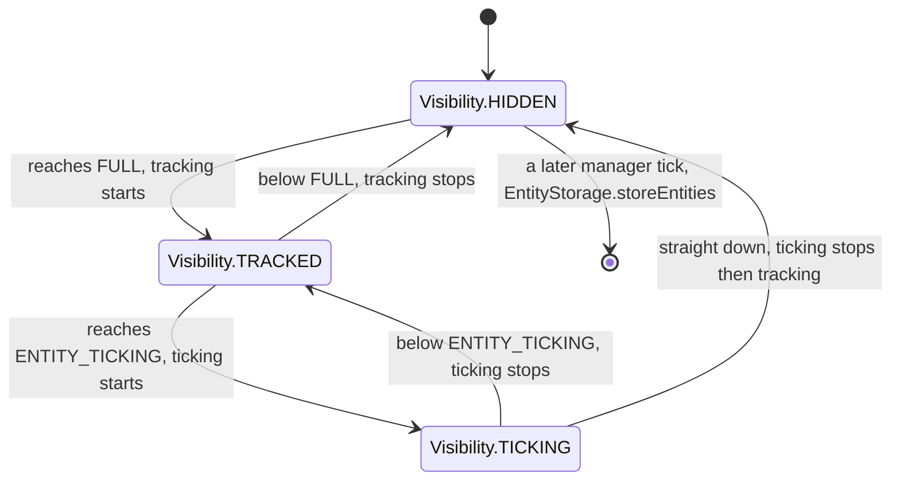

# Entity lifecycle

> Verified against **Minecraft 26.2** · Part VI · A zombie spawns in a dark chunk at night, is ticked for a while, and then either despawns or is written to disk when the chunk unloads.

Night falls, you are standing in a field, and somewhere behind you a zombie
appears. What the server actually did is smaller and stranger than it looks.
Once a tick, for each chunk near a player and each mob category still under
its cap, `NaturalSpawner.getRandomPosWithin` rolls a random x, a random z and
**one** y — a single uniform draw between the world bottom and the surface
height of that column. Three attempts follow — each one a *group*, because a
successful attempt keeps spawning siblings around the first mob until a size
limit stops it — and each one makes a handful of tries that jitter only x
and z. So the whole of one category's chance in one chunk this tick lives on
**one horizontal slice**: every eligible category gets its own slice, caves
and the open field compete for the same rolls, and a world with more vertical
space between bedrock and grass spreads those rolls thinner over the surface.
Everything else on this page — the caps, the light test, the despawn radius,
the write to disk — hangs off that one roll, or off the moment several
rejections later where the mob is finally allowed to exist.

## The cast

| class | what it decides | thread |
|---|---|---|
| `NaturalSpawner` | every test between a chunk and a mob, in one file of static methods | server main |
| `NaturalSpawner.SpawnState` | the per-tick census, the global cap per `MobCategory`, and the biome crowding budget through `PotentialCalculator` | server main, rebuilt each tick |
| `LocalMobCapCalculator` | whether any player near *this* chunk is still under the per-player limit | server main, rebuilt each tick |
| `SpawnPlacements` | the placement type, heightmap and predicate for each `EntityType` — code, not data | a static table, read on the server main thread |
| `PersistentEntitySectionManager` | which entities exist, which are findable, which tick, which chunks are queued to unload | server main, with one concurrent load inbox |
| `Visibility` | the three-state projection of `FullChunkStatus` that everything above reads | an enum, read on both sides |
| `EntityTickList` | the set the tick walks, and the double buffer that makes mutating it mid-walk safe | server main, and the client's main thread for `ClientLevel` |
| `EntityStorage` | the *entities/* region files, separate from the block ones | reads on the IO pool, deserialises and writes on the server main thread |

## A spawn attempt is a filter, not a conversation

Almost every step of the spawner is a **rejection**, and the rejections are not
all the same size: one drops a category for the whole tick, one skips a chunk
for every category, one ends this category on this chunk, and most of them cost
nothing but a single jittered try. Drawing it as a conversation hides all of
that. Here it is as the filter it is, in two halves — what has to pass before a
position is rolled, and what happens once one has been — with the tests
themselves in the table under them.

*Three sizes of giving up, before a position has even been rolled: a category
can leave the whole tick, a chunk can leave every category, and the two of them
can end together. The rejecting edges are the subject of this page; the passing
ones are only what is left.*

Follow the right-hand edge to the bottom and the roll is the thing to stop at:
one x, one z and **one** y, and everything below it happens at that one height.

*After the roll the ways out are cheap: almost every failure jitters x and z and
tries again, and only three of the eight leave the loop at all. A new group
attempt puts x and z back at the roll. The thick edge is the boundary the rest
of this section is about.*

Three things in that loop are worth reading twice. Almost every rejection
merely jitters again — it costs one try, not one of the three attempts. The two that end
a *group* are the empty species list and the group filling up. And the two that
end the whole category on this chunk are a null from `EntityType.create` and a
full cluster, which is why *one bad construction* and *one crowded spawn* both
look, from outside, like the chunk going quiet. Only the last box is a spawn:
`Mob.finalizeSpawn` settles what the mob is, and
`ServerLevel.addFreshEntityWithPassengers` is the door every other spawner in
the game uses too.

### What each test drops, in the order it runs

| the test | it fails when | what is given up |
|---|---|---|
| `NaturalSpawner.getFilteredSpawningCategories` | it is a monster category and the monster game rules are off; it is a persistent category and the game time is not a multiple of 400; or `NaturalSpawner.SpawnState.canSpawnForCategoryGlobal` is already at the cap | the category, for the whole tick |
| `ChunkMap.collectSpawningChunks` | the holder has no ticking chunk behind it, or `ChunkMap.playerIsCloseEnoughForSpawning` finds no non-spectator player within 128 blocks measured horizontally to the chunk centre | the chunk, for every category |
| `ServerLevel.canSpawnEntitiesInChunk` | the chunk is not entity-ticking, or lies outside the world border | the chunk, for every category |
| `NaturalSpawner.SpawnState.canSpawnForCategoryLocal` | `LocalMobCapCalculator.canSpawn` finds every nearby player at their own cap — or finds no nearby player at all | this category on this chunk |
| `NaturalSpawner.getRandomPosWithin` | the single y roll landed at the very bottom of the world | this category on this chunk |
| the block at the rolled position | it is a redstone conductor, and this is asked before any species is picked | this category on this chunk |
| `EntityGetter.getNearestPlayer` | there is no non-spectator player anywhere in the level | this try |
| `NaturalSpawner.isRightDistanceToPlayerAndSpawnPoint` | within 24 blocks of the nearest player; within 24 of the respawn point and that point is in this dimension; or the jitter left this chunk for one that cannot spawn | this try |
| `NaturalSpawner.getRandomSpawnMobAt` | the list is empty — or the category is `MobCategory.WATER_AMBIENT` in a reduced-water-ambient biome, 98 times in 100 | this group attempt |
| `NaturalSpawner.isValidSpawnPostitionForType` | the category is `MobCategory.MISC`; it is too far out for a type that cannot spawn far from a player; the type is unsummonable or no longer in the list at this exact block; `SpawnPlacements.isSpawnPositionOk` fails on the placement type; `SpawnPlacements.checkSpawnRules` fails, which is where the light test lives; or the type's spawn box collides with the world | this try |
| `NaturalSpawner.SpawnState.canSpawn` | the biome's crowding budget for this exact type is spent | this try |
| `EntityType.create` | feature-flagged off, or Peaceful and not allowed there | this category on this chunk |
| `NaturalSpawner.isValidPositionForMob` | `Mob.checkSpawnRules` or `Mob.checkSpawnObstruction` fails on the real object, or `Mob.removeWhenFarAway` says it would despawn instantly anyway | this try |
| `Mob.isMaxGroupSizeReached` | the group has all the siblings it is allowed | this group attempt |
| `Mob.getMaxSpawnClusterSize` | the cluster is full | this category on this chunk |

The boundary that matters is the thick edge. Everything above it is decided
against the `EntityType` — the placement type, the heightmap
([chunk anatomy](../world/chunk-anatomy.md#the-six-heightmaps)), the light rule, the collision
box — because constructing a mob to ask it costs
more than answering from the type. Nothing above that line has an object to
call a method on. `Monster.checkMonsterSpawnRules` is the light rule for a
zombie, and it hands the light half to `Monster.isDarkEnoughToSpawn`, three
tests in a row: sky light against a random draw from
zero to 31, then the dimension's `DimensionType.monsterSpawnBlockLightLimit`
if that limit is below 15, then the local brightness against a sample of
`DimensionType.monsterSpawnLightTest`. The last of those is where storms come
in: during thunder the brightness is computed with a fixed sky-darkening
of 10 instead of the level's current one, which is what lets monsters spawn
outdoors in the daytime. The light rule is per-dimension data,
not a constant, and `EntitySpawnReason.ignoresLightRequirements` exempts
exactly one reason, `EntitySpawnReason.TRIAL_SPAWNER`.

The last gate before construction is the one nobody meets, and it is worth
knowing why. `NaturalSpawner.SpawnState.canSpawn` asks the biome for a
`MobSpawnSettings.MobSpawnCost` for this exact type: a *charge* the mob adds to
a field of nearby charges and an *energy budget* the sum may not exceed, so a
species can be made to thin itself out over distance rather than over a cap.
`PotentialCalculator` is that field, and the rule is per biome and per type
rather than global. In vanilla data **two biomes use it at all** — soul sand
valley, for ghasts, skeletons and endermen, and the warped forest, for endermen
and striders. Everywhere else the biome has no cost for the type,
`MobSpawnSettings.getMobSpawnCost` returns null, and the gate passes without
arithmetic.

Construction is itself a filter, and the harshest-tempered one:
`EntityType.create` can return null ([entity
anatomy](entity-anatomy.md#from-a-registry-entry-to-a-live-object) has the two
gates it checks and the one request flag that skips them). What the spawner
does with a null is its own: `NaturalSpawner.spawnCategoryForPosition` returns
outright, not trying the next position. On Peaceful the spawner does all the
work up to construction and then abandons this category's attempt on this
chunk.

The species it was about to build came from a list, and that list has a
hard-coded exception in front of it. `NaturalSpawner.mobsAt` asks
`ChunkGenerator.getMobsAt`, which walks the structures at the position and,
for the first one declaring a `StructureSpawnOverride` for this category,
**replaces the biome's list entirely** with the structure's — inside a piece
or inside the whole start, depending on the override's
`StructureSpawnOverride.BoundingBoxType`. That is how an ocean monument spawns
guardians and empties itself of axolotls, and it is a data-pack field
(*spawn_overrides*) on the structure. Thirty-four shipped structures carry the
field and **six** fill it in — and of the twenty-three overrides those six
declare, eighteen name nothing at all, which bans the category inside the box
rather than replacing its list ([structure spawn
overrides](../../reference/structure-spawn-overrides.md)). Ahead of all of it sits
`NaturalSpawner.isInNetherFortressBounds`, which is not data-driven at all:
if the category is `MobCategory.MONSTER` and the block below is
`Blocks.NETHER_BRICKS` and the position is anywhere inside a fortress's
bounds, the list is the constant `NetherFortressStructure.FORTRESS_ENEMIES`.
The fortress declares the same list as an override too — the code path just
gets there first, over a wider box.

### The two caps, and where 289 comes from

A mob must pass both caps, and they are counted differently. The **global**
cap in `NaturalSpawner.SpawnState.canSpawnForCategoryGlobal` is
`MobCategory.getMaxInstancesPerChunk` — 70 for `MobCategory.MONSTER`, 10 for
`MobCategory.CREATURE` — times the number of spawnable chunks, divided by
`NaturalSpawner.MAGIC_NUMBER`. That divisor is 17², and the 17 is not
arbitrary: `DistanceManager` tracks spawn chunks out to eight chunks from
each player over a neighbourhood that includes diagonals, so one player
contributes a Chebyshev square of 17×17 chunks. The constant normalises the
cap back into *seventy monsters per player's worth of area*, which is why it
grows with player count and shrinks when players stand together.

The **local** cap is `LocalMobCapCalculator.canSpawn`, and it is a veto
rather than a budget: it walks the players near this chunk and answers yes
the moment it finds one under the raw per-chunk number for the category. With
no player near the chunk the walk finds nobody and the answer is **no** — which
is not dead code, because *near* means something different here from the
128-block test two gates above: that one measures to the chunk centre, and this
one counts the players whose spawn-chunk neighbourhood contains the chunk, so a
chunk can pass the first and find nobody in the second.
(`SharedConstants.DEBUG_IGNORE_LOCAL_MOB_CAP` is the development switch that
turns that half off.) The census both caps count from skips any mob that is
`Mob.isPersistenceRequired` or `Mob.requiresCustomPersistence` — named,
leashed or ridden — so a named zombie costs nothing against either cap. That
is the same predicate pair that makes `Mob.checkDespawn` return early, which
is why *name it and it stays* and *name it and it stops counting* are one
fact and not two.

### Three constants nobody reads, and one that is not the number it looks like

`NaturalSpawner` declares `NaturalSpawner.MIN_SPAWN_DISTANCE` 24,
`NaturalSpawner.SPAWN_DISTANCE_CHUNK` 8 and
`NaturalSpawner.SPAWN_DISTANCE_BLOCK` 128, and **not one of the three is read
anywhere in the game** — the live values are the literals 576.0 and 16384.0
at their use sites, both already squared. The two that *are* read are
`NaturalSpawner.MAGIC_NUMBER` and one more. That one,
`NaturalSpawner.INSCRIBED_SQUARE_SPAWN_DISTANCE_CHUNK`, is neither 8 nor 24:
it is the floor of 8 divided by the square root of two, so **5**, and
`DistanceManager.hasPlayersNearby` uses it as the fast *yes* of a three-way
answer — inside 5 chunks certainly near, beyond 8 certainly not, and in
between fall through to the real per-player distance test. Reading a name and
believing the number is how a page gets this wrong.

### What finalizeSpawn settles for the whole pack

`Mob.finalizeSpawn` adds a triangular random bonus to `Attributes.FOLLOW_RANGE`
under `Mob.RANDOM_SPAWN_BONUS_ID` and rolls a 5 % chance of left-handedness.
`Zombie.finalizeSpawn` then rolls loot-pickup and door-breaking against local
difficulty, equipment and its enchantments, and — the part players notice —
returns a `Zombie.ZombieGroupData` that the loop feeds back into the *next*
mob of the same group. Baby-or-adult is decided once, by the first zombie, and
inherited by the rest: a spawn group is all-baby or all-adult, never mixed. A
baby gets a 5 % roll at an existing unridden `Chicken` in a box five blocks
wide and three tall, and *only if that roll fails* a second 5 % roll to
create one.
Two different limits end it. `Mob.isMaxGroupSizeReached` breaks the current
group and lets the next of the three attempts start; `Mob.getMaxSpawnClusterSize`
returns outright and kills all three. `Mob`'s base value is four, and seven
classes override it: `AbstractHorse` to 6, `Wolf` and `AbstractFish` to 8 —
with `AbstractSchoolingFish` overriding again to return its own school size —
and `Ghast`, `HappyGhast` and `Pillager` **down** to 1.

### The variant that same method picks

Seven species pick a *variant* in their own override of `Mob.finalizeSpawn`
before calling the base one — `Chicken`, `Cow`, `Pig`, `Cat`, `Frog`, `Wolf`
and `ZombieNautilus` — and all seven do it through the same call,
`VariantUtils.selectVariantToSpawn`, handed a `SpawnContext` built from the level and the block position. Each
variant in the registry carries a `SpawnPrioritySelectors`: a list of
conditions, each with an integer priority. `PriorityProvider.select` unpacks
every variant's selectors into one list, sorts it by priority descending, and
walks it keeping entries whose condition passes and dropping every entry below
the highest priority that has matched — so the highest *matching* priority wins
outright, and `PriorityProvider.pick` then chooses uniformly at random among
whatever is tied at it. A variant whose selector has no condition at all
(`PriorityProvider.alwaysTrue`, which `SpawnPrioritySelectors.fallback` wraps)
always matches, which is how a default loses to a biome-specific variant
without either knowing the other exists. `SpawnConditions` registers three
condition types into `BuiltInRegistries.SPAWN_CONDITION_TYPE` — `BiomeCheck`,
`StructureCheck` and `MoonBrightnessCheck` — and the shipped data uses the
priority to mean *rarity*: an all-black cat is priority 1 inside a swamp hut
and priority 0 anywhere the moon is at least 0.9 bright, so the hut always wins
and the full moon is the fallback. The registry of codecs behind one interface
is the [data-driven type pattern](../foundations/data-driven-types.md) once
more, and this is the entry that pattern's table sends here for.

## The other ways in

Natural spawning is one caller of `LevelWriter.addFreshEntity` among many.
`BaseSpawner` drives the `SpawnerBlockEntity` and `TrialSpawner` the trial
chambers ([block entities](../blocks/block-entities.md#loaded-is-not-enough-to-tick)
owns the block half of both); `SpawnEggItem` and
`SummonCommand` are the deliberate ones; `AgeableMob.getBreedOffspring` makes
babies; a raid spawns its waves through `Raid` and its `Raider`s; and five
`CustomSpawner` implementations — `PhantomSpawner`,
`PatrolSpawner`, `CatSpawner`, `WanderingTraderSpawner` and `VillageSiege` —
are ticked as a list by `ServerLevel.tickCustomSpawners` after the chunks,
a list only the overworld is constructed with
([the level tick](../server/server-level-tick.md#the-chunk-source-does-five-things-in-one-call)).
Each stamps one of the nineteen `EntitySpawnReason` constants, though not a
distinct one — phantoms and cats both count as *natural*, sieges and
wandering traders both as *event* — and that reason never leaves the server: nothing about *why* something spawned
crosses the wire. Nor does most of it change anything: eleven of the nineteen
are compared somewhere, eight are labels no class tests, and every comparison
but two is inside one method, `Mob.finalizeSpawn`
([entity spawn reasons](../../reference/spawn-reasons.md)).

## Entry: what addFreshEntity actually does

`LevelWriter.addFreshEntity` is a default method that returns **false**.
`Level` does not override it and neither does `ClientLevel`. Exactly two
classes do. `ServerLevel.addFreshEntity` is the one this page is about.
`WorldGenRegion.addFreshEntity` is the other, and it does something entirely
different: it writes the entity straight into the `ChunkAccess`'s own list and
never touches `PersistentEntitySectionManager` at all. That is the
`EntitySpawnReason.CHUNK_GENERATION` path — worldgen mobs are parked in the
proto-chunk as NBT and only enter the manager later, when the chunk is
promoted and `PersistentEntitySectionManager.addWorldGenChunkEntities` is
handed them ([the generation pipeline](../world/chunk-generation-pipeline.md#full-is-assembled-on-the-server-thread)).
On the client the only way in is `ClientLevel.addEntity`, called from the
packet handler, and it begins by *removing* whatever already holds that
network id. The server door takes the passengers with it:
`ServerLevel.addFreshEntityWithPassengers` walks `Entity.getSelfAndPassengers`,
vehicle first, and puts each of them through the four steps below — all four on
one tick, and the order of them is the thing to read.

*The manager files the entity before anything else hears of it, and the client
is told in the middle: tracking, then the packet, then ticking. Leaving and
being written are the other half, and they belong to the state machine below.*

`PersistentEntitySectionManager.addNewEntity` is the one public step in that
figure, and `LevelCallback.onCreated` the first thing it raises.
`ServerLevel.EntityCallbacks` is the class those callbacks land in, and the
figure draws every hop through it: `PersistentEntitySectionManager.startTracking`
and `PersistentEntitySectionManager.startTicking` are private, and all they do
is raise `LevelCallback.onTrackingStart` and `LevelCallback.onTickingStart` —
two of `LevelCallback`'s seven — which is how `ServerChunkCache.addEntity` and
`EntityTickList.add` come to be called by a class that knows about neither.
`ServerLevel.EntityCallbacks` is also where a surprising amount
of the level hangs: the scoreboard entry, the
players list and the sleeping-player recount, waypoint tracking, the
navigating-mob set the block-change notifier walks, the `EnderDragonPart` id
registrations, and the dynamic `DynamicGameEventListener` registration
([game events](../world/game-events-and-vibrations.md#listeners-live-in-the-chunk-one-registry-per-section)).

## Findable, ticking, or neither

*Findable* means findable in the entity grid, which is a second grid: entities
live in `EntitySection`s of 16³ blocks keyed by `SectionPos`, held by an
`EntitySectionStorage` that is nothing to do with the block sections of the
same size ([chunk anatomy](../world/chunk-anatomy.md#sections-and-their-four-counters)).
A section holds a `ClassInstanceMultiMap`, so *every arrow in this box* costs
one class lookup rather than a walk, and — the part that matters here — a
section carries its own `Visibility`, which is why status is a property of a
section and not of an entity. Beside it `EntityLookup` keeps the flat
id-and-UUID index; which of the two a query uses is [Part XIII's
subject](../commands/entity-selectors.md).

`Visibility` is the whole idea in three constants — `Visibility.HIDDEN`,
`Visibility.TRACKED`, `Visibility.TICKING` — and
`Visibility.fromFullChunkStatus` is the projection: `FullChunkStatus.FULL`
makes a chunk's entities findable, `FullChunkStatus.ENTITY_TICKING` makes them
tick, anything less hides them
([tickets and loading](../world/tickets-and-loading.md#the-four-statuses)).

*These are a section's states, not an entity's: an entity changes state because
its section did. Up is one step at a time and down need not be — and the exit
is several ticks after the client was told, not with it.*

The asymmetry the figure draws is real, and worth stating precisely.
`PersistentEntitySectionManager.updateChunkStatus` runs its four tests in a
fixed order — stop ticking, stop tracking, start tracking, start ticking — so
on the way **up** an entity becomes trackable before it becomes tickable, and
on the way **down** it stops ticking before it stops being tracked. That order
holds only on the chunk-status path. The other transition path, an entity
walking across a section boundary into a differently-statused section, runs
through `PersistentEntitySectionManager.Callback` instead, which does tracking
first in *both* directions and then ticking, and fires
`LevelCallback.onSectionChange` at the end. And the always-ticking exemption,
`Entity.isAlwaysTicking`, which lifts an entity clear of every one of those
filters, is claimed by exactly one class in 26.2: `Player`.

## The tick it gets, and the despawn check it gets anyway

The entity block of `ServerLevel.tick` is skipped in its entirety once the
level has gone 300 ticks without an active ticket. Otherwise the tick walks
`EntityTickList` and, for each entry that is neither removed nor frozen by
`TickRateManager.isEntityFrozen`, calls `Entity.checkDespawn` — whose
base implementation is *empty*, overridden only by `Mob`, `EnderDragon`,
`WitherBoss` and `ShulkerBullet`, so for an item or an arrow it is a no-op
call. Only **after** that does the range test run: a `ServerPlayer` is exempt
outright, everything else needs `DistanceManager.inEntityTickingRange` for its
own chunk, and an entity already riding a live vehicle returns here to be
ticked by `ServerLevel.tickPassenger` instead.

So despawn is checked for every member of the tick list while ticking is not.
The two sets should agree, and mostly do — the tick list *is* the ticking set
— but they read different sources: membership follows the chunk holder's
promoted `FullChunkStatus`, while the per-tick gate reads the simulation
tracker directly, and the two need not have converged in the same tick.

`EntityTickList` is what makes that walk safe. It holds two id-keyed maps and
a nullable reference to whichever one is being iterated. Adding or removing
during a walk copies the live map into the spare and **swaps** them, so the
in-flight iterator finishes over the original, untouched map and the mutation
lands in the new one. A second concurrent walk is refused outright, by
checking that reference rather than a boolean.

## Ending one: Mob.checkDespawn

Left in a loaded chunk, the zombie ends through `Mob.checkDespawn`, whose
first branch consults no player at all: on Peaceful, anything whose type is
not `EntityType.isAllowedInPeaceful` is discarded on the spot, ahead of even
the persistence check. Past that, a persistent mob has its
`LivingEntity.noActionTime` pinned to zero and is done.

Everything else is measured against the nearest non-spectator player — and if
there is no player in the level at all, both remaining branches do nothing, so
a mob alone in a world never despawns by distance. Beyond
`MobCategory.getDespawnDistance` — 128 blocks for every category except
`MobCategory.WATER_AMBIENT`, which is 64 — it is discarded instantly. Beyond
`MobCategory.getNoDespawnDistance`, a flat 32 for every category, it is
discarded on a 1-in-800 roll, but only once `LivingEntity.noActionTime` has
passed 600; inside that 32 the same method resets that counter to zero, so
standing near a mob keeps it alive. Both distance branches also require
`Mob.removeWhenFarAway`, the per-species veto — and it is broader than people
expect: `Animal` returns false for *every* animal, tamed or not, and
`Villager` for every villager, so a wild cow on a hilltop never despawns by
distance at all. That is why *128 blocks and it is gone* is a species-dependent
rule and not a universal one. What both branches
call is `Entity.discard`, which destroys and does not save.

## Ending two: the chunk goes away

Walk far enough instead and the chunk falls out of entity-ticking: the zombie
stops ticking but stays findable. Fall to `Visibility.HIDDEN` and two things
happen, several ticks apart. At the status change,
`PersistentEntitySectionManager.updateChunkStatus` stops ticking and stops
tracking the section's entities, and stopping tracking is what reaches
`ChunkMap` and sends `ClientboundRemoveEntitiesPacket` — the client is told
*then*, not at the write. The chunk key goes into the manager's unload set,
and some later `PersistentEntitySectionManager.tick` runs
`PersistentEntitySectionManager.processUnloads` over it.

That later step is not a formality, and it can refuse. A chunk whose entity
data is still being read back off disk is deferred to a future tick. A chunk
that has entities to save but has *never been read* is **loaded first**, so
the two sets can be merged — the unload triggers a load. Only then does
`EntityStorage.storeEntities` write the *Entities* list and a *Position* into
the *entities/* region files ([chunk storage](../world/chunk-storage.md#a-chunk-nobody-needs-any-more)),
which are separate from the block *region/* files and which remember the
chunks that came back empty so they are never re-read. Each saved entity and
its passengers then take `Entity.RemovalReason.UNLOADED_TO_CHUNK` and drop
their level callback.

`Entity.shouldBeSaved` has three clauses and they decide the whole contents of
that file. Passengers are written **inside** their vehicle, never beside it, so
anything currently riding is refused; a vehicle whose passengers are exactly one
player is refused too, because it travels in that player's own data instead; and
— the clause that is easy to miss, because it is the first one in the method —
an entity already carrying a non-saving removal reason is skipped, which is what
keeps a discarded mob still sitting in a section out of the file.

## Five reasons, one label

| reason | destroys | saves | what leaves it behind |
|---|---|---|---|
| `Entity.RemovalReason.KILLED` | yes | no | death, in every sense the game means it |
| `Entity.RemovalReason.DISCARDED` | yes | no | `Entity.discard`, every despawn, a `ConversionType.SINGLE` conversion (`Mob.convertTo` adds the new mob, then discards the old — `ConversionType.SPLIT_ON_DEATH` keeps it), the client replacing a network id |
| `Entity.RemovalReason.UNLOADED_TO_CHUNK` | no | **yes** | the unload above — the only reason that saves |
| `Entity.RemovalReason.UNLOADED_WITH_PLAYER` | no | no | a vehicle travelling inside a player's own save data |
| `Entity.RemovalReason.CHANGED_DIMENSION` | no | no | a portal, where the entity is rebuilt on the far side |

*Destroys* means `LevelCallback.onDestroyed` fires — the scoreboard entry and
the waypoint go. An unloading zombie keeps all of it, because
`Entity.RemovalReason.UNLOADED_TO_CHUNK` does not destroy. The five are not a
state machine, and `Entity.setRemoved` is where that shows: it writes the
reason **only if none is set**, so the entity's *stored* reason is the first
one and a second call cannot change it — but the rest of the method runs every
time, and it runs on two different reasons at once. The dismount branch reads
the stored reason (it dismounts from a vehicle only when that reason destroys);
passengers are dropped unconditionally; and
`EntityInLevelCallback.onRemove` is then fired with the reason *this* call was
given, which on a second call is not the one the entity is carrying. The one link a removal
does not break is an `EntityReference` somebody else is holding ([entity
anatomy](entity-anatomy.md#the-tree-and-the-class-that-was-inserted-into-it)),
which decays back to a UUID rather than to nothing.

## Where to look

`NaturalSpawner` is one file of static methods and the cascade above is its
table of contents; read `NaturalSpawner.spawnCategoryForPosition` first, then
`NaturalSpawner.SpawnState` and `LocalMobCapCalculator` for the two caps and
`SpawnPlacements` for the per-type rules the cascade consults.
`Mob.finalizeSpawn` is where a group becomes a group and
`Mob.checkDespawn` where one ends. For the other half of the page, start at
`PersistentEntitySectionManager.updateChunkStatus` — the four tests in their
fixed order — with `Visibility` and `EntityTickList` beside it, and finish on
`Entity.setRemoved` and `Entity.RemovalReason`. Two doors the page leaves
closed: `EntityLookup`, the flat index a command selector walks instead of the
section grid, and `TransientEntitySectionManager`, the client's much simpler
counterpart to everything above.

Before this page: [authority](authority.md#five-predicates-and-the-final-one-the-other-four-hang-off),
on which side is allowed to decide any of it. After it: [synched entity
data](synched-entity-data.md#five-more-channels-all-keyed-by-the-same-entity-id) —
what the `ClientboundAddEntityPacket` bundle above is carrying, and how it
stays current.

---

*Rules: names, never code · how the system works, not how the code reads ·
newest version only · every backticked name passes `tools/verify_names.py`.*
