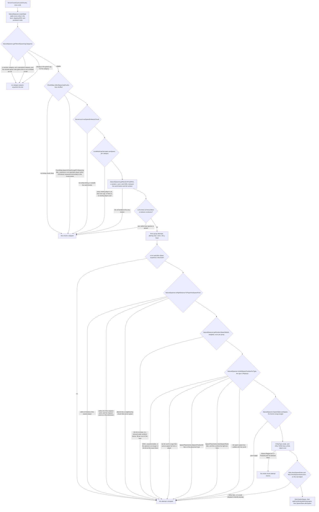
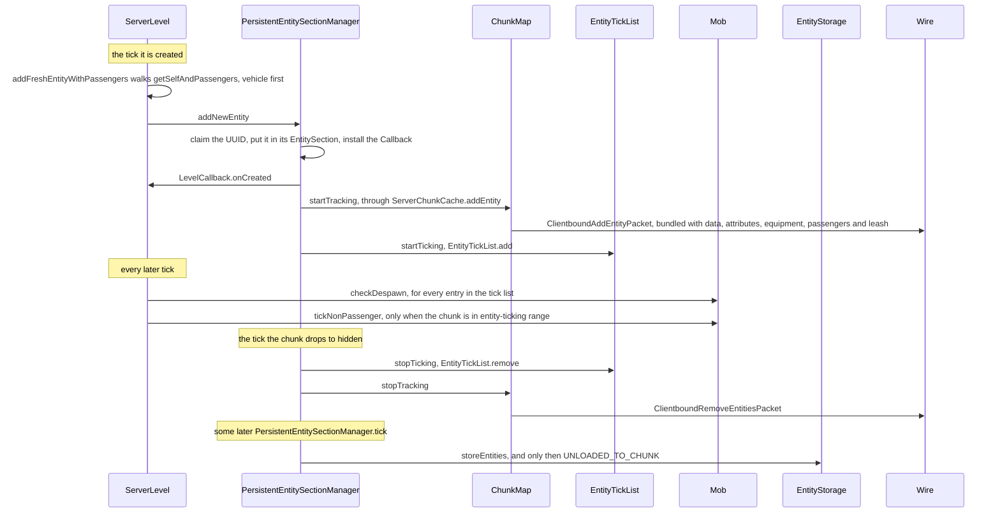
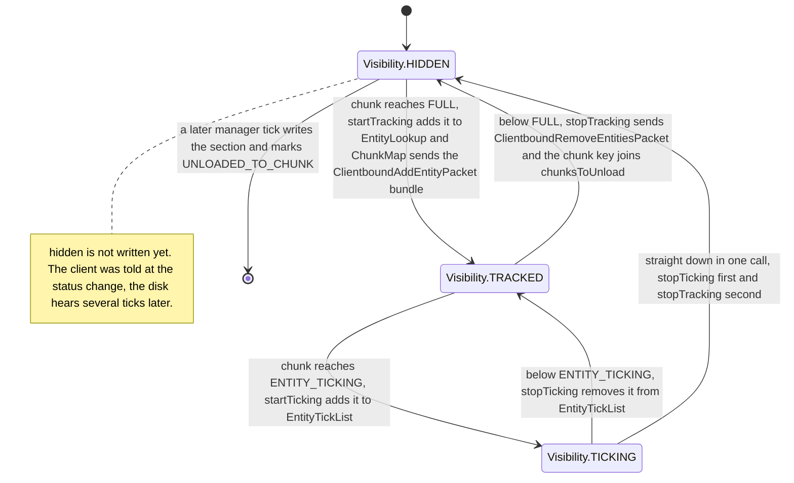

# Entity lifecycle

> Verified against **Minecraft 26.2** · Part VI · A zombie spawns in a dark chunk at night, is ticked for a while, and then either despawns or is written to disk when the chunk unloads.

Night falls, you are standing in a field, and somewhere behind you a zombie
appears. What the server actually did is smaller and stranger than it looks.
Once a tick, for each chunk near a player and each mob category still under
its cap, `NaturalSpawner.getRandomPosWithin` rolls a random x, a random z and
**one** y — a single uniform draw between the world bottom and the surface
height of that column. Three group attempts follow, and they jitter only x
and z. So the whole of one category's chance in one chunk this tick lives on
**one horizontal slice**: every eligible category gets its own slice, caves
and the open field compete for the same rolls, and a world with more vertical
space between bedrock and grass spreads those rolls thinner over the surface.
Everything else on this page — the caps, the light test, the despawn radius,
the write to disk — hangs off that one roll, or off the moment several
rejections later where the mob is finally allowed to exist.

## The cast

| class | what it decides | thread |
|---|---|---|
| `NaturalSpawner` | every test between a chunk and a mob, in one file of static methods | server main |
| `NaturalSpawner.SpawnState` | the per-tick census, the global cap per `MobCategory`, and the biome energy budget through `PotentialCalculator` | server main, rebuilt each tick |
| `LocalMobCapCalculator` | whether any player near *this* chunk is still under the per-player limit | server main, rebuilt each tick |
| `SpawnPlacements` | the placement type, heightmap and predicate for each `EntityType` — code, not data | a static table, read on the server main thread |
| `PersistentEntitySectionManager` | which entities exist, which are findable, which tick, which chunks are queued to unload | server main, with one concurrent load inbox |
| `Visibility` | the three-state projection of `FullChunkStatus` that everything above reads | an enum, read on both sides |
| `EntityTickList` | the set the tick walks, and the double buffer that makes mutating it mid-walk safe | server main, and the client's main thread for `ClientLevel` |
| `EntityStorage` | the *entities/* region files, separate from the block ones | reads on the IO pool, deserialises and writes on the server main thread |

## A spawn attempt is a filter, not a conversation

Almost every step of the spawner is a **rejection**. Drawing it as a
conversation hides that, so here it is as the cascade it is — top to bottom
in the order the code runs, with everything that can drop an attempt drawn as
an arrow leaving the path.

The boundary that matters is the one marked **only now**. Everything above it
is decided against the `EntityType` — the placement type, the heightmap, the
light rule, the collision box — because constructing a mob to ask it costs
more than answering from the type. Nothing above that line has an object to
call a method on. `Monster.checkMonsterSpawnRules` is the light rule for a
zombie, and it is three tests in a row: sky light against a random draw from
zero to 31, then the dimension's `DimensionType.monsterSpawnBlockLightLimit`
if that limit is below 15, then the local brightness against a sample of
`DimensionType.monsterSpawnLightTest`. The last of those is where storms come
in: during thunder the brightness is computed with a fixed sky-darkening
of 10 instead of the level's current one, which is what lets monsters spawn
outdoors in the daytime. The light rule is per-dimension data,
not a constant, and `EntitySpawnReason.ignoresLightRequirements` exempts
exactly one reason, `EntitySpawnReason.TRIAL_SPAWNER`.

Construction is itself a filter, and the harshest-tempered one:
`EntityType.create` returns null when the type is feature-flagged off or the
difficulty is Peaceful and the type is not `EntityType.isAllowedInPeaceful`,
and `NaturalSpawner.spawnCategoryForPosition` answers a null by returning
outright — not by trying the next position. On Peaceful the spawner does all
the work up to construction and then abandons the chunk.

### The two caps, and where 289 comes from

A mob must pass both caps, and they are counted differently. The **global**
cap in `NaturalSpawner.SpawnState.canSpawnForCategoryGlobal` is
`MobCategory.getMaxInstancesPerChunk` — 70 for `MobCategory.MONSTER`, 10 for
`MobCategory.CREATURE` — times the number of spawnable chunks, divided by
`NaturalSpawner.MAGIC_NUMBER`. That divisor is 17², and the 17 is not
arbitrary: `DistanceManager` tracks spawn chunks out to eight chunks from
each player over a neighbourhood that includes diagonals, so one player
contributes a Chebyshev square of 17×17 chunks. The constant normalises the
cap back into *seventy monsters per player's worth of area*, which is why it
grows with player count and shrinks when players stand together.

The **local** cap is `LocalMobCapCalculator.canSpawn`, and it is a veto
rather than a budget: it walks the players near this chunk and answers yes
the moment it finds one under the raw per-chunk number for the category. With
no player near the chunk the walk finds nobody and the answer is **no**.
(`SharedConstants.DEBUG_IGNORE_LOCAL_MOB_CAP` is the development switch that
turns that half off.) The census both caps count from skips any mob that is
`Mob.isPersistenceRequired` or `Mob.requiresCustomPersistence` — named,
leashed or ridden — so a named zombie costs nothing against either cap. That
is the same predicate pair that makes `Mob.checkDespawn` return early, which
is why *name it and it stays* and *name it and it stops counting* are one
fact and not two.

### The four constants that are not the numbers

`NaturalSpawner` declares `NaturalSpawner.MIN_SPAWN_DISTANCE` 24,
`NaturalSpawner.SPAWN_DISTANCE_CHUNK` 8 and
`NaturalSpawner.SPAWN_DISTANCE_BLOCK` 128, and **not one of the three is read
anywhere in the game** — the live values are the literals 576.0 and 16384.0
at their use sites, both already squared. Only `NaturalSpawner.MAGIC_NUMBER`
is genuinely read. The other live constant,
`NaturalSpawner.INSCRIBED_SQUARE_SPAWN_DISTANCE_CHUNK`, is neither 8 nor 24:
it is the floor of 8 divided by the square root of two, so **5**, and
`DistanceManager.hasPlayersNearby` uses it as the fast *yes* of a three-way
answer — inside 5 chunks certainly near, beyond 8 certainly not, and in
between fall through to the real per-player distance test. Reading a name and
believing the number is how a page gets this wrong.

### What finalizeSpawn settles for the whole pack

`Mob.finalizeSpawn` adds a triangular random bonus to `Attributes.FOLLOW_RANGE`
under `Mob.RANDOM_SPAWN_BONUS_ID` and rolls a 5 % chance of left-handedness.
`Zombie.finalizeSpawn` then rolls loot-pickup and door-breaking against local
difficulty, equipment and its enchantments, and — the part players notice —
returns a `Zombie.ZombieGroupData` that the loop feeds back into the *next*
mob of the same group. Baby-or-adult is decided once, by the first zombie, and
inherited by the rest: a spawn group is all-baby or all-adult, never mixed. A
baby gets two 5 % rolls at a chicken to ride, the first looking for an
existing unridden `Chicken` within five blocks and the second creating one.
The group ends at `Mob.isMaxGroupSizeReached`, or at four mobs, which is what
`Mob.getMaxSpawnClusterSize` returns unless a species raises it.

## The other ways in

Natural spawning is one caller of `LevelWriter.addFreshEntity` among many.
`BaseSpawner` drives the `SpawnerBlockEntity` and `TrialSpawner` the trial
chambers ([block entities](../blocks/block-entities.md)); `SpawnEggItem` and
`SummonCommand` are the deliberate ones; `AgeableMob.getBreedOffspring` makes
babies; and five `CustomSpawner` implementations — `PhantomSpawner`,
`PatrolSpawner`, `CatSpawner`, `WanderingTraderSpawner` and `VillageSiege` —
are ticked as a list by `ServerLevel.tickCustomSpawners` after the chunks.
Each stamps a different one of the nineteen `EntitySpawnReason` constants, and
that reason never leaves the server: nothing about *why* something spawned
crosses the wire.

## Entry: what addFreshEntity actually does

`LevelWriter.addFreshEntity` is a default method that returns **false**.
`Level` does not override it and neither does `ClientLevel`. Exactly two
classes do. `ServerLevel.addFreshEntity` is the one this page is about.
`WorldGenRegion.addFreshEntity` is the other, and it does something entirely
different: it writes the entity straight into the `ChunkAccess`'s own list and
never touches `PersistentEntitySectionManager` at all. That is the
`EntitySpawnReason.CHUNK_GENERATION` path — worldgen mobs are parked in the
proto-chunk as NBT and only enter the manager later, when the chunk is
promoted and `PersistentEntitySectionManager.addWorldGenChunkEntities` is
handed them ([the generation pipeline](../world/chunk-generation-pipeline.md)).
On the client the only way in is `ClientLevel.addEntity`, called from the
packet handler, and it begins by *removing* whatever already holds that
network id.

`ServerLevel.EntityCallbacks` is the class those four callbacks land in, and
it is where a surprising amount of the level hangs: the scoreboard entry, the
players list and the sleeping-player recount, waypoint tracking, the
navigating-mob set the block-change notifier walks, the `EnderDragonPart` id
registrations, and the dynamic `DynamicGameEventListener` registration
([game events](../world/game-events-and-vibrations.md)).

## Findable, ticking, or neither

`Visibility` is the whole idea in three constants, and
`Visibility.fromFullChunkStatus` is the projection: `FullChunkStatus.FULL`
makes a chunk's entities findable, `FullChunkStatus.ENTITY_TICKING` makes them
tick, anything less hides them
([tickets and loading](../world/tickets-and-loading.md)).

The asymmetry is real and worth stating precisely.
`PersistentEntitySectionManager.updateChunkStatus` runs its four tests in a
fixed order — stop ticking, stop tracking, start tracking, start ticking — so
on the way **up** an entity becomes trackable before it becomes tickable, and
on the way **down** it stops ticking before it stops being tracked. That order
holds only on the chunk-status path. The other transition path, an entity
walking across a section boundary into a differently-statused section, runs
through `PersistentEntitySectionManager.Callback` instead, which does tracking
first in *both* directions and then ticking, and fires
`LevelCallback.onSectionChange` at the end. And the always-ticking exemption,
`Entity.isAlwaysTicking`, which lifts an entity clear of every one of those
filters, is claimed by exactly one class in 26.2: `Player`.

## The tick it gets, and the despawn check it gets anyway

The entity block of `ServerLevel.tick` is skipped in its entirety once the
level has gone 300 ticks without an active ticket. Otherwise the tick walks
`EntityTickList` and, for each entry that is neither removed nor frozen by
`TickRateManager.isEntityFrozen`, calls `Entity.checkDespawn` — whose
base implementation is *empty*, overridden only by `Mob`, `EnderDragon`,
`WitherBoss` and `ShulkerBullet`, so for an item or an arrow it is a no-op
call. Only **after** that does the range test run: a `ServerPlayer` is exempt
outright, everything else needs `DistanceManager.inEntityTickingRange` for its
own chunk, and an entity already riding a live vehicle returns here to be
ticked by `ServerLevel.tickPassenger` instead.

So despawn is checked for every member of the tick list while ticking is not.
The two sets should agree, and mostly do — the tick list *is* the ticking set
— but they read different sources: membership follows the chunk holder's
promoted `FullChunkStatus`, while the per-tick gate reads the simulation
tracker directly, and the two need not have converged in the same tick.

`EntityTickList` is what makes that walk safe. It holds two id-keyed maps and
a nullable reference to whichever one is being iterated. Adding or removing
during a walk copies the live map into the spare and **swaps** them, so the
in-flight iterator finishes over the original, untouched map and the mutation
lands in the new one. A second concurrent walk is refused outright, by
checking that reference rather than a boolean.

## Ending one: Mob.checkDespawn

Left in a loaded chunk, the zombie ends through `Mob.checkDespawn`, whose
first branch consults no player at all: on Peaceful, anything whose type is
not `EntityType.isAllowedInPeaceful` is discarded on the spot, ahead of even
the persistence check. Past that, a persistent mob has its
`LivingEntity.noActionTime` pinned to zero and is done.

Everything else is measured against the nearest non-spectator player — and if
there is no player in the level at all, both remaining branches do nothing, so
a mob alone in a world never despawns by distance. Beyond
`MobCategory.getDespawnDistance` — 128 blocks for every category except
`MobCategory.WATER_AMBIENT`, which is 64 — it is discarded instantly. Beyond
`MobCategory.getNoDespawnDistance`, a flat 32 for every category, it is
discarded on a 1-in-800 roll, but only once `LivingEntity.noActionTime` has
passed 600; inside that 32 the same method resets that counter to zero, so
standing near a mob keeps it alive. Both distance branches also require
`Mob.removeWhenFarAway`, the per-species veto that tamed animals, villagers
and anything holding a job override — which is why *128 blocks and it is
gone* is a species-dependent rule and not a universal one. What both branches
call is `Entity.discard`, which destroys and does not save.

## Ending two: the chunk goes away

Walk far enough instead and the chunk falls out of entity-ticking: the zombie
stops ticking but stays findable. Fall to `Visibility.HIDDEN` and two things
happen, several ticks apart. At the status change,
`PersistentEntitySectionManager.updateChunkStatus` stops ticking and stops
tracking the section's entities, and stopping tracking is what reaches
`ChunkMap` and sends `ClientboundRemoveEntitiesPacket` — the client is told
*then*, not at the write. The chunk key goes into the manager's unload set,
and some later `PersistentEntitySectionManager.tick` runs
`PersistentEntitySectionManager.processUnloads` over it.

That later step is not a formality, and it can refuse. A chunk whose entity
data is still being read back off disk is deferred to a future tick. A chunk
that has entities to save but has *never been read* is **loaded first**, so
the two sets can be merged — the unload triggers a load. Only then does
`EntityStorage.storeEntities` write the *Entities* list and a *Position* into
the *entities/* region files ([chunk storage](../world/chunk-storage.md)),
which are separate from the block *region/* files and which remember the
chunks that came back empty so they are never re-read. Each saved entity and
its passengers then take `Entity.RemovalReason.UNLOADED_TO_CHUNK` and drop
their level callback.

Two rules decide what is in that file. Passengers are written **inside** their
vehicle, never beside it, so `Entity.shouldBeSaved` refuses any entity that is
riding something; and a vehicle whose passengers are exactly one player is
refused too, because it travels in that player's own data instead. The clause
that is easy to miss is the first one in the method: an entity already
carrying a non-saving removal reason is skipped, which is what keeps a
discarded mob still sitting in a section out of the file.

## Five reasons, one label

| reason | destroys | saves | what leaves it behind |
|---|---|---|---|
| `Entity.RemovalReason.KILLED` | yes | no | death, in every sense the game means it |
| `Entity.RemovalReason.DISCARDED` | yes | no | `Entity.discard`, every despawn, the client replacing a network id |
| `Entity.RemovalReason.UNLOADED_TO_CHUNK` | no | **yes** | the unload above — the only reason that saves |
| `Entity.RemovalReason.UNLOADED_WITH_PLAYER` | no | no | a vehicle travelling inside a player's own save data |
| `Entity.RemovalReason.CHANGED_DIMENSION` | no | no | a portal, where the entity is rebuilt on the far side |

*Destroys* means `LevelCallback.onDestroyed` fires — the scoreboard entry and
the waypoint go. An unloading zombie keeps all of it, because
`Entity.RemovalReason.UNLOADED_TO_CHUNK` does not destroy. The five are not a
state machine: `Entity.setRemoved` writes the reason **only if none is set**,
so the first one wins and anything trying to upgrade a removal silently does
nothing. It drops its passengers unconditionally, but dismounts the entity
from its own vehicle only when the reason destroys. The one link that survives
a removal by design is an `EntityReference` held by somebody else — it keeps a
UUID, upgrades to the object on first resolution, and falls back to the UUID
when the target goes, which is how *who last hurt me* survives a chunk unload.

## Where to look

`NaturalSpawner.spawnCategoryForPosition` · `NaturalSpawner.SpawnState` ·
`LocalMobCapCalculator` · `ChunkMap.collectSpawningChunks` ·
`SpawnPlacements` · `EntitySpawnReason` · `Mob.finalizeSpawn` ·
`Mob.checkDespawn` · `MobCategory` · `ServerLevel.addFreshEntity` ·
`PersistentEntitySectionManager.updateChunkStatus` · `Visibility` ·
`EntityLookup` · `EntitySection` · `EntitySectionStorage` · `LevelCallback` ·
`EntityInLevelCallback` · `EntityTickList` · `ServerLevel.tickNonPassenger` ·
`Level.guardEntityTick` · `EntityStorage` · `Entity.RemovalReason` ·
`Entity.setRemoved` · `TransientEntitySectionManager`

Before this page: [authority](authority.md), on which side is allowed to
decide any of it. After it: [synched entity data](synched-entity-data.md) —
what the `ClientboundAddEntityPacket` bundle above is carrying, and how it
stays current.

---

*Rules: names, never code · how the system works, not how the code reads ·
newest version only · every backticked name passes `tools/verify_names.py`.*
