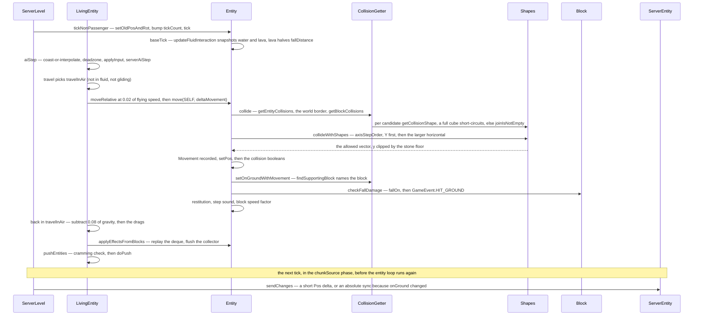
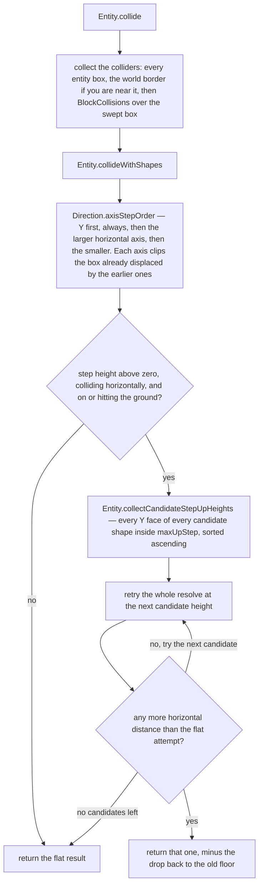

# Movement and collision

> Verified against **Minecraft 26.2** · Part VI · One tick of a falling zombie: 0.08 of gravity, one swept box against a stone floor, and the four booleans everything downstream reads.

A zombie is two blocks above stone with nothing pushing it sideways. Its
tick builds one delta vector, hands it to `Entity.move`, gets back the part
of it the world allowed, and sets four booleans from the difference. Then it
has to answer a harder question: *what did I just walk through?* It does not
answer that by sampling the destination. Every segment of the tick's
movement was recorded into a deque, `Entity.movementThisTick`, and
`Entity.applyEffectsFromBlocks` replays those segments afterwards — in the
same axis order the collision used, visiting every block the swept box
actually crossed, `AABB.collidedAlongVector` rather than a static overlap.
And the effects that replay finds are not applied where they are found: they
are queued into an `InsideBlockEffectApplier.StepBasedCollector` and flushed
in `InsideBlockEffectType` declaration order, so fire and water touched in
the *same* step of the replay always end in the extinguish, whatever order
the blocks came in.

## The cast

| class | what it decides | thread |
|---|---|---|
| `Entity` | the geometry: clipping, stepping up, bouncing, whether you are on the ground and what you are standing on | server main, or client main for whoever is authoritative |
| `LivingEntity` | the physics above it: gravity, drag, friction, swimming, gliding, climbing | same |
| `CollisionGetter` | which blocks are candidates, through `BlockCollisions`, and which one is holding you up | same |
| `Shapes` / `VoxelShape` | the clipping arithmetic, one axis at a time | same |
| `Entity.Movement` | one recorded segment — from, to, and the pre-collision vector that fixes the replay's axis order | same |
| `InsideBlockEffectApplier.StepBasedCollector` | when a block effect actually happens, and in what order | same |
| `EntityFluidInteraction` | the once-per-tick snapshot of water and lava height, eye depth and current | same |
| `ServerEntity` | whether this tick's new position costs a short delta or an absolute sync | server main, in the broadcast phase |

## Who is allowed to run this at all

The trace below is the *authoritative* copy's tick, and which copy that is
inverts between a mob and a player: nothing in a client-side mob's own tick
reaches `Entity.move`, while your own player is simulated on your machine for
real. The predicate that decides is `Entity.isLocalInstanceAuthoritative`
rather than a bare "am I the client", and it is stated in full once, at
[authority](authority.md#five-predicates-and-the-final-one-the-other-four-hang-off);
this page notes each gate where the trace hits it.

## The tick

## Building the delta

`Entity.baseTick` clears the cached block state, records whether the eyes
were in water, and calls `Entity.updateFluidInteraction` — one sweep that
fills the water and lava trackers of `EntityFluidInteraction` with their
heights and accumulated current. Everything downstream — `Entity.isInWater`,
`Entity.isInLava`, `Entity.getFluidHeight`, `Entity.isEyeInFluid` — reads
that snapshot and never the live world. Fire ticks after it, lava *halves*
`Entity.fallDistance` rather than clearing it, and `Entity.checkBelowWorld`
discards anything 64 below the world floor — except a `LivingEntity`, which
overrides the hook and takes four points of *fell out of the world* damage a
tick instead.

`LivingEntity.aiStep` is the order of every mob's tick and worth memorising:
interpolate-or-coast, head turn, equipment, a deadzone that zeroes any delta
component under 0.003 (a squared-horizontal test instead, for players),
`LivingEntity.applyInput`, `Mob.serverAiStep` — the goal selector and the
movement control, which set `LivingEntity.xxa` and `LivingEntity.zza`
([AI](ai-goals-and-brains.md#what-decides), [pathfinding](pathfinding.md#following-it-one-tick-at-a-time)) — the jump
branch, gliding, the travel branch, `Entity.applyEffectsFromBlocks`,
animation, freezing, `LivingEntity.pushEntities`. Our zombie's jump branch
is skipped before `Entity.onGround` is ever consulted, because the branch is
gated on `LivingEntity.jumping` and a falling zombie is not asking to jump.

The travel branch is a fork, not a call. If the controlling passenger is a
`Player` and the mob is alive it is `LivingEntity.travelRidden` — the path
every horse, pig and happy ghast takes, and the reason a ridden mob's input
comes from `LivingEntity.getRiddenInput` rather than its own AI. Otherwise,
and only if both `Entity.canSimulateMovement` and `Entity.isEffectiveAi`
hold, it is `LivingEntity.travel`, which picks one of three:
`LivingEntity.travelInFluid` (splitting again into
`LivingEntity.travelInWater` and `LivingEntity.travelInLava`),
`LivingEntity.travelFallFlying` — the elytra model, lift from the square of
the pitch cosine — or `LivingEntity.travelInAir`.
`LivingEntity.shouldTravelInFluid` picks the first, and note what it reads:
the *cached* in-water and in-lava flags, with the live `FluidState` at the
block position used only for `LivingEntity.canStandOnFluid`, which is how a
strider walks on lava.

`LivingEntity.travelInAir` probes the block below through
`Entity.getBlockPosBelowThatAffectsMyMovement` — 0.500001 down — for its
friction: airborne, 1.0, and on stone `Block.getFriction`'s 0.6 through
`LivingEntity.computeModifiedFriction`. For an airborne entity
`LivingEntity.getFrictionInfluencedSpeed` then returns
`LivingEntity.getFlyingSpeed`: **0.02** for a mob nobody is riding, which is
why you have almost no air control — a literal, not
`Attributes.FLYING_SPEED`, which is not even in the base living attribute
set. `Entity.moveRelative` rotates the input by the yaw and adds it to
`Entity.deltaMovement` through `Entity.setDeltaMovement`, which silently
discards the whole vector if it is not finite, so NaN never enters the
physics state.

Every knob on the entity's side is a syncable attribute
([attributes](attributes.md#forty-numbers-every-one-of-them-clamped)): `Attributes.GRAVITY` (0.08),
`Attributes.STEP_HEIGHT` (0.6), `Attributes.MOVEMENT_SPEED` (0.7),
`Attributes.JUMP_STRENGTH` (0.42), `Attributes.SAFE_FALL_DISTANCE` (3.0),
`Attributes.FALL_DAMAGE_MULTIPLIER`, `Attributes.MOVEMENT_EFFICIENCY`,
`Attributes.WATER_MOVEMENT_EFFICIENCY`, `Attributes.AIR_DRAG_MODIFIER`,
`Attributes.FRICTION_MODIFIER`, `Attributes.BOUNCINESS`. The world's half is
four block properties ([blocks and states](../blocks/blocks-and-states.md#four-decisions-four-lookups)):

| property | default | who changes it |
|---|---|---|
| `Block.getFriction` | 0.6 | 0.98 on ice, packed ice and `Blocks.FROSTED_ICE`, 0.989 on blue ice, 0.8 on `Blocks.SLIME_BLOCK` |
| `Block.getSpeedFactor` | 1.0 | 0.4 on soul sand and honey |
| `Block.getJumpFactor` | 1.0 | 0.5 on honey |
| `Block.getBounceRestitution` | 0.0 | 1.0 on `Blocks.SLIME_BLOCK`, 0.75 on beds |

`MoverType` names who is moving you, in five constants. `MoverType.PISTON` is
the one with real machinery — `Entity.limitPistonMovement` collapses the
vector to a single axis, `Entity.applyPistonMovementRestriction` clamps it to
±0.51 per game tick, and that path alone is exempt from the *multiply* by
`Entity.stuckSpeedMultiplier` — it still clears the field
([pistons](../blocks/pistons-and-block-events.md#one-push-tick-by-tick)). `MoverType.SHULKER_BOX`
makes a `Shulker` teleport rather than move, and `MoverType.SELF` and
`MoverType.PLAYER` are read together by `Player.maybeBackOffFromEdge`, which
is what stops a crouching player walking off a ledge.

## Resolving one axis at a time

`Entity.move` opens with two things that are easy to miss.
`Entity.stuckSpeedMultiplier` is applied to the delta and *cleared* in the
same breath, zeroing `Entity.deltaMovement` with it — that pair is the whole
cobweb, berry-bush and powder-snow model — and `Entity.noPhysics` is an escape hatch above
even it: an entity with it set skips collision entirely and has all four
booleans cleared.

Two things in the gathering stage surprise people. The first is that
**collision is against shapes, not blocks**: a candidate contributes
whatever `BlockBehaviour.BlockStateBase.getCollisionShape` says, which for a
fence is 1.5 blocks tall — to walk into *and* to stand on. The 1.0 you see
outlined is `BlockBehaviour.BlockStateBase.getShape`, the selection box, and
`CrossCollisionBlock` builds the two from different heights. The mover only
ever asks for the first. The second is that most entities are not colliders
at all: `EntityGetter.getEntityCollisions` wraps with `Shapes.create` the
box of every entity that answers `Entity.canBeCollidedWith`, and the base
class answers **false** — so the mob standing next to you contributes
nothing, while boats, living shulkers and happy ghasts do. (Pushing is a different
predicate, `Entity.isPushable`, and belongs to the crowding pass below.)
`BlockCollisions` walks the box with a `Cursor3D`, reads chunks through
`CollisionGetter.getChunkForCollisions` — a full chunk if it is already
there, null otherwise, and a missing chunk is simply stepped past, so an
entity at the edge of loaded space falls through empty space rather than
blocking the tick. A full cube short-circuits to a box intersection;
anything else goes through `Shapes.joinIsNotEmpty`.

The step-up loop in the figure is the part worth slowing down for. It does
not guess a height and it does not pick the best one. It harvests the Y
coordinates of the candidate shapes that lie above the entity's feet and
within `Entity.maxUpStep`, skipping the height the flat attempt already
tried, sorts them
ascending, and retries the *whole* resolve at each until one yields any more
horizontal distance than the flat attempt — and returns that one. It is the
lowest step that helps, which is also why an entity can step onto a shape's
internal ledge and not only its top face. `Entity.maxUpStep` is zero on the
base class and `LivingEntity.maxUpStep` reads `Attributes.STEP_HEIGHT`,
raised to at least 1.0 when a `Player` is riding — which is how a ridden
horse climbs a full block.

## What the move reports back

Before committing, one clip: if `Entity.fallDistance` is non-zero and the
allowed movement is at least a block long, `Entity.move` casts a ray up to
eight blocks along it for `BlockTags.FALL_DAMAGE_RESETTING` and resets the
fall distance on any hit. Then an `Entity.Movement` record — from, to, and
the pre-collision delta — goes onto `Entity.movementThisTick`, and
`Entity.setPos` moves the point and the bounding box together.

The four booleans are then computed by comparing what was asked with what
was allowed: `Mth.equal` on the two horizontals, but **exact** inequality on
Y, and the whole vertical block only runs if the entity moved vertically at
all or is authoritative. `Entity.onGround` is therefore a comparison and not
a raycast — it is set from `Entity.verticalCollisionBelow`, meaning the
vertical component was clipped and it was negative. The only geometric probe
is `CollisionGetter.findSupportingBlock`, reached through
`Entity.setOnGroundWithMovement` and `Entity.checkSupportingBlock`, and it
answers *which* block is holding you (for sounds and the speed factor), not
*whether* — probing a paper-thin slab under the box, retrying with the box
shifted back along the movement if that finds nothing, and setting
`Entity.onGroundNoBlocks` when it still does.

`Entity.checkFallDamage` runs next, only when this instance is authoritative.
It adds the downward movement to `Entity.fallDistance` and, on landing, calls
`Block.fallOn`, posts `GameEvent.HIT_GROUND` and resets the distance.
`Block.fallOn` is what calls `LivingEntity.causeFallDamage`,
`LivingEntity.calculateFallPower` subtracts
`Attributes.SAFE_FALL_DISTANCE` and `LivingEntity.calculateFallDamage`
multiplies by `Attributes.FALL_DAMAGE_MULTIPLIER` and checks
`EntityTypeTags.FALL_DAMAGE_IMMUNE` ([damage](damage-and-death.md#the-number-the-arrow-decides)). Our
two-block fall is 2 − 3 < 0, so the power is zero and **nothing at all**
happens: the landing particles are gated on a positive power and the fall
sound on positive damage, so only the game event and the reset fire. That
reset is reached from more places than you would guess — landing, entering
water in `Entity.updateFluidInteraction`, climbing in
`LivingEntity.handleOnClimbable`, every `LivingEntity.rideTick`, under
`MobEffects.SLOW_FALLING` or `MobEffects.LEVITATION` at the top of the
travel branch, `Entity.makeStuckInBlock`, and the tag clip above. Lava
halves it instead.

Then `Entity.restituteMovementAfterCollisions`, gated on
`Entity.canSimulateMovement`: a real restitution model, not slime-block
code. It reflects the horizontal components, and for a downward hit combines
`Attributes.BOUNCINESS` with `Block.getBounceRestitution`, damped to 80% for
non-living entities, gated on the impact being at least one tick of gravity
— which is why nothing jitters at rest on a slime block — and opted out of
by `BlockTags.SUPPRESSES_BOUNCE` or by crouching. A bounce posts
`GameEvent.BOUNCE` ([game events](../world/game-events-and-vibrations.md#a-game-event-is-one-number))
and sets `Entity.syncPosition`. `Entity.applyMovementEmissionAndPlaySound`
follows, gated on *not client-side or authoritative*: it accumulates
`Entity.moveDist` and fires `Entity.playStepSound` plus `GameEvent.STEP`
when it passes `Entity.nextStep`. Last, the horizontal components are
multiplied by `Entity.getBlockSpeedFactor` — soul sand's 0.4, lerped towards
1 by `Attributes.MOVEMENT_EFFICIENCY`.

## And then gravity

Control returns to `LivingEntity.travelInAir`, *after* the move, and only
now is gravity subtracted: `Entity.getEffectiveGravity`, 0.08, or capped at
0.01 while falling with `MobEffects.SLOW_FALLING`. `MobEffects.LEVITATION`
replaces that step entirely rather than modifying it, and a client-side
entity standing over an unloaded chunk gets a hard-coded −0.1. The
horizontals are then multiplied by block friction times a 0.91 scaled by
`Attributes.AIR_DRAG_MODIFIER`, the vertical by a 0.98 scaled by the same —
`Attributes.FRICTION_MODIFIER` touches only the block-friction term, and
block friction is 1.0 unless `Entity.onGround`. The whole drag step is
skipped when `LivingEntity.shouldDiscardFriction` is set. Climbing lives
inside this same step: `LivingEntity.handleOnClimbable` clamps the fall
speed on a `BlockTags.CLIMBABLE` block, and a separate clamp in
`LivingEntity.handleRelativeFrictionAndCalculateMovement` sets the vertical
component to 0.2 when a climbing or powder-snow entity is either colliding
horizontally or jumping — which is the whole of "you go up a ladder by
pressing into it".

So the delta `Entity.move` consumes carries the *previous* tick's gravity.
That is one of two conventions in the codebase, and the other is
`Entity.applyGravity`, which runs *before* the move. **An `ItemEntity` does
it the other way, and the contrast is the clearest way to see both.**
`ItemEntity.tick` applies gravity (a default of 0.04) before `Entity.move`
and drag after it, **reverses** any downward velocity on landing at half
strength — items bounce, they do not merely damp — and skips the move
entirely when it is resting still on the ground and the tick count says it is
not this item's turn, calling
`Entity.applyEffectsFromBlocksForLastMovements` on the previous tick's
segments instead. Its `Entity.getMovementEmission` is
`Entity.MovementEmission.NONE`, so it makes no step sounds. Neither
convention is wrong.

The fluid snapshot has one exception, and it is a useful one:
`LivingEntity.checkFallDamage` re-runs `Entity.updateFluidInteraction` from
*inside* `Entity.move` whenever the entity is not already in water (and
`ItemEntity.tick` re-runs it too), which is exactly why falling into water
cancels the fall damage in the same tick that entered it.

## What did I pass through

`Entity.applyEffectsFromBlocks` runs on the same gate as the step sound —
not client-side, or authoritative. It drains `Entity.movementThisTick` into
`Entity.finalMovementsThisTick` first — substituting a single old-position-to-
position segment when the deque is empty, and appending a final segment when
the entity ended somewhere the last recorded one did not — and only then runs
the replay, which opens by calling `Block.stepOn` for the block underfoot,
gated on `Entity.onGround`.

Each segment is replayed in the *same axis order the collision used* —
`Direction.axisStepOrder` again, over the segment's stored pre-collision
vector — and `Entity.checkInsideBlocks` walks each leg with
`BlockGetter.forEachBlockIntersectedBetween`, testing each block with
`AABB.collidedAlongVector` (through `Entity.collidedWithShapeMovingFrom`)
rather than a static overlap at the destination, and calling
`BlockBehaviour.BlockStateBase.entityInside`, `Entity.onInsideBlock` and
`FluidState.entityInside` on what it finds. `Entity.visitedBlocks` is the
deduplicator: a block is visited at most once across the whole replay,
however many segments cross it. Two budgets bound the work — sixteen sweep
steps per segment, which is not sixteen blocks, because every block the box
covers at one end of the sweep shares a single step index; and
`Entity.movementThisTick` merges its two oldest entries once it reaches a
hundred, buying bounded memory with a little precision. A segment that
exhausts its steps gets one last zero-length visit at the destination, which
covers every block the box ends up inside.

Nothing found is applied inline. Each effect is queued into the
`InsideBlockEffectApplier.StepBasedCollector`, which flushes a step's worth
at a time in `InsideBlockEffectType` declaration order —
`InsideBlockEffectType.FREEZE`, `InsideBlockEffectType.CLEAR_FREEZE`,
`InsideBlockEffectType.FIRE_IGNITE`, `InsideBlockEffectType.LAVA_IGNITE`,
`InsideBlockEffectType.EXTINGUISH` — so fire and water touched in the same
step always end in the extinguish. The reordering is strictly per step:
`InsideBlockEffectApplier.StepBasedCollector.advanceStep` flushes as the
replay advances and
`InsideBlockEffectApplier.StepBasedCollector.applyAndClear` runs the
accumulated list at the end, so across steps the order stays chronological
and fire in a *later* step than water still burns you.

## Off it goes

`LivingEntity.pushEntities` closes the tick. It collects pushable
neighbours through `Level.getPushableEntities` — a different predicate from
the collision one, and on the client `ClientLevel.getPushableEntities`
returns at most the local player, never the crowd. On a server it applies
`GameRules.MAX_ENTITY_CRAMMING` (default 24, checked one tick in four, the
damage 6) and then calls `LivingEntity.doPush` → `Entity.push`, a
horizontal-only impulse scaled by 0.05 and ignored below a hundredth of a
block.

Nothing has crossed the network yet. `ServerEntity.sendChanges` runs in the
chunk-source phase of `ServerLevel.tick`, which comes *before* the entity
loop ([the level tick](../server/server-level-tick.md#the-broadcast-which-is-why-entities-are-a-tick-behind)) — so this tick's
movement is broadcast at the start of the next one. It becomes a short delta,
`ClientboundMoveEntityPacket.Pos`, only when it can: not too big for a
short, no more than 400 **gated evaluations** since the last absolute sync —
`ServerEntity.teleportDelay` is incremented inside the gate, so for an entity
on the default interval that is at least 1,200 ticks — not riding, the
entity does not demand precision, **and `Entity.onGround` still matches what
the last absolute sync recorded**. The last condition is the one that fails
most often, and it is a real cost: every landing and every step off a ledge
forces a full `ClientboundEntityPositionSyncPacket`. Setting the entity's
`Entity.syncPosition` flag re-phases the tracker's own counter to the next
interval boundary, so the send happens at the next evaluation rather than up
to an interval late, and `ClientboundSetEntityMotionPacket` carries the delta
separately ([what the client is
told](../networking/what-the-client-is-told.md#gate-3-and-the-position-it-chooses)
owns the choice between the two shapes). On the receiving side,
`ClientPacketListener.handleEntityPositionSync` moves only an entity that is
*not* locally authoritative
([authority](authority.md#the-boat-authoritative-on-exactly-one-machine)), and
snaps rather than interpolates past 64
blocks of correction — otherwise it feeds `InterpolationHandler`, three
steps by default, which is the *interpolate* half of the fork
`LivingEntity.aiStep` opens with; the coast branch is what runs when there is
no handler.

## Where to look

`LivingEntity.aiStep` · `LivingEntity.travel` · `LivingEntity.travelInAir` ·
`LivingEntity.handleRelativeFrictionAndCalculateMovement` ·
`LivingEntity.handleOnClimbable` · `Entity.move` · `Entity.collide` ·
`Entity.collideBoundingBox` · `Entity.collideWithShapes` ·
`Entity.collectCandidateStepUpHeights` · `CollisionGetter` ·
`BlockCollisions` · `Shapes.collide` · `Entity.setPos` ·
`Entity.setOnGroundWithMovement` · `Entity.checkSupportingBlock` ·
`Entity.checkFallDamage` · `Entity.restituteMovementAfterCollisions` ·
`Entity.applyMovementEmissionAndPlaySound` ·
`Entity.updateFluidInteraction` · `EntityFluidInteraction` ·
`Entity.applyEffectsFromBlocks` · `Entity.checkInsideBlocks` ·
`InsideBlockEffectApplier.StepBasedCollector` · `InsideBlockEffectType` ·
`LivingEntity.pushEntities` · `MoverType` · `InterpolationHandler` ·
`ServerEntity.sendChanges`

---

*Rules: names, never code · how the system works, not how the code reads ·
newest version only · every backticked name passes `tools/verify_names.py`.*
