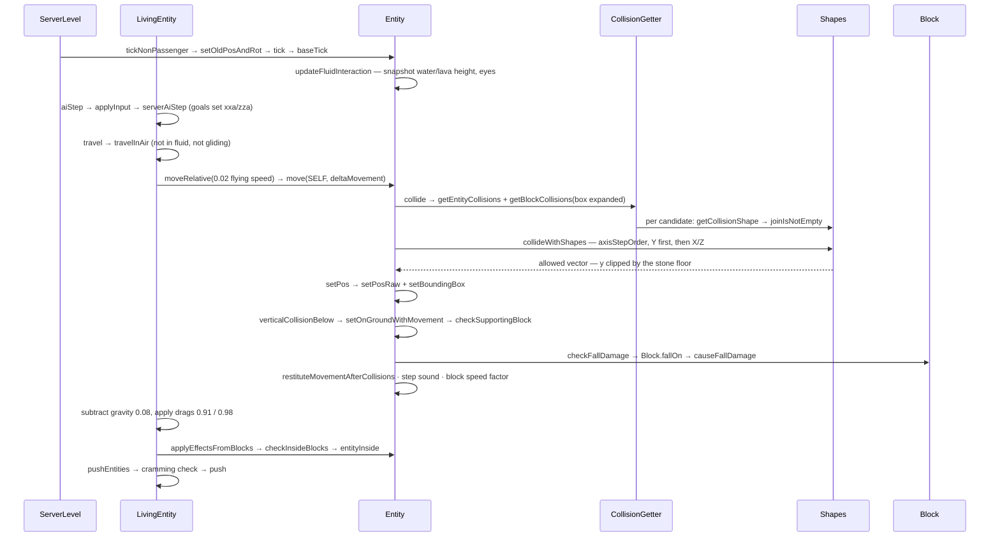

# Movement and collision

> Verified against **Minecraft 26.2** · Part VI · One tick of a falling zombie: 0.08 of gravity, one swept box against a stone floor, and the four booleans everything downstream reads.

## Responsibility

Every entity that moves does it the same way: build a delta vector, hand it
to `Entity.move`, and let the collision resolver return the part of that
vector the world allowed. `Entity.move` owns the geometry — clipping
against block shapes, other entities and the world border, stepping up,
bouncing, deciding whether you are on the ground and what you are standing
on. The layer above it, `LivingEntity.travel`, owns the physics — gravity,
drag, friction, swimming, gliding — and the layer above *that* is AI or
player input. Fall damage, step sounds, and the "you are inside a
cobweb/fire/powder snow" effects are all consequences the mover reports,
not decisions the caller makes.

The one sentence a player recognises: *you slide on ice, sink in soul sand,
bounce on slime, step up a slab without jumping, and take damage from the
fourth block down.*

## The data it owns

- **Where it is.** `Entity.position` (a `Vec3`), with `Entity.blockPosition`
  and `Entity.chunkPosition` derived and cached beside it, and the bounding
  box, which only `Entity.setPos` recomputes (`Entity.makeBoundingBox`,
  `Entity.setBoundingBox`). `Entity.setPosRaw` moves the point and notifies
  the level callback; `Entity.setPos` moves the point *and* the box.
  `Entity.absSnapTo` is the hard teleport: it also rewrites the previous
  position, which is what makes it destroy interpolation.
- **Where it is going.** `Entity.deltaMovement`, read and written through
  `Entity.getDeltaMovement`, `Entity.setDeltaMovement` and
  `Entity.addDeltaMovement` — all of which silently drop non-finite
  components, so NaN never enters the physics state.
  `Entity.getKnownMovement` is what other systems should ask.
- **What just happened.** Four public booleans set by the last move:
  `Entity.horizontalCollision`, `Entity.verticalCollision`,
  `Entity.verticalCollisionBelow`, `Entity.minorHorizontalCollision`; plus
  `Entity.onGround`, `Entity.onGroundNoBlocks` ("grounded, but no supporting
  block was found") and `Entity.mainSupportingBlockPos`. Almost every
  gameplay question — can I jump, do I take fall damage, which block's sound
  do I play, am I sprinting-eligible — reads these rather than the world.
- **How far it has come.** `Entity.fallDistance` (a **double** in 26.2, not a
  float), `Entity.moveDist` and `Entity.flyDist` for the step-sound counter,
  `Entity.nextStep` as its threshold.
- **What it moved through.** `Entity.movementThisTick` and
  `Entity.finalMovementsThisTick`, deques of the private record
  `Entity.Movement` (from, to, and the pre-collision vector), plus
  `Entity.visitedBlocks` and an `InsideBlockEffectApplier.StepBasedCollector`.
  This is how "which blocks did I pass through" is answered *after* the fact
  rather than by sampling the destination.
- **What it is standing in.** `Entity.fluidInteraction`, an
  `EntityFluidInteraction` built over water and lava, holding an
  `EntityFluidInteraction.Tracker` per fluid with the height, whether the
  eyes are inside, and the accumulated current. `Entity.isInWater`,
  `Entity.isUnderWater`, `Entity.isInLava`, `Entity.getFluidHeight` and
  `Entity.isEyeInFluid` all read that snapshot, taken once per tick in
  `Entity.updateFluidInteraction` — never the live world.
- **The mover's identity.** `MoverType` has exactly five constants —
  `MoverType.SELF`, `MoverType.PLAYER`, `MoverType.PISTON`,
  `MoverType.SHULKER_BOX`, `MoverType.SHULKER` — and the only two that
  change behaviour are `MoverType.PISTON` (clamped to ±0.51 per axis per
  game tick by `Entity.applyPistonMovementRestriction`, and exempt from
  `Entity.stuckSpeedMultiplier`) and `MoverType.SELF`.
- **The physics knobs are attributes** ([attributes](attributes.md)), all
  syncable: `Attributes.GRAVITY` (0.08), `Attributes.STEP_HEIGHT` (0.6),
  `Attributes.MOVEMENT_SPEED` (0.7), `Attributes.JUMP_STRENGTH` (0.42),
  `Attributes.SAFE_FALL_DISTANCE` (3.0),
  `Attributes.FALL_DAMAGE_MULTIPLIER` (1.0),
  `Attributes.WATER_MOVEMENT_EFFICIENCY`, `Attributes.MOVEMENT_EFFICIENCY`,
  `Attributes.AIR_DRAG_MODIFIER`, `Attributes.FRICTION_MODIFIER`,
  `Attributes.BOUNCINESS`, `Attributes.FLYING_SPEED`.
- **And the block knobs are block properties**
  ([blocks and states](../blocks/blocks-and-states.md)): `Block.getFriction`
  (0.6 by default, 0.98 on ice, 0.989 on blue ice), `Block.getSpeedFactor`
  (0.4 on soul sand and honey), `Block.getJumpFactor` (0.5 on honey) and
  `Block.getBounceRestitution` (1.0 on `Blocks.SLIME_BLOCK`, 0.75 on beds) —
  bounce is now a generic property, not slime-block code.

## When it runs

On the **server main thread**, from the level's entity loop:
`ServerLevel.tickNonPassenger` saves the old position and rotation, bumps
the tick count and calls `Entity.tick`; passengers go through
`Entity.rideTick` instead ([the level tick](../server/server-level-tick.md)).
On the **client main thread**, `ClientLevel.tickEntities` runs the *same*
code for every ticking entity — a tracked zombie on your screen is
simulating its own physics at 20 Hz, and then being corrected. What differs
is `Entity.isLocalInstanceAuthoritative`, which gates the collision-flag
update, `Entity.checkFallDamage` and the bounce.

Nothing here runs off-thread. Collision reads chunks through
`CollisionGetter.getChunkForCollisions`, which asks for a full chunk without
loading it and returns null if it is absent; that null is why
`Entity.touchingUnloadedChunk` exists and why an entity at the edge of
loaded space stops taking fall damage rather than blocking the tick.

The order inside `LivingEntity.aiStep` is worth memorising, because it is
the order of every mob's tick: interpolate (client) → head turn → equipment
→ zero out delta components below 0.003 → `LivingEntity.applyInput` →
`Mob.serverAiStep` (goals and controls; see [AI](ai-goals-and-brains.md)) →
jump → gliding → `LivingEntity.travel` → `Entity.applyEffectsFromBlocks` →
animation → freezing → `LivingEntity.pushEntities`.

## The trace: one tick of a falling zombie

1. **Base tick.** `Entity.baseTick` invalidates the cached block state,
   records whether the eyes were in water, and calls
   `Entity.updateFluidInteraction` — one sweep that fills the water and lava
   trackers with their heights and accumulated current. Fire ticks; lava
   *halves* `Entity.fallDistance` rather than clearing it;
   `Entity.checkBelowWorld` kills anything 64 below the world floor.
2. **Intent.** `LivingEntity.aiStep` zeroes any delta component under 0.003
   (a deadzone, tighter for players), runs `LivingEntity.applyInput`, then
   `Mob.serverAiStep` — the goal selector and the movement control, which
   set `LivingEntity.xxa`/`LivingEntity.zza` and the speed from
   `Attributes.MOVEMENT_SPEED`. The jump branch is skipped because
   `Entity.onGround` is false. Then `LivingEntity.travel`.
3. **Which physics.** `LivingEntity.travel` picks one of three:
   `LivingEntity.travelInFluid` (splitting again into
   `LivingEntity.travelInWater` and `LivingEntity.travelInLava`),
   `LivingEntity.travelFallFlying`, or `LivingEntity.travelInAir`. Ours is
   the last.
4. **Accelerate.** `LivingEntity.travelInAir` reads the block below through
   `Entity.getBlockPosBelowThatAffectsMyMovement` (a probe 0.500001 down) —
   airborne, so friction is 1.0; standing on stone it would be
   `LivingEntity.computeModifiedFriction` of `Block.getFriction`, giving
   0.6. `LivingEntity.getFrictionInfluencedSpeed` returns the airborne
   `LivingEntity.getFlyingSpeed` — **0.02** for a mob, which is why you have
   almost no air control — and `Entity.moveRelative` rotates the input by
   the yaw and adds it to the delta.
5. **Move.** `Entity.move(MoverType.SELF, …)`:
   - `Entity.maybeBackOffFromEdge` (identity for everything but `Player`);
   - `Entity.collide` gathers colliders: `EntityGetter.getEntityCollisions`
     wraps each pushable entity's box with `Shapes.create`, the world border
     contributes `WorldBorder.getCollisionShape` if you are near it, and
     `CollisionGetter.getBlockCollisions` iterates `BlockCollisions`, which
     walks the swept box with a `Cursor3D` and asks each state for
     `BlockBehaviour.BlockStateBase.getCollisionShape`. A full cube
     short-circuits to a box intersection; anything else goes through
     `Shapes.joinIsNotEmpty`;
   - `Entity.collideWithShapes` resolves one axis at a time in the order
     `Direction.axisStepOrder` gives — **Y first, always**, then the larger
     horizontal axis — each axis clipping the box *already displaced* by the
     previous ones, via `Shapes.collide` → `VoxelShape.collide`. The stone
     floor truncates the downward component here;
   - if the entity has step height, is colliding horizontally, and is on or
     hitting the ground, `Entity.collectCandidateStepUpHeights` harvests
     every Y coordinate of every candidate shape within
     `Entity.maxUpStep`, and the resolver is retried at each until one
     yields more horizontal distance.
6. **Commit.** A `Entity.Movement` record is pushed onto
   `Entity.movementThisTick`, `Entity.setPos` moves the point and the box,
   and the collision booleans are computed by comparing what was asked with
   what was allowed (`Mth.equal` per axis).
   `Entity.setOnGroundWithMovement` → `Entity.checkSupportingBlock` →
   `CollisionGetter.findSupportingBlock` finds *which* block holds you by
   probing a paper-thin slab under the box — retrying with the box shifted
   back along the movement when the first probe finds nothing.
7. **Consequences, in the mover.** `Entity.checkFallDamage` (only if this
   instance is authoritative) adds the downward movement to
   `Entity.fallDistance`, and on landing calls `Block.fallOn`, posts
   `GameEvent.HIT_GROUND` and calls `Entity.resetFallDistance`.
   `Block.fallOn` is what calls `LivingEntity.causeFallDamage`;
   `LivingEntity.calculateFallPower` subtracts
   `Attributes.SAFE_FALL_DISTANCE` and multiplies by
   `Attributes.FALL_DAMAGE_MULTIPLIER`, so our two-block fall is 2 − 3 < 0:
   sound and particles, no damage. Then
   `Entity.restituteMovementAfterCollisions` (the bounce),
   `Entity.applyMovementEmissionAndPlaySound` (which accumulates
   `Entity.moveDist` and fires `Entity.playStepSound` plus `GameEvent.STEP`
   when it passes `Entity.nextStep`), and finally the horizontal-only
   multiply by `Entity.getBlockSpeedFactor` — soul sand's 0.4, lerped
   towards 1 by `Attributes.MOVEMENT_EFFICIENCY`.
8. **Then gravity.** Back in `LivingEntity.travelInAir`, *after* the move:
   subtract `Entity.getEffectiveGravity` (0.08, or capped at 0.01 while
   falling with `MobEffects.SLOW_FALLING`), multiply the horizontals by
   0.91 × block friction and the vertical by 0.98 — both scaled by
   `Attributes.AIR_DRAG_MODIFIER` and `Attributes.FRICTION_MODIFIER`.
9. **What did I pass through.** `Entity.applyEffectsFromBlocks` drains the
   movement deque and replays each segment in the *same axis order the
   collision used*, visiting every block the swept box actually crossed —
   `AABB.collidedAlongVector`, not a static overlap at the destination — and
   calling `BlockBehaviour.BlockStateBase.entityInside` and
   `Entity.onInsideBlock` on each, plus `FluidState.entityInside`. The
   effects are not applied inline: they are queued into
   `InsideBlockEffectApplier.StepBasedCollector` and flushed in
   `InsideBlockEffectType` order — `InsideBlockEffectType.FREEZE`,
   `InsideBlockEffectType.CLEAR_FREEZE`, `InsideBlockEffectType.FIRE_IGNITE`,
   `InsideBlockEffectType.LAVA_IGNITE`, `InsideBlockEffectType.EXTINGUISH` —
   so walking out of fire into water always extinguishes, whatever order the
   blocks were touched in.
10. **Crowding.** `LivingEntity.pushEntities` collects pushable neighbours
    (team collision rules honoured), applies `GameRules.MAX_ENTITY_CRAMMING`
    — default 24, and the cramming damage is 6 — and calls
    `LivingEntity.doPush` → `Entity.push`, a horizontal-only impulse scaled
    by 0.05 and ignored below a hundredth of a block.
11. **Off it goes.** `ServerEntity.sendChanges` turns the new position into
    a short delta (`ClientboundMoveEntityPacket.Pos`) when it can, or an
    absolute `ClientboundEntityPositionSyncPacket` when it cannot — too big,
    too long since the last teleport, riding, or the entity demands
    precision. `Entity.syncPosition` forces the next send.

**An `ItemEntity` does it in the other order**, and the contrast is the
clearest way to see the two conventions: `ItemEntity.tick` applies gravity
(0.04) *before* `Entity.move`, then applies drag afterwards, halves any
downward velocity on landing, and skips the move entirely on a cheap path
when it is resting still on the ground and the tick count says it is not
this item's turn. Its `Entity.getMovementEmission` is
`Entity.MovementEmission.NONE`, so it makes no step sounds.

## Interfaces

- **Called by:** `LivingEntity.travel` and its four siblings; `ItemEntity`,
  `FallingBlockEntity`, `PrimedTnt`, `ExperienceOrb` and the projectiles
  directly; `PistonMovingBlockEntity` with `MoverType.PISTON`
  ([redstone](../blocks/redstone.md)); `Shulker` with its own mover types;
  player input with `MoverType.PLAYER` (Part VIII).
- **Calls into:** `CollisionGetter` and `BlockCollisions` for block shapes,
  `EntityGetter.getEntityCollisions` for entity boxes, `Shapes` and
  `VoxelShape` for the clipping arithmetic, `Block.fallOn` and
  `Block.stepOn`, `BlockBehaviour.BlockStateBase.entityInside`,
  `LivingEntity.causeFallDamage` ([damage](damage-and-death.md)),
  `GameEvent.STEP` / `GameEvent.HIT_GROUND` / `GameEvent.BOUNCE`
  ([game events](../world/game-events-and-poi.md)).
- **Crosses the network as:** `ClientboundMoveEntityPacket.Pos`,
  `ClientboundMoveEntityPacket.Rot`, `ClientboundMoveEntityPacket.PosRot`
  (short deltas), `ClientboundEntityPositionSyncPacket` (absolute, the
  fallback), `ClientboundTeleportEntityPacket`,
  `ClientboundSetEntityMotionPacket` (applied by `Entity.lerpMotion`),
  `ClientboundMoveMinecartPacket`, `ClientboundMoveVehiclePacket`. Inbound:
  `ServerboundMovePlayerPacket`, `ServerboundMoveVehiclePacket`,
  `ServerboundPlayerInputPacket` — Part VIII owns the player half and the
  server's sanity checks in `ServerGamePacketListenerImpl`.
- **Smoothed by:** `InterpolationHandler` — three steps by default —
  attached to `LivingEntity` and driven from `LivingEntity.aiStep`.
  `ClientPacketListener.handleEntityPositionSync` only moves an entity that
  is *not* locally authoritative, and snaps rather than interpolates when
  the correction exceeds 64 blocks.
- **Data-driven by:** block properties (friction, speed factor, jump factor,
  bounce restitution), `BlockTags.CLIMBABLE`,
  `BlockTags.FALL_DAMAGE_RESETTING`, `BlockTags.SUPPRESSES_BOUNCE`,
  `BlockTags.CAN_GLIDE_THROUGH`, `EntityTypeTags.FALL_DAMAGE_IMMUNE`,
  `FluidTags.WATER` / `FluidTags.LAVA`, the twelve movement attributes, and
  `GameRules.MAX_ENTITY_CRAMMING`.

## Invariants and surprises

- **Y is resolved first, always.** `Direction.axisStepOrder` returns a
  Y-leading order and picks the larger horizontal axis next, and each axis
  clips against the box already displaced by the earlier ones. The
  inside-block replay deliberately repeats that order, because "which blocks
  did I touch" depends on it.
- **Collision is against shapes, not blocks.** A block contributes whatever
  `BlockBehaviour.BlockStateBase.getCollisionShape` says, which is why a
  fence is 1.5 tall to walk into and 1.0 tall to stand on, and why an
  entity's own collider is just its `AABB` wrapped by `Shapes.create`.
- **`Entity.onGround` is a comparison, not a raycast.** It is set from
  `Entity.verticalCollisionBelow` — the vertical component was clipped, and
  it was negative. The only geometric probe is
  `CollisionGetter.findSupportingBlock`, and that answers *which* block, for
  sounds and `Entity.getBlockSpeedFactor`, not *whether*.
- **Step height is an attribute now.** `Entity.maxUpStep` is zero on the
  base class; `LivingEntity.maxUpStep` reads `Attributes.STEP_HEIGHT`, and
  raises it to at least 1.0 when a player is riding — which is how a ridden
  horse climbs a full block.
- **Step-up searches, it does not guess.**
  `Entity.collectCandidateStepUpHeights` collects every Y coordinate of every
  candidate shape inside the step height and retries the whole resolve at
  each one, keeping the best horizontal result. An entity can step onto a
  shape's internal ledge, not only its top face.
- **The two gravity conventions.** `LivingEntity.travelInAir` moves first
  and applies gravity after, so the delta consumed by `Entity.move` carries
  the *previous* tick's gravity. `Entity.applyGravity` — used by items, TNT,
  falling blocks and projectiles — runs before the move. Both are correct;
  neither is the other.
- **Fluid state is a per-tick snapshot.** `EntityFluidInteraction` is filled
  once in `Entity.updateFluidInteraction`; `Entity.isInWater` reads the
  cached flag. Nothing in the middle of a tick can see the water it just
  entered.
- **Bounce is a real restitution model.** `Entity.restituteMovementAfterCollisions`
  reflects the horizontal components, and for a downward hit combines
  `Attributes.BOUNCINESS` with `Block.getBounceRestitution`, damped to 80 %
  for non-living entities, gated on the impact exceeding one tick of
  gravity — which is why nothing jitters at rest on a slime block — and
  opted out of by `BlockTags.SUPPRESSES_BOUNCE`.
- **Fall distance is reset in more places than you would guess:** on
  landing, on entering water, on climbing, while riding, under
  `MobEffects.SLOW_FALLING` or `MobEffects.LEVITATION`, and by a dedicated
  clip inside `Entity.move` for long movements through
  `BlockTags.FALL_DAMAGE_RESETTING`. Lava halves it instead.
- **The inside-block replay has a budget.** Sixteen block visits per
  movement segment, with one final visit at the destination if the budget
  runs out, and the movement deque merges its two oldest entries once it
  reaches a hundred — bounded memory bought with a little precision.
- **Both sides run the physics.** The client ticks a tracked zombie's
  `Entity.move` in full and then accepts a correction; the authority check
  is `Entity.isLocalInstanceAuthoritative`, not "am I the client".

## Where to look

`Entity.move` · `Entity.collide` · `Entity.collideBoundingBox` ·
`Entity.collideWithShapes` · `Entity.collectCandidateStepUpHeights` ·
`Entity.setPos` · `Entity.setOnGroundWithMovement` ·
`Entity.checkSupportingBlock` · `Entity.checkFallDamage` ·
`Entity.applyEffectsFromBlocks` · `InsideBlockEffectApplier` ·
`Entity.updateFluidInteraction` · `EntityFluidInteraction` ·
`LivingEntity.travel` · `LivingEntity.travelInAir` ·
`LivingEntity.handleRelativeFrictionAndCalculateMovement` ·
`LivingEntity.aiStep` · `LivingEntity.pushEntities` · `MoverType` ·
`CollisionGetter` · `BlockCollisions` · `Shapes.collide` ·
`InterpolationHandler` · `ServerEntity.sendChanges`

---

*Rules: names, never code · how the system works, not how the code reads ·
newest version only · every backticked name passes `tools/verify_names.py`.*
