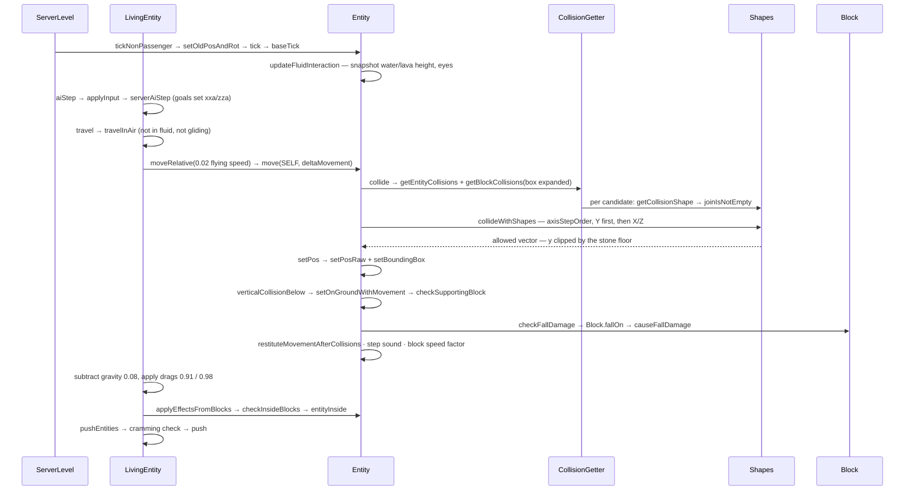

# Movement and collision

> Verified against **Minecraft 26.2** · Part VI · One tick of a falling zombie: 0.08 of gravity, one swept box against a stone floor, and the four booleans everything downstream reads.

## Responsibility

Every entity that moves does it the same way: build a delta vector, hand it
to `Entity.move`, and let the collision resolver return the part of that
vector the world allowed. `Entity.move` owns the geometry — clipping
against block shapes, other entities and the world border, stepping up,
bouncing, deciding whether you are on the ground and what you are standing
on. The layer above it, `LivingEntity.travel`, owns the physics — gravity,
drag, friction, swimming, gliding — and the layer above *that* is AI or
player input. Fall damage, step sounds, and the "you are inside a
cobweb/fire/powder snow" effects are all consequences the mover reports,
not decisions the caller makes.

The one sentence a player recognises: *you slide on ice, sink in soul sand,
bounce on slime, step up a slab without jumping, and take damage from the
fourth block down.*

## The data it owns

- **Where it is.** `Entity.position` (a `Vec3`), with `Entity.blockPosition`
  and `Entity.chunkPosition` derived and cached beside it, and the bounding
  box (`Entity.makeBoundingBox`, `Entity.setBoundingBox`).
  `Entity.setPosRaw` moves the point and notifies the level callback;
  `Entity.setPos` moves the point *and* the box; `Entity.setBoundingBox` is
  public and a handful of entities that own their own geometry — `Shulker`,
  `Interaction`, the hanging entities — call it directly.
  `Entity.absSnapTo` is the hard teleport: it rewrites the previous position
  as well as the current one and clamps horizontally to ±3.0000512E7.
  `Entity.snapTo` also rewrites the previous position, through
  `Entity.setOldPosAndRot`; neither touches the `InterpolationHandler`, and
  the callers that want interpolation gone cancel it explicitly first.
- **Where it is going.** `Entity.deltaMovement`, read and written through
  `Entity.getDeltaMovement`, `Entity.setDeltaMovement` and
  `Entity.addDeltaMovement` — the two setters discard the assignment
  outright if the vector is not finite (the whole vector, not the offending
  component), so NaN never enters the physics state.
  `Entity.getKnownMovement` is what other systems should ask.
- **What just happened.** Four public booleans set by the last move:
  `Entity.horizontalCollision`, `Entity.verticalCollision`,
  `Entity.verticalCollisionBelow`, `Entity.minorHorizontalCollision`; plus
  `Entity.onGround`, `Entity.onGroundNoBlocks` ("grounded, but no supporting
  block was found") and `Entity.mainSupportingBlockPos`. Almost every
  gameplay question — can I jump, do I take fall damage, which block's sound
  do I play, am I sprinting-eligible — reads these rather than the world.
- **How far it has come.** `Entity.fallDistance` (a **double** in 26.2, not a
  float), `Entity.moveDist` and `Entity.flyDist` for the step-sound counter,
  `Entity.nextStep` as its threshold.
- **What it moved through.** `Entity.movementThisTick` and
  `Entity.finalMovementsThisTick`, deques of the private record
  `Entity.Movement` (from, to, and the pre-collision vector) — the first an
  `ArrayDeque`, the second a plain list — plus `Entity.visitedBlocks`, which
  is the *deduplicator* (a block is visited at most once per replay, however
  many segments cross it), and an
  `InsideBlockEffectApplier.StepBasedCollector`. This is how "which blocks
  did I pass through" is answered *after* the fact rather than by sampling
  the destination.
- **What it is standing in.** `Entity.fluidInteraction`, an
  `EntityFluidInteraction` built over water and lava, holding an
  `EntityFluidInteraction.Tracker` per fluid with the height, whether the
  eyes are inside, and the accumulated current. `Entity.isInWater`,
  `Entity.isUnderWater`, `Entity.isInLava`, `Entity.getFluidHeight` and
  `Entity.isEyeInFluid` all read that snapshot, taken once per tick in
  `Entity.updateFluidInteraction` — never the live world.
- **The mover's identity.** `MoverType` has exactly five constants —
  `MoverType.SELF`, `MoverType.PLAYER`, `MoverType.PISTON`,
  `MoverType.SHULKER_BOX`, `MoverType.SHULKER`. `MoverType.PISTON` is the
  one with real machinery: `Entity.limitPistonMovement` collapses the vector
  to a single axis and `Entity.applyPistonMovementRestriction` clamps it to
  ±0.51 per game tick, and the piston path is exempt from
  `Entity.stuckSpeedMultiplier`. `MoverType.SHULKER_BOX` makes `Shulker`
  teleport rather than move; `MoverType.SELF` and `MoverType.PLAYER` are
  read together by `Player.maybeBackOffFromEdge` and separately by
  `AbstractArrow` and `AbstractMinecart`.
- **The physics knobs are attributes** ([attributes](attributes.md)), all
  syncable: `Attributes.GRAVITY` (0.08), `Attributes.STEP_HEIGHT` (0.6),
  `Attributes.MOVEMENT_SPEED` (0.7), `Attributes.JUMP_STRENGTH` (0.42),
  `Attributes.SAFE_FALL_DISTANCE` (3.0),
  `Attributes.FALL_DAMAGE_MULTIPLIER` (1.0),
  `Attributes.WATER_MOVEMENT_EFFICIENCY`, `Attributes.MOVEMENT_EFFICIENCY`,
  `Attributes.AIR_DRAG_MODIFIER`, `Attributes.FRICTION_MODIFIER`,
  `Attributes.BOUNCINESS`, `Attributes.FLYING_SPEED`.
- **And the block knobs are block properties**
  ([blocks and states](../blocks/blocks-and-states.md)): `Block.getFriction`
  (0.6 by default, 0.98 on ice, 0.989 on blue ice), `Block.getSpeedFactor`
  (0.4 on soul sand and honey), `Block.getJumpFactor` (0.5 on honey) and
  `Block.getBounceRestitution` (1.0 on `Blocks.SLIME_BLOCK`, 0.75 on beds) —
  bounce is now a generic property, not slime-block code.

## When it runs

On the **server main thread**, from the level's entity loop:
`ServerLevel.tickNonPassenger` saves the old position and rotation, bumps
the tick count and calls `Entity.tick`; passengers go through
`Entity.rideTick` instead ([the level tick](../server/server-level-tick.md)).
On the **client main thread**, `ClientLevel.tickEntities` calls the same
`Entity.tick` for every ticking entity — but what happens inside it is not
the same, and the difference is the most important thing on this page.

### Who is allowed to simulate

Four predicates, all on `Entity`, decide it.
`Entity.isLocalInstanceAuthoritative` is the root: on the client it asks
`Entity.isLocalClientAuthoritative`, on the server it is the negation of
`Entity.isClientAuthoritative`. `Entity.canSimulateMovement` and
`Entity.isEffectiveAi` both default to it, and `LivingEntity.aiStep` runs
`LivingEntity.travel` — and therefore `Entity.move` — only when **both**
hold.

The consequences invert the naive picture:

- **A tracked mob on the client does not run physics at all.** The base
  `Entity.isLocalClientAuthoritative` is true only through a controlling
  passenger, so a client-side zombie fails the gate, never calls
  `LivingEntity.travel`, and never calls `Entity.move`. What it does instead
  is at the top of `LivingEntity.aiStep`: if it is interpolating, step the
  `InterpolationHandler`; otherwise **coast**, scaling its delta by 0.98 and
  nothing else. The client is not simulating and being corrected — it is
  replaying, and the correction is all there is.
- **A player is client-authoritative on both sides.** `Player` overrides
  `Entity.isClientAuthoritative` to true outright, so on the *server* a
  player fails `Entity.isLocalInstanceAuthoritative` and `Entity.move`
  applies it no fall damage — the server takes that path from
  `Entity.doCheckFallDamage`, driven by the movement packet
  ([input to movement](../player/input-to-movement.md)). `Player` separately
  overrides `Entity.canSimulateMovement` to *is this not a client, or am I
  the local player*, which is what lets the server run the full simulation
  it then throws away, and lets your own client run it for real.
- `Mob.isEffectiveAi` narrows the AI half further with `Mob.isNoAi`, which
  is where the *NoAI* tag actually bites.

Inside `Entity.move` the gating is finer still and not one flag:
`Entity.checkFallDamage` and the *vertical* collision flags are gated on
`Entity.isLocalInstanceAuthoritative` (the horizontal flags are always
updated), the bounce on `Entity.canSimulateMovement`, and the step-sound
emission on *not client-side, or authoritative*.

Nothing here runs off-thread. Collision reads chunks through
`CollisionGetter.getChunkForCollisions`, which asks for a full chunk without
loading it and returns null if it is absent; `BlockCollisions` simply steps
past a missing chunk, so an entity at the edge of loaded space falls through
empty space rather than blocking the tick. (`Entity.touchingUnloadedChunk`
is a *separate* guard on a different path — it gates
`Entity.doCheckFallDamage`, the packet-driven fall check the server runs for
players and vehicles, not the in-mover one.)

The order inside `LivingEntity.aiStep` is worth memorising, because it is
the order of every mob's tick: interpolate-or-coast → head turn → equipment
→ zero out delta components below 0.003 → `LivingEntity.applyInput` →
`Mob.serverAiStep` (goals and controls; see [AI](ai-goals-and-brains.md)) →
jump → gliding → **the travel branch** → `Entity.applyEffectsFromBlocks` →
animation → freezing → `LivingEntity.pushEntities`.

The travel branch is not one call but a fork. If the controlling passenger
is a `Player` and the mob is alive, it is `LivingEntity.travelRidden` — the
path every horse, pig and happy ghast takes, and the reason a ridden mob's
input comes from `LivingEntity.getRiddenInput` rather than from its own AI.
Otherwise, and only if the authority gates above allow it, it is
`LivingEntity.travel`.

## The trace: one tick of a falling zombie

1. **Base tick.** `Entity.baseTick` invalidates the cached block state,
   records whether the eyes were in water, and calls
   `Entity.updateFluidInteraction` — one sweep that fills the water and lava
   trackers with their heights and accumulated current. Fire ticks; lava
   *halves* `Entity.fallDistance` rather than clearing it;
   `Entity.checkBelowWorld` kills anything 64 below the world floor.
2. **Intent.** `LivingEntity.aiStep` zeroes any delta component under 0.003
   (a deadzone, tighter for players), runs `LivingEntity.applyInput`, then
   `Mob.serverAiStep` — the goal selector and the movement control, which
   set `LivingEntity.xxa`/`LivingEntity.zza` and the speed from
   `Attributes.MOVEMENT_SPEED`. The jump branch is skipped because
   `Entity.onGround` is false. Then `LivingEntity.travel`.
3. **Which physics.** `LivingEntity.travel` picks one of three:
   `LivingEntity.travelInFluid` (splitting again into
   `LivingEntity.travelInWater` and `LivingEntity.travelInLava`, and chosen
   by `LivingEntity.shouldTravelInFluid`, which reads the *live* fluid state
   at the block position rather than the tracker),
   `LivingEntity.travelFallFlying` — the elytra model, lift from the square
   of the pitch cosine and its own three drag constants — or
   `LivingEntity.travelInAir`. Ours is the last.
4. **Accelerate.** `LivingEntity.travelInAir` reads the block below through
   `Entity.getBlockPosBelowThatAffectsMyMovement` (a probe 0.500001 down) —
   airborne, so friction is 1.0; standing on stone it would be
   `LivingEntity.computeModifiedFriction` of `Block.getFriction`, giving
   0.6. `LivingEntity.getFrictionInfluencedSpeed` returns the airborne
   `LivingEntity.getFlyingSpeed` — **0.02** for a mob, which is why you have
   almost no air control. (That method returns a literal; it does *not* read
   `Attributes.FLYING_SPEED`, which belongs to the AI layer's flying move
   controls and is not even in the base living attribute set.) Then
   `Entity.moveRelative` rotates the input by the yaw and adds it to the
   delta.
5. **Move.** `Entity.move(MoverType.SELF, …)`, whose first gate is
   `Entity.isAffectedByBlocks` and whose escape hatch is `Entity.noPhysics`
   — an entity with `Entity.noPhysics` set skips collision entirely and has
   all four booleans cleared. Then:
   - `Entity.stuckSpeedMultiplier` is applied and *cleared* in the same
     breath, zeroing the delta with it: that pair is the whole cobweb and
     berry-bush model;
   - `Entity.maybeBackOffFromEdge` (identity for everything but `Player`);
   - `Entity.collide` gathers colliders: `EntityGetter.getEntityCollisions`
     wraps with `Shapes.create` the box of every entity that answers
     `Entity.canBeCollidedWith` — which the base class answers **false**, so
     the mob standing next to you contributes no collider at all; boats,
     shulkers and minecarts do. (Pushing is a different predicate,
     `Entity.isPushable`, used only by the crowding pass in step 10.) The
     world border contributes `WorldBorder.getCollisionShape` if you are
     near it, and
     `CollisionGetter.getBlockCollisions` iterates `BlockCollisions`, which
     walks the swept box with a `Cursor3D` and asks each state for
     `BlockBehaviour.BlockStateBase.getCollisionShape`. A full cube
     short-circuits to a box intersection; anything else goes through
     `Shapes.joinIsNotEmpty`;
   - `Entity.collideWithShapes` resolves one axis at a time in the order
     `Direction.axisStepOrder` gives — **Y first, always**, then the larger
     horizontal axis — each axis clipping the box *already displaced* by the
     previous ones, via `Shapes.collide` → `VoxelShape.collide`. The stone
     floor truncates the downward component here;
   - if the entity has step height, is colliding horizontally, and is on or
     hitting the ground, `Entity.collectCandidateStepUpHeights` harvests
     every Y coordinate of every candidate shape within
     `Entity.maxUpStep`, and the resolver is retried at each until one
     yields more horizontal distance.
6. **Commit.** A `Entity.Movement` record is pushed onto
   `Entity.movementThisTick`, `Entity.setPos` moves the point and the box,
   and the collision booleans are computed by comparing what was asked with
   what was allowed — `Mth.equal` on the two horizontals, but **exact**
   inequality on Y, and the whole vertical block only runs if the entity
   moved vertically or is authoritative.
   `Entity.setOnGroundWithMovement` → `Entity.checkSupportingBlock` →
   `CollisionGetter.findSupportingBlock` finds *which* block holds you by
   probing a paper-thin slab under the box — retrying with the box shifted
   back along the movement when the first probe finds nothing.
7. **Consequences, in the mover.** `Entity.checkFallDamage` (only if this
   instance is authoritative) adds the downward movement to
   `Entity.fallDistance`, and on landing calls `Block.fallOn`, posts
   `GameEvent.HIT_GROUND` and calls `Entity.resetFallDistance`.
   `Block.fallOn` is what calls `LivingEntity.causeFallDamage`;
   `LivingEntity.calculateFallPower` subtracts
   `Attributes.SAFE_FALL_DISTANCE`, and `LivingEntity.calculateFallDamage`
   is what then multiplies by `Attributes.FALL_DAMAGE_MULTIPLIER` and checks
   `EntityTypeTags.FALL_DAMAGE_IMMUNE`. Our two-block fall is 2 − 3 < 0, so
   the power is zero and **nothing at all** happens: the landing particles
   are gated on a positive power and the fall sound on positive damage. Only
   `GameEvent.HIT_GROUND` and the fall-distance reset fire. Then
   `Entity.restituteMovementAfterCollisions` (the bounce),
   `Entity.applyMovementEmissionAndPlaySound` (which accumulates
   `Entity.moveDist` and fires `Entity.playStepSound` plus `GameEvent.STEP`
   when it passes `Entity.nextStep`), and finally the horizontal-only
   multiply by `Entity.getBlockSpeedFactor` — soul sand's 0.4, lerped
   towards 1 by `Attributes.MOVEMENT_EFFICIENCY`.
8. **Then gravity.** Back in `LivingEntity.travelInAir`, *after* the move:
   subtract `Entity.getEffectiveGravity` (0.08, or capped at 0.01 while
   falling with `MobEffects.SLOW_FALLING`) — unless `MobEffects.LEVITATION`
   is active, which replaces the gravity step entirely rather than modifying
   it, or the entity is a client-side one standing over an unloaded chunk,
   which gets a hard-coded −0.1. Then multiply the horizontals by 0.91 ×
   block friction, scaled by `Attributes.FRICTION_MODIFIER`, and the
   vertical by 0.98 scaled by `Attributes.AIR_DRAG_MODIFIER` — the friction
   modifier touches only the horizontal term, and block friction is 1.0
   unless `Entity.onGround`. The whole drag step is skipped when
   `LivingEntity.shouldDiscardFriction` is set.
   Climbing is a special case inside this same step:
   `LivingEntity.handleOnClimbable` clamps the fall speed on a
   `BlockTags.CLIMBABLE` block, and a separate clamp in
   `LivingEntity.handleRelativeFrictionAndCalculateMovement` sets the
   vertical component to 0.2 when a climbing or powder-snow entity is either
   colliding horizontally or jumping — which is the whole of "you go up a
   ladder by pressing into it".
9. **What did I pass through.** `Entity.applyEffectsFromBlocks` first calls
   `Block.stepOn` for the block underfoot, gated on `Entity.onGround`. Then
   it drains the movement deque and replays each segment in the *same axis
   order the collision used*, visiting every block the swept box actually
   crossed —
   `AABB.collidedAlongVector`, not a static overlap at the destination — and
   calling `BlockBehaviour.BlockStateBase.entityInside` and
   `Entity.onInsideBlock` on each, plus `FluidState.entityInside`. The
   effects are not applied inline: they are queued into
   `InsideBlockEffectApplier.StepBasedCollector` and flushed in
   `InsideBlockEffectType` order — `InsideBlockEffectType.FREEZE`,
   `InsideBlockEffectType.CLEAR_FREEZE`, `InsideBlockEffectType.FIRE_IGNITE`,
   `InsideBlockEffectType.LAVA_IGNITE`, `InsideBlockEffectType.EXTINGUISH` —
   so fire and water touched in the *same* step always end in the
   extinguish, whatever order the blocks came in. The reordering is
   per-step, though: the collector flushes each step as the replay advances,
   so across steps the order is still chronological, and fire in a later
   step than water still burns you.
10. **Crowding.** `LivingEntity.pushEntities` collects pushable neighbours —
    a different predicate from the collision one, and on the client the
    query returns at most the local player, never the crowd —
    (team collision rules honoured), applies `GameRules.MAX_ENTITY_CRAMMING`
    — default 24, and the cramming damage is 6 — and calls
    `LivingEntity.doPush` → `Entity.push`, a horizontal-only impulse scaled
    by 0.05 and ignored below a hundredth of a block.
11. **Off it goes.** `ServerEntity.sendChanges` turns the new position into
    a short delta (`ClientboundMoveEntityPacket.Pos`) when it can, or an
    absolute `ClientboundEntityPositionSyncPacket` when it cannot — too big,
    more than 400 ticks since the last teleport, riding, the entity demands
    precision, **or `Entity.onGround` changed since the last send**. That
    last one is the common case: every landing and every step off a ledge
    costs an absolute sync. `Entity.syncPosition` forces the next send.

**An `ItemEntity` does it in the other order**, and the contrast is the
clearest way to see the two conventions: `ItemEntity.tick` applies gravity
(0.04) *before* `Entity.move`, then applies drag afterwards, **reverses**
any downward velocity on landing at half strength — items bounce, they do
not merely damp — and skips the move entirely on a cheap path
when it is resting still on the ground and the tick count says it is not
this item's turn. Its `Entity.getMovementEmission` is
`Entity.MovementEmission.NONE`, so it makes no step sounds.

## Interfaces

- **Called by:** `LivingEntity.travel` and its four siblings; `ItemEntity`,
  `FallingBlockEntity`, `PrimedTnt`, `ExperienceOrb` and the projectiles
  directly; `PistonMovingBlockEntity` with `MoverType.PISTON`
  ([pistons and block events](../blocks/pistons-and-block-events.md)); `Shulker` with its own mover types;
  player input with `MoverType.PLAYER`
  ([input to movement](../player/input-to-movement.md)).
- **Calls into:** `CollisionGetter` and `BlockCollisions` for block shapes,
  `EntityGetter.getEntityCollisions` for entity boxes, `Shapes` and
  `VoxelShape` for the clipping arithmetic, `Block.fallOn` and
  `Block.stepOn`, `BlockBehaviour.BlockStateBase.entityInside`,
  `LivingEntity.causeFallDamage` ([damage](damage-and-death.md)),
  `GameEvent.STEP` / `GameEvent.HIT_GROUND` / `GameEvent.BOUNCE`
  ([game events](../world/game-events-and-vibrations.md)).
- **Crosses the network as:** `ClientboundMoveEntityPacket.Pos`,
  `ClientboundMoveEntityPacket.Rot`, `ClientboundMoveEntityPacket.PosRot`
  (short deltas), `ClientboundEntityPositionSyncPacket` (absolute, the
  fallback), `ClientboundTeleportEntityPacket`,
  `ClientboundSetEntityMotionPacket` (applied by `Entity.lerpMotion`),
  `ClientboundMoveMinecartPacket`, `ClientboundMoveVehiclePacket`. Inbound:
  `ServerboundMovePlayerPacket`, `ServerboundMoveVehiclePacket`,
  `ServerboundPlayerInputPacket` — [input to movement](../player/input-to-movement.md)
  owns the player half and the server's sanity checks in
  `ServerGamePacketListenerImpl`.
- **Smoothed by:** `InterpolationHandler` — three steps by default —
  attached to `LivingEntity` and driven from `LivingEntity.aiStep`.
  `ClientPacketListener.handleEntityPositionSync` only moves an entity that
  is *not* locally authoritative, and snaps rather than interpolates when
  the correction exceeds 64 blocks.
- **Data-driven by:** block properties (friction, speed factor, jump factor,
  bounce restitution), `BlockTags.CLIMBABLE`,
  `BlockTags.FALL_DAMAGE_RESETTING`, `BlockTags.SUPPRESSES_BOUNCE`,
  `BlockTags.CAN_GLIDE_THROUGH`, `EntityTypeTags.FALL_DAMAGE_IMMUNE`,
  `FluidTags.WATER` / `FluidTags.LAVA`, the twelve movement attributes, and
  `GameRules.MAX_ENTITY_CRAMMING`.

## Invariants and surprises

- **Y is resolved first, always.** `Direction.axisStepOrder` returns a
  Y-leading order and picks the larger horizontal axis next, and each axis
  clips against the box already displaced by the earlier ones. The
  inside-block replay deliberately repeats that order, because "which blocks
  did I touch" depends on it.
- **Collision is against shapes, not blocks.** A block contributes whatever
  `BlockBehaviour.BlockStateBase.getCollisionShape` says, which for a fence
  is 1.5 blocks tall — to walk into *and* to stand on. The 1.0 you see
  outlined is `BlockBehaviour.BlockStateBase.getShape`, the selection box;
  `CrossCollisionBlock` builds the two from different heights and the mover
  only ever asks for the first. An entity's own collider, by contrast, is
  just its `AABB` wrapped by `Shapes.create`.
- **`Entity.onGround` is a comparison, not a raycast.** It is set from
  `Entity.verticalCollisionBelow` — the vertical component was clipped, and
  it was negative. The only geometric probe is
  `CollisionGetter.findSupportingBlock`, and that answers *which* block, for
  sounds and `Entity.getBlockSpeedFactor`, not *whether*.
- **Step height is an attribute now.** `Entity.maxUpStep` is zero on the
  base class; `LivingEntity.maxUpStep` reads `Attributes.STEP_HEIGHT`, and
  raises it to at least 1.0 when a player is riding — which is how a ridden
  horse climbs a full block.
- **Step-up searches, it does not guess — and it stops at the first win.**
  `Entity.collectCandidateStepUpHeights` collects every Y coordinate of every
  candidate shape inside the step height, sorts them ascending, and retries
  the whole resolve at each until one yields *any* more horizontal distance
  than the flat attempt; that one is returned. It is the lowest step that
  helps, not the best one. An entity can step onto a shape's internal ledge,
  not only its top face.
- **The two gravity conventions.** `LivingEntity.travelInAir` moves first
  and applies gravity after, so the delta consumed by `Entity.move` carries
  the *previous* tick's gravity. `Entity.applyGravity` — used by items, TNT,
  falling blocks and projectiles — runs before the move. Both are correct;
  neither is the other.
- **Fluid state is a snapshot, but not a once-per-tick one.**
  `EntityFluidInteraction` is filled by `Entity.updateFluidInteraction` in
  `Entity.baseTick`, and `Entity.isInWater` reads the cached flag rather
  than the world. But `LivingEntity.checkFallDamage` re-runs the sweep from
  *inside* `Entity.move` whenever the entity is not already in water, and
  `ItemEntity.tick` re-runs it too — which is exactly why falling into water
  cancels the fall damage in the same tick that entered it.
- **Bounce is a real restitution model.** `Entity.restituteMovementAfterCollisions`
  reflects the horizontal components, and for a downward hit combines
  `Attributes.BOUNCINESS` with `Block.getBounceRestitution`, damped to 80 %
  for non-living entities, gated on the impact being at least one tick of
  gravity — which is why nothing jitters at rest on a slime block — and
  opted out of by `BlockTags.SUPPRESSES_BOUNCE`.
- **Fall distance is reset in more places than you would guess:** on
  landing, on entering water, on climbing, while riding, under
  `MobEffects.SLOW_FALLING` or `MobEffects.LEVITATION`, and by a dedicated
  clip inside `Entity.move` for long movements through
  `BlockTags.FALL_DAMAGE_RESETTING`. Lava halves it instead.
- **The inside-block replay has a budget.** Sixteen block visits per
  movement segment, with one final visit at the destination if the budget
  runs out, and the movement deque merges its two oldest entries once it
  reaches a hundred — bounded memory bought with a little precision.
- **Only one side runs the physics, and which side depends on the entity.**
  A tracked mob is simulated on the server and *coasted* on the client — the
  client's copy never reaches `Entity.move`. A player is the other way up:
  client-authoritative on both sides, so it is the client that simulates for
  real and the server that re-runs it as a check. The predicate is
  `Entity.isLocalInstanceAuthoritative`, never "am I the client".

## Where to look

`Entity.move` · `Entity.collide` · `Entity.collideBoundingBox` ·
`Entity.collideWithShapes` · `Entity.collectCandidateStepUpHeights` ·
`Entity.setPos` · `Entity.setOnGroundWithMovement` ·
`Entity.checkSupportingBlock` · `Entity.checkFallDamage` ·
`Entity.applyEffectsFromBlocks` · `InsideBlockEffectApplier` ·
`Entity.updateFluidInteraction` · `EntityFluidInteraction` ·
`LivingEntity.travel` · `LivingEntity.travelInAir` ·
`LivingEntity.handleRelativeFrictionAndCalculateMovement` ·
`LivingEntity.aiStep` · `LivingEntity.travelRidden` ·
`LivingEntity.handleOnClimbable` · `LivingEntity.pushEntities` ·
`Entity.isLocalInstanceAuthoritative` · `Entity.canSimulateMovement` ·
`MoverType` ·
`CollisionGetter` · `BlockCollisions` · `Shapes.collide` ·
`InterpolationHandler` · `ServerEntity.sendChanges`

---

*Rules: names, never code · how the system works, not how the code reads ·
newest version only · every backticked name passes `tools/verify_names.py`.*
