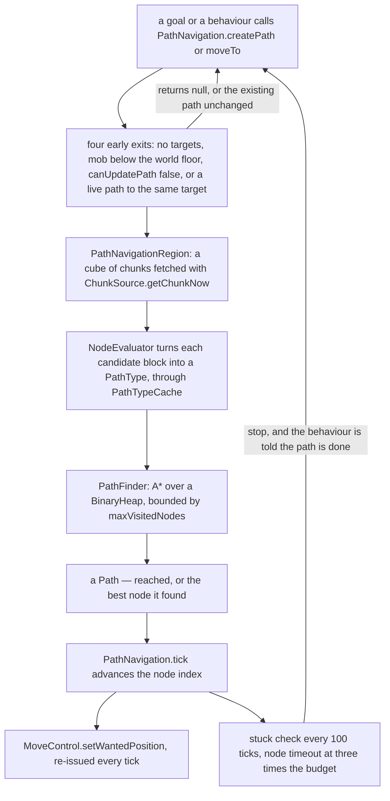
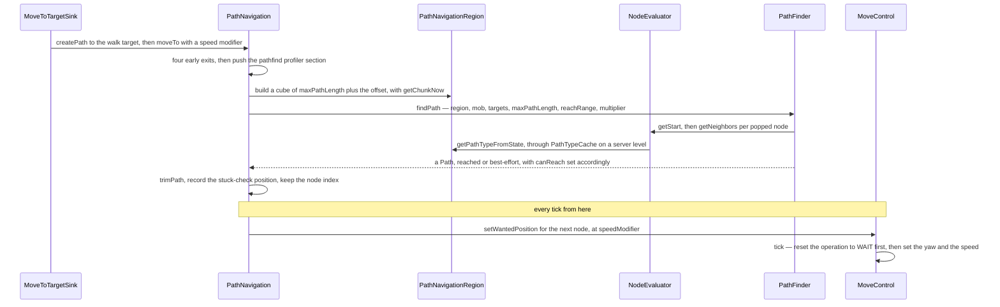

# Pathfinding

> Verified against **Minecraft 26.2** · Part VI · A villager decides to walk to its bed, and a hundred ticks later it is standing still against a fence, having formally given up.

A behaviour has produced a position and stopped caring. Everything between
that position and a mob actually leaning into a direction is this page: one
A\* search over a snapshot of already-loaded chunks, a `Path` of nodes, and a
control that has to be told again every single tick. The part of it people
recognise is the failure. **Giving up is machinery, not an absence of it** —
every node the mob is walking towards carries a timeout computed from its
distance and the mob's current speed, three times over that budget abandons
the path outright, and a separate check every hundred ticks asks whether the
mob has covered a quarter of the ground its speed says it should have. The
mob you watch walk into a wall and then wander off is running a scheduled
surrender.

Above the waterline is [goals and
brains](ai-goals-and-brains.md#what-decides), which
decides *where*; this page is *how*, and it is the same machinery whichever
decision system asked.

## The cast

| class | what it decides | thread |
|---|---|---|
| `PathNavigation` | when to search, what budget to search with, when to give up | server main |
| `PathNavigationRegion` | which blocks the search is allowed to see — a snapshot, never a load | server main |
| `NodeEvaluator` | what a block *is* to this mob, as a `PathType` | server main |
| `PathTypeCache` | the 4,096-entry memo that makes that affordable | server main, owned by `ServerLevel` |
| `PathFinder` | the A\* itself, bounded by a node budget | server main |
| `Path` | the node list, and whether it actually reaches the target | server main, with a stream codec for the debug channel only |
| `MoveControl` | where a wanted position becomes a yaw and a speed, and forgets it again the same tick | server main |

Nothing here is asynchronous. There is not a future, an executor or a thread
anywhere in the pathfinder, and every entry point takes a `ServerLevel` or a
`Mob` on one. Nothing crosses the network either, except when a debug client
has subscribed.

## The pipeline

## Asking: the four ways a search does not happen

`PathNavigation.createPath` refuses before it does anything expensive. It
returns null on an empty target set, on a mob below `Level.getMinY`, and on
`PathNavigation.canUpdatePath` — which for `GroundPathNavigation` means *on
the ground, in liquid, or riding something*, so an airborne mob simply cannot
ask. The fourth exit is the interesting one: if there is already a path that
is not done and the requested target is among its targets, **the existing
path is returned unchanged**. Re-asking for a destination you are already
walking to costs nothing and changes nothing.

`PathNavigation.recomputePath` is the other entrance, and it is rate-limited
rather than refused. More often than every twenty game ticks, or with
`PathNavigation.canUpdatePath` false, it sets a flag instead and the next
`PathNavigation.tick` tries again. That deferral is what keeps a mob standing
in a doorway from re-searching twenty times a second.

## The budget, which is also the map

One number governs both how hard the search may work and how much world it
may look at. `PathNavigation` builds its `PathFinder` with
`Attributes.FOLLOW_RANGE`'s **base** value times sixteen, and
`PathNavigation.updatePathfinderMaxVisitedNodes` later recomputes it as
sixteen times the larger of the *modified* follow range
([attributes](attributes.md#the-instance-three-indices-and-one-cached-number)
owns the difference between the two) and
`PathNavigation.setRequiredPathLength` — 16 by default, raised in seven
classes' constructors: 48 for `Villager`, `Allay`, `Bee`, `CopperGolem` and
`HappyGhast`, 40 for `Llama`, 32 for `Fox`. The recompute has exactly one
trigger, and it is not the pathfinder's: `Mob.onAttributeUpdated` calls it
when either `Attributes.FOLLOW_RANGE` or `Attributes.TEMPT_RANGE` changes, so
a mob that is tempted or angered searches a different amount of world from
the one it woke up with. `PathNavigation.setMaxVisitedNodesMultiplier`
scales the result, and keeps scaling it until
`PathNavigation.resetMaxVisitedNodesMultiplier` puts it back: `Bee` is the
only class that touches either.

The same maximum path length becomes the **radius of the
`PathNavigationRegion`**, plus an offset of 8 or 16 depending on which
`PathNavigation.createPath` overload was used — and inside the search it appears twice more,
as a test on the current node's distance from the start and on each
neighbour's walked distance. A villager can find a bed 48 blocks away because its constructor set its
*required path length* to 48, and the larger of the two numbers wins; it
cannot find one 60 blocks away no matter how open the ground is. That is the
budget behind [a villager claiming a
bed](../world/points-of-interest.md#the-trace-a-villager-claims-a-bed), whose
scan radius is the same 48 for exactly this reason.

That region is built by asking `ChunkSource.getChunkNow` for every chunk in
the cube. **A path search never loads a chunk and never blocks** — an absent
chunk is a null entry that reads as air. This is the same discipline
`Entity.move` uses for collisions, and it is why AI cannot stall a tick.

## What a block is

`NodeEvaluator` answers *what is this position, to this mob* with a
`PathType`: 27 constants, each carrying a default cost, and **a negative cost
means impassable, not expensive**. Nine of the twenty-seven are −1 —
`PathType.BLOCKED`, `PathType.LAVA`, `PathType.FENCE`, `PathType.LEAVES`,
`PathType.POWDER_SNOW`, `PathType.DAMAGING`, `PathType.UNPASSABLE_RAIL` and
the two closed doors; `PathType.WATER` is 8, `PathType.FIRE` 16,
`PathType.OPEN` and `PathType.WALKABLE` 0. A mob overrides any of them for
itself with `Mob.setPathfindingMalus`, read back through
`Mob.getPathfindingMalus` — which is how the same lava is free ground to a
`Strider`, merely expensive to a `ZombifiedPiglin`, and a wall to the
ordinary `Piglin` that never overrides it. The question a block is *asked* is
narrower than the answer: `PathComputationType` has three values — land,
water and air — and a block's own pathability hook sees only which of the
three is being planned, never which mob is planning it.

Four evaluators in the pathfinder package cover the movement modes:
`WalkNodeEvaluator`, and the three that specialise it or replace it —
`FlyNodeEvaluator` and `AmphibiousNodeEvaluator` extend the walker,
`SwimNodeEvaluator` extends `NodeEvaluator` directly. Two mobs subclass one
further for themselves, `Frog` and `Creaking`. Each `PathNavigation` subclass chooses one:
`GroundPathNavigation`, `FlyingPathNavigation`, `WaterBoundPathNavigation`,
`AmphibiousPathNavigation`, and `WallClimberNavigation` on top of the ground
one.

Classifying a block is expensive enough to memo. `PathTypeCache` is a fixed
4,096-entry table owned by `ServerLevel`, consulted through
`PathfindingContext` — which attaches it **only** on a `ServerLevel` and
falls back to computing the type from scratch otherwise. It is invalidated
one position at a time from `ServerLevel.sendBlockUpdated`, which is the
subject of the last section.

## The search

`PathFinder.findPath` is plain A\* over a `BinaryHeap`, and three of its
details decide what mobs feel like.

**It is bounded twice: by a node count and by a distance.** The loop breaks
as soon as its visit counter reaches the budget —
`PathFinder.setMaxVisitedNodes`, scaled by the multiplier — and inside the
loop the maximum path length is the second bound, gating which nodes are
expanded and which neighbours are admitted at all. Under the node budget
alone a search through open ground would reach much further than the same
budget spends in a maze; the distance bound is what stops it.

**The heuristic is inflated.** Each neighbour's *h* is the best straight-line
estimate multiplied by 1.5, which makes the search greedy: it finds a route
sooner and the route it finds is not guaranteed to be the shortest. When
several targets were reached, the winner is simply the path with the fewest
nodes; when none was, it is the path that ends closest to a target, with
fewest nodes as the tie-break.

**A failed search still returns a path.** If no target came within
the *reach range* — measured as a Manhattan distance from the popped node — the
finder reconstructs a path to the closest node it managed to reach and marks
it *not reached*. That is what `Path.canReach` reports, and it is the number
that matters rather than "was a path found": `AcquirePoi` tests it before
claiming a point of interest, and `MoveToTargetSink` turns a false into a
*cannot reach* memory. A null from `PathNavigation.createPath` means one of
the four early exits rather than a search that came back empty-handed — the
finder always has a best node to reconstruct towards.

One more thing the search does not do unless asked: it accumulates its closed
set, and attaches it to the `Path`, only while something is subscribed to
`DebugSubscriptions.ENTITY_PATHS`. `PathNavigation` installs that predicate
in its constructor, off the server's `ServerDebugSubscribers`. `Path` has a
stream codec for exactly this and no gameplay reason.

## Following it, one tick at a time

`PathNavigation.tick` advances the node index and calls
`MoveControl.setWantedPosition` with the next node and the speed modifier.
It has to do that **every** tick, because `MoveControl.tick` sets its own
`MoveControl.Operation` back to `MoveControl.Operation.WAIT` as it handles
the move — the control is a one-shot instruction, not a destination it
remembers.

`MoveControl.setWantedPosition` is the main way a decision, goal or brain,
becomes movement, but it is neither the only method nor a single call site.
`MoveControl.strafe` is a second entrance, used by `RangedBowAttackGoal` and
the brain behaviour `BackUpIfTooClose`; `MoveControl.setWait` is a third.
`MoveControl.setWantedPosition` itself has twelve callers outside the navigations, in
eight classes: the shared goals `TemptGoal.ForNonPathfinders` and
`TryFindWaterGoal`, the per-mob goals of `Bee`, `Blaze`, `Ghast` and `Vex`,
`Rabbit` from the mob itself rather than from a goal, and `Fox` to pin a
sleeping fox where it lies. The first of those is why a happy ghast drifts
towards you in a straight line through terrain a path search would have
routed around — an ordinary tempted cow runs the base `TemptGoal`, which
calls the navigation like anything else.

Three more controls sit beside it and are the rest of what turns a decision
into a pose — all four implementing `Control`, and all four re-specialised by
movement mode the way the evaluators are, so a `SmoothSwimmingMoveControl` or
a `FlyingMoveControl` is the same object with different arithmetic.
`LookControl` aims the head, `JumpControl` fires a jump the mover
then executes, and `BodyRotationControl` swings the body to follow the head
the moment the head is more than fifteen degrees off — it is the *reverse*
move, easing the head back towards the front, that waits for ten stable
ticks. `BodyRotationControl.clientTick` is a leftover
name: `LivingEntity.tick` calls `Mob.tickHeadTurn` with no side check at all,
so it runs on both sides every tick.

The mover itself is Part VI's [movement and
collision](movement-and-collision.md#building-the-delta) — the control sets the yaw and calls
`Mob.setSpeed`, which writes `LivingEntity.zza` with it, and
`LivingEntity.travel` does the rest. `LivingEntity.xxa` is written only by
the strafe branch, which pathfinding never takes.

## Giving up

Two independent timers, and they answer different questions.

`PathNavigation.doStuckDetection` runs its first half **every hundred ticks**:
it compares where the mob is with where it was at the last check, against a
threshold of the mob's effective speed times 100 times 0.25 — a quarter of
the ground the speed claims. Below that, `PathNavigation.isStuck` is set and
the path is stopped. The effective speed is the speed itself at 1.0 or above
and the *square* of it below, which quietly makes the threshold far more
forgiving for slow mobs.

The second half is per node. When the next node changes, the navigation
computes a time budget for it — the distance to that node divided by the
mob's speed, times twenty — and accumulates real ticks against it. Past
**three times** that budget, `PathNavigation.timeoutPath` resets the counters
and stops. This is the one that catches a mob whose path is fine and whose
route is blocked by something the search could not see.

Both endings are the same ending from outside: `PathNavigation.isDone`
becomes true, and whichever behaviour or goal was waiting on the path finds
out on its next evaluation.

## The one place the world pushes back

Everything above is AI asking the world questions. `ServerLevel.sendBlockUpdated`
is the single call in the other direction. It invalidates the changed
position in the path-type cache **unconditionally**, and then — only if
`Shapes.joinIsNotEmpty` says the collision shape actually changed — walks
`ServerLevel.navigatingMobs` — every navigating mob in the level, **unbounded
by distance** — asks each navigation
`PathNavigation.shouldRecomputePath` about the position, and calls
`PathNavigation.recomputePath` on the ones that say yes. That last loop —
and only that loop — is wrapped in a re-entrancy flag, because a recompute
can itself change blocks; a call that arrives while the flag is set logs and,
in a development environment, pauses.

That is why closing a door in front of a mob re-routes it and repainting a
block does not.

## Why mobs look stupid

**Why do mobs take silly routes?** The heuristic is multiplied by 1.5, so the
search is deliberately greedy — it stops at the first route that reaches,
not the best one. Cost is a per-block malus, not a distance, so a mob will
happily walk three blocks further to avoid a `PathType.WATER` node worth 8.

**Why does a mob stop dead at the edge of my render distance?** It did not.
The search only sees chunks already loaded on the server, and a target
outside them is simply not reachable; the path comes back with
`Path.canReach` false and the behaviour that asked gives up.

**Why does a villager find a bed across the village but not one behind a
wall?** Because 48 is `Villager`'s required path length, so distance is
rarely the limit — and because `AcquirePoi` runs a real path search before it
claims anything, so unreachable is invisible rather than merely far.

## Where to look

`PathNavigation` · `PathNavigation.createPath` · `PathNavigation.moveTo` ·
`PathNavigation.tick` · `PathNavigation.recomputePath` ·
`PathNavigation.canUpdatePath` · `PathNavigation.doStuckDetection` ·
`PathNavigation.updatePathfinderMaxVisitedNodes` ·
`PathNavigation.setRequiredPathLength` · `GroundPathNavigation` ·
`FlyingPathNavigation` · `WaterBoundPathNavigation` ·
`AmphibiousPathNavigation` · `WallClimberNavigation` ·
`PathNavigationRegion` · `PathFinder.findPath` · `BinaryHeap` · `Node` ·
`Target` · `Path.canReach` · `NodeEvaluator` · `WalkNodeEvaluator` ·
`SwimNodeEvaluator` · `FlyNodeEvaluator` · `AmphibiousNodeEvaluator` ·
`PathType` · `PathTypeCache` · `PathfindingContext` ·
`Mob.getPathfindingMalus` · `MoveControl.setWantedPosition` · `LookControl` ·
`JumpControl` · `BodyRotationControl` · `ServerLevel.sendBlockUpdated`

---

*Rules: names, never code · how the system works, not how the code reads ·
newest version only · every backticked name passes `tools/verify_names.py`.*
